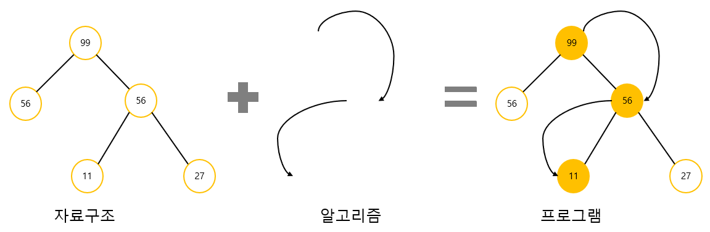
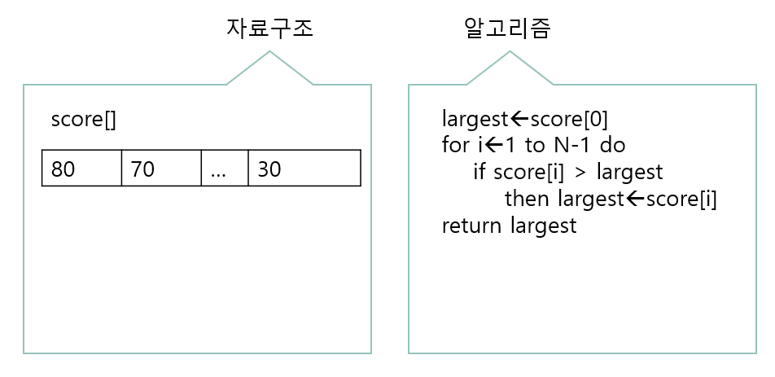
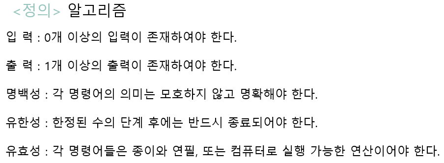
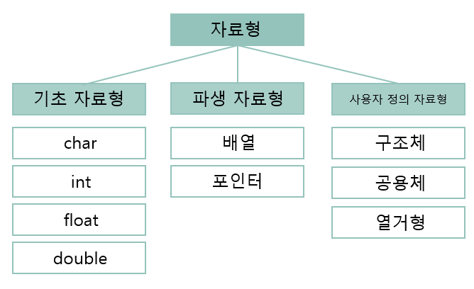
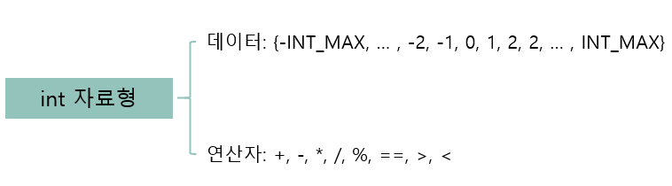
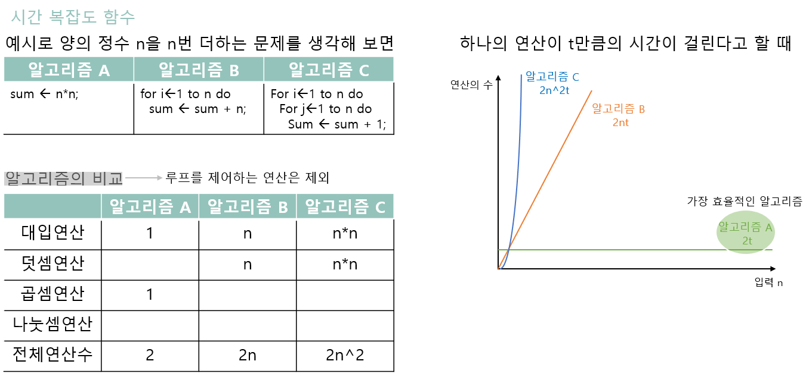
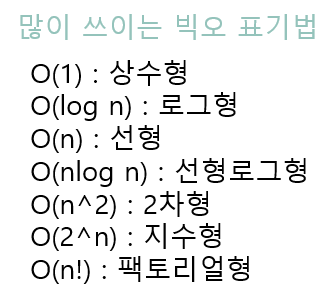
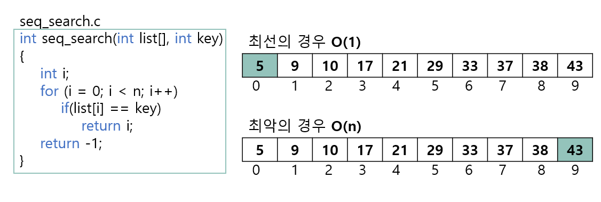

# 01. 자료구조와 알고리즘(DataStructure and Algorithm)

## 1.1 자료구조와 알고리즘

### 자료구조란?

- 우리는 일상생활에서 사물들을 정리하는 여러 가지 방법을 이용하고 있다. 버킷 리스트에는 우리가 평생에 이루고 싶은 목표를 차례대로 기록한다. 식당에서는 그릇들을 쌓아서 보관한다. 마트에서 계산을 할 때는 차례대로 줄을 선다. 영어사전에는 단어들과 단어들의 설명이 저장되어 있다. 컴퓨터는 계층적인 디렉터리를 이용하여 파일들을 저장한다. 지도에는 도시들과 도시들을 연결하는 도로가 표시되어 있다. 


- 사람들이 사물을 정리하여 저장하는 것과 마찬가지로 프로그램에서도 자료들을 정리하여 보관하는 여러 가지 구조들이 있다. 이를 자료 구조(data structure)라 부른다. 몇 가지의 예를 들어보면 식당에서 그릇을 쌓는 것처럼 자료들을 쌓아서 정리하는 구조를 컴퓨터에서는 "스택"이라고 부른다. 스택에서는 맨 위에서만 자료를 추가하거나 제거할 수 있다. 마트 계산대의 줄에 해당하는 자료 구조를 우리는 큐라 부른다. 큐에서는 먼저 도착한 자료가 먼저 빠져나간다.

  |     일상생활에서의 예     | 해당하는 자료구조 |
  | :-----------------------: | :---------------: |
  | 그릇을 쌓아서 보관하는 것 |       스택        |
  |     마트 계산대의 줄      |        큐         |
  |        버킷 리스트        |      리스트       |
  |         영어사전          |       사전        |
  |           지도            |      그래프       |
  |  컴퓨터의 디렉토리 구조   |       트리        |


- 컴퓨터 프로그램은 무엇으로 이루어져 있을까? 흔히 "프로그램 = 자료구조 + 알고리즘"이라고 한다. 대부분의 프로그램에서 자료(data)를 처리하고 있고 이들 자료는 자료구조를 사용하여 저장된다. 또한 주어진 문제를 처리하는 절차가 필요하다. 이것은 알고리즘이라고 불린다.



- 예를 들어 시험 성적을 읽어 들여서 최고 성적을 구하는 프로그램에 대하여 생각하여 보자. 외부에서 성적이 입력되면 이 성적들을 처리하기 좋게끔 프로그램 어딘가에 저장시켜야 한다. 우리가 가장 쉽게 사용할 수 있는 것은 아마도 배열일 것이다. 이 경우, 배열이 자료를 저장하는 구조, 즉 자료 구조가 된다. 
- 다음으로 필요한 것은 배열에 저장된 점수들 중에서 가장 큰 값을 찾는 절차이다. 여러 가지 방법으로 할 수 있겠지만 가장 간단하게 변수를 하나 만들고 배열의 첫 번째 요소 값을 변수에 저장한 다음, 이 변수와 배열의 요소들을 순차적으로 비교하여, 만약 배열의 요소가 더 크다면 배열 요소의 값을 변수에 저장한다. 이런식으로 배열의 끝까지 진행하면 최고 성적을 찾을 수 있다. 이렇게 문제를 해결하는 절차를 알고리즘이라고 한다.



- 최고 성적을 구하는 프로그램을 C언어를 이용하여 작성하여 보면 다음의 프로그램과 같다. 여기서 배열 scores가 자료구조에 해당되고 largest를 첫 번째 요소로 초기화하고 나머지 요소들과 순차적으로 비교하는 것이 알고리즘에 해당한다.

  ```C
  #include <stdio.h>
  #include <stdlib.h> // rand() 함수 포함 라이브러리
  #include <time.h>   // time()함수 포함 라이브러리
  #define MAX_ELEMENTS 100
  int scores[MAX_ELEMENTS];	// 자료구조
  
  int get_max_score(int n) 	// 학생의 숫자는 n
  {
  	int i, largest;
  	largest = scores[0];	// 알고리즘
  	for (i = 1; i<n; i++) {
  		if (scores[i] > largest) {
  			largest = scores[i];
  		}
  	}
  	return largest;
  }
  
  int main(){
  	int random;
  	srand(time(NULL));
  	for(int i=0; i<MAX_ELEMENTS; i++){
  		random = rand() % 101;
  		scores[i] = random;	
  	}
  	printf("%d\n", get_max_score(100));
  }
  ```

  

- 자료구조와 알고리즘은 밀접한 관계가 있어서 자료구조가 결정되면 그 자료구조에서 사용할 수 있는 알고리즘이 결정된다. 컴퓨터가 복잡한 자료들을 빠르게 저장, 검색, 분석, 전송, 갱신하기 위해서는 자료구조가 효율적으로 조직화되어 있어야 한다. 또한 각 응용에 가장 적합한 자료구조와 알고리즘을 선택하여야 한다.


### 알고리즘이란?

- 어떤 문제가 주어져 있고 이것을 컴퓨터로 해결하려고 한다고 가정하자. **첫 번째** 해야 할 일은 문제를 해결할 수 있는 방법을 고안하는 것이다. 예를 들면 컴퓨터를 이용하여 전화번호부에서 특정한 사람의 이름을 찾는 문제를 생각하여 보자. 

  - 한 가지 방법은 전화번호부의 첫 페이지부터 시작하여 한 장씩 넘기면서 특정한 사람을 찾는 것이다. 이 방법은 엄청난 시간이 걸리는 방법이고 보통 이런 식으로 찾는 사람은 거의 없을 것이다. 

  - 또 하나의 방법은 전화번호부의 이름들이 정렬되어 있음을 이용하는 방법이다. 즉 찾고자 하는 이름이 "박철수"라고 하자. 전화번호부의 중간에 있는 이름과 "박철수"를 비교한다. 중간에 있는 이름보다 앞에 있다면 앞부분만 검색한다. 그렇지 않다면 뒷부분만 검색하면 된다. 이러한 과정을 박철수란 이름을 찾을 때까지 되풀이 한다. 이 방법은 굉장히 효율적인 방법이고 일반적인 사람들이 사용하는 방법이다. 이러한 방법들은 보통 프로그래밍 스타일이나 프로그래밍 언어와는 무관하다. 즉 C언어를 사용하던, Java를 사용하건, 사용되는 방법은 동일하다.

    

- **두 번째**로 해야 할 일은 이들 방법에 따라 컴퓨터가 수행하여야 할 단계적인 절차를 자세히 기술하는 것이다. 컴퓨터로 문제를 풀기 위한 단계적인 절차를 알고리즘이라고 한다. 엄밀하게 이야기 하면 알고리즘이란 문제와 컴퓨터가 주어진 상태에서 문제를 해결하는 방법을 정밀하게 장치가 이해할 수 있는 언어로 기술한 것이다.따라서 알고리즘은 특정한 일을 수행하는 명령어들의 집합이다. 여기서 명령어란 컴퓨터에서 수행되는 문장들을 의미한다. 모든 명령어들의 집합이 알고리즘이 되는 것은 아니고 알고리즘이 되기 위한 조건들을 만족하는 집합만이 알고리즘으로 정의된다.

  

  

- 따라서 알고리즘에는 입력은 없어도 되지만 출력은 반드시 하나이상 있어야 하고 모로한 방법으로 기술된 명령어들의 집합은 알고리즘이라 할 수 없다. 또한 실행할 수 없는 명령어(예를 들면 0으로 나누는 연산)를 사용하면 역시 알고리즘이 아니다. 또한 무한히 반복되는 명령어들의 집합도 알고리즘이 아니다.

- 알고리즘을 기술하는 데는 다음과 같은 4가지의 방법이 있다.

  - 1. 한글이나 영어 같은 자연어

    2. 흐름도(flowchart)

    3. 의사 코드(pseudo-code)

    4. 프로그래밍 언어

       

  - 1의 방법은 자연어를 사용하기 때문에 약간의 모호성이 존재한다. 이 모호성을 제거하기 위하여 명령어로 사용되는 단어들을 명백하게 정의해야만 알고리즘이 될 수 있다.

  - 2의 방법은 도형을 사용하여 알고리즘을 기술하는 방법으로 초심자에게 좋은 방법이지만 알고리즘이 복잡해 질수록 기술하기 힘들게 될 것이다. 따라서 가장 많이 쓰이는 방법은 3, 4와 같은 의사 코드나 프로그래밍 언어를 사용하는 방법이다. 프로그래밍 언어의 예약어들은 모두 명백한 의미를 가지고 있어서 알고리즘을 기술하는데 안성맞춤이다. 의사 코드는 자연어보다는 더 체계적이고 프로그래밍 언어보다는 덜 엄격한 언어로서 알고리즘을 기술하는 데만 사용되는 코드를 말한다.


## 1.2 추상 자료형

- 먼저 자료형(data type)이란 용어 그래도 "데이터의 종류"로서 우리말로는 "자료형"이라 할 수 있다. 자료형에는 많은 종류가 있다. 즉 정수, 실수, 문자열 등이 기초적인 자료형의 예이다. 이러한 자료형은 프로그래밍 언어가 기본적으로 제공한다. 이외에도 많은 자료형이 존재한다.

  

- 자료형을 작성할 때는 실행 가능한 연산에 대해서도 신경 써야 한다. 데이터의 종류가 결정되면 그 데이터와 관련된 연산도 달라진다. 예를 들어서 나머지를 계산하는 연산자는 정수 데이터에서는 의미가 있지만 실수 데이터에서는 의미가 없어진다. 

- 예를 들어서 정수를 나타내는 int 자료형을 데이터와 연산으로 분리하여서 정의해보자. int 자료형에서 데이터는 "컴퓨터에서 나타낼 수 있는 정수의 집합"이고 연산은 "정수 간에 가능한 연산"을 의미할 것이다.

  

- 자료형이라고 하면 데이터뿐만 아니라 데이터 간에 가능한 연산도 고려하여 야 한다. 복잡한 자료형을 구현할 때는 연산이 연산자가 아니고 함수(function)로 작성된다. 예를 들어서 "스택"이라는 자료형에서 새로운 값을 추가하는 연산은 **add()**라는 함수로 정의된다.

- 추상 자료형(ADT : abstract data type)이란 추상적, 수학적으로 자료형을 정의한 것이다.

  - 소프트웨어 개발과 유지보수에 있어서 가장 중요한 이슈는 "어떻게 소프트웨어 시스템의 복잡성을 관리할 것인가"이다. 이러한 복잡성에 대처하기 위한 새로운 아이디어들이 등장하였고, 이 아이디어를 구현한 프로그래밍 방법론과 언어들이 개발되었다. 이러한 방법론이나 언어들의 유력한 주제는 추상화(abstraction)와 관련된 도구들의 개발이였다.
  - 추상화란 어떤 시스템의 간략화된 기술 또는 명세로서 시스템의 정말 핵심적인 구조나 동작에만 집중하는 것이다. 좋은 추상화는 사용자에게 중요한 정보는 강조되고 반면 중요하지 않은 구현 세부 사항은 제거되는 것이다. 이를 위하여 정보은닉기법(information hiding)이 개발되었고 추상 자료형(ADT)의 개념으로 발전되었다.

- ADT는 실제적인 구현으로부터 분리되어 정의된 자료형을 말한다. 즉 자료형을 추상적(수학적)으로 정의함을 의미한다. ADT에서는 데이터나 연산이 무엇(what)인지는 정의되지만 데이터나 연산을 어떻게(how) 컴퓨터 상에서 구현할 것인지는 정의되지 않는다.

- 예를 들어서 연산을 정의할 때 연산의 이름, 매개 변수, 반환형은 정의하지만 연산을 구현하는 구체적인 코드는 주어지지 않는 것이 ADT이다. 다만 연산을 정의하는 추상적인 의사 코드는 주어질 수 있다.

- 예를 들어서 자연수를 나타내는 추상자료형을 정의해보면 다음과 같다.

  

- ADT는 먼저 ADT의 이름부터 시작된다. ADT안에는 객체(objects)와 함수(functions)들이 정의된다. 객체는 주로 집합의 개념을 사용하여 정의 된다. 이후에 함수들이 정의 된다. 함수는 앞에서 언급한 연산을 의미한다.


## 1.3 알고리즘의 성능 분석

### 알고리즘의 복잡도 분석방법

- 알고리즘 복잡도 분석은 구현하지 않고도 모든 입력을 고려하는 방법이고 실행 하드웨어나 소프트웨어 환경과는 관계없이 알고리즘의 효율성을 평가할 수 있다.

### 시간 복잡도 함수

- 알고리즘 분석에서는 먼저 좋다는 의미를 분명히 하여야 한다. 알고리즘 분석에서는 2가지의 측면을 고려할 수 있다. 즉 알고리즘의 수행시간과 알고리즘이 필요로하는 기억공간의 양이 그것이다.
- 알고리즘의 수행시간 분석을 시간 복잡도(time complexity)라고 하고 알고리즘이 사용하는 기억공간 분석을 공간 복잡도(space complexity)라고 한다. 우리가 알고리즘의 복잡도를 이야기 할때 대개는 시간 복잡도를 말한다. 그 이유는 대개 알고리즘이 차지하는 공간보다는 수행시간에 더 관심이 많기 때문이다.
- 시간 복잡도는 알고리즘의 절대적인 수행 시간을 나타내는 것이 아니라 알고리즘을 이루고 있는 연산들이 몇 번이나 수행되는지를 숫자로 표시한다. 연산에는 덧셈, 곱셈과 같은 산술 연산도 있고 대입연산, 비교 연산, 이동 연산도 있을 수 있다. 알고리즘의 복잡도를 분석할 때는 바로 이들 연산의 수행횟수를 사용한다. 즉 어떤 알고리즘이 수행하는 연산의 개수를 계산하여 두개의 알고리즘을 비교할 수 있다.
- 연산들의 수행 횟수는 보통 그값이 변하지 않는 상수가 아니다. 연산들의 수행횟수는 보통 프로그램에 주어지는 입력의 개수 n에 따라 변하게 된다. 입력의 개수가 10일 때와 1000일 때는 분명 수행되는 연산의 개수에 큰 차이가 있을 것이다. 따라서 일반적으로 연산의 수행횟수는 고정된 숫자가 아니라 n에 대한 함수가 된다. 연산의 수를 입력의 개수 n의 함수로 나타낸 것을 시간복잡도 함수라고 하고 **T(n)**이라고 표기한다.




### 빅오 표기법

- 일반적으로 입력의 개수 n과 시간 복잡도 함수 T(n)의 관계는 상당히 복잡할 수 있다. 하지만 자료의 개수가 많은 경우에는 차수가 가장 큰 항이 가장 영향을 크게 미치고 다른 항들은 상대적으로 무시될 수 있다. 예를 들면 다음과 같은 시간 복잡도 함수를 가정하자.

  **T(n)** = **n<sup>2</sup>** + **n** + **1**

- n = 1000 일때 T(n)의 값은 1,001,001이고 이중에서 첫 번째 항인 n<sup>2</sup>의 값이 전체의 약 99.9%이고 두번째 항의 값이 약 0.1%를 차지한다. 따라서 입력 자료의 개수가 큰경우에는 차수가 가장 큰 항이 전체의 값을 주도함을 알 수 있다. 따라서 보통 시간복잡도 함수에서 차수가 가장 큰 항만을 고려하면 충분하다.

- 시간 복잡도 함수에서 불필요한 정보를 제거하여 알고리즘 분석을 쉽게 할 목적으로 시간 복잡도를 표시하는 방법을 빅오 표기법이라고 한다. 즉 알고리즘이 n에 비례하는 수행시간을 가진다고 말하는 대신에 알고리즘 A의 시간복잡도가 **O(n)**이라고 한다. **O(n)**은 "빅오 of n"이라고 읽는다.

  - 두개의 함수 f(n)과 g(n)이 주어졌을 때 모든 n>n<sub>0</sub>  에 대하여 |f(n)|<= c|g(n)|을 만족하는 2개의 상수 c와 n<sub>0</sub> 가 존재하면 f(n) = O(g(n))이다.

  

### 최선, 평균, 최악의 경우

- 알고리즘의 효율성은 주어지는 자료집합에 따라 다음의 3가지 경우로 나누어서 평가할 수 있다. 첫째, 최악의 경우(worst case)는 자료집합 중에서 알고리즘의 수행시간이 가장 오래 걸리는 경우이다. 최선의 경우(best case)는 수행시간이 가장 적은 경우를 의미한다. 평균적인 경우(average case)는 알고리즘의 모든 입력을 고려하고 각 입력이 발생하는 확률을 고려하여 평균적인 수행시간을 의미한다.
- 3가지의 경우 중에서 평균적인 수행시간이 가장 좋아보인다. 그러나 평균 수행시간을 산출하기 위해서는 광범위한 자료 집합에 대하여 알고리즘을 적용시켜서 평균값을 계산해야 할 것이다. 따라서 평균 수행시간은 상당히 구하기 힘들 수 있다. 따라서 최악의 경우의 수행시간이 알고리즘의 시간 복잡도 척도로 많이 쓰인다.



- 최선의 경우는 찾고자 하는 숫자가 배열의 맨 처음에 있는 경우이다. --> O(1)
- 최악의 경우는 찾고자 하는 숫자가 맨 마지막에 있는 경우이다. --> O(n)
- 평균적인 경우는, 먼저 모든 숫자가 균일하게 탐색된다고 가정하자. 즉 모든 숫자들이 탐색될 가능성이 1/n이다. 따라서 모든 숫자들이 탐색되었을 경우의 비교 연산 수행 횟수를 더한 다음, 전체 숫자 개수로 나누어주면 평균적인 경우의 비교 연산 수행횟수를 알 수 있다.
  - (1 + 2 + 3 + ... + n) / n = (n + 1)/2
  - 따라서 빅오 표기법으로는 O(n)임을 알 수 있다. 

