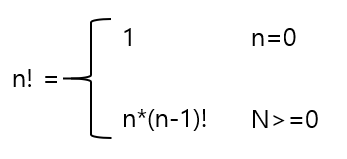
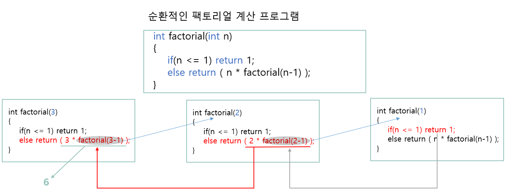
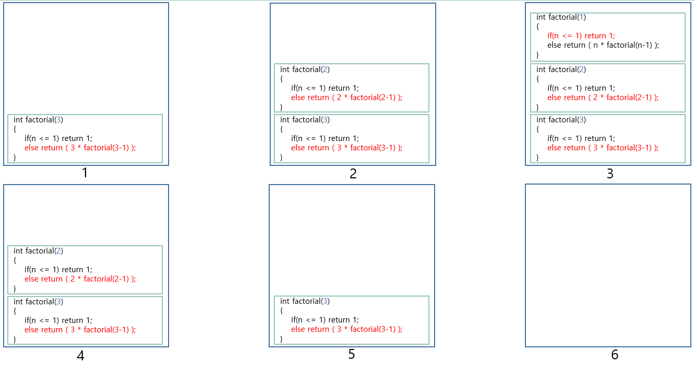
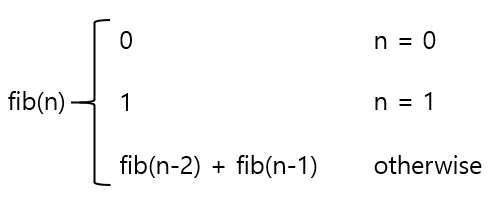
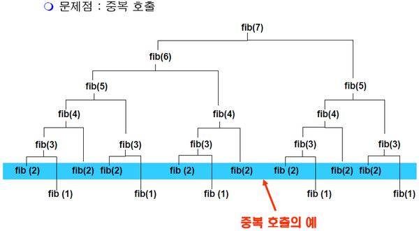
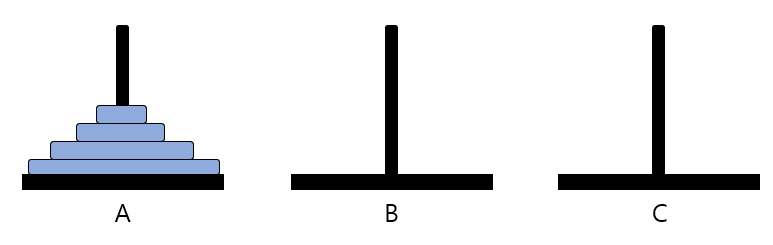
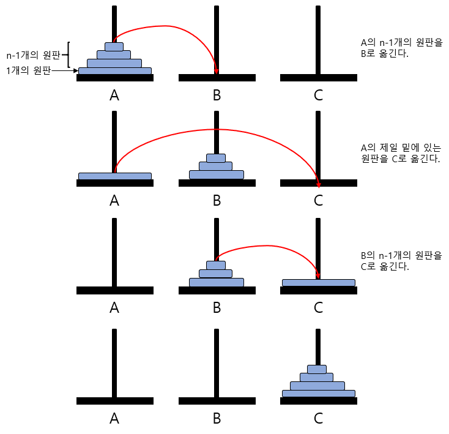

# 02. 순환(recursive)

## 2.1 순환의 소개

- 순환(recursive)이란 어떤 알고리즘이나 함수가 자기 자신을 호출하여 문제를 해결하는 프로그래밍 기법이다. 이것은 처음에는 상당히 이상하게 보이지만 사실 순환은 가장 흥미롭고 또 효과적인 프로그래밍 기법 중에 하나이다. 순환은 많은 문제들을 해결하는데 독특한 개념적인 프레임 워크를 제공한다.


### 순환의 예

- 순환은 본질적으로 순환적인 문제나 그러한 자료구조를 다루는 프로그램에 적합하다. 예를 들어 정수의 팩토리얼은 다음과 같이 정의된다.

  

- 즉 위의 정의에서 팩토이러 n!을 정의하는데 다시 팩토리얼 (n-1)!이 사용되었다. 이러한 정의를 순환적이라 한다. 위의 정의에 따라 n!을 구하는 함수 **factorial(n)**을 제작하여 보자. n!을 계산하려면 먼저 (n-1)!을 구하여 여기에 n을 곱하여 주면 n!값을 계산할 수 있다. 그러면 (n-1)!은 어떻게 계산할 것인가? 일단 (n-1)!을 계산하는 함수 **factorial_n_1**를 따로 제작하여 호출해서 계산하여 보자.

  ```c
  int factorial(int n) {
      if(n <= 1) return (1);
      else return (n * factorial_n_1(n-1));
  }
  ```

- 그런데 여기서 하나의 아이디어는 현재 우리가 제작하고 있는 함수가 n을 매개변수로 받아서 n!을 구하는 함수라는 점이다. 따라서 매개변수만 (n-1)로 변경하여 주면 (n-1)!값을 계산 할 수 있으리라는 것이다.

  - 순환적인 팩토리얼 계산 프로그램

    ```C
    int factorial(int n) {
        if(n <= 1) return (1);
        else return (n * factorial(n-1));
    }
    ```




### 순환 호출의 내부적인 구현

- 만약 위와 같이 프로그램을 작성하였을 경우, 컴퓨터 안에서는 어떤 일이 일어날까? 순환을 이해하기 위하여 먼저 함수 호출의 과정을 살펴보자.

- 프로그래밍 언어에서 하나의 함수가 자기 자신을 다시 호출하는 것은 다른 함수를 호출하는 것과 동일하다. 즉 복귀주소가 시스템 스택에 저장되고 호출되는 함수를 위한 매개변수(parameter)와 지역변수를 스택으로부터 할당받는다. 이러한 함수를 위한 시스템 스택에서의 공간을 활성 레코드(activation record)라 한다. 이러한 준비가 끝나면 호출된 함수의 시작 위치로 점프하여 수행을 시작한다. 만약 호출된 함수가 자기 자신이라면 자기 자신의 시작 위치로 점프하게 되는 것이다. 호출된 함수가 끝나게 되면 시스템 스택에서 복귀주소를 추출하여 호출한 함수로 되돌아가게 된다.

- 순환호출이 계속 중첩될수록 시스템 스택에는 활성 레코드들이 쌓이게 된다.

  


### 순환 알고리즘의 구조

- 순환 알고리즘은 자기 자신을 순환적으로 호출하는 부분과 순환 호출을 멈추는 부분으로 구성되어 있다. 만약 순환 호출을 멈추는 부분이 없다면 시스템 스택을 다 사용할 때까지 순환적으로 호출되다가 결국 오류를 내면서 멈출 것이다. 

- 만약 다음의 팩토리얼 계산 함수에서 만약 **if(n<=1) return(1)**이 없다면 어떻게 될까?

  ```c
  #include <stdio.h>
  
  int factorial(int n) {
      printf("factorial(%d)\n", n);
      // if(n <= 1) return (1);
      // else 
      return (n * factorial(n-1));
  }
  
  int main(){
      factorial(3);
  }
  ```

  - 팩토리얼 함수는 무한히 순환호출을 하게되고 결국 오류를 발생시킨다. 프로그램 실행 화면의 일부는 다음과 같다. 스택의 크기에 따라 출력되는 매개 변수의 숫자는 달라진다. 따라서 반드시 순환 호출에는 순환 호출을 멈추는 문장이 포함되어야 한다.

    - 실행결과

      ```
      ...
      factorial(-43165)
      factorial(-43166)
      factorial(-43167)
      factorial(-43168)
      factorial(-43169)
      factorial(-43170)
      factorial(-43171)
      factorial(-43172)
      factorial(-43173)
      factorial(-43174)
      ```

      

### 순환 <---> 반복

- 되풀이하는 것은 많은 컴퓨터 알고리즘에서 볼 수 있는 주요한 특징이다. 사실 빠르게 되풀이 하는 것은 컴퓨터의 중요한 능력중의 하나이다. 프로그래밍 언어에서 되풀이하는 방법에는 반복(iteration)과 순환(recursive)의 2가지가 있다.
- 반복이란 for나 while 등의 반복구조로 되풀이 하는 방법이다. 반복을 제어하는 변수를 사용하여 일정횟수동안 반복시킬수도 있고 어떤 조건이 만족될때까지 반복시킬수도 있다. 반복은 간명하고 효율적으로 되풀이를 구현하는 방법이다.
- 반면에 때로는 반복을 사용하게 되면 지나치게 복잡해지는 문제들도 존재한다. 이런 경우에는 순환이 좋은 해결책이 될 수 있다. 순환은 주어진 문제를 해결하기 위하여 자신을 다시 호출하여 작업을 수행하는 방식이다. 순환은 본질적으로 순환적(recursive)인 문제나 그러한 자료구조를 다루는 프로그램에 적합하다.
- 기본적으로 반복과 순환은 문제 해결 능력이 같으며 많은 경우에 순환 알고리즘을 반복 버전으로, 반복 알고리즘을 순환 버전으로 바꾸어 쓸 수 있다. 특히 순환 호출이 끝에서 이루어지는 순환을 꼬리 순환(tail recursive)이라 하는데, 이를 반복 알고리즘으로 쉽게 바꾸어 쓸 수 있다. 그러나 순환은 어떤 문제에서는 반복에 비해 알고리즘을 훨씬 명확하고 간결하게 나타낼 수 있다는 장점이 있다
- 순환은 일반적으로 함수 호출을 하게 되므로 반복에 비해 수행속도 면에서는 떨어진다. 따라서 알고리즘을 설명할 때는 순환으로 하고 실제 프로그램에서는 그것을 반복버전으로 바꾸어 코딩하는 경우도 있다. 물론 순환이 더 빠른예제도 존재한다.


### 순환의 원리

- 순환의적인 팩토리얼 함수를 살펴보면, 문제를 하나도 해결하지 않고 순환 호출만 하고 잇는 것은 절대 아니다. 문제의 일부를 해결한 다음, 나머지 문제에 대하여 순환 호출을 한다는 것을 유의하여야 한다.

  

- 우리가 보통 건축업자를 고용하여 집을 지을 때 한사람이 모든 공사를 다하지 않는다. 건축업자는 다시 여러 명의 하청업자를 고용하여 집의 여러 부분들을 완성시킨다. 하청업자들은 다시 다른 하청업자들을 고용하여 맡은 일을 완성한다. 이런 식으로 주어진 문제를 더 작은 동일한 문제들로 분해하여 해결하는 방법을 분할정복(divide and conquer)이라 한다. 여기서 중요한 것은 순환호출이 일어날 때마다 문제의 크기가 작아진다는 것이다. 문제의 크기가 점점 작아지면 풀기가 쉬워지고 결국은 아주 풀기 쉬운 문제가 된다.


## 2.2 거듭제곱값 계산

- 팩토리얼 계산 프로그램에서는 반복적인 방법이 순환적인 방법에 비하여 속도가 빠르다. 여기서는 순환적인 방법이 반복적인 방법보다 더 빠른 예제를 다루어 보자. 숫자 _x_의 _n_-거듭제곱 값인 _x_<sup>n</sup>을 구하는 함수를 작성하여 보자. 만약 순환을 생각하지 않고 작성한다면 당연히 다음과 같이 작성할 것이다. C언어의 수학 라이브러리 함수는 사용하지 않는다고 가정하자.

- 반복적인 거듭제곱 계산 프로그램

  ```C
  double slow_power(double x, int n) {
      int i;
      double result = 1.0;
      
      for(i=0; i<n; i++)
          result = result * x;
      return (result);
  }
  ```

- 다음은 순환의 개념을 사용하여 _n_ 제곱거듭값인 _x_<sup>n</sup>을 구하는 함수를 작성하여 보자. 알고리즘은 다음과 같다.

  ```
  power(x, n):
  	if n==0
  		then return 1;
      else if n이 짝수
      	then return power(x^2, n/2);
      else if n이 홀수
      	then return x*power(x^2, (n-1)/2);
  ```

- x<sup>n</sup>=(x<sup>2</sup>)<sup>n/2</sup>의 공식을 이용하여 _n_이 짝수인 경우에는 _x_<sup>2</sup>를 먼저 계산한 후에 이값을 _n_/2제곱 하는 것이다. _n_이 홀수인 경우에는 _x_<sup>2</sup>를 (_n_-1)/2 제곱하고 여기에 _x_를 곱해주면 된다.

- 위의 알고리즘에서도 역시 문제의 크기가 줄어듦을 유의하여야 한다. 처음에는 _n_승 이었다가 _n_/2승으로 되고 또 _n_/4승으로 점점 문제의 크기가 줄어든다.

- 순환적인 거듭제곱 계산 프로그램

  ```C
  double power(double x, int n) {
      if(n==0) return 1;
      else if((n%2) == 0)
          return power(x*x, n/2);
      else return x*power(x*x, (n-1)/2);
  }
  ```

- C언어를 이용하여 위의 알고리즘을 구현하여 보면 위의 프로그램과 같다. 어느 함수가 더 빠를까? 알고리즘은 복잡해 보이고 게다가 함수 호출이라는 오버헤드도 있지만  놀랍게도 순환적인 power() 함수가 더 빠르다. 실제로 구현하여 수행시간을 clock()함수로 측정하여 보면 2<sup>500</sup>을 1000000번 계산시키는데 반복적인 slow_power() 함수가 7.11초가 걸리는 반면, 순환적인 power() 함수는 0.47초 밖에 걸리지 않았다.

- 한 번의 순환 호출을 할 때마다 문제의 크기는 약 절반으로 줄어든다. 즉 _n_이 100이라면 다음과 같은 문제의 크기가 줄어들게 된다.

  - 100 --> 50 --> 25 --> 12 --> 6 --> 3 --> 1

  - n을 잠시 2의 거듭제곱인 2<sup>k</sup>라고 가정하여 보자. 그러면 순환호출을 한번 할 때마다 n의 크기가 절반씩 줄어들게 되므로 다음과 같이 줄어든다.
  - 2<sup>k</sup> --> 2<sup>k-1</sup> --> 2<sup>k-2</sup> --> ... --> 2<sup>1</sup> --> 2<sup>0</sup>

- 약 k번의 순환호출이 일어나게 됨을 알 수 있다. 실제로 n=2<sup>k</sup>이므로 양변에 log 함수를 취하면 log<sub>2</sub>n=k임을 알 수 있다. n이 만약 2의 거듭제곱이 아닌 경우에도 비슷하게 추리할 수 있다.
- 한번의 순환 호출이 일어날 때마다 약 1번의 곱셈과 1번의 나눗셈이 일어나므로 전체 연산의 개수는 k=log<sub>2</sub>n에 비례하게 될 것이고 따라서 시간 복잡도는 _**O**_(**log**<sub>2</sub>_**n**_)이 된다.
- 반면에 반복적인 기법을 사용한 slow_power() 함수의 시간복잡도는 한번의 루프마다 한 번의 곱셈이 필요하고 루프의 개수는 정확히 n이된다. 따라서 시간 복잡도는 _**O**_(**_n_**)이 된다.


## 2.3 피보나치 수열의 계산

- 순환을 사용하게 되면 단순하게 작성이 가능하며 가독성이 높아진다. 그러나 똑같은 계산을 몇번씩 반복한다면 아주 단순한 경우라 할지라도 계산시간이 엄청나게 길어질 수 있다. 이러한 예로 순환 호출을 이용하여 피보나치 수열을 계산하는 경우를 분석해보자.

- 피보나치 수열이란 다음과 같이 정의되는 수열이다.

  

- 피보나치 수열에서는 앞의 두 개의 숫자를 더해서 뒤의 숫자를 만든다. 정의에 따라 수열을 만들어 보면 다음과 같다.
  - 0,	1,	1,	2,	3,	5,	8,	13,	21,	34,	55,	89,	144,	...

- 피보나치 수열은 정의 자체가 순환적으로 되어 있다. 따라서 구현 시에 순환 호출을 사용하는 것이 자연스러운 방법이다. 피보나치 수열을 C언어를 이용하여 프로그램해 보면 다음과 같다.

- 순환적인 피보나치 수열 계산 프로그램

  ```C
  int fib(int n) {
      if(n==0) return 0;
      if(n==1) return 1;
      return (fib(n-1) + fib(n-2));
  }
  ```

  - 위의 함수는 매우 단순하고 이해하기 쉽지만 매우 비효율적이다. 왜냐하면 아래 그림처럼 fib(7)을 호출할때 fib(2)가 8번이나 계산되기 때문이다. 이런 현상은 순환호출이 깊어질수록 점점 심해진다. 따라서 상당히 비효율적임을 알 수 있다.

    

  - 순환적인 피보나치 수열 알고리즘의 시간 복잡도는 어떻게 될까? 순환적인 알고리즘의 복잡도는 순환적으로 표현할 수 있다.
    - _**T(n)**_ = _**T(n-1)**_ + _**T(n-2)**_ + **C**

  - 위의 순환적인 수식을 풀어보면 대략 다음과 같은 상한을 가지는 시간 복잡도가 도출된다.
    - _**O(2<sup>n</sup>)**_

- 그렇다면 피보나치 수열을 계산하는데 다른방법이 있을까? 이 경우에는 순환을 사용하지 않고 반복구조를 이용하여 프로그램하면 제일 좋은 결과를 얻을 수 있다. 

- 반복적인 피보나치 수열 계산 프로그램

  ```C
  int fib_iter(int n) {
      if (n == 0) return 0;
      if (n == 1) return 1;
      
      int pp = 0;
      int p = 1;
      int result = 0;
      
      for(int i=2; i<=n; i++) {
          result = p + pp;
          pp = p;
          p = result;
      }
      return result;
  }
  ```


### 2.4 하노이탑 문제

- 순환의 파워를 가장 극명하게 보여주는 예제가 바로 하노이 탑 문제이다. 

- 문제는 다음과 같다. 고대 인동의 베나레스에는 세계의 중심이 있고, 그 곳에는 아주 큰 사원이 있다. 이 사원에는 높이 50m정도 되는 다이아몬드 막대 3개가 있다. 그 중 한 막대에는 천지 창조 때에 신이 64장의 순금 원판을 크기가 큰 것으로부터 차례대로 쌓아 놓았다. 신은 승려들에게 밤낮으로 쉬지 않고 한 장씩 원판을 옮기어 빈 다이아몬드 막대 중 어느 한곳으로 모두 옮겨 놓도록 명령하였다. 원판은 한 번에 한개씩만 옮겨야 하고, 절대로 작은 원판위에 큰 원판을 올려 놓을 수 없다. 64개의 원판의 크기는 모두 다르다. 어떻게 하여야 하는가? 이 전설의 탑을 "하노이의 탑(The Tower of Hanoi)"이라고 부른다.

- 주어진 문제를 이해하기 위하여 원판의 개수가 4개인 경우를 살펴보자.

  

  - 문제는 막대 A에 쌓여있는 원판 4개를 막대 C로 옮기는 것이다. 단 다음의 조건을 지켜야 한다.
    - 한 번에 하나의 원판만 이동할 수 있다.
    - 맨 위의 잇는 원판만 이동할 수 있다.
    - 크기가 작은 원판위에 큰 원판이 쌓일 수 없다.
    - 중간의 막대를 임시적으로 이용할 수 있으나 앞의 조건들을 지켜야한다.

- 이 문제는 순환적으로 생각하면 쉽게 해결할 수 있다. 순환이 일어날수록 문제의 크기가 작아져야 한다. 여기서의 문제의 크기는 이동하여야 하는 디스크의 개수가 된다. 다음과 같이 문제를 나우어 생각하여 보자. n개의 원판이 A에 쌓여있는 경우, 먼저 위에 쌓여있는 n-1개의 원판을 B로 옮긴 다음, 제일 밑에 있는 원판을 C로 옮긴다. 이어서 B에 있던 n-1개의 원판을 C로 옮긴다. 자 이제 문제는 B에 쌓여있던 n-1개의 원판을 어떻게 C로 옮기냐이다. 이 문제를 다음과 같이 알고리즘을 만들어서 생각하여보자.

  

  ```C
  // 막대 from에 쌓여있는 n개의 원판을 막대 tmp를 사용하여 막대 to로 옮긴다.
  void hanoi_tower(int n, char from, char tmp, char to) {
      if(n == 1) {
          from에 있는 한 개의 원판을 to로 옮긴다.
      }
      else {
          1. from의 맨 밑의 원판을 제외한 나머지 원판들을 tmp로 옮긴다.
          2. from에 있는 한 개의 원판을 to로 옮긴다.
          3. tmp의 원판들을 to로 옮긴다.
      }
  }
  ```

  - 위의 의사 코드 중에서 2. 는 1개의 원판을 이동하는 것이므로 매우 쉽고 문제는 n-1개의 원판을 이동하여야 하는 1. 과 3. 을 어떻게 해결하느냐이다. 그러나 자세히 살펴보면 1. 과 3. 은 막대의 워치만 달라졌을 뿐 원래의 문제의 축소된 형태라는 것을 발견할 수 있다. 즉 1. 은 to를 사용하여 from에서 tmp로 n-1개의 원판을 이동하는 문제이고 3. 은 from을 사용하여 tmp에서 to로 n-1개의 원판을 이동하는 문제이다. 따라서 순환 호출을 사용할 수 있어서 다음과 같이 다시 작성할 수 있다. 

    ```C
    // 막대 from에 쌓여있는 n개의 원판을 막대 tmp를 사용하여 막대 to로 옮긴다.
    void hanoi_tower(int n, char from, char tmp, char to) {
        if(n == 1) {
            from에 있는 한 개의 원판을 to로 옮긴다.
        }
        else {
            hanoi_tower(n-1, from, to, tmp);
            from에 있는 한 개의 원판을 to로 옮긴다.
            hanoi_tower(n-1, tmp, from, to);
        }
    }
    ```

  - 원판을 이동한다는 것은 그냥 화면에 어디서 어디로 이동한다고 출력해주면 된다. 따라서 다음과 같은 프로그램이 얻어진다.

  - 하노이의 탑 문제 프로그램

    ```C
    #include <stdio.h>
    void hanoi_tower(int n, char from, char tmp, char to) {
        if(n == 1) {
            printf("원판 1을 %c에서 %c으로 옮긴다.\n", from, to);
        }
        else {
            hanoi_tower(n-1, from, to, tmp);
            printf("원판 %d을 %c에서 %c으로 옮긴다.\n", n, from, to);
            hanoi_tower(n-1, tmp, from, to);
        }
    }
    
    int main() {
        hanoi_tower(4, 'A', 'B', 'C');
        return 0;
    }
    ```

    