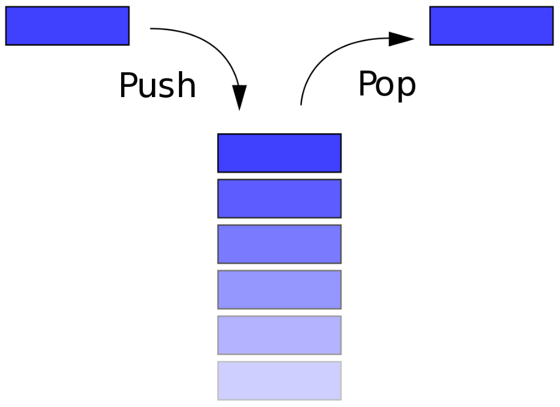

# 04 스택(Stack)

## 4.1 스택이란?

- 스택은 제한적으로 접근할 수 있는 나열 구조이다. 그 접근 방법은 언제나 목록의 끝에서만 일어난다. 스택은 한 쪽 끝에서만 자료를 넣거나 뺄 수 있는 **선형 구조**(LIFO - Last In First Out)으로 되어 있다.

- 자료를 넣는 것을 '밀어넣는다'하여 **푸쉬**(push)라고 하고 반대로 넣어둔 자료를 꺼내는 것을 **팝**(pop)이라고 하는데, 이때 꺼내지는 자료는 가장 최근에 푸쉬한 자료부터 나오게 된다. 이처럼 나중에 넣은 값이 먼저 나오는 것을 **LIFO**구조라고 한다.

  

  


### ADT STACK

- 객체 : 0개 이상의 원소를 가지는 유한 선형 리스트
- 연산 :
  - create(size) ::= 최대 크기가 size인 공백 스택을 생성한다.
  - is_full(s) ::=
    - if(스택의 원소수 == size) return TRUE;
    - else return FALSE;
  - is_empty(s) ::=
    - if(스택의 원소수 == 0) return TRUE;
    - else return FALSE;
  - push(s, item) ::=
    - if( is_full(s) ) return ERROR_STACKFULL;
    - else 스택의 맨 위의 item을 추가한다.
  - pop(s) ::=
    - if( is_empty(s) ) return ERROR_STACKEMPTY;
    - else 스택의 맨 위의 원소를 제거해서 반환한다.
  - peek(s) ::=
    - if( is_empty(s) ) return ERROR_STACKEMPTY;
    - else 스택의 맨위의 원소를 제거하지 않고 반환한다.


## 4.2 스택의 구현

### 동적 배열 스택 프로그램

```c
#include <stdio.h>
#include <stdlib.h>

typedef int element;
typedef struct {
    element *data;
    int capacity;
    int top;
} StackType;

// 스택 생성 함수
void init_stack(StackType *s) {
    s->top = -1;
    s->capacity = 1;
    s->data = (element*)malloc(s->capacity * sizeof(element));
}

// 공백 상태 검출 함수
int is_empty(StackType *s) {
    return (s->top == -1);
}

// 포화 상태 검출 함수
int is_full(StackType *s) {
    return (s->top == (s->capacity - 1));
}

// 추가 함수
void push(StackType *s, element item) {
    if(is_full(s)) {
        s->capacity *= 2;
        s->data = (element*)realloc(s->data, s->capacity *sizeof(element));
    }
    s->data[++(s->top)] = item;
}

// 삭제 함수
element pop(StackType *s) {
    if(is_empty(s)) {
        fprintf(stderr, "스택 공백 에러\n");
        exit(1);
    }
    else return s->data[(s->top)--];
}

int main() {
    StackType s;
    init_stack(&s);
    push(&s, 1);
    push(&s, 2);
    push(&s, 3);
    printf("%d \n", pop(&s));
    printf("%d \n", pop(&s));
    printf("%d \n", pop(&s));
    free(s.data);
}
```

- 실행 결과

```C
3
2
1
```


## 4.3 스택의 응용

### 괄호 검사 프로그램

```C
#include <stdio.h>
#include <stdlib.h>
#include <string.h>

typedef char element;
typedef struct {
    element *data;
    int capacity;
    int top;
} StackType;

// 스택 생성 함수
void init_stack(StackType *s) {
    s->top = -1;
    s->capacity = 1;
    s->data = (element*)malloc(s->capacity * sizeof(element));
}

// 공백 상태 검출 함수
int is_empty(StackType *s) {
    return (s->top == -1);
}

// 포화 상태 검출 함수
int is_full(StackType *s) {
    return (s->top == (s->capacity - 1));
}

// 추가 함수
void push(StackType *s, element item) {
    if(is_full(s)) {
        s->capacity *= 2;
        s->data = (element*)realloc(s->data, s->capacity *sizeof(element));
    }
    s->data[++(s->top)] = item;
}

// 삭제 함수
element pop(StackType *s) {
    if(is_empty(s)) {
        fprintf(stderr, "스택 공백 에러\n");
        exit(1);
    }
    else return s->data[(s->top)--];
}

int check_matching(const char *in) {
    StackType s;
    char ch, open_ch;
    int i, n = strlen(in); // n= 문자열의 길이
    init_stack(&s); 	   // 스택의 초기화
        
    for(i=0; i<n; i++) {
        ch = in[i];
        switch(ch) {
            case '(': case '[': case '{':
                push(&s, ch);
                break;
            case ')': case ']': case '}':
                if(is_empty(&s)) return 0;
                else {
                    open_ch = pop(&s);
                    if((open_ch == '(' && ch != ')') ||
                       (open_ch == '[' && ch != ']') ||
                       (open_ch == '{' && ch != '}')) {
                        return 0;
                    }
                    break;
            }
        }
    }
    if(!is_empty(&s)) return 0; // 스택에 남아있으면 오류
    return 1;
}

int main() {
    char *p = "{ A[(i+1)]=0; }";
    if(check_matching(p) == 1)
   		printf("%s 괄호검사 성공\n", p);
    else
        printf("%s 괄호검사 실패\n", p);
}
```

- 실행 결과

```C
{ A[(i+1)]=0; } 괄호검사 성공
```


### 후위표기식 계산

```C
#include <stdio.h>
#include <stdlib.h>
#include <string.h>

typedef char element;
typedef struct {
    element *data;
    int capacity;
    int top;
} StackType;

void init_stack(StackType *s) {
    s->top = -1;
    s->capacity = 1;
    s->data = (element*)malloc(sizeof(element) * s->capacity);
}

int is_empty(StackType *s) {
    return (s->top == -1);
}

int is_full(StackType *s) {
    return (s->top == (s->capacity - 1));
}

void push(StackType *s, element item) {
    if(is_full(s)) {
        s->capacity *= 2;
        s->data = (element*)realloc(s->data, sizeof(element) * s->capacity);
    }
    s->data[++(s->top)] = item;
}

element pop(StackType *s) {
    if(is_empty(s)) {
        fprintf(stderr, "스택 공백 에러\n");
        exit(1);
    }
    return s->data[(s->top)--];
}

// 후위 표기 수식 계산 함수
int eval(char exp[]) {
    int op1, op2, value, i = 0;
    int len = strlen(exp);
    char ch;
    StackType s;

    init_stack(&s);
    for(i=0; i<len; i++) {
        ch = exp[i];
        if(ch != '+' && ch != '-' && ch != '*' && ch != '/') {
            value = ch - '0'; // 입력이 피연산자이면
            push(&s, value);
        }
        else {                // 연산자이면 피연산자를 스택에서 제거
            op2 = pop(&s);
            op1 = pop(&s);
            switch(ch) {
                case '+': push(&s, op1 + op2); break;
                case '-': push(&s, op1 - op2); break;
                case '*': push(&s, op1 * op2); break;
                case '/': push(&s, op1 / op2); break;
            }
        }
    }
    return pop(&s);
}

int main() {
    int result;
    printf("후위표기수식은 82/3-32*+\n");
    result = eval("82/3-32*+");
    printf("결과값은 %d\n", result);
}
```

- 실행 결과

```
후위표기수식은 82/3-32*+
결과값은 7
```


### 중위표기수식을 후위표기수식으로 변환

```C
#include <stdio.h>
#include <stdlib.h>
#include <string.h>

typedef char element;
typedef struct {
    element *data;
    int capacity;
    int top;
} StackType;

void init_stack(StackType *s) {
    s->top = -1;
    s->capacity = 1;
    s->data = (element*)malloc(sizeof(element) * s->capacity);
}

int is_empty(StackType *s) {
    return (s->top == -1);
}

int is_full(StackType *s) {
    return (s->top == (s->capacity - 1));
}

void push(StackType *s, element item) {
    if(is_full(s)) {
        s->capacity *= 2;
        s->data = (element*)realloc(s->data, sizeof(element) * s->capacity);
    }
    s->data[++(s->top)] = item;
}

element pop(StackType *s) {
    if(is_empty(s)) {
        fprintf(stderr, "스택 공백 에러\n");
        exit(1);
    }
    return s->data[(s->top)--];
}

element peek(StackType *s) {
    if(is_empty(s)) {
        fprintf(stderr, "스택 공백 에러\n");
        exit(1);
    }
    return s->data[(s->top)];    
}

// 연산자들의 우선순위를 반환한다.
int prec(char op) {
    switch(op) {
        case '(': case ')': return 0;
        case '+': case '-': return 1;
        case '*': case '/': case '%': return 2; 
    }
    return -1;
}

// 중위 표기 수식 -> 후위 표기 수식
void infix_to_postfix(char exp[]) {
    int i = 0;
    char ch, top_op;
    int len = strlen(exp);
    StackType s;

    init_stack(&s);
    for(i=0; i<len; i++) {
        ch = exp[i];
        switch(ch) {
            case '+': case '-': case '*': case '/': case '%': // 연산자
                // 스택에 있는 연산자의 우선순위가 더 크거나 같으면 출력
                while(!is_empty(&s) && prec(ch) <= prec(peek(&s)))
                    printf("%c", pop(&s));
                push(&s, ch);
                break;
            case '(': // 왼쪽 괄호
                push(&s, ch);
                break;
            case ')': // 오른쪽 괄호
                top_op = pop(&s);
                // 왼쪽 괄호를 만날때가지 출력
                while(top_op != '(') {
                    printf("%c", top_op);
                    top_op = pop(&s);
                }
                break;
            default: // 피연산자
                printf("%c", ch);
                break;
        }
    }
    while(is_empty(&s)) // 스택에 저장된 연산자들 출력
        printf("%c", pop(&s));
}

int main() {
    char *s = "(2+3)*4+9";
    printf("중위표기수식 %s \n", s);
    printf("후위표기수식 ");
    infix_to_postfix(s);
    printf("\n");
}
```

- 실행 결과

```
중위표기수식 (2+3)*4+9
후위표기수식 23+4*9+
```


### 미로탐색 프로그램

```C
#include <stdio.h>
#include <stdlib.h>
#include <string.h>
#define MAZE_SIZE 6

typedef struct {
    short r;
    short c;
} element;
typedef struct {
    element *data;
    int capacity;
    int top;
} StackType;

void init_stack(StackType *s) {
    s->top = -1;
    s->capacity = 1;
    s->data = (element*)malloc(sizeof(element) * s->capacity);
}

int is_empty(StackType *s) {
    return (s->top == -1);
}

int is_full(StackType *s) {
    return (s->top == (s->capacity - 1));
}

void push(StackType *s, element item) {
    if(is_full(s)) {
        s->capacity *= 2;
        s->data = (element*)realloc(s->data, sizeof(element) * s->capacity);
    }
    s->data[++(s->top)] = item;
}

element pop(StackType *s) {
    if(is_empty(s)) {
        fprintf(stderr, "스택 공백 에러\n");
        exit(1);
    }
    return s->data[(s->top)--];
}

element here = { 1, 0 }, entry = { 1, 0 };

char maze[MAZE_SIZE][MAZE_SIZE] = {
    { '1', '1', '1', '1', '1', '1' },
    { 'e', '0', '1', '0', '0', '1' },
    { '1', '0', '0', '0', '1', '1' },
    { '1', '0', '1', '0', '1', '1' },
    { '1', '0', '1', '0', '0', 'x' },
    { '1', '1', '1', '1', '1', '1' }
};
// 위치를 스택에 삽입
void push_loc(StackType *s, int r, int c) {
    if(r < 0 || c < 0) return;
    if(maze[r][c] != '1' && maze[r][c] != '.') {
        element tmp;
        tmp.r = r;
        tmp.c = c;
        push(s, tmp);
    }
}

// 미로를 화면에 출력한다.
void maze_print(char maze[MAZE_SIZE][MAZE_SIZE]) {
    printf("\n");
    for(int r=0; r<MAZE_SIZE; r++) {
        for(int c=0; c<MAZE_SIZE; c++) {
            printf("%c", maze[r][c]);
        }
        printf("\n");
    }
}

int main() {
    int r, c;
    StackType s;

    init_stack(&s);
    here = entry;
    while(maze[here.r][here.c] != 'x') {
        r = here.r;
        c = here.c;
        maze[r][c] = '.';
        maze_print(maze);
        push_loc(&s, r-1, c);
        push_loc(&s, r+1, c);
        push_loc(&s, r, c-1);
        push_loc(&s, r, c+1);
        if(is_empty(&s)) {
            printf("실패\n");
            return 0;
        }
        else
            here = pop(&s);
    }
    printf("성공\n");
}
```

- 실행 결과

```
111111  111111  111111
.01001	..1001  ..1001
100011  100011  1.0011
101011  101011  101011
10100x  10100x  10100x
111111  111111  111111

111111  111111  111111
..1001	..1001  ..1001
1..011  1...11  1...11
101011  101011  101.11
10100x  10100x  10100x
111111  111111  111111

111111  111111  성공
..1001	..1001  
1...11  1...11  
101.11  101.11  
101.0x  101..x  
111111  111111  
```

