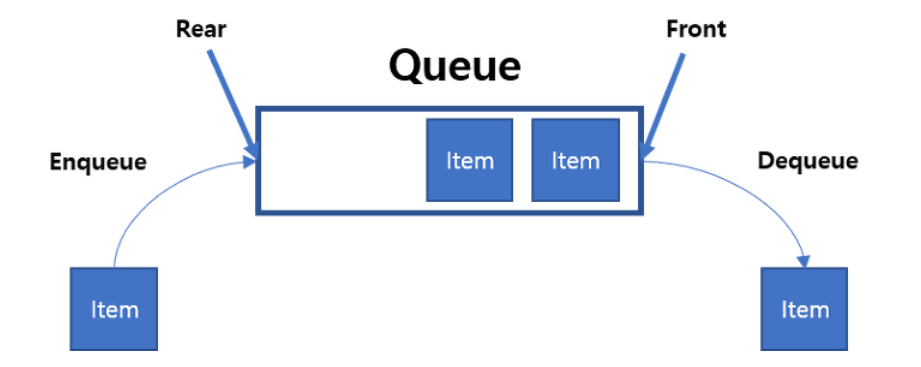
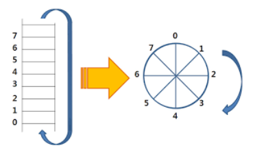
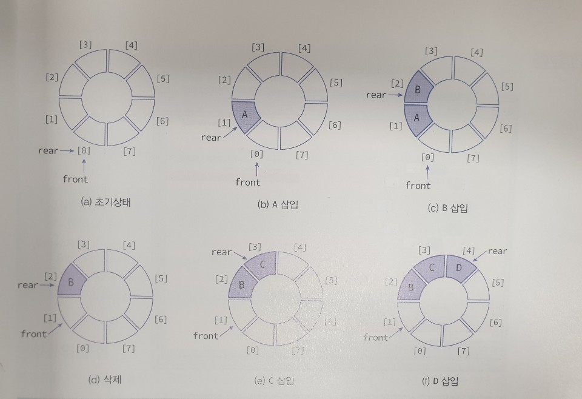
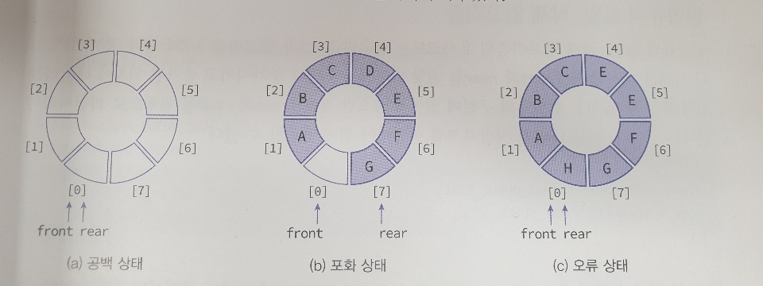
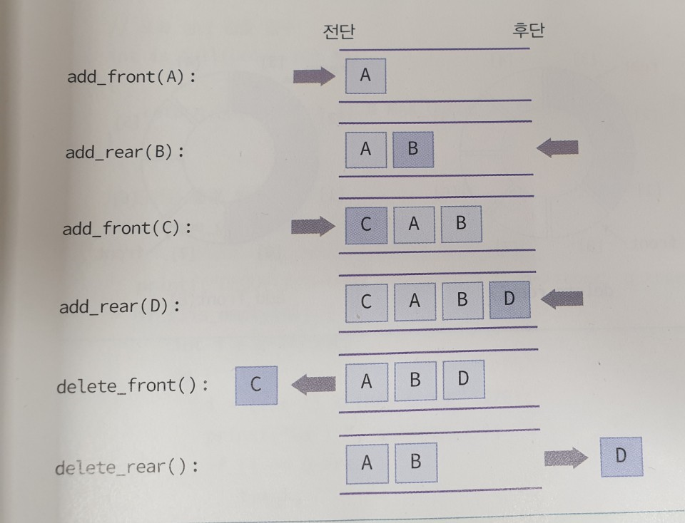

# 05. 큐(Queue)

## 5.1 큐 추상 데이터 타입

- 스택의 경우, 나중에 들어온 데이터가 먼저 나가는 구조인데 반하여 큐(queue)는 먼저 들어온 데이터가 먼저 나가는 구조로 이러한 특성을 **선입선출**(FIFO: First-In First-Out)이라고 한다.

- 큐는 뒤에서 새로운 데이터가 추가되고 앞에서 데이터가 하나씩 삭제되는 구조를 가지고 있다. 구조상으로 큐가 스택과 다른 점은 스택의 경우, 삽입과 삭제가 같은 쪽에서 일어나지만 큐에서는 삽입과 삭제가 다른쪽에서 일어난다는 것이다.  **그림**과 같이, 큐에서 삽입이 일어나는 곳을 **후단**(rear)라고 하고 삭제가 일어나는 곳을 **전단**(front)라고 한다.

  

  

### ADT QUEUE

- 객체 : 0개 이상의 요소들로 구성된 선형 리스트
- 연산 : 
  - create(max_size) ::=
    - 최대 크기가 max_size인 공백큐를 생성한다.
  - init(q) ::=
    - 큐를 초기화 한다.
  - is_empty(q) ::=
    - if(size == 0) return TRUE;
    - else return FALSE;
  - enqueue(q, e) ::=
    - if( is_full(q) ) queue_full 오류;
    - else q의 끝에 e를 추가한다.
  - dequeue(q) ::=
    - if( is_empty(q) ) queue_empty 오류;
    - else q의 맨 앞에 있는 e를 제거하여 반환한다.
  - peek(q) ::=
    - if( if_empty(q) ) queue_empty 오류;
    - else q의 맨 앞에 있는 e를 읽어서 반환한다. 


## 5.2 선형 큐

- 큐도 스택과 마찬가지로 구현하는 방법이 여러 가지이나 여기서는 가장 간단한 방법, 즉 1차원 배열을 쓰는 방법을 먼저 살펴본다. 정수를 저장할 수 있는 큐를 만들어 보면, 먼저 정수의 1차원 배열을 정의하고 삽입, 삭제를 위한 변수인 front와 rear를 만든다. front는 큐의 첫 번째 요소를 가리키고 rear는 큐의 마지막 요소를 가리킨다.
- front와 rear의 초기값은 -1이다. 데이터가 증가되는 rear를 하나 증가하고 그 위치에 데이터가 저장된다. 삭제할 때도 front를 하나 증가하고 front가 가리키는 위치에 있는 데이터를 삭제한다. 
- 위와 같은 큐를 선형큐(linear queue)하고 한다.

### 선형큐의 구현

```C
#include <stdio.h>
#include <stdlib.h>
#define MAX_QUEUE_SIZE 5

typedef int element;
typedef struct {
    int front;
    int rear;
    element data[MAX_QUEUE_SIZE];
} QueueType;

// 오류 함수
void error(char *message) {
    fprintf(stderr, "%s\n", message);
    exit(1);
}

void init_queue(QueueType *q) {
    q->rear = -1;
    q->front = -1;
}

void queue_print(QueueType *q) {
    for(int i=0; i<MAX_QUEUE_SIZE; i++) {
        if(i > q->front && i <= q->rear)
            printf("%d | ", q->data[i]);
        else
            printf("   | ");
    }
    printf("\n");
}

int is_full(QueueType *q) {
    if(q->rear == MAX_QUEUE_SIZE - 1)
        return 1;
    else 
        return 0;
}

int is_empty(QueueType *q) {
    if(q->front == q->rear)
        return 1;
    else
        return 0;
}

void enqueue(QueueType *q, element item) {
    if(is_full(q)) {
        error("큐가 포화상태입니다.");
        return;
    }
    q->data[++(q->rear)] = item;
}

element dequeue(QueueType *q) {
    if(is_empty(q)) {
        error("큐가 공백상태입니다.");
        return -1;
    }
    int item = q->data[++(q->front)];
    return item;
}

int main() {
    int item = 0;
    QueueType q;

    init_queue(&q);

    enqueue(&q, 10); queue_print(&q);
    enqueue(&q, 20); queue_print(&q);
    enqueue(&q, 30); queue_print(&q);

    item = dequeue(&q); queue_print(&q);
    item = dequeue(&q); queue_print(&q);
    item = dequeue(&q); queue_print(&q);
}
```

- 실행 결과

```
10 |    |    |    |    |
10 | 20 |    |    |    |
10 | 20 | 30 |    |    |
   | 20 | 30 |    |    |
   |    | 30 |    |    |
   |    |    |    |    |
```

- 선형큐의 문제점
  - 선형큐는 이해하기는 쉽지만 문제점이 있다. 즉 front와 rear값이 계속 증가만 하기 때문에 언젠가는 배열의 끝에 도달하게 되고 배열의 앞부분이 비어 있더라도 사용하지를 못한다는 점이다. 
  - 따라서 주기적으로 모든 요소들을 왼쪽으로 이동시켜야 한다. 하지만 이런식으로 요소들을 이동시키면 해결은 되지만 매번 이동시킨다면 상당한 시간이 걸리고 또한 프로그램 코딩이 복잡해 진다.


## 5.3 원형 큐

- 위의 문제는 배열을 선형으로 생각하지 말고 원형으로 생각하면 쉽게 해결된다. 즉, front와 rear의 값이 배열의 끝인 (MAX_QUEUE_SIZE-1)에 도달하면 다음에 증가되는 값은 0이 되도록 하는 것이다.
- 여기서 실제 배열이 원형으로 변화되는 것은 아니다. 그냥 개념상으로 원형으로 배열의 인덱스를 변화시켜주는 것뿐이다. 

  

- 원형큐에서는 front와 rear의 개념이 약간 변경된다. 먼저 초기값은 -1이 아닌 0이다. 또 front는 항상 큐의 첫 번째 요소의 앞을, rear는 마지막 요소를 가르킨다.

- 처음에 front, rear는 모두 0이고 삽입 시에는 rear가 먼저 증가되고, 증가된 위치에 새로운 데이터가 삽입된다. 또 삭제 시에도 front가 먼저 증가된 다음, 증가된 위치에서 데이터를 삭제한다.

  

- front와 rear의 값이 같으면 원형 큐가 비어 있음을 나타낸다. 원형큐에서는 하나의 자리는 항상 비워둔다. 왜냐하면 포화 상태와 공백 상태를 구별하기 위해서이다. 만약 한 자리를 비워두지 않는다면 공백 상태와 포화 상태를 구분 할 수 없을 것이다.
- 따라서 원형 큐에서 만약 front==rear이면 공백 상태가 되고 만약 front가 rear보다 하나 앞에 있으면 포화 상태가 된다.
- 만약 요소들의 개수를 저장하고 있는 추가적인 변수 count 변수를 사용할 수 있다면 한자리를 비워두지 않아도 된다.

  


### 원형 큐의 삽입, 삭제 알고리즘

- 원형 큐의 구현에 있어서 중요한 것은 front와 rear를 원형으로 회전시켜서 한다는 것이다. 이는 나머지 연산자 %를 이용하여 쉽게 구현할 수 있다.

```
원형 큐에서의 삽입 알고리즘
enqueue(Q, x) :
	rear <- (rear + 1) % MAX_QUEUE_SIZE;
	Q[rear] <- x;
```

```
원형 큐에서의 삭제 알고리즘
dequeue(Q) :
	front <- (front + 1) % MAX_QUEUE_SIZE;
	return Q[front];
```

- 위의 알고리즘에 의해 만약 MAX_QUEUE_SIZE를 5로 정의하면, front와 rear값은 0,1,2,3,4,0과 같이 변화된다.


### 원형 큐의 구현

- 원형큐에서의 front는 첫 번째 요소 하나 앞을, rear는 마지막 요소를 가리킨다. 따라서 삽입을 할 때는 rear을 무조건 먼저 하나 증가시키고 증가된 위치에 삽입을 하여야 하고, 삭제 할 때도 먼저 front를 증가시킨 다음, 그 위치에서 데이터를 꺼내 와야 한다.
- 공백 상태 검출은 front와 rear가 같으면 공백 상태로 판단할 수 있다. 포화 상태 검출은 (rear + 1) % MAX_QUEUE_SIZE이 front와 같으면 포화 상태라고 판단한다.

```C
#include <stdio.h>
#include <stdlib.h>

// ==== 원형 큐 코드 시작 =====
#define MAX_QUEUE_SIZE 5
typedef int element;
typedef struct {
    element data[MAX_QUEUE_SIZE];
    int front, rear;
} QueueType;

// 오류 함수
void error(char *message) {
    fprintf(stderr, "%s\n", message);
    exit(1);
}

// 큐 초기화 함수
void init_queue(QueueType *q) {
    q->front = q->rear = 0;
}

// 공백 상태 검출 함수
int is_empty(QueueType *q) {
    return (q->front == q->rear);
}

// 포화 상태 검출 함수
int is_full(QueueType *q) {
    return ((q->rear + 1) % MAX_QUEUE_SIZE == q->front);
}

// 원형큐 출력 함수
void queue_print(QueueType *q) {
    printf("QUEUE(front=%d rear=%d) = ", q->front, q->rear);
    if(!is_empty(q)) {
        int i = q->front;
        do{
            i = (i + 1) % (MAX_QUEUE_SIZE);
            printf("%d | ", q->data[i]);
            if(i == q->rear)
                break;
        }while(i != q->front);
    }
    printf("\n");
}

// 삽입 함수
void enqueue(QueueType *q, element item) {
    if(is_full(q))
        error("큐가 포화상태입니다.");
    q->rear = (q->rear + 1) % MAX_QUEUE_SIZE;
    q->data[q->rear] = item;
}

// 삭제 함수
element dequeue(QueueType *q) {
    if(is_empty(q))
        error("큐가 공백상태입니다.");
    q->front = (q->front + 1) % MAX_QUEUE_SIZE;
    return q->data[q->front];
}

element peek(QueueType *q) {
    if(is_empty(q))
        error("큐가 공백상태입니다.");
    return q->data[(q->front + 1) %  MAX_QUEUE_SIZE];
}

int main() {
    QueueType queue;
    int element;

    init_queue(&queue);
    printf("--데이터 추가 단계--\n");
    while(!is_full(&queue)) {
        printf("정수를 입력하시오: ");
        scanf("%d", &element);
        enqueue(&queue, element);
        queue_print(&queue);
    }
    printf("큐는 포화상태입니다.\n\n");

    printf("--데이터 삭제 단계--\n");
    while(!is_empty(&queue)) {
        element = dequeue(&queue);
        printf("꺼내진 정수: %d \n", element);
        queue_print(&queue);
    }
    printf("큐는 공백상태입니다.\n");
}
```

- 실행 결과

```
--데이터 추가 단계--
정수를 입력하시오: 10
QUEUE(front=0 rear=1) = 10 | 
정수를 입력하시오: 20
QUEUE(front=0 rear=2) = 10 | 20 | 
정수를 입력하시오: 30
QUEUE(front=0 rear=3) = 10 | 20 | 30 | 
정수를 입력하시오: 40
QUEUE(front=0 rear=4) = 10 | 20 | 30 | 40 | 
큐는 포화상태입니다.

--데이터 삭제 단계--
꺼내진 정수: 10
QUEUE(front=1 rear=4) = 20 | 30 | 40 |
꺼내진 정수: 20
QUEUE(front=2 rear=4) = 30 | 40 |
꺼내진 정수: 30
QUEUE(front=3 rear=4) = 40 |
꺼내진 정수: 40
QUEUE(front=4 rear=4) =
큐는 공백상태입니다.
```


## 5.4 덱이란?

- 덱(deque)은 double-ended queue의 줄임말로서 큐의 전단(front)과 후단(rear)에서 모두 삽입과 삭제가 가능한 큐를 의미한다. 그렇지만 여전히 중단에 삽입하거나 삭제하는 것은 허용하지 않는다.

### ADT Deque

- 객체 : n개의 element형의 요소들의 순서 있는 모임

- 연산 :

  - create() ::= 덱을 생성한다.

  - init(dq) ::= 덱을 초기화 한다.

  - is_empty(dq) ::= 덱이 공백 상태인지를 검사한다.

  - is_full(dq) ::= 덱이 포화 상태인지를 검사한다.

  - add_front(dq, e) ::= 덱의 앞에 요소를 추가한다.

  - add_rear(dq, e) ::= 덱의 뒤에 요소를 추가한다.

  - delete_front(dq) ::= 덱의 앞에 있는 요소를 반환한 다음 삭제한다.

  - delete_rear(dq) ::= 덱의 뒤에 있는 요소를 반환한 다음 삭제한다.

  - get_front(dq) ::= 덱의 앞에서 삭제하지 않고 앞에 있는 요소를 반환한다.

  - get_rear(dq) ::= 덱의 뒤에서 삭제하지 않고 뒤에 있는 요소를 반환한다.

    

- 덱은 스택과 큐의 연산들을 모두 가지고 있다. 예를 들면, **add_front**와 **delete_front** 연산은 스택의 push와 pop 연산과 동일하다. 또한 **add_rear** 연산과 **delete_front** 연산은 각각 큐의 enqueue와 dequeue 연산과 같다. 
- 추가로 덱은 **get_front, get_rear, delete_rear** 연산을 갖는다. 따라서 덱은 스택이나 큐에 비해 더 융통성 있는 많은 자료 구조로 볼 수 있다.
- 만약 덱의 전단과 관련된 연산들만을 사용하면 스택이 되고, 삽입은 후단, 삭제는 전단만을 사용하면 큐로 동작한다.




### 배열을 이용한 덱의 구현

- 원형 큐와 덱은 공통점이 많은데, 원형 큐를 확장하면 덱도 손쉽게 구현할 수 있다. 덱도 원형 큐와 같이 전단과 후단을 사용한다. 따라서 큐에서 사용한 배열 data와 front, rear를 그래도 사용하면 되고, 추가적인 데이터는 필요없다.
- 원형 큐에서 그대로 사용할 수 있는 많은 연산들이 있다. **is_empty(), is_full(), size(), init_queue(), print_deque(), add_rear(), delete_front(), get_front()** 등은 원형 큐의 연산들과 동일하다. 다만 이름이 변경된 것들이 있다. 예를 들어서 **add_rear()**는 **enqueue()**와 동일하다.
- 덱에 새롭게 추가된 연산에는 **delete_rear(), add_front(), get_rear()**가 있다.
- get_rear()가 가장 간단한데, 공백상태가 아닌경우 rear가 가르키는 항목을 반환하면 된다. delete_raer()와 add_front()에서는 원형 큐에서와 다르게 반대 방향의 회전이 필요하다. front나 rear를 감소시켜야 하는데, 만약 음수가 되면 MAX_QUEUE_SIZE를 더해주어야 한다.

```C
#include <stdio.h>
#include <stdlib.h>

#define MAX_QUEUE_SIZE 5
typedef int element;
typedef struct {
    element data[MAX_QUEUE_SIZE];
    int front, rear;
} DequeType;

// 오류 함수
void error(char *message) {
    fprintf(stderr, "%s\n", message);
    exit(1);
}

void init_deque(DequeType *q) {
    q->front = q->rear = 0;
}

int is_empty(DequeType *q) {
    return (q->front == q->rear); 
}

int is_full(DequeType *q) {
    return ((q->rear + 1) % MAX_QUEUE_SIZE == q->front); 
}

void deque_print(DequeType *q) {
    printf("DEQUE(front=%d rear=%d) = ", q->front, q->rear);
    if(!is_empty(q)) {
        int i = q->front;
        do{
            i = (i + 1) % (MAX_QUEUE_SIZE);
            printf("%d | ", q->data[i]);
            if(i == q->rear)
                break;
        }while(i != q->front);
    }
    printf("\n");
}

void add_rear(DequeType *q, element item) {
    if(is_full(q))
        error("큐가 포화상태입니다.");
    q->rear = (q->rear + 1) % MAX_QUEUE_SIZE;
    q->data[q->rear] = item;
}

element delete_front(DequeType *q) {
    if(is_empty(q))
        error("큐가 공백상태입니다.");
    q->front = (q->front + 1) % MAX_QUEUE_SIZE;
    return q->data[q->front];
}

element get_front(DequeType *q) {
    if(is_empty(q))
        error("큐가 공백상태입니다.");
    return q->data[(q->front + 1) % MAX_QUEUE_SIZE];
}

void add_front(DequeType *q, element val) {
    if(is_full(q))
        error("큐가 포화상태입니다.");
    q->data[q->front] = val;
    q->front = (q->front - 1 + MAX_QUEUE_SIZE) % MAX_QUEUE_SIZE;
}

element delete_rear(DequeType *q) {
    int prev = q->rear;
    if(is_empty(q))
        error("큐가 공백상태입니다.");
    q->rear = (q->rear - 1 + MAX_QUEUE_SIZE) % MAX_QUEUE_SIZE;
    return q->data[prev];
}

element get_rear(DequeType *q) {
    if(is_empty(q))
        error("큐가 공백상태입니다.");
    return q->data[q->rear];
}

int main() {
    DequeType queue;

    init_deque(&queue);
    for(int i=0; i<3; i++) {
        add_front(&queue, i);
        deque_print(&queue);
    }
    for(int i=0; i<3; i++) {
        delete_rear(&queue);
        deque_print(&queue);
    }
}
```

- 실행 결과

```
DEQUE(front=4 rear=0) = 0 |
DEQUE(front=3 rear=0) = 1 | 0 |
DEQUE(front=2 rear=0) = 2 | 1 | 0 |
DEQUE(front=2 rear=4) = 2 | 1 |
DEQUE(front=2 rear=3) = 2 |
DEQUE(front=2 rear=2) =
```


## 5.5 큐의 응용 : 시뮬레이션

- 은행에서 고객이 들어와서 서비스를 받고 나가는 과정을 시뮬레이션 해본다. 우리에게 필요한 것은 고객들이 기다리는 평균시간이 얼마냐 되느냐이다. 만약 기다리는 시간이 너무 길다면 행원을 더 투입하여 대기시간을 줄여야 할 것이다.
- 여기서는 최대한 간단하게 설정하여 시뮬레이션의 핵심적인 내용만 알아본다. 먼저 서비스하는 행원은 한사람이라고 가정한다. 고객의 대기행렬은 큐로 시뮬레이션된다. 주어진 시간동안 고객은 랜덤한 가격으로 큐에 들어온다. 고객들의 서비스 시간도 한계값 안에서 랜덤하게 설정된다.
- 큐에 들어있는 고객들은 순서대로 서비스를 받는다. 한 고객의 서비스가 끝나면 큐의 앞에 있는 다른 고객이 서비스를 받기 시작한다. 정해진 시간동안의 시뮬레이션이 끝나면 고객들의 평균대기시간을 계산하여 출력한다.


- 시뮬레이션은 하나의 반복 루프로 이루어진다.
  - 먼저 현재시각을 나타내는 clock이라는 변수를 하나 증가한다.
  - [0, 10] 사이의 난수를 생성하여 3보다 작으면 새로운 고객이 들어왔다고 판단한다. 새로운 고객이 들어오면 구조체를 생성하고 여기에 고객의 아이디, 도착시간, 서비스 시간 등의 정보를 복사한다. 여기서 고객이 필요로 하는 서비스 시간도 역시 난수로 생성한다. 이 구조체를  enqueue()를 호출하여서 큐에 추가한다. 전역 변수인 service_time에 현재 처리 중인 고객의 서비스 시간을 저장해둔다.
  - service_time이 0인지 아닌지를 살펴본다. 만약 service_time이 0이 아니면 어떤 고객이 지금 서비스를 받고 있는 중임을 의미한다. clock이 하나 증가했으므로 service_time을 하나 감소시킨다. 만약 service_time이 0이면 현재 서비스 받는 고객이 없다는 것을 의미한다. 따라서 큐에서 고객 구조체를 하나 꺼내어 서비스를  시작한다. 즉 서비스를 시작한다는 의미는 전역 변수 service_time에 고객의 서비스 시간을 저장한다는 것이다. 보다 복잡한 처리를 시뮬레이션 하려면 코드를 추가해야한다.
  - 60분의 시간이 지나면 고객들의 기다린 시간을 전부 합하여 화면에 출력한다. 

```C
#include <stdio.h>
#include <stdlib.h>
#include <time.h>
#define MAX_QUEUE_SIZE 5

typedef struct {
    int id;
    int arrival_time;
    int service_time;
} element;

typedef struct {
    element data[MAX_QUEUE_SIZE];
    int front, rear;
} QueueType;

void error(char *message) {
    fprintf(stderr, "%s\n", message);
    exit(1);
}

void init_queue(QueueType *q) {
    q->front = q->rear = 0;
}

int is_empty(QueueType *q) {
    return (q->front == q->rear);
}

int is_full(QueueType *q) {
    return ((q->rear + 1) % MAX_QUEUE_SIZE == q->front);  
}

void enqueue(QueueType *q, element item) {
    if(is_full(q))
        error("queue is full.\n");
    q->rear = (q->rear + 1) % MAX_QUEUE_SIZE;
    q->data[q->rear] = item;
}

element dequeue(QueueType *q) {
    if(is_empty(q))
        error("queue is empty.\n");
    q->front = (q->front + 1) % MAX_QUEUE_SIZE;
    return q->data[q->front];
}

int main() {
    int minutes = 60;
    int total_wait = 0;
    int total_customers = 0;
    int service_time = 0;
    int service_customer;
    QueueType queue;
    init_queue(&queue);

    srand(time(NULL));
    for(int clock = 0; clock < minutes; clock++) {
        printf("현재시각=%d\n", clock);
        if(rand() % 10 < 3) {
            element customer;
            customer.id = total_customers++;
            customer.arrival_time = clock;
            customer.service_time = rand() % 3+1;
            enqueue(&queue, customer);
            printf("고객 %d이 %d분에 들어옵니다. 업무처리시간= %d분\n",
                customer.id, customer.arrival_time, customer.service_time);
        }
        if(service_time > 0) {
            printf("고객 %d 업무처리중입니다.\n", service_customer);
            service_time--;
        }
        else {
            if(!is_empty(&queue)) {
                element customer = dequeue(&queue);
                service_customer = customer.id;
                service_time = customer.service_time;
                printf("고객 %d이 %d분에 업무를 시작합니다. 대기시간은 %d분이었습니다.\n",
                    customer.id, clock, clock - customer.arrival_time);
                total_wait += clock - customer.arrival_time;
            }
        }
    }
    printf("전체 대기 시간=%d분 \n", total_wait);
}
```

- 실행 결과

```
현재시각=0
현재시각=1
현재시각=2
현재시각=3
현재시각=4
현재시각=5
고객 0이 5분에 들어옵니다. 업무처리시간= 2분
고객 0이 5분에 업무를 시작합니다. 대기시간은 0분이었습니다.
현재시각=6
고객 0 업무처리중입니다.
현재시각=7
고객 0 업무처리중입니다.
현재시각=8
현재시각=9
현재시각=10
현재시각=11
현재시각=12
현재시각=13
현재시각=14
현재시각=15
현재시각=16
고객 1이 16분에 들어옵니다. 업무처리시간= 1분
고객 1이 16분에 업무를 시작합니다. 대기시간은 0분이었습니다.
현재시각=17
고객 1 업무처리중입니다.
현재시각=18
현재시각=19
현재시각=20
현재시각=21
현재시각=22
현재시각=23
현재시각=24
현재시각=25
고객 2이 25분에 들어옵니다. 업무처리시간= 2분
고객 2이 25분에 업무를 시작합니다. 대기시간은 0분이었습니다.
현재시각=26
고객 2 업무처리중입니다.
현재시각=27
고객 2 업무처리중입니다.
현재시각=28
고객 3이 28분에 들어옵니다. 업무처리시간= 3분
고객 3이 28분에 업무를 시작합니다. 대기시간은 0분이었습니다.
현재시각=29
고객 3 업무처리중입니다.
현재시각=30
고객 4이 30분에 들어옵니다. 업무처리시간= 2분
고객 3 업무처리중입니다.
현재시각=31
고객 3 업무처리중입니다.
현재시각=32
고객 5이 32분에 들어옵니다. 업무처리시간= 2분
고객 4이 32분에 업무를 시작합니다. 대기시간은 2분이었습니다.
현재시각=33
고객 6이 33분에 들어옵니다. 업무처리시간= 1분
고객 4 업무처리중입니다.
현재시각=34
고객 7이 34분에 들어옵니다. 업무처리시간= 3분
고객 4 업무처리중입니다.
현재시각=35
고객 5이 35분에 업무를 시작합니다. 대기시간은 3분이었습니다.
현재시각=36
고객 5 업무처리중입니다.
현재시각=37
고객 8이 37분에 들어옵니다. 업무처리시간= 1분
고객 5 업무처리중입니다.
현재시각=38
고객 6이 38분에 업무를 시작합니다. 대기시간은 5분이었습니다.
현재시각=39
고객 6 업무처리중입니다.
현재시각=40
고객 9이 40분에 들어옵니다. 업무처리시간= 3분
고객 7이 40분에 업무를 시작합니다. 대기시간은 6분이었습니다.
현재시각=41
고객 7 업무처리중입니다.
현재시각=42
고객 7 업무처리중입니다.
현재시각=43
고객 7 업무처리중입니다.
현재시각=44
고객 8이 44분에 업무를 시작합니다. 대기시간은 7분이었습니다.
현재시각=45
고객 8 업무처리중입니다.
현재시각=46
고객 10이 46분에 들어옵니다. 업무처리시간= 1분
고객 9이 46분에 업무를 시작합니다. 대기시간은 6분이었습니다.
현재시각=47
고객 11이 47분에 들어옵니다. 업무처리시간= 1분
고객 9 업무처리중입니다.
현재시각=48
고객 9 업무처리중입니다.
현재시각=49
고객 9 업무처리중입니다.
현재시각=50
고객 12이 50분에 들어옵니다. 업무처리시간= 1분
고객 10이 50분에 업무를 시작합니다. 대기시간은 4분이었습니다.
현재시각=51
고객 13이 51분에 들어옵니다. 업무처리시간= 1분
고객 10 업무처리중입니다.
현재시각=52
고객 14이 52분에 들어옵니다. 업무처리시간= 1분
고객 11이 52분에 업무를 시작합니다. 대기시간은 5분이었습니다.
현재시각=53
고객 11 업무처리중입니다.
현재시각=54
고객 12이 54분에 업무를 시작합니다. 대기시간은 4분이었습니다.
현재시각=55
고객 15이 55분에 들어옵니다. 업무처리시간= 1분
고객 12 업무처리중입니다.
현재시각=56
고객 13이 56분에 업무를 시작합니다. 대기시간은 5분이었습니다.
현재시각=57
고객 13 업무처리중입니다.
현재시각=58
고객 14이 58분에 업무를 시작합니다. 대기시간은 6분이었습니다.
현재시각=59
고객 14 업무처리중입니다.
전체 대기 시간=53분
```

