# 06. 연결리스트 l(LinkedList)

## 6.1 리스트 추상 데이터 타입

### ADT LIST

- 객체 : n개의 element형으로 구성된 순서 있는 모임
- 연산 :
  - insert(list, pos, item) ::= pos 위치에 요소를 추가한다.
  - insert_last(list, item) ::= 맨 끝에 요소를 추가한다.
  - insert_first ::= 맨 처음에 요소를 추가한다.
  - delete(list, pos) ::= pos 위치의 요소를 제거한다.
  - clear(list) ::= 리스트의 모든 요소를 제거한다.
  - get_entry(list, pos) ::= pos 위치의 요소를 반환한다.
  - get_length(list) ::= 리스트의 길이를 구한다.
  - is_empty(list) ::= 리스트가 비었는지를 검사한다.
  - is_full(list) ::= 리스트가 꽉 찼는지를 검사한다.
  - print_list(list) ::= 리스트의 모든 요소를 표시한다.


### 리스트의 구현

- 리스트는 배열과 연결리스트를 이용하여 구현할 수 있다. 배열을 이용하면 리스트 ADT를 가장 간단하게 구현할 수 있다. 하지만 크기가 고정되는 점은 단점이다. 다른 방법으로는 포인터를 이용하여 연결 리스트를 만드는 방법이 있다. 연결 리스트는 필요할 때마다 중단에 속지를 추가해서 사용할 수 있는 바인더 공책과 비슷하다.
- 배열을 사용하여 리스트를 구현하면 장점과 단점이 존재한다. 장점은 구현이 간단하고 속도가 빠르다는 것이다. 단점으로는 리스트의 크기가 고정된다는 것을 들 수 있다. 즉 배열의 특성상 동적으로 크기를 늘리거나 줄이는 것이 힘들다. 따라서 만약 데이터를 추가하고 싶은데 더 이상 남은 공간이 없다면 문제가 발생한다. 
- 연결 리스트는 크기가 제한되지 않고, 중간에서 쉽게 삽입하거나 삭제할 수 있는 유연한 리스트를 구현할 수 있다. 하지만 연결 리스트도 단점이 있는데, 구현이 복잡하고, 임의의 항목을 추출하려고 할 때는 배열을 사용하는 방법보다 시간이 많이 걸린다.


## 6.2 배열로 구현된 리스트

### 리스트의 정의

- 배열로 리스트를 구현하기 위하여 배열과 항목의 개수를 구조체로 묶어서 **ArrayListType**이라는 새로운 데이터 타입을 정의한다.

```C
#define MAX_LIST_SIZE 100 // 리스트의 최대 크기

typedef int element;      // 항목의 정의
typedef struct {
    element array[MAX_LIST_SIZE]; // 배열 정의
    int size;                     // 현재 리스트에 저장된 항목들의 개수
} ArraryListType;
```


### 기초 연산

- 리스트의 연산들을 함수로 구현해본다. 모든 연산은 구조체 포인터를 받는다. 구조체 포인터를 받아야 하는 이유는 함수 안에서 구조체를 변경할 필요도 있기 때문이다. 포인터를 사용하지 않으면 구조체의 복사본이 전달되어서 원본 구조체를 변경할 수 없다. 일단 쉽게 구현할 수 있는 연산부터 구현해 본다.

```C
// 오류 처리 함수
void error(char *message) {
    fprintf(stderr, "%s\n", message);
    exit(1);
}

// 리스트 초기화 함수
void init(ArraryListType *L) {
    L->size = 0;
}

// 리스트가 비어 있으면 1을 반환
// 그렇지 않으면 0을 반환
int is_empty(ArraryListType *L) {
    return (L->size == 0);
}

// 리스트가 가득 차있으면 1을 반환
// 그렇지 않으면 0을 반환
int is_full(ArraryListType *L) {
    return (L->size == MAX_LIST_SIZE);
}

element get_entry(ArraryListType *L, int pos) {
    if(pos < 0 || pos >= L->size)
        error("위치 오류");
    return L->array[pos];
}

// 리스트 출력
void print_list(ArraryListType *L) {
    int i;
    for(i = 0; i<L->size; i++)
        printf("%d->", L->array[i]);
    printf("\n");
}
```


 ### 항목 추가 연산

- 이제 리스트의 맨 끝에 항목을 추가하는 **insert_last()** 함수를 구현해본다.

```C
void insert_last(ArraryListType *L, element item) {
    if(L->size >= MAX_LIST_SIZE) {
        error("리스트 오버플로우");
    }
    L->array[L->size++] = item;
}
```

- insert_last() 함수에서는 리스트에 빈공간이 없으면 오류를 발생시킨다.
- 이제 리스트의 pos 위치에 새로운 항목을 추가하려면 pos번째부터 마지막 항목까지 오른쪽으로 이동하여 빈자리를 만든 후에, 새로운 항목을 pos위치에 저장하여야 한다.

```C
void insert(ArraryListType *L, int pos, element item) {
    if(!is_full(L) && pos >= 0 && pos <= L->size) {
        for(int i=(L->size - 1); i >= pos; i--) {
            L->array[i+1] = L->array[i];
        }
        L->array[pos] = item;
        L->size++;
    }
}
```


### 항목 삭제 연산

- pos 위치의 항목을 삭제하는 delete(list, pos)를 구현해본다. 이때도 마찬가지로 삭제한 후에 array[pos+1]부터 array[size-1]까지를 한 칸씩 앞으로 이동하여야 한다.

```C
element delete(ArraryListType *L, int pos) {
    element item;

    if(pos < 0 || pos >= L->size) 
        error("위치 오류");
    item = L->array[pos];
    for(int i = pos; i < (L->size - 1); i++) {
        L->array[i] = L->array[i+1];
    }
    L->size--;
    return item;
}
```


### 테스트 프로그램

```C
#include <stdio.h>
#include <stdlib.h>
#define MAX_LIST_SIZE 100 // 리스트의 최대 크기

typedef int element;      // 항목의 정의
typedef struct {
    element array[MAX_LIST_SIZE]; // 배열 정의
    int size;                     // 현재 리스트에 저장된 항목들의 개수
} ArraryListType;

// 오류 처리 함수
void error(char *message) {
    fprintf(stderr, "%s\n", message);
    exit(1);
}

// 리스트 초기화 함수
void init(ArraryListType *L) {
    L->size = 0;
}

// 리스트가 비어 있으면 1을 반환
// 그렇지 않으면 0을 반환
int is_empty(ArraryListType *L) {
    return (L->size == 0);
}

// 리스트가 가득 차있으면 1을 반환
// 그렇지 않으면 0을 반환
int is_full(ArraryListType *L) {
    return (L->size == MAX_LIST_SIZE);
}

element get_entry(ArraryListType *L, int pos) {
    if(pos < 0 || pos >= L->size)
        error("위치 오류");
    return L->array[pos];
}

// 리스트 출력
void print_list(ArraryListType *L) {
    int i;
    for(i = 0; i<L->size; i++)
        printf("%d->", L->array[i]);
    printf("\n");
}

void insert_last(ArraryListType *L, element item) {
    if(L->size >= MAX_LIST_SIZE) {
        error("리스트 오버플로우");
    }
    L->array[L->size++] = item;
}

void insert(ArraryListType *L, int pos, element item) {
    if(!is_full(L) && pos >= 0 && pos <= L->size) {
        for(int i=(L->size - 1); i >= pos; i--) {
            L->array[i+1] = L->array[i];
        }
        L->array[pos] = item;
        L->size++;
    }
}

element delete(ArraryListType *L, int pos) {
    element item;

    if(pos < 0 || pos >= L->size) 
        error("위치 오류");
    item = L->array[pos];
    for(int i = pos; i < (L->size - 1); i++) {
        L->array[i] = L->array[i+1];
    }
    L->size--;
    return item;
}

int main() {
    // ArrayListType를 정적으로 생성하고 ArrayListType를
    // 가리키는 포인터를 함수의 매개변수로 전달한다.
    ArraryListType list;

    init(&list);
    insert(&list, 0, 10);  print_list(&list);
    insert(&list, 0, 20);  print_list(&list);
    insert(&list, 0, 30);  print_list(&list);
    insert_last(&list, 40);print_list(&list);
    delete(&list, 0);      print_list(&list);
}
```

- 실행 결과

```
10->
20->10->
30->20->10->
30->20->10->40->
20->10->40->
```


## 6.3 연결 리스트

- 연결리스트는 동적으로 크기가 변할 수 있고, 삭제나 삽입 시에 데이터를 이동할 필요가 없다. 이렇게 연결된 표현(linked representation)은 포인터를 사용하여 데이터들을 연결한다. 연결된 표현은 널리 사용되며 추상 데이터 타입 "리스트"의 구현에만 사용되는 것이 아니고 다른 여러 가지의 자료구조(트리, 그래프, 스택, 큐) 등을 구현하는데도 많이 사용된다.

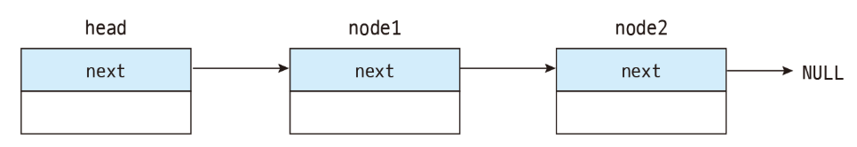

- 위의 그림처럼 연결된 표현은 줄로 연결된 상자라고 생각할 수 있다. 상자 안에는 데이터가 들어가고 상자에 연결된 줄을 따라가면 다음 상자를 찾을 수 있다. 연결된 표현은 일단 데이터를 한군데 모아두는 것을 포기하는 것이다. 데이터들은 메인 메모리상의 어디에나 흩어져서 존재할 수 있다. 이런식으로 물리적으로 흩어져 있는 자료들을 서로 연결하여 하나로 묶는 방법을 연결 리스트라고 한다. 상자를 연결하는 줄은 포인터로 구현한다.


### 연결 리스트의 구조

- 앞의 그림에서 상자를 컴퓨터 용어로 노드(node)라고 부른다. 연결 리스트는 이들 노드들의 집합이다. 노드들은 메모리의 어떤 위치에나 있을 수 있으며, 다른 노드로 가기 위해서는 현재 노드가 가지고 있는 포인터를 이용하면 된다. 노드는 데이터 필드(data field)와 링크 필드(link field)로 구성되어 있다.

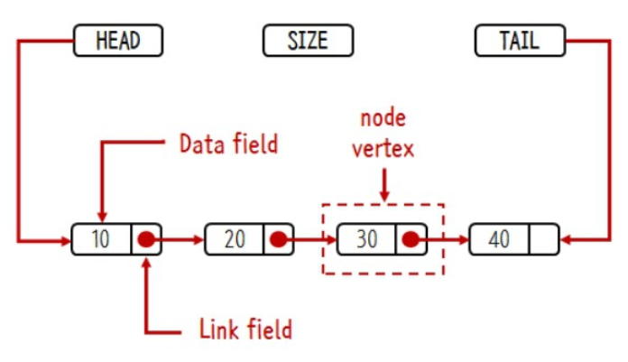

- 데이터 필드에는 우리가 저장하고 싶은 데이터가 들어간다. 데이터는 정수가 될 수도 있고 구조체와 같은 복잡한 데이터가 될 수도 있다. 링크 필드에는 다른 노드를 가르키는 포인터가 저장된다. 이 포인터를 이용하여 다음 노드로 건너갈 수 있다.
- 연결 리스트에서는 연결리스트의 첫 번째 노드를 알아야 만이 전체의 노드에 접근할 수 있다. 따라서 연결 리스트마다 첫 번째 노드를 가리키고 있는 변수가 필요한데 이것을 헤드 포인터(head pointer)라고 한다. 그리고 마지막 노드의 링크 필드는 NULL로 설정되는데 이는 더 이상 연결된 노드가 없다는 것을 의미한다.
- 연결 리스트의 노드들은 필요할 때마다 malloc()을 이용하여 동적으로 생성된다.


### 연결리스트의 종류

- 다음과 같은 3가지 종류의 연결 리스트가 있다. 단순 연결 리스트(singly linked list)는 하나의 방향으로만 연결되어 있는 연결 리스트이다. 단순 연결 리스트는 체인(chain)이라고도 한다. 단순 연결 리스트에서 마지막 노드의 링크는 NULL값을 가진다.
- 원형 연결 리스트(circular linked list)는 단순 연결리스트와 같으나 마지막 노드의 링크가 첫 번째 노드를 가리킨다.
- 이중 연결 리스트(doubly linked list)는 각 노드마다 2개의 링크가 존재한다. 하나의 링크는 앞에 있는 노드를 가리키고 또 하나의 링크는 뒤에 있는 노드를 가리킨다.

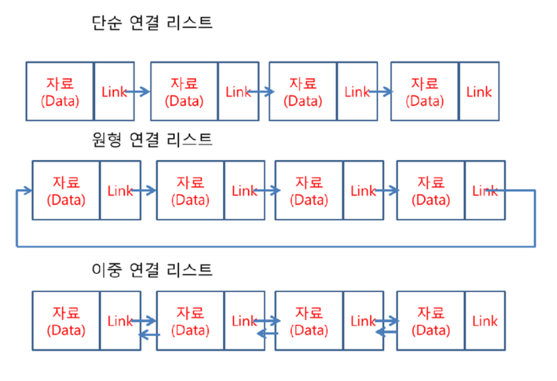


## 6.4 단순 연결 리스트

- 단순 연결 리스트에서는 노드들이 하나의 링크 필드를 가지며 이 링크 필드를 이용하여 모든 노드들이 연결되어 있다. 마지막 노드의 링크 값은 NULL이 된다.
- 단순 연결 리스트를 C언어로 구현하기 위해서는 다음과 같은 질문에 답하여야 한다.
  - 노드는 어떻게 정의할 것인가? **--->** 자기 참조 구조체를 이용한다.
  - 노드는 어떻게 생성할 것인가? **--->** malloc()을 호출하여 동적 메모리로 생성한다.
  - 노드는 어떻게 삭제할 것인가? **--->** free()을 호출하여 동적 메모리를 해제한다.


### 노드의 정의

- 노드는 자기 참조 구조체를 이용하여 정의된다. 자기 참조 구조체한 자기 자신을 참조하는 포인터를 포함하는 구조체이다. 구조체 안에는 데이터를 저장하는 data필드와 포인터가 저장되어 있는 link필드가 존재한다. data 필드는 element 타입의 데이터를 저장하고 있다. link필드는 ListNode를 가리키는 포인터로 정의되며 다음 노드의 주소가 저장된다.

```C
typedef int element;
typedef struct ListNode { // 노드 타입을 구조체로 정의한다.
    element data;
    struct ListNode *link;
} ListNode;
```

- 위의 코드에서 노드의 구조는 정의하였지만 아직 노드는 생성되지 않았음에 주의하여야 한다. 구조체 ListNode는 노드를 만들기 위한 설계도에 해당된다. ListNode를 가지고 실제 구조체를 생성하려면 구조체 변수를 선언하여야 한다.


### 공백 리스트의 생성

- 단순 연결리스트는 헤드 포인터만 있으면 모든 노드를 찾을 수 있다. 따라서 다음과 같은 노드를 가리키는 포인터 head를 정의하면 하나의 단순 연결 리스트가 만들어 졌다고 볼 수 있다. 현재는 노드가 없으므로 head값은 NULL이 된다.

```C
ListNode *head = NULL;
```

- 어떤 리스트가 공백인지를 검사하려면 헤드 포인터가 NULL인지를 검사하면 된다.


### 노드의 생성

- 일반적으로는 연결 리스트에서는 필요할 때마다 동적 메모리 할당을 이용하여 노드를 동적으로 생성한다. 다음의 코드에서는 mallocc() 함수를 이용하여 노드의 크기만큼의 동적 메모리를 할당 받는다. 이 동적 메모리가 하나의 노드가 된다. 동적 메모리의 주소를 헤드 포인터인 head에 저장한다.

```c
head = (ListNode*)malloc(sizeof(ListNode));
```

- 위의 코드까지 실행되면 노드가 하나 생성된다. 하지만 아직 노드에는 아무것이 채워지지 않은 상태이다.

  

- 다음 절차는 새로 만들어진 노드에 데이터를 저장하고 링크필드를 NULL로 설정하는 것이다.

```c
head->data = 10;
head->link = NULL;
```

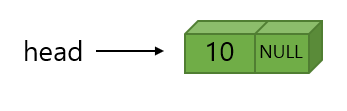

 ### 노드의 연결

- 일반적으로 연결 리스트에는 여러 개의 노드가 서로 연결되어 있다. 따라서 동일한 방식으로 두번째 노드를 동적으로 생성하고 노드애 20을 저장해본다.

```c
ListNode *p
p = (ListNode*)malloc(sizeof(ListNode));
p->data = 20;
p->link = NULL;
```

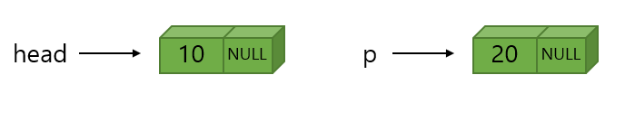

- 이제 생성된 2개의 노드를 서로 연결해본다. head->link에 p를 저장하면 첫 번째 노드의 링크가 두 번째 노드를 가리키게 된다.

```c
head->link = p;
```

- 최종적으로는 다음과 같은 연결 리스트가 될 것이다.

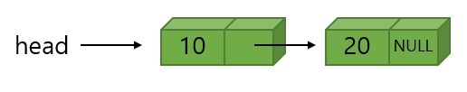


## 6.5 단순 연결 리스트의 연산 구현

- 앞 절에서는 노드를 하나씩 만들어서 연결하였다. 작은 리스트이면 이렇게 만들어도 되지만 리스트가 커지면 추상 데이터 타입에 정의된 전용 함수들을 통하여 노드를 추가하는 것이 편리하다. 단순 연결리스트에서 우리가 작성할 함수들은 다음과 같다.
  - insert_first() : 리스트의 시작 부분에 항목을 삽입하는 함수
  - insert() : 리스트의 중간 부분에 항목을 삽입하는 함수
  - delete_first() : 리스트의 첫 번째 항목을 삭제하는 함수
  - delete() : 리스트의 중간 항목을 삭제하는 함수
  - print_list() :리스트를 방문하여 모든 항목을 출력하는 함수


### 단순 연결 리스트의 정의

- 단순 연결 리스트는 원칙적으로 헤드 포인터만 있으면 된다.

```c
ListNode *head;
```


### 삽입 연산 insert_first()

- 단순 연결 리스트의 경우, 리스트의 처음이나 끝에 새로운 노드를 추가하는 경우가 많다. 여기서는 리스트의 첫 부분에 새로운 노드를 추가하는 함수 **insert_first()**를 작성해본다. 여기서 매개 변수 **head**는 헤드 포인터이고 **value**는 새롭게 추가되는 테이터이다.

```C
ListNode* insert_first(ListNode *head, element value);
```

- head가 첫 번째 노드를 가리키기 때문에 리스트의 시작 부분에 노드를 추가하는 것은 비교적 쉽다. 새로운 노드를 하나 생성하고 새로운 노드의 link에 현재의 head 값을 저장한 후에, head를 변경하여 새로 만든 노드를 가리키도록 하면 된다. insert_first()은 변경된 헤드 포인터를 반환한다. 따라서 반환된 값을 헤드포인터에 저장하여야 한다.
- 단순 연결리스트의 삽입함수

```c
ListNode* insert_first(ListNode *head, int value) {
    ListNode *p = (ListNode*)malloc(sizeof(ListNode));
    p->data = value;
    p->link = head;     // 헤드 포인터의 복사
    head = p;           // 헤드 포인터 변경
    return head;        // 변경된 헤드 포인터 반환
}
```


### 삽입 연산 insert()

- insert()는 가장 일반적인 경우로서 연결 리스트의 중간에 새로운 노드를 추가한다. 이때는 반드시 삽입되는 위치의 선행 노드를 알아야 삽입이 가능하다. 선행 노드를 pre가 가리키고 있다고 가정하자. 예를 들어서 아래 그림에서 "20"과 "30" 사이에 "35"을 삽입하여보자. 다음과 같은 절차가 필요하다.

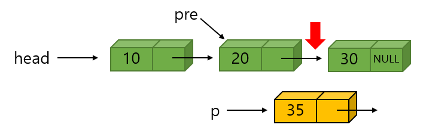

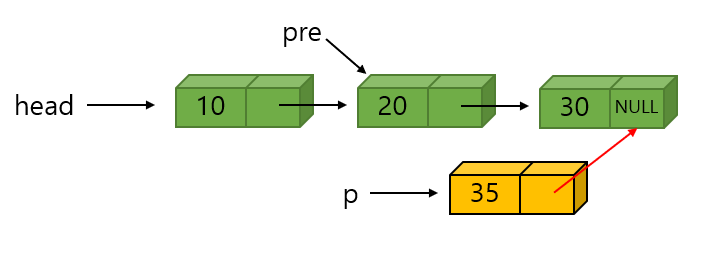

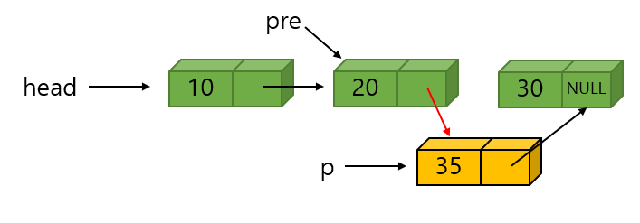

- 단순 연결 리스트의 삽입함수

```C
// 노드 pre 뒤에 새로운 노드 삽입
ListNode* insert(ListNode *head, ListNode *pre, element value) {
    ListNode *p = (ListNode*)malloc(sizeof(ListNode));
    p->data = value;
    p->link = pre->link;
    pre->link = p;
    return head;
}
```


### delete_first() 함수

- 첫 번째 노드를 삭제하는 함수 delete_first() 함수는 다음과 같은 원형을 가진다.

```C
ListNode* delete_first(ListNode *head)
```

- 연결 리스트의 시작 부분에서 노드삭제

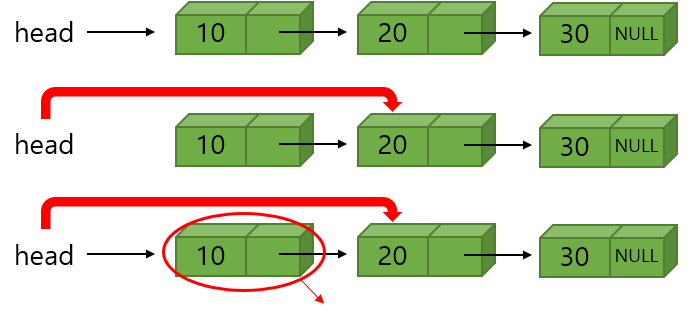

- 단순 연결 리스트의 삭제함수

```C
ListNode* delete_first(ListNode *head) {
    ListNode *removed;
    if(head == NULL) return NULL;
    removed = head;
    head = removed->link;
    free(removed);
    return head;
}
```


### 삭제 연산 delete()

- 리스트의 중간에서 삭제하는 알고리즘을 살펴본다. 다음과 같은 연결 리스트에서 노드 "30"을 삭제한다고 하자.


- 단순 연결 리스트의 삭제함수

```C
//pre가 가르키는 노드의 다음 노드를 삭제한다.
ListNode* delete(ListNode *head, ListNode *pre) {
    ListNode *removed;
    removed = pre->link;
    pre->link = removed->link;
    free(removed);
    return head;
}
```


### print_list() 함수

- 리스트 방분 알고리즘

```C
void print_list(ListNode *head) {
    for(ListNode *p = head; p != NULL; p = p->link)
        printf("%d->", p->data);
    printf("NULL \n");
}
```


### 전체 테스트 프로그램

```c
#include <stdio.h>
#include <stdlib.h>

typedef int element;
typedef struct ListNode { // 노드 타입
    element data;
    struct ListNode *link;
} ListNode;

void error(char *message) {
    fprintf(stderr, "%s\n", message);
    exit(1);
}

ListNode* insert_first(ListNode *head, int value) {
    ListNode *p = (ListNode*)malloc(sizeof(ListNode));
    p->data = value;
    p->link = head;     // 헤드 포인터의 복사
    head = p;           // 헤드 포인터 변경
    return head;        // 변경된 헤드 포인터 반환
}

// 노드 pre 뒤에 새로운 노드 삽입
ListNode* insert(ListNode *head, ListNode *pre, element value) {
    ListNode *p = (ListNode*)malloc(sizeof(ListNode));
    p->data = value;
    p->link = pre->link;
    pre->link = p;
    return head;
}

ListNode* delete_first(ListNode *head) {
    ListNode *removed;
    if(head == NULL) return NULL;
    removed = head;
    head = removed->link;
    free(removed);
    return head;
}

//pre가 가르키는 노드의 다음 노드를 삭제한다.
ListNode* delete(ListNode *head, ListNode *pre) {
    ListNode *removed;
    removed = pre->link;
    pre->link = removed->link;
    free(removed);
    return head;
}

void print_list(ListNode *head) {
    for(ListNode *p = head; p != NULL; p = p->link)
        printf("%d->", p->data);
    printf("NULL \n");
}

// 테스트 프로그램
int main() {
    ListNode *head = NULL;

    for(int i=0; i<5; i++) {
        head = insert_first(head, i); // insert_first()가 반환된 헤드 포인터를 head에 대입한다.
        print_list(head);
    }
    for(int i=0; i<5; i++) {
        head = delete_first(head);
        print_list(head);
    }
}
```


## 6.6 연결 리스트의 응용 : 다항식

- 연결 리스트를 이용하여 동일한 다항식을 표현해보고 이 두가지의 표현 방식을 비교하여 본다. 
- 다항식을 단순 연결 리스트로 표현 가능한데 각 항을 하나의 노드로 표현해본다. 각 노드는 계수(coef)와 지수(exp) 그리고, 다음 항을 가리키는 링크(link) 필드로 구성되어 있다.

```c
typedef struct ListNode {
    int coef;
    int expon;
    struct ListNode *link;
} ListNode;
```

- 각 다항식은 다항식의 첫 번째 항을 가르키는 포인터로 표현된다.

```c
ListNode *A, *B;
```

- 예를 들면 다항식 **A**(x) = 3x^12 + 2x^8 + 1과 **B**(x) = 8x^12 - 3x^10 + 10x^6은 다음과 같이 표현된다.

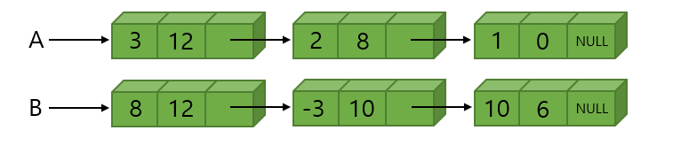

- 2개의 다항식을 더하는 덧셈 연산을 구현하여 본다. 다항식이 연결리스트로 표현되어 있기 때문에 포인터 변수 p와 q를 이용하여 다항식 A와 B의 항들을 따라 순회하면서 각 항들을 더하면 된다. p와 q가 가리키는 항의 지수에 따라 3가지의 경우로 나누어 처리할 수 있다.

  - p.expon == q.expon :
    - 두 계수를 더해서 0이 아니면 새로운 항을 만들어 결과 다항식 C에 추가한다. 그리고 p와 q는 모두 다음 항으로 이동한다.
  - p.expon < q.expon :
    - q가 지시하는 항을 새로운 항으로 복사하여 결과 다항식 C에 추가한다. 그리고 q만 다음항으로 이동한다.
  - p.exopn > q.expon :
    - p가 지시하는 항을 새로운 항으로 복사하여 결과 다항식 C에 추가한다. 그리고 p만 다음항으로 이동한다.

  - 위의 과정들을 p나 q 둘 중에서 어느 하나가 NULL이 될 때 까지 되풀이 한다. p나 q중에서 어느 하나가 NULL이 되면 아직 남아 있는 항들을 전부 C로 가져오면 된다.

- 연결 리스트로 구현한 다항식 덧셈 프로그램

```C
#include <stdio.h>
#include <stdlib.h>

typedef struct ListNode {
    int coef;
    int expon;
    struct ListNode *link;
} ListNode;

// 연결 리스트 헤더
typedef struct ListType { // 리스트 헤더 타입
    int size;
    ListNode *head;
    ListNode *tail;
} ListType;

// 오류 함수
void error(char *message) {
    fprintf(stderr, "%s\n", message);
    exit(1);
}

// 리스트 헤더 생성 함수
ListType* create() {
    ListType *plist = (ListType*)malloc(sizeof(ListNode));
    plist->size = 0;
    plist->head = plist->tail = NULL;
    return plist;
}

// plist는 연결 리스트의 헤더를 가리키는 포인터, coef는 계수,
// expon는 지수
void insert_last(ListType* plist, int coef, int expon) {
    ListNode* temp = (ListNode*)malloc(sizeof(ListNode));
    if(temp == NULL) error("메모리 할당 에러");

    temp->coef = coef;
    temp->expon = expon;
    temp->link = NULL;

    if(plist->tail == NULL) {
        plist->head = plist->tail = temp;
    }
    else {
        plist->tail->link = temp;
        plist->tail = temp;
    }
    plist->size++;
}

// list3 = list1 + list2
void poly_add(ListType* plist1, ListType* plist2, ListType* plist3) {
    ListNode* a = plist1->head;
    ListNode* b = plist2->head;
    int sum;

    while(a && b) {
        if(a->expon == b->expon) {
            sum = a->coef + b->coef;
            if(sum != 0) insert_last(plist3, sum, a->expon);
            a = a->link; b = b->link;
        }
        else if(a->expon > b->expon) {
            insert_last(plist3, a->coef, a->expon);
            a = a->link;
        }
        else {
            insert_last(plist3, b->coef, b->expon);
            b = b->link;            
        }
    }

    // a나 b중의 하나가 먼저 끝나게 되면 남아있는 항들을 모두
    // 결과 다항식으로 복사
    for(; a != NULL; a = a->link)
        insert_last(plist3, a->coef, a->expon);
    for(; b != NULL; b = b->link)
        insert_last(plist3, b->coef, b->expon);
}

void poly_print(ListType *plist) {
    ListNode* p = plist->head;

    printf("polynomial = ");
    for(; p; p = p->link) {
        printf("%d^%d + ", p->coef, p->expon);
    }
    printf("\n");
}

int main() {
    ListType *list1, *list2, *list3;

    // 연결 리스트 헤더 생성
    list1 = create();
    list2 = create();
    list3 = create();

    // 다항식 1을 생성
    insert_last(list1, 3, 12);
    insert_last(list1, 2, 8);
    insert_last(list1, 1, 0);

    // 다항식 2를 생성
    insert_last(list2, 8, 12);
    insert_last(list2, -3, 10);
    insert_last(list2, 10, 6);
    
    poly_print(list1);
    poly_print(list2);

    // 다항식3 = 다항식1 + 다항식2
    poly_add(list1, list2, list3);
    poly_print(list3);

    free(list1); free(list2); free(list3);
}
```

- 실행 결과

```
polynomial = 3^12 + 2^8 + 1^0 +
polynomial = 8^12 + -3^10 + 10^6 +
polynomial = 11^12 + -3^10 + 2^8 + 10^6 + 1^0 +
```

