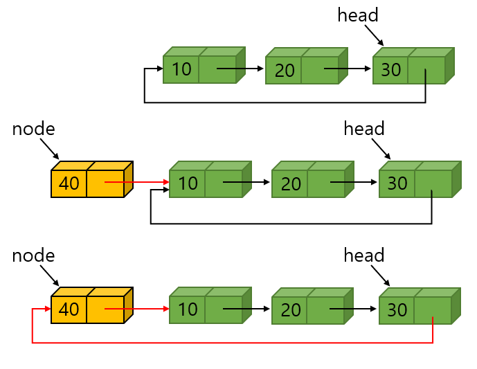
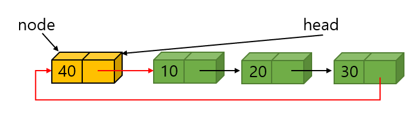
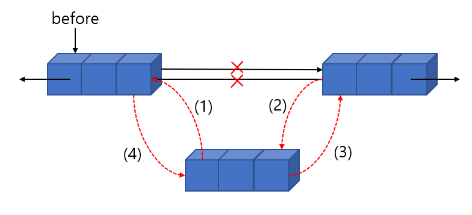
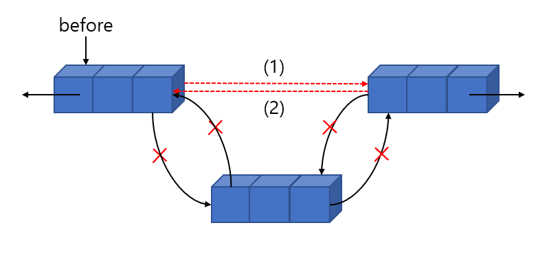
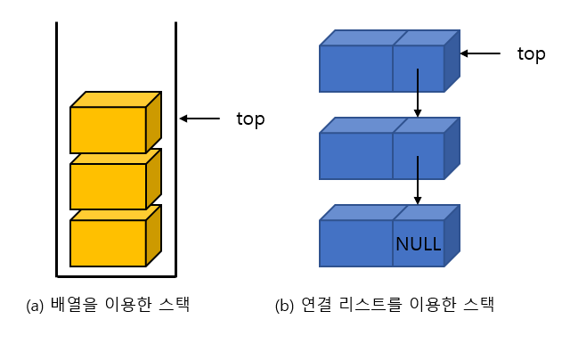
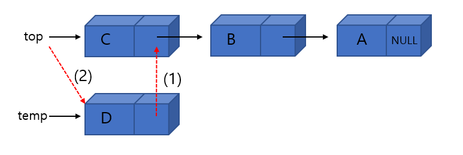
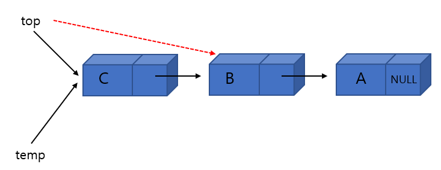

# 07. 연결리스트 ll(LinkedList)

## 7.1 원형 연결 리스트

### 원형 연결 리스트 소개

- 원형 연결 리스트란 마지막 노드가 첫 번째 노드를 가리키는 리스트이다. 즉 마지막 노드의 링크 필드가 널(NULL)이 아니라 첫 번째 노드 주소가 되는 리스트이다.
- 원형 연결 리스트에서는 하나의 노드에서 다른 모든 노드로의 접근이 가능하다. 하나의 노드에서 링크를 계속 따라 가면 결국 모든 노드를 거쳐서 자기 자신으로 되돌아 올 수 있는 것이다. 따라서 노드의 삽입과 삭제가 단순 연결리스트보다는 용이해진다는 것이다.
- 삭제나 삽입 시에는 항상 선행 노드를 가리키는 포인터가 필요하다.
- 원형 연결 리스트가 특히 유용한 경우는 리스트의 끝에 노드를 삽입하는 연산이 단순 연결 리스트보다 효율적일 수 있다는 것이다. 단순 연결리스트에서 리스트의 끝에 노드를 추가하려면 첫 번째 노드에서 부터 링크를 따라서 노드의 개수만큼 진행하여 마지막 노드까지 가야한다.
- 그러나 만약 원형 연결 리스트에서 헤드 포인터가 마지막 노드를 가리키도록 구성한다면 상수 시간 안에 리스트의 처음과 끝에 노드를 삽입할 수 있다.


### 원형 연결 리스트 정의

- 원형 연결 리스트도 원칙적으로 헤드 포인터만 있으면 된다.

```C
ListNode *head;
```


### 원형 리스트의 처음에 삽입

- 이 변형된 원형 연결 리스트를 이용하여 리스트의 처음에 삽입하는 함수를 작성하여 본다. 그림과 같이 먼저 새로운 노드의 링크인 node->link가 첫 번째 노드를 가리키게 하고 다음에 마지막 노드의 링크가 node를 가리키게 하면 된다.



- 원형 연결 리스트 처음에 삽입하는 함수

```C
ListNode* insert_first(ListNode* head, element data) {
    ListNode *node = (ListNode*)malloc(sizeof(ListNode));
    node->data = data;
    if(head == NULL) {
        head = node;
        node->link = head;
    }
    else {
        node->link = head->link;
        head->link = node;
    }
    return head;
}
```


### 원형 리스트 끝에 삽입

- 앞의 코드에 한 문장만 추가하면 원형 연결 리스트의 끝에 삽입할 수 있다. 즉 원형 연결 리스트는 어차피 원형으로 연결되어 있으므로 어디가 처음이고 어디가 끝인지는 불분명하다. 따라서 아래의 그림처럼 head의 위치만 새로운 노드로 바꾸어 주면 새로운 노드가 마지막 노드가 된다.



- 원형연결리스트의 끝에 삽입하는 함수

```C
ListNode* insert_last(ListNode* head, element data) {
    ListNode *node = (ListNode*)malloc(sizeof(ListNode));
    node->data = data;
    if(head == NULL) {
        head = node;
        node->link = head;
    }
    else {
        node->link = head->link;
        head->link = node;
        head = node;
    }
    return head;
}
```

### 테스트 프로그램

- 원형 리스트가 이와 같은 장점이 있지만 마지막 노드의 링크가 NULL이 아니기 때문에 리스트의 끝에 도달했는지를 검사하려면 헤드 포인터와 비교하여야 한다.
- 원형 연결 리스트 테스트 프로그램

```c
#include <stdio.h>
#include <stdlib.h>

typedef int element;
typedef struct ListNode { // 노드 타입
    element data;
    struct ListNode *link;
} ListNode;

// 리스트의 항목 출력
void print_list(ListNode* head) {
    ListNode *p;

    if(head == NULL) return;
    p = head->link;
    while(p != head) {
        printf("%d->", p->data);
        p = p->link;
    }
    printf("%d->", p->data);
}

ListNode* insert_first(ListNode* head, element data) {
    ListNode *node = (ListNode*)malloc(sizeof(ListNode));
    node->data = data;
    if(head == NULL) {
        head = node;
        node->link = head;
    }
    else {
        node->link = head->link;
        head->link = node;
    }
    return head;
}

ListNode* insert_last(ListNode* head, element data) {
    ListNode *node = (ListNode*)malloc(sizeof(ListNode));
    node->data = data;
    if(head == NULL) {
        head = node;
        node->link = head;
    }
    else {
        node->link = head->link;
        head->link = node;
        head = node;
    }
    return head;
}


int main() {
    ListNode *head = NULL;

    head = insert_last(head, 20);
    head = insert_last(head, 30);
    head = insert_last(head, 40);
    head = insert_first(head, 10);
    print_list(head);
}
```


## 7.2 원형 연결 리스트는 어디에 사용될까?

- 첫 번째로 컴퓨터에서 여러 응용 프로그램을 하나의 CPU를 이용하여 실행할 때에 필요하다. 현재 실행중인 모든 응용 프로그램은 원형 연결 리스트에 보관되며 운영 체제는 원형 연결 리스트에 있는 프로그램의 실행을 위해 고정된 시간 슬롯을 제공한다. 운영 체제는 모든 응용 프로그램이 완료될 때까지 원형 연결 리스트를 계속 순회한다.
- 두 번째 예는 멀티 플레이어 게임이다. 모든 플레이어는 원형 연결 리스트에 저장되며 한 플레이어의 기회가 끝나면 포인터를 앞으로 움직여서 다음 플레이어의 순서가 된다.
- 세 번째로 원형 연결 리스트는 우너형 큐를 만드는데도 사용할 수 있다. 원형 큐에서는 두 개의 포인터, front와 rear가 있어야 한다.


### 멀티 플레이어 게임

- 3명의 플레이어가 보드 게임을 한다고 하자, 게임에 빠지면 누구 순서인지도 잊어버릴 수 있다. 프로그램을 작성하여서 현재 누구 순서인지를 알리도록 한다.

```c
#include <stdio.h>
#include <stdlib.h>
#include <string.h>

typedef char element[100];
typedef struct ListNode { // 노드 타입
    element data;
    struct ListNode *link;
} ListNode;

ListNode* insert_first(ListNode* head, element data) {
    ListNode *node = (ListNode*)malloc(sizeof(ListNode));
    strcpy(node->data, data);
    if(head == NULL) {
        head = node;
        node->link = head;
    }
    else {
        node->link = head->link;
        head->link = node;
    }
    return head;
}

// 원형 연결 리스트 테스트 프로그램
int main() {
    ListNode *head = NULL;

    head = insert_first(head, "KIM");
    head = insert_first(head, "PARK");
    head = insert_first(head, "CHOI");

    ListNode* p = head;
    for(int i=0; i<10; i++) {
        printf("현재 차례=%s \n", p->data);
        p = p->link;
    }
}
```


## 7.3 이중 연결 리스트

- 단순 연결 리스트에서 어떤 노드에서 후속 노드를 찾기는 쉽지만, 선행 노드를 찾으려면 구조상 아주 어렵다. 원형 연결 리스트라고 하더라도 거의 전체 노드를 거쳐서 돌아 와야 한다. 따라서 응용 프로그램에서 특정 노드에서 양방향으로 자유롭게 움직일 필요가 있다면 단순 연결 리스트 구조는 부적합하다. 이중 연결 리스트는 이러한 문제점을 해결하기 위하여 만들어진 자료구조이다.

- 이중 연결 리스트는 하나의 노드가 선행 노드와 후속 노드에 대한 두 개의 링크를 가지는 리스트이다. 링크가 양방향이므로 양방향으로 검색이 가능해진다. 단점으로는 공간을 많이 차지하고 코드가 복잡해진다는 것이다.

- 실제 응용에서는 아래의 그림처럼 이중 연결 리스트와 원형 연결 리스트를 혼합한 형태가 많이 사용된다. 또 헤드 노드(head node)라는 특별한 노드를 추가하는 경우가 많다. 헤드 포인터는 리스트의 첫 번째 노드를 가리키는 포인터이고, 헤드 노드는 데이터를 가지고 있지 않은 특별한 노드를 추가하는 것이다.

  

- 헤드 노드의 데이터 필드는 아무런 정보도 담고 있지 않다. 다만 삽입과 삭제 알고리즘을 간편하게 하기 위하여 존재한다.

- 노드의 구조를 구조체를 이용하여 정의해보면 다음과 같다. 노드의 왼쪽 링크 필드는 llink는 바로 선행 노드를 가리키며, 오른쪽 링크 필드 rlink는 후속 노드를 가리킨다.

```c
typedef int element;
typedef struct DListNode {
    element data;
    struct DListNode* llink;
    struct DListNode* rlink;
} DListNode;
```


### 삽입 연산

- 먼저 삽입 연산에 대하여 살펴보자. 따라서 아래 그림의 순서대로 링크 필드의 값을 바꾸면 된다.  새로 만들어진 노드의 링크를 먼저 바꾸는 것을 알 수 있다. 새로 만들어진 노드의 링크는 아무런 정보도 가지고 있지 않기 때문에 변경하여도 안전하기 때문이다.



- 이중 연결 리스트에서의 삽입함수

```c
// 새로운 데이터를 노드 before의 오른쪽에 삽입한다.
void dinsert(DListNode *before, element data) {
    DListNode *newnode = (DListNode*)malloc(sizeof(DListNode));
    newnode->data = data;
    newnode->llink = before;
    newnode->rlink = before->rlink;
    before->rlink->llink = newnode;
    before->rlink = newnode;
}
```


### 삭제연산

- 삭제 연산은 아래의 그림의 순서로 링크들의 값을 변화시키면 된다.



- 이중 연결 리스트에서의 삭제함수

```c
// 노드 removed를 삭제한다.
void ddelete(DListNode* head, DListNode* removed) {
    if (removed == head) return;
    removed->llink->rlink = removed->rlink;
    removed->rlink->llink = removed->llink;
    free(removed);
}
```


### 완전한 프로그램

- 아래의 프로그램은 이중 연결 리스트를 사용한 간단한 프로그램이다. 이중 연결 리스트의 내용을 출력할 수 있는 print_dlist 함수가 있으며 이중 연결 리스트를 초기화하는 함수인 init()가 추가되어 있다. 한 가지 주의할 것은 이중 연결 리스트에서는 보통 헤드 노드가 존재하므로 단순 연결 리스트처럼 헤드 포인터가 필요 없다. 즉 헤드 노드만 알고 있으면 어떤 노드로도 접근할 수 있다.
- 헤드 노드는 main 함수 안에 변수로 head라는 이름으로 생성되어 있다. head는 포인터 변수가 아니고 구조체 포인터 변수임을 유의해야 한다. 이중 연결 리스트는 사용하기 전에 반드시 초기화를 해야 된다는 점을 유의해야 한다. 즉 헤더 노드의 링크필드들이 자기 자신을 가리키도록 초기화를 하여야 한다.

- 이중 연결 리스트에서의 삭제함수

```c
#include <stdio.h>
#include <stdlib.h>

typedef int element;
typedef struct DListNode {
    element data;
    struct DListNode* llink;
    struct DListNode* rlink;
} DListNode;

// 이중 연결 리스트를 초기화
void init(DListNode* phead) {
    phead->llink = phead;
    phead->rlink = phead;
}

// 이중 연결 리스트의 노드를 출력
void print_dlist(DListNode* phead) {
    DListNode *p;
    for(p = phead->rlink; p != phead; p = p->rlink) {
        printf("<-| |%d| |-> ", p->data);
    }
    printf("\n");
}

// 새로운 데이터를 노드 before의 오른쪽에 삽입한다.
void dinsert(DListNode *before, element data) {
    DListNode *newnode = (DListNode*)malloc(sizeof(DListNode));
    newnode->data = data;
    newnode->llink = before;
    newnode->rlink = before->rlink;
    before->rlink->llink = newnode;
    before->rlink = newnode;
}

// 노드 removed를 삭제한다.
void ddelete(DListNode* head, DListNode* removed) {
    if (removed == head) return;
    removed->llink->rlink = removed->rlink;
    removed->rlink->llink = removed->llink;
    free(removed);
}

// 이중 연결 리스트 테스트 프로그램
int main() {
    DListNode* head = (DListNode*)malloc(sizeof(DListNode));
    init(head);
    printf("추가 단계\n");
    for(int i=0; i<5; i++) {
        // 헤드 노드의 오른쪽에 삽입
        dinsert(head, i);
        print_dlist(head);
    }
    printf("\n삭제 단계\n");
    for(int i=0; i<5; i++) {
        print_dlist(head);
        ddelete(head, head->rlink);
    }
    free(head);
}
```


## 7.4 예제 : mp3 재생 프로그램 만들기

- 우리는 차안에서나 PC에서 mp3음악을 리스트로 저장하였다가 듣곤 한다. 어떤 리스트 형태가 mp3 재생 프로그램에 적합할까?
- mp3 재생기를 보면 현재 곡에서 이전 곡으로 가기도 하고 다음 곡으로 가기도 한다. 또 처음 곡이나 마지막 곡으로 가기도 한다. 따라서 현재 항목에서 이전 항목이나 다음 항목으로 쉽게 이동할 수 있는 자료 구조를 사용하여야 한다. 우리는 이중 연결 리스트를 이용하여서 음악을 저장하고 사용자의 명령에 맞추어 곡을 선택하는 프로그램을 작성해본다.
- mp3 플레이어 프로그램

```c
#include <stdio.h>
#include <stdlib.h>
#include <string.h>

typedef char element[100];
typedef struct DListNode {
    element data;
    struct DListNode* llink;
    struct DListNode* rlink;
} DListNode;

DListNode* current;

// 이중 연결 리스트를 초기화
void init(DListNode* phead) {
    phead->llink = phead;
    phead->rlink = phead;
}

// 이중 연결 리스트의 노드를 출력
void print_dlist(DListNode* phead) {
    DListNode* p;
    for(p = phead->rlink; p != phead; p = p->rlink) {
        if(p == current)
            printf("<-| #%s# |-> ", p->data);
        else
            printf("<- | %s |-> ", p->data);
    }
    printf("\n");
}

// 노드 newnode를 노드 before의 오른쪽에 삽입한다.
void dinsert(DListNode *before, element data) {
    DListNode* newnode = (DListNode*)malloc(sizeof(DListNode));
    strcpy(newnode->data, data);
    newnode->llink = before;
    newnode->rlink = before->rlink;
    before->rlink->llink = newnode;
    before->rlink = newnode;
}

// 노드 removed를 삭제한다.
void ddelete(DListNode *head, DListNode *removed) {
    if(removed == head) return;
    removed->llink->rlink = removed->rlink;
    removed->rlink->llink = removed->llink;
    free(removed);
}

// 이중 연결 리스트 테스트 프로그램
int main() {
    char ch;
    DListNode* head = (DListNode*)malloc(sizeof(DListNode));
    init(head);

    dinsert(head, "Mamamia");
    dinsert(head, "Dancing Queen");
    dinsert(head, "Fernando");

    current = head->rlink;
    print_dlist(head);

    do {
        printf("\n명령어를 입력하시오(<, >, q): ");
        ch = getchar();
        if(ch == '<') {
            current = current->llink;
            if(current == head)
                current = current->llink;
        }
        else if(ch == '>') {
            current = current->rlink;
            if(current == head)
                current = current->rlink;
        }
        print_dlist(head);
        getchar();
    } while (ch != 'q');
}
```


## 7.5 연결 리스트로 구현한 스택

- 배열을 이용한 스택과 연결리스트를 이용한 스택의 비교



- 이러한 스택이나 큐를 연결된 스택(linked stack)이라고 한다. 외부에서 보기에는 배열을 이용한 스택이나 연결 리스트를 이용한 스택이나 전혀 차이가 없다. 즉 제공되는 외부 인터페이스는 완전히 동일하다. 달라지는 것은 스택의 내부구현이다. 연결 리스트를 이용하여 스택을 만들게 되면 큰 장점이 있다. 즉 크기가 제한되지 않는다는 것이다. 동적 메모리 할당만 할 수 있으면 스택에 새로운 요소를 삽입할 수 있다. 반면에 동적 메모리 할당이나 해제를 해야 하므로 삽입이나 삭제 시간은 좀 더 걸린다.

### 연결된 스택 정의

- 연결된 스택은 기본적으로 연결 리스트이기 때문에 다음과 같이 노드를 정의한다. 노드는 우리가 저장하고 싶은 데이터 필드와 다음 노드를 가리키기 위한 포인터가 들어 있는 링크 필드로 구성된다. 또한 top은 더이상 정수가 아니고 노드를 가리키는 포인터로 선언된다. 또한 연결된 스택에 관련된 데이터는 top 포인터 뿐이지만 일관성을 위하여 LinkedStackType이라는 구조체 타입으로 정의되었다. 모든 함수들은 이 구조체의 포인터를 매개 변수로 받아서 사용한다.

```c
typedef int element;
typedef struct StackNode {
    element data;
    struct StackNode *link;
} StackNode;

typedef struct {
    StackNode *top;
} LinkedStackType;
```


### 삽입 연산

- 연결된 스택에서 삽입 연산을 구현해본다. 연결된 스택은 개념적으로 단순 연결 리스트에서 맨 앞에 데이터를 삽입하는 것과 동일하다. 연결된 스택에서는 헤드 포인터가 top이라는 이름으로 불리는 것 이외는 별 차이점이 없다. 삽입 연산에는 먼저 동적 메모리 할당으로 노드를 만들고 이 노드를 첫 번째 노드로 삽입한다. 아래의 그림과 같이 top값을 temp->link에 복사한 다음, temp를 top에 복사하면 된다.




### 삭제 연산

- 삭제 연산에서는 top의 값을 top->link로 바꾸고 기존의 top이 가리키는 노드를 동적 메모리 해제하면 된다. 스택에서 삭제 연산 시에 링크 필드의 변화는 아래의 그림에 있다.



- 연결된 스택에서 공백상태는 연결 리스트와 마찬가지로 top 포인터가 NULL인 경우이다. 그리고 포화상태는 동적 메모리 할당만 된다면 생성할 수 있기 때문에 없는 거나 마찬가지 이다.


### 연결된 스택 프로그램

```C
#include <stdio.h>
#include <stdlib.h>

typedef int element;
typedef struct StackNode {
    element data;
    struct StackNode *link;
} StackNode;

typedef struct {
    StackNode *top;
} LinkedStackType;

// 초기화 함수
void init(LinkedStackType *s) {
    s->top = NULL;
}

// 공백 상태 검출 함수
int is_empty(LinkedStackType *s) {
    return (s->top == NULL);
}

// 포화 상태 검출 함수
int is_full(LinkedStackType *s) {
    return 0;
}

// 삽입 함수
void push(LinkedStackType *s, element item) {
    StackNode *temp = (StackNode*)malloc(sizeof(StackNode));
    temp->data = item;
    temp->link = s->top;
    s->top = temp;
}   

void print_stack(LinkedStackType *s) {
    for(StackNode *p = s->top; p != NULL; p = p->link)
        printf("%d->", p->data);
    printf("NULL \n");
}

// 삭제 함수
element pop(LinkedStackType *s) {
    if(is_empty(s)) {
        fprintf(stderr, "스택이 비어있음\n");
        exit(1);
    }
    else {
        StackNode *temp = s->top;
        int data=  temp->data;
        s->top = s->top->link;
        free(temp);
        return data;
    }
} 

// 피크 함수
element peek(LinkedStackType *s) {
    if(is_empty(s)) {
        fprintf(stderr, "스택이 비어있음\n");
        exit(1);
    }
    else {
        return s->top->data;
    }
}

int main() {
    LinkedStackType s;
    init(&s);
    push(&s, 1); print_stack(&s);
    push(&s, 2); print_stack(&s);
    push(&s, 3); print_stack(&s);
    pop(&s); print_stack(&s);
    pop(&s); print_stack(&s);
    pop(&s); print_stack(&s);
}
```


## 7.6 연결 리스트로 구현한 큐

- 연결 리스트를 이용하여 스택을 만들 수 있는 것처럼 큐도 연결 리스트를 이용하여 만들 수 있다. 연결 리스트로 만들어진 큐를 연결된 큐(linked queue)라고 한다.
- 연결 리스트로 구현된 큐는 배열로 구현된 큐에 비하여 크기가 제한되지 않는다는 장점을 가지고 있다. 반면 배열로 구현된 큐에 비하여 코드가 약간 더 복잡해 지고, 링크 필드 때문에 메모리 공간을 더 많이 사용한다.
- 기본적인 구조는 단순 연결 리스트에다가 2개의 포인터를 추가한 것과 같다. front 포인터는 삭제와 관련되며 rear 포인터는 맨 뒤에 있는 요소를 가리킨다. 큐에 요소가 없는 경우에는 front와 rear는 NULL값이 된다.
- 큐의 요소들은 구조체로 정의되며 이 구조체는 데이터를 저장하는 data필드와 다음 노드를 가리키기 위한 포인터가 들어있는 link 필드로 이루어져 있다.


### 연결된 큐 정의

- 연결된 큐는 다음과 같이 정의 된다.

```C
typedef int element;        // 요소의 타입
typedef struct QueueNode {  // 큐의 노드의 타입
    element data;
    struct QueueNode *link;
} QueueNode;

typedef struct {            // 큐 ADT 구현
    QueueNode *front, *rear;
} LinkedQueueType;
```


### 삽입 연산

- 삽입 연산은 먼저 동적 메모리 할당을 통하여 새로운 노드를 생성한 다음, 데이터를 저장하고 연결 리스트의 끝에 새로운 노드를 추가하면 된다.

- 연결된 큐 삽입 연산

```C
// 삽입 함수
void enqueue(LinkedQueueType *q, element data) {
    QueueNode *temp = (QueueNode*)malloc(sizeof(QueueNode));
    temp->data = data;
    temp->link = NULL;
    if(is_empty(q)) {
        q->front = temp;
        q->rear = temp;
    }
    else {
        q->rear->link = temp;
        q->rear = temp;
    }
}
```


### 삭제 연산

- 삭제 연산은 연결 리스트의 처음에서 노드를 꺼내오면 된다.  삭제 연산은 먼저 큐가 공백 상태인지 검사하여야 한다.
- 연결된 큐 삭제 연산

```C
// 삭제 함수
element dequeue(LinkedQueueType *q) {
    QueueNode *temp = q->front;
    element data;
    if(is_empty(q)) {
        fprintf(stderr, "스택이 비어있음\n");
        exit(1);
    }
    else {
        data = temp->data;
        q->front = q->front->link;
        if(q->front == NULL)
            q->rear = NULL;
        free(temp);
        return data;
    }
}
```


### 연결된 큐 프로그램

- 다음은 연결된 큐를 사용하는 전체 프로그램이다. 공백 상태 검출은 front나 rear가 NULL이면 공백 상태로 판단할 수 있다. 연결 리스트의 경우, 메모리 할당과정에서 오류가 있지 않는 한 포화상태는 없다고 보아야 한다. 따라서 포화 상태 검출 함수인 is_full 함수는 항상 0을 반환한다.

- 연결된 큐 프로그램

```C
#include <stdio.h>
#include <stdlib.h>

typedef int element;        // 요소의 타입
typedef struct QueueNode {  // 큐의 노드의 타입
    element data;
    struct QueueNode *link;
} QueueNode;

typedef struct {            // 큐 ADT 구현
    QueueNode *front, *rear;
} LinkedQueueType;

// 큐 초기화 함수
void init(LinkedQueueType *q) {
    q->front = q->rear = NULL;
}

// 공백 상태 검출 함수
int is_empty(LinkedQueueType *q) {
    return (q->front == NULL);
}

// 포화 상태 검출 함수
int is_full(LinkedQueueType *q) {
    return 0;
}

// 삽입 함수
void enqueue(LinkedQueueType *q, element data) {
    QueueNode *temp = (QueueNode*)malloc(sizeof(QueueNode));
    temp->data = data;
    temp->link = NULL;
    if(is_empty(q)) {
        q->front = temp;
        q->rear = temp;
    }
    else {
        q->rear->link = temp;
        q->rear = temp;
    }
}

// 삭제 함수
element dequeue(LinkedQueueType *q) {
    QueueNode *temp = q->front;
    element data;
    if(is_empty(q)) {
        fprintf(stderr, "스택이 비어있음\n");
        exit(1);
    }
    else {
        data = temp->data;
        q->front = q->front->link;
        if(q->front == NULL)
            q->rear = NULL;
        free(temp);
        return data;
    }
}

void print_queue(LinkedQueueType *q) {
    QueueNode *p;
    for(p = q->front; p != NULL; p = p->link)
        printf("%d->", p->data);
    printf("NULL\n");
}

int main() {
    LinkedQueueType queue;

    init(&queue);

    enqueue(&queue, 1); print_queue(&queue);
    enqueue(&queue, 2); print_queue(&queue);
    enqueue(&queue, 3); print_queue(&queue);
    dequeue(&queue);    print_queue(&queue);
    dequeue(&queue);    print_queue(&queue);
    dequeue(&queue);    print_queue(&queue);
}
```

