# 10. 그래프 l(Graph)

## 10.1 그래프란?

### 그래프의 소개

- 그래프(graph)는 객체 사이의 연결 관계를 표현할 수 있는 자료 구조다. 그래프의 대표적인 예는 지도이다. 아래그림의 지하철 노선도는 여러 개의 역들이 어떻게 연결되었는지를 보여준다. 지도를 그래프로 표현하면 지하철의 특정한 역에서 다른 역으로 가는 최단 경로를 쉽게 프로그래밍해서 찾을 수 있다.

  

- 또한 전기 소자를 그래프로 표현하게 되면 전기 회로의 소자들이 어떻게 연결되어 있는지를 표현해야 회로가 제대로 동작하는지 분석할 수 있으며, 운영 체제에서는 프로세스와 자원들이 어떻게 연관되는지를 그래프로 분석하여 시스템의 효율이나 교착상태 유무 등을 알아낼 수 있다.

  

- 이러한 많은 문제들은 공통적으로 도시, 소자, 자원, 프로젝트 등의 객체들이 서로 연결되어 있는 구조로 표현 가능하다. 그래프는 이러한 많은 문제들을 표현할 수 있는 훌륭한 논리적 도구이다. 우리가 여태까지 배워온 선형리스트나 트리의 구조로는 위와 같은 복잡한 문제들을 표현할 수 없다. 그래프 구조는 인접 행렬이나 인접 리스트로 메모리에 표현되고 처리될 수 있으므로 광범위한 분야의 다양한 문제들을 그래프로 표현하여 컴퓨터 프로그래밍에 의해 해결할 수 있다.
- 그래프는 아주 일반적인 자료 구조로서 앞에서 배웠던 트리도 그래프의 하나의 특수한 종류로 볼 수 있다. 그래프 이론(graph theory)은 컴퓨터 학문 분야의 활발한 연구 주제이며 문제해결을 위한 도구로서 많은 이론과 응용이 존재한다. 우리는 여기서 그래프의 기본적인 알고리즘에 대해서 학습한다.


### 그래프의 역사

- 1736년에 수학자 오일러(Euler)는 "Konigsberg의 다리" 문제를 해결하기 위하여 그래프를 처음으로 사용하였다. Konigsberg시의 한 가운데는 Pregel 강이 흐르고 있고 여기에는 7개의 다리가 있다. "Konigsberg의 다리" 문제란 "임의의 지역에서 출발하여 모든 다리를 단 한번만 건너서 처음 출발했던 지역으로 돌아올 수 있는가"이다.

  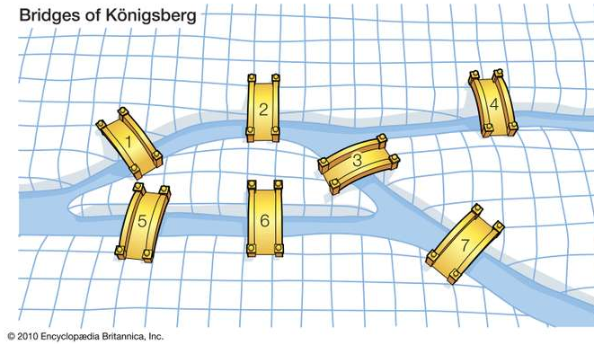

- 많은 사람들이 이 문제의 답을 찾기 위해 노력을 했다. 한번 시도해보면 알 수 있지만 그런 방법은 없다는 것이 정답이다. 오일러는 어떤 한 지역에서 시작하여 모든 다리를 한 번씩만 지나서 처음 출발점으로 되돌아오려면 각 지역에 연결된 다리의 개수가 모두 짝수이어야 함을 증명하였다. 오일러는 위의 문제를 다음과 같이 간단하게 변경하였다.

  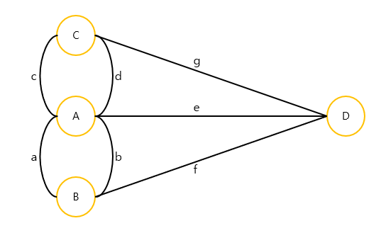

- 오일러는 이 문제에서 핵심적이고 중요한 것은 'A, B, C, D의 위치가 어떠한 관계로 연결되었는가?' 라고 생각하고, 특정 지역은 정점(node)로, 다리는 간선(edge)로 표현하여 위의 그림과 같은 그래프(graph) 문제로 변환하였다. 오일러는 이러한 그래프에 존재하는 모든 간선을 한번만 통과하면서 처음 정점으로 되돌아오는 경로를 오일러 경로(Eulerian tour)라 정의하고, 그래프의 모든 정점에 연결된 간선의 개수가 짝수일 때만 오일러 경로가 존재한다는 오일러의 정리를 증명하였다. 따라서 위 그림의 그래프는 오일러의 정리에 의해 오일러 경로가 존재하지 않는다는 것을 복잡한 시행착오를 거치지 않고도 손쉽게 알 수 있게 한다.


### 그래프로 표현할 수 있는 것들

- 도로

  - 도로의 교차점과 일방통행길 등을 그래프로 효과적으로 표현할 수 있다.

  


- 미로
  - 미로도 그래프를 이용하여 효과적으로 표현이 가능하다.

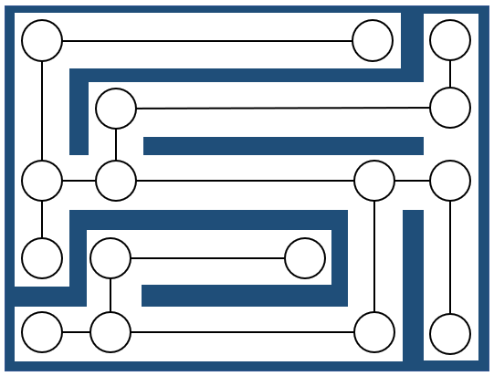


- 선수과목

  - 대학교에서 전공과목을 수강하기 위해서는 미리 들어야 하는 선수과목들이 있다. 그래프는 이러한 선수과목 관계를 효과적으로 표현할 수 있다.

  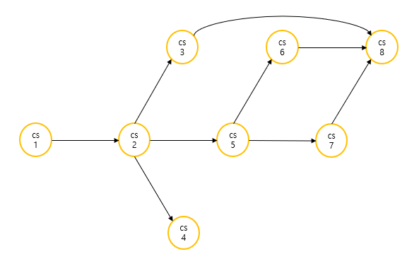


## 10.2 그래프의 정의와 용어

### 그래프의 정의

- 그래프는 정점(vertax)와 간선(edge)들의 유한 집합이라 할 수 있다. 수학적으로는 G = (V, E)와 같이 표시한다. 여기서, V(G)는 그래프 G의 정점들의 집합을, E(G)는 그래프 G의 간선들의 집합을 의미한다. 정점은 여러 가지 특성을 가질 수 있는 객체를 의미하고, 간선은 이러한 정점들 간의 관계를 의미한다. 정점(vertax)는 노드(node)라고도 불리며, 간선(edge)는 링크(link)라고도 불린다. 

  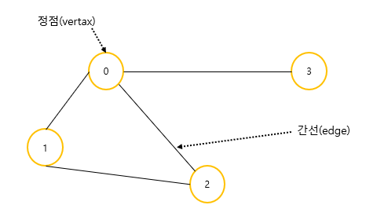

- 위의 그림의 그래프는 다음과 같이 집합으로 표현할 수 있다.

  V(G1) = { 0,  1,  2,  3 }

  E(G1) = { (0,  1),  (0,  2),  (0,  3), (1,  2) }


### 무방향 그래프와 방향 그래프

- 간선의 종류에 따라 그래프는 무방향 그래프(undirected graph)와 방향 그래프(directed graph)로 구분된다.무방향 그래프의 간선은 간선을 통해서 양방향으로 갈수 있음을 간성을 통해서 양방향으로 갈수 있음을 나타내며 정점 A와 정점 B를 연결하는 간선은 (A, B)와 같이 정점의 쌍으로 표현한다. (A, B)와 (B, A는 동일한 간선이 된다. 방향 그래프는 간선에 방향성이 존재하는 그래프로서 도로의 일방통행길처럼 간선을 통하여 한쪽 방향으로만 갈 수 있음을 나타낸다. 정점 A에서 정점 B로만 갈 수 있는 간선은 <A, B>로 표시한다. 방향 그래프에서 <A, B>와 <B, A>는 서로 다른 간선이다.

  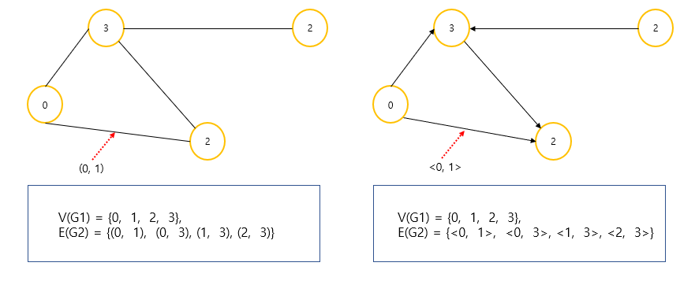


### 네트워크

- 간선에 가중치를 할당하게 되면, 간선의 역할이 두 정점간의 연결 유무뿐만 아니라 연결 강도까지 나타낼 수 있으므로 보다 복잡한 관계를 표현할 수 있게 된다. 이렇게 간선에 비용이나 가중치가 할당된 그래프를 가중치 그래프(weighted graph) 또는 네트워크(network)라 하며 아래의 그림과 같이 나타낸다. 여기서는 "네트워크"로 통일하여 사용하고자 한다. 네트워크는 도시와 도시를 연결하는 도로의 길이, 회로 소자의 용향, 통신망의 사용료 등을 추가로 표현할 수 있으므로 그 응용 분야가 보다 광범위 하다.

  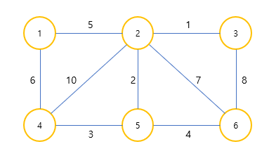


### 부분 그래프

- 어떤 그래프의 정점의 일부와 간선의 일부로 이루어진 그래프를 부분 그래프(subgraph)라 한다.

  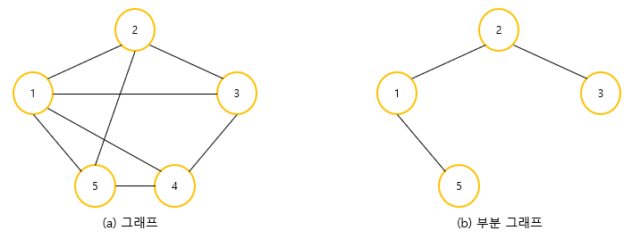

  


### 정점의 차수

- 그래프에서 인접 정점(adjacent vertex)란 간선에 의해 직접 연결된 정점을 뜻한다. 아래 그림의 그래프에서 정점 0의 인접 정점은 정점 1, 정점 2, 정점 3이다. 무방향 그래프에서 정점의 차수(degree)는 그 정점에 인접한 정점의 수를 말한다. 아래 그림에서 정점 0의 차수는 3이다.

  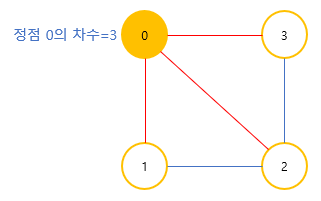

- 무방향 그래프에서 모든 정점의 차수를 합하면 간선 수의 2배가 된다. 이것은 하나의 간선이 두개의 점에 인접하기 때문이다.  아래 그림의 그래프에서 모든 정점 차수의 합은 10이고 간선은 5임을 확인해 보라. 방향 그래프에서는 외부에서 오는 간선의 개수를 진입 차수(in-degree)라 하고 외부로 향하는 간선의 개수를 진출 차수(out-degree)라 한다.


### 경로

- 무방향 그래프에서 정점 s로부터 정점 e까지의 경로는 정점의 나열 s,  v<sub>1</sub>,   v<sub>2</sub>,  . . . ,   v<sub>k</sub>,  e로서, 나열된 정점들 간에는 반드시 간선 (s,  v<sub>1</sub>),  ( v<sub>1</sub>,  v<sub>2</sub>),  . . . , ( v<sub>k</sub>, e)가 존재해야 한다. 만약 방향 그래프라면 <s,  v<sub>1</sub>>, < v<sub>1</sub>,  v<sub>2</sub>>, . . . , < v<sub>k</sub>, e>가 있어야 한다. 아래 그림의 그래프에서 0, 1, 2, 3은 경로지만 0, 1, 3, 2는 경로가 아니다. 왜냐하면 간선 (1, 3)이 존재하지 않기 때문이다.

  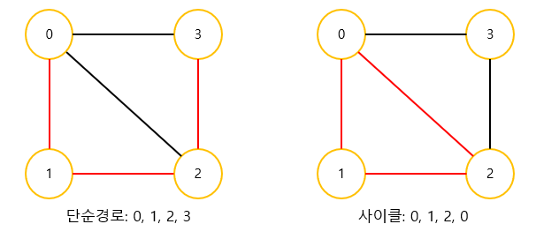

- 경로 중에서 반복되는 간선이 없을 경우에 이러한 경로를 단순 경로(simple path)라 한다. 만약에 단순 경로의 시작 정점과 종료 정점이 동일하다면 이러한 경로를 사이클(cycle)이라 한다.


### 연결 그래프

- 무방향 그래프 G에 있는 모든 정점쌍에 대하여 항상 경로가 존재한다면 G는 연결되었다고 하며, 이러한 무방향 그래프 G를 연결 그래프(connected graph)라 부른다. 그렇지 않은 그래프는 비연결 그래프(unconnected graph)라고 한다. **트리는 그래프의 특수한 형태로서 사이클을 가지지 않는 연결 그래프**이다.

  


### 완전 그래프

- 그래프에 속해있는 모든 정점이 서로 연결되어 있는 그래프를 완전 그래프(complete graph)라고 한다. 무방향 완전 그래프의 정점 수를 n이라고 하면, 하나의 정점은 n-1개의 다른 정점으로 연결되므로 간선의 수는 n * (n-1)/2가 된다. 만약 완전 그래프에서 n=4라면 간선의 수는 (4*3)/2 = 6이다.

  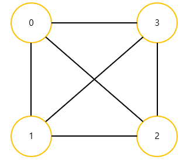


## 10.3 그래프의 표현 방법

- 그래프를 표현하는 방법에는 다음과 같이 2가지의 방법이 있다. 그래프 문제의 특성에 따라 위의 두 가지 표현 방법은 각각 메모리 사용량과 처리 시간 등에서 장단점을 가지므로, 문제에 적합한 표현 방법을 선택해야 한다.
  - 인접 행렬(adjacency matrix) : 2차원 배열을 사용하여 그래프를 표현한다.
  - 인접 리스트(adjacency) : 연결 리스트를 사용하는 그래프를 표현한다.


### 인접 행렬

- 그래프의 정점 수가 n이라면 n * n의 2차원 배열인 행렬(adjacency matrix) M의 각 원소를 다음의 규칙에 의해 할당함으로써 그래프를 메모리에 표현할 수 있다.

  ```C
  if(간선 (i, j)가 그래프에 존재) M[i][j] = 1,
  otherwise					 N[i][j] = 0
  ```

- 우리가 다루고 있는 그래프에서는 자체 간선을 허용하지 않으므로 인접 행렬의 대각선 성분은 모두 0으로 표시한다. 아래 그림의 (a), (b)와 같이 무방향 그래프의 인접 행렬은 대칭 행렬이 된다. 이는 무방향 그래프의 간선 (i, j)는 정점 i에서 정점 j로의 연결뿐만 아니라 정점 j에서 정점 i로의 연결을 동시에 의미하기 때문이다. 따라서 무방향 그래프의 경우, 배열의 상위 삼각이나 하위 삼각만 저장하면 메모리를 절약할 수 있다. 그러나 (c)의 방향 그래프의 예에서 보듯이 방향 그래프의 인접 행렬은 일반적으로 대칭이 아니다.

  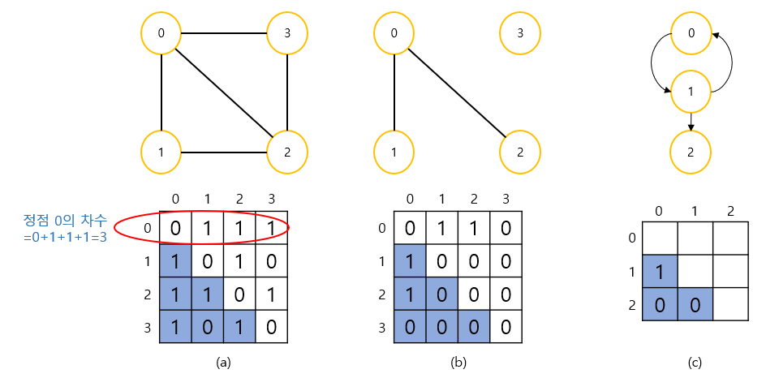

- n개의 정점을 가지는 그래프를 인접 행렬로 표현하기 위해서는 간선의 수에 무관하게 항상 n<sup>2</sup>개의 메모리 공간이 필요하다. 이에 따라 인접 행렬은 위의 그림 (a)와 같이 그래프에 간선이 많이 존재하는 밀집 그래프(dense graph)를 표현하는 경우네는 적합하나, 위의 그림 (b)와 같이 그래프 내에 적은 숫자의 간선만을 가지는 희소 그래프(sparse graph)의 경우에는 메모리의 낭비가 크므로 적합하지 않다.

- 인접 행렬을 이용하면 두 정점을 연결하는 간선의 존재 여부를 O(1)시간 안에 즉시 알 수 있는 장점이 있다. 즉 정점 u와 정점 v를 연결하는 정점이 있는지 알려면 M\[u][v]의 값을 조사하면 바로 알 수 있다. 또한 정점의 차수는 인접 행렬의 행이나 열을 조사하면 알 수 있으므로 O(n)의 연산에 의해 알 수 있다. 정점 i에 대한 차수는 다음과 같이 인접 배열의 i번째 행에 있는 값을 모두 더하면 된다.

  degree(i) = ${\sum_{k=0}^{N-1}M[i][k]}$

- 반면에 그래프에 존재하는 모든 간선의 수를 알아내려면 인접 행렬 전체를 조사해야 하므로 n^2^번의 조사가 필요하게 되어 O(n^2^)의 시간이 요구된다.


### 인접 행렬을 이용한 그래프 추상 데이터 타입의 구현

- 그래프에 관련된 변수들을 하나의 구조체 GraphType에 정리하도록 하자. 먼저 그래프에 존재하는 정점의 개수 n이 필요하다. 인접 행렬을 이용하여 구현하려면 또한 크기가 n*n인 2차원 배열인 인접 행렬이 필요하다. 인접 행렬의 이름을 adj_mat라고 하면 GraphType 구조체는 다음과 같이 정의할 수 있다.

  ```C
  #define MAX_VERTICES 50
  typedef struct _GraphType {
      int n;			// 정점의 개수
      int adj_mat[MAX_VERTICES][MAX_VERTICES];
  } GraphType;
  ```

- 물론 이런 식으로 구현하면 한정된 개수의 정점까지만 그래프에 삽입할 수 있다.  만약 동적 배열로 구현한다면 사용자가 정점을 삽입할 때마다 다시 크기를 조정할 수 있을 것이다. 정점을 삽입하는 연산은 n을 하나 증가하면 된다. 정점의 번호는 순차적으로 증가한다고 가정하자. 간선을 삽입하는 연산은 adj_mat\[start][end]와 ad_mat\[end][start]에 1을 삽입하면된다. 물론 방향 그래프인 경우에는 adj_mat\[start][end]에만 1을 삽입하여야 한다. 전체 프로그램은 다음과 같다.

  ```C
  #include <stdio.h>
  #include <stdlib.h>
  
  #define MAX_VERTICES 50
  typedef struct _GraphType {
      int n;      // 정점의 개수
      int adj_mat[MAX_VERTICES][MAX_VERTICES];
  } GraphType;
  
  // 그래프 초기화
  void init(GraphType *g) {
      int r, c;
      g->n = 0;
      for(r=0; r<MAX_VERTICES; r++)
          for(c=0; c<MAX_VERTICES; c++)
              g->adj_mat[r][c] = 0;
  }
  
  // 정점 삽입 연산
  void insert_vertax(GraphType *g, int v) {
      if(((g->n) + 1) > MAX_VERTICES) {
          fprintf(stderr, "그래프 : 정점의 개수 초과");
          return;
      }
      g->n++;
  }
  
  // 간선 삽입 현산
  void insert_edge(GraphType *g, int start, int end) {
      if(start >= g->n || end >= g->n) {
          fprintf(stderr, "그래프 : 정점 번호 오류");
          return;
      }
      g->adj_mat[start][end] = 1;
      g->adj_mat[end][start] = 1;
  }
  
  // 인접 행렬 출력 함수
  void print_adj_mat(GraphType *g) {
      for(int i=0; i<g->n; i++) {
          for(int j=0; j<g->n; j++) {
              printf("%2d ", g->adj_mat[i][j]);
          }
          printf("\n");
      }
  }
  
  int main() {
      GraphType *g;
      g = (GraphType*)malloc(sizeof(GraphType));
      init(g);
      for(int i=0; i<4; i++)
          insert_vertax(g, i);
      insert_edge(g, 0, 1);
      insert_edge(g, 0, 2);
      insert_edge(g, 0, 3);
      insert_edge(g, 1, 2);
      insert_edge(g, 2, 3);
      print_adj_mat(g);
  
      free(g);
      return 0;
  }
  ```


### 인접 리스트

- 인접 리스트(adjacency list)는 그래프를 표현함에 있어 각각의 정점에 인접한 정점들을 연결 리스트로 표시한것이다. 각 연결 리스트의 노드들은 인접 정점을 저장하게 된다. 각 연결 리스트들은 헤더 노드를 가지고 있고 이 헤더 노드들은 하나의 배열로 구성되어 있다. 따라서 정점의 번호만 알면 이 번호를 배열의 인덱스로 하여 각 정점의 연결 리스트에 쉽게 접근할 수 있다.

  무방향 그래프의 경우 정점 i와 정점 j를 연결하는 간선 (i,  j)는 정점 i의 연결 리스트에 인접 정점 j로서 한번 표현되고, 정점 j의 연결 리스트에 인접 정점 i로 다시 한번 표현된다. 인접 리스트의 각각의 연결 리스트에 정점들이 입력되는 순서에 따라 연결 리스트 내에서 정점들의 순서가 달라질 수 있다. 우리는 그래프 표현의 일관성을 유지하기 위하여 아래의 그림과 같이 인접 리스트가 정점의 오름차순으로 연결된다고 가정한다.

  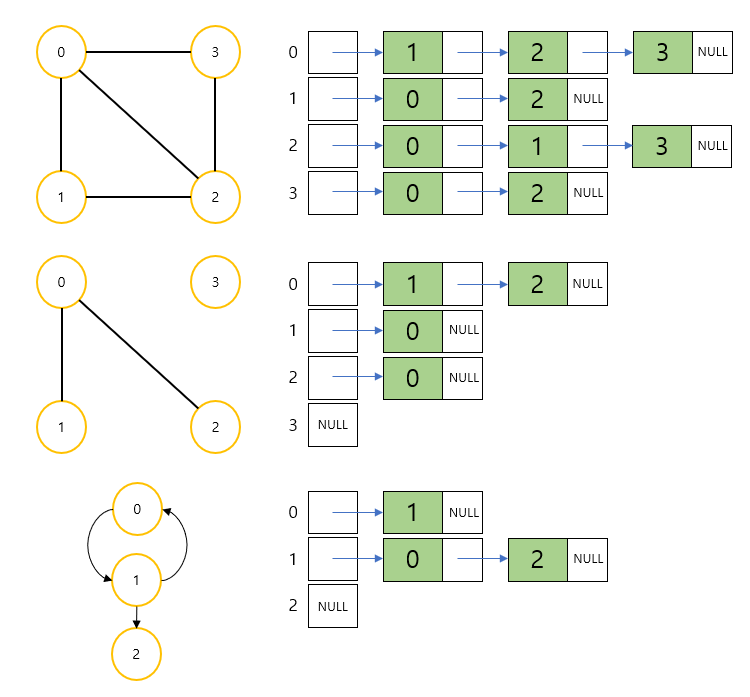

- 따라서 정점의 수가 n 개이고 간선의 수가 e개의 무방향 그래프를 표시하기 위해서는 n개의 연결 리스트가 필요하고, n개의 헤더 노드와 2e개의 노드가 필요하다. 따라서 인접 리스트 표현은 간선의 개수가 적은 희소 그래프(sparse graph)의 표현에 적합하다.

  그래프에 간선 (i,  j)의 존재 여부나 정점 i의 차수를 알기 위해서는 인접 리스트에서의 정점 i의 연결 리스트를 탐색해야 하므로 연결 리스트에 있는 노드의 수만큼, 즉 정점 차수만큼의 시간이 필요하다. 즉 n개 정점과 e개의 간선을 가진 그래프에서 전체 간선의 수를 알아내려면 헤더 노드를 포함하여 모든 인접 리스트를 조사해야 하므로 O(n+e)의 연산이 요구된다.


### 인접 리스트를 이용한 그래프 추상 데이터 타입의 구현

- 그래프에 관련된 변수들을 하나의 구조체 GraphType에 정리하도록 하자. 먼저 그래프에 존재하는 정점의 개수 n이 필요하다. 인접 리스트를 이용하여 구현하려면 각 정점마다 하나의 연결 리스트가 필요하다. 따라서 정점의 개수만큼의 포인터 배열이 필요하다. 포인터 배열의 이름을 adj_list라고 하고 연결 리스트의 하나의 노드를 GraphNode라는 구조체를 이용하여 나타내자. 전체 소스는 다음과 같다.

  ```C
  #include <stdio.h>
  #include <stdlib.h>
  
  #define MAX_VERTICES 50
  typedef struct _GraphNode {
      int vertex;
      struct _GraphNode *link;
  } GraphNode;
  
  typedef struct _GraphType {
      int n;      // 정점의 개수
      GraphNode *adj_list[MAX_VERTICES];
  } GraphType;
  
  // 그래프 초기화
  void init(GraphType *g) {
      int v;
      g->n = 0;
      for(v=0; v<MAX_VERTICES; v++)
          g->adj_list[v] = NULL;
  }
  
  // 정점 삽입 연산
  void insert_vertax(GraphType *g, int v) {
      if(((g->n) + 1) > MAX_VERTICES ) {
          fprintf(stderr, "그래프 : 정점의 개수 초과");
          return;
      } 
      g->n++;
  }
  
  // 간선 삽입 연산, v를 u의 인접 리스트에 삽입한다.
  void inset_edge(GraphType *g, int u, int v) {
      GraphNode *node;
      if (u >= g->n || v >= g->n) {
          fprintf(stderr, "그래프 : 정점 번호 오류");
          return;
      }
      node = (GraphNode*)malloc(sizeof(GraphNode));
      node->vertex = v;
      node->link = g->adj_list[u];
      g->adj_list[u] = node;
  }
  
  void print_adj_list(GraphType *g) {
      for(int i=0; i<g->n; i++) {
          GraphNode *p = g->adj_list[i];
          printf("정점 %d의 인접 리스트 ", i);
          while(p != NULL) {
              printf("-> %d ", p->vertex);
              p = p->link;
          }
          printf("\n");
      }
  }
  
  int main() {
      GraphType *g;
      g = (GraphType*)malloc(sizeof(GraphType));
      init(g);
      for(int i=0; i<4; i++)
          insert_vertax(g, i);
      inset_edge(g, 0, 1);
      inset_edge(g, 1, 0);
      inset_edge(g, 0, 2);
      inset_edge(g, 2, 0);
      inset_edge(g, 0, 3);
      inset_edge(g, 3, 0);
      inset_edge(g, 1, 2);
      inset_edge(g, 2, 1);
      inset_edge(g, 2, 3);
      inset_edge(g, 3, 2);
      print_adj_list(g);
      free(g);
      return 0;
  }
  
  ```

## 10.4 그래프의 탐색

- 그래프 탐색은 가장 기본적인 연산으로서 하나의 정점으로부터 시작하여 차례대로 모든 정점들을 한 번씩 방문하는 것이다. 그래프 탐색은 아주 중요하다. 많은 문제들이 단순히 그래프의 노드를 탐색하는 것으로 해결된다. 대표적으로 특정한 정점에서 다른 정점으로 갈 수 있는지 없는지를 탐색을 통하여 알 수 있다. 예를 들어 도시를 연결하는 그래프가 있을 때, 특정 도시에서 다른 도시로 갈 수 있는지 없는지는 그래프를 특정 노드에서 시작하여 탐색하여 보면 알 수 있다.
- 그래프의 탐색 방법은 깊이 우선 탐색과 너비 우선 탐색의 두 가지가 있다.
  - 깊이 우선 탐색(DFS: depth first search)
  - 너비 우선 탐색(BFS: breath first search)


- 깊이 우선 탐색은 트리에서 생각하면 이해하기 쉽다.(트리도 그래프의 일종이라는 점을 명심하자.) 트리를 탐색할 때 시작 정점에서 한 방향으로 계속 가다가 더 이상 갈 수 없게 되면 다시 가장 가까운 갈림길로 돌아와서 다른 방향으로 다시 탐색을 진행하는 방법과 유사하다. 아래의 그림에서 0-->1-->3-->4-->2-->5-->6의 순서대로 탐색이 진행된다.

  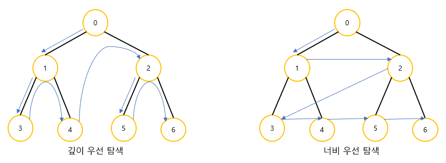

- 너비 우선 탐색은 시작 정점으로부터 가까운 정점을 먼저 방문하고 멀리 떨어져 있는 정점을 나중에 방문하는 순회 방법이다. 위의 그림에서 0-->1-->2-->3-->4-->5-->6의 순서대로 탐색이 진행된다.


## 10.5 깊이 우선 탐색

- 그래프에서 깊이 우선 탐색은 어떻게 진행될까? 깊이 우선 탐색은 그래프의 시작 정점에서 출발하여 시작 정점 v를 방문하였다고 표시한다. 이어서 v에 인접한 정점들 중에서 아직 방문하지 않은 정점 u를 선택한다. 만약 그러한 정점이 없다면 탐색은 종료한다. 만약 아직 방문하지 않은 정점 u가 있다면 u를 시작 정점으로 하여 깊이 우선 탐색을 다시 시작한다. 이 탐색이 끝나게 되면 다시 v에 인접한 정점들 중에서 아직 방문이 안된 정점을 찾는다. 만약 없으면 종료하고 있다면 다시 그 정점을 시작 정점으로 하여 깊이 우선 탐색을 다시 시작한다. 깊이 우선 탐색도 자기 자신을 다시 호출하는 순환 알고리즘의 형태를 가지고 있음을 알 수 있다.

  - 깊이우선탐색

    ```
    depth_first_search(v):
    
    	v를 방문되었다고 표시;
    	for all u ∈ (v에 인접한 정점) do
    		if (u가 아직 방문되지 않았으면)
    			then depth_first_search(u)
    ```

- 아래 그림에 예제 그래프를 깊이 우선 탐색한 결과를 보였다. 여기서 0번 정점을 시작 정점으로 선택하였다.

  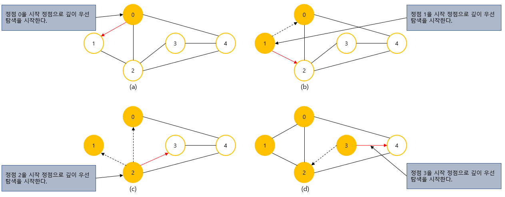

  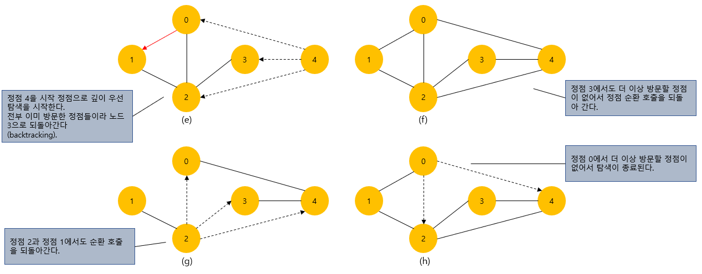


### 깊이 우선 탐색의 구현(인접 행렬 버전)

- 깊이 우선 탐색을 구현하는 데는 2가지의 방법이 있다. 순환 호출을 이용하는 것이 첫 번째 방법이고 두 번째 방법은 명시적인 스택을 사용하여 인접한 정점들을 스택에 저장하였다가 다시 꺼내어 작업을 하는 것이다. 여기서는 순환 호출을 이용하는 방법으로 구현하기로 한다. 

  방문 여부를 기록하기 위해 배열 visited를 사용하며, 모든 정점의 visited 배열값은 FALSE으로 초기화되고 정점이 방문될 때마다 해당 정점의 visited 배열값은 TRUE로 변경된다.

  또한 그래프가 인접 행렬 또는 인접 리스트로 표현되었는가에 따라 깊이 우선 탐색 프로그램이 약간 달라지는데, 여기서는 먼저 인접 행렬을 이용하여 그래프가 표현되었다고 가정하고 깊이 우선 탐색 프로그램을 구현하였다.

  adj_mat\[v][w] 값이 1이면 정점 v와 정점 w는 인접한 것이고 정점 w가 아직 방문되지 않았으면 정점 w를 시작 정점으로 하여 깊이 우선 탐색을 시작한다.

- 인접 배열로 표현된 그래프에 대한 깊이우선탐색 프로그램

  ```C
  #include <stdio.h>
  #include <stdlib.h>
  
  #define TRUE 1
  #define FALSE 0
  #define MAX_VERTICES 50
  typedef struct _GraphType {
      int n;  // 정점의 개수
      int adj_mat[MAX_VERTICES][MAX_VERTICES];
  } GraphType;
  
  int visited[MAX_VERTICES];
  
  // 그래프 초기화
  void init(GraphType *g) {
      int r, c;
      g->n = 0;
      for(r=0; r<MAX_VERTICES; r++)
          for(c=0; c<MAX_VERTICES; c++)
              g->adj_mat[r][c] = 0;
  }
  // 정점 삽입 연산
  void insert_vertex(GraphType *g, int v) {
      if(((g->n) + 1) > MAX_VERTICES) {
          fprintf(stderr, "그래프 : 정점의 개수 초과");
          return;
      }
      g->n++;
  }
  // 간선 삽입 연산
  void insert_edge(GraphType *g, int start, int end) {
      if(start >= g->n || end >= g->n) {
          fprintf(stderr, "그래프 : 정점 번호 오류");
          return;
      }
      g->adj_mat[start][end] = 1;
      g->adj_mat[end][start] = 1;
  }
  // 인접 행렬로 표현된 그래프에 대한 깊이 우선 탐색
  void dfs_mat(GraphType *g, int v) {
      int w;
      visited[v] = TRUE;          // 정점 v의 방문 표시
      printf("정점 %d -> ", v);   // 인접 정점 탐색
      for(w=0; w<g->n; w++)
          if(g->adj_mat[v][w] != 0 && !visited[w])
              dfs_mat(g, w);      // 정점 w에서 DFS 새로 시작
  }
  
  int main() {
      GraphType *g;
      g = (GraphType*)malloc(sizeof(GraphType));
      init(g);
      for (int i = 0; i<4; i++)
          insert_vertex(g, i);
      insert_edge(g, 0, 1);
      insert_edge(g, 0, 2);
      insert_edge(g, 0, 3);
      insert_edge(g, 1, 2);
      insert_edge(g, 2, 3);
  
      printf("깊이 우선 탐색\n");
      dfs_mat(g, 0);
      printf("\n");
      return 0;
  }
  ```


### 깊이 우선 탐색의 구현(인접 리스트 버전)

- 아래의 프로그램은 그래프가 인접 리스트로 표현되었을 경우의 깊이 우선 탐색 프로그램이다. 
  인접 리스트는 다수의 연결 리스트로 구성되는데, 각 연결 리스트의 노드는 데이터 필드와 링크 필드로 이루어지는데, 

  데이터 필드에는 인접 정점의 번호가 저장되고 링크 필드에는 다음 인접 정점을 가리키는 포인터가 저장된다.

  연결 리스트의 노드는 구조체 타입 GraphNode로 정의 되었다. 포인터 배열 adj_list의 각 요소는 각 연결 리스트의 첫번째 노드를 가리킨다. 역시 방문 여부를 기록하기 위하여 visited를 사용하였다.

- 인접배열로 표현된 그래프에 대한 깊이우선탐색 프로그램

  ```C
  int visited[MAX_VERTICES];
  
  // 인접 리스트로 표현된 그래프에 대한 깊이 우선 탐색
  void dfs_list(GraphType *g, int v) {
      GraphNode *w;		
      visited[v] = TRUE;						// 정점 v의 방문 표시
      printf("정점 %d -> ", v);	   			   // 방문한 정점 출력
      for(w = g->adj_list[v]; w; w = w->link)	// 인접 정점 탐색
          if(!visited[w->vertex])
              dfs_list(g, w->vertex);			// 정점 w에서 DFS 새로 시작
  }
  ```


### 명시적인 스택을 이용한 깊이 우선 탐색의 구현

- 깊이 우선 탐색은 명시적인 스택을 사용하여 구현이 가능하다. 다음은 의사 코드이다.

  ```
  DFS-iterative(G, v);
  
  	스택 S를 생성한다.
  	S.push(v);
  	while (not is_empty(S)) do
  		v = S.pop()
  		if(v가 방문되지 않았으면)
  		v를 방문했다고 표시
  		for all u ∈ (v에 인접한 정점) do
  			if(u가 아직 방문되지 않았으면)
  				S.push(u)
  ```

  - 스택을 하나 생성하여서 시작 정점을 스택에 넣는다. 이어서 스택에서 하나의 정점을 꺼내서 탐색을 시작한다. 정점을 방문한 후에 정점의 모든 인접 정점들을 스택에 추가한다. 스택에 하나도 남지 않을 때까지 알고리즘은 계속된다.


### 깊이 우선 탐색의 분석

- 깊이 우선 탐색은 그래프의 모든 간선을 조사하므로 정점의 수가 n이고 간선의 수가 e인 그래프인 경우, 그래프가 인접 리스트로 표현되어 있다면 시간 복잡도가 O(n+e)이고, 인접 행렬로 표시되어 있다면 O(n<sup>2</sup>)이다. 이는 희소 그래프인 경우 깊이 우선 탐색은 인접 리스트의 사용이 인접 행렬보다 시간적으로 유리함을 뜻한다.


## 10.6 너비 우선 탐색

- 너비 우선 탐색(breath first search : BFS)은 시작 정점으로부터 가까운 정점을 먼저 방문하고 멀리 떨어져 있는 정점을 나중에 방문하는 순회 방법이다.

  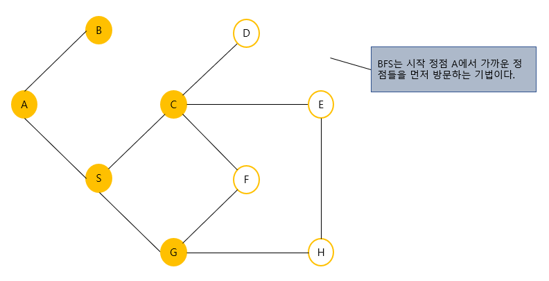

- 위의 그래프를 방문한다고 가정하자. 먼저 시작 정점인 A를 방문한다. 다음에는 정점 A의 인접 정점인 {B, S}를 차례대로 방문한다. 다음으로 정점 {B, S}에 인접한 정점 {C, G}를 방문한다.

  너비 우선 탐색을 위해서는 가까운 거리에 있는 정점들을 차례로 저장한 후 꺼낼 수 있는 자료구조인 큐(queue)가 필요하다. 알고리즘은 무조건 큐에서 정점을 꺼내서 정점을 방문하고 인접정점들을 큐에 추가한다. 큐가 소진될 때까지 동일한 코드를 반복한다. 다음은 너비 우선 탐색의 의사코드이다.

  ```
  breadth_first_search(v):
  
  	v를 방문되었다고 표시;
  	큐 Q에 정점 v를 삽입;
  	while (Q가 공백이 아니면) do
  		Q에서 정점 w를 삭제;
  		for all u ∈ (w에 인접한 정점) do
  			if(u가 아직 방문되지 않았으면)
  				then u를 큐에 삽입;
  					 u를 방문되었다고 표시;
  ```


### 너비 우선 탐색의 구현(인접 행렬 버전)

- 다음은 인접 행렬을 이용하여 너비 우선 탐색을 구현한 것이다. 너비 우선 탐색은 큐를 사용하여야 하므로 깊이 우선 탐색보다 코드가 약간 복잡해진다.

  ```c
  #include <stdio.h>
  #include <stdlib.h>
  
  #define TRUE 1
  #define FALSE 0
  #define MAX_QUEUE_SIZE 10
  
  typedef int element;
  typedef struct {
      element queue[MAX_QUEUE_SIZE];
      int front, rear;
  } QueueType;
  
  void error(char *message) {
      fprintf(stderr, "%s\n", message);
      exit(1);
  }
  
  void queue_init(QueueType *q) {
      q->front = q->rear = 0;
  }
  
  int is_empty(QueueType *q) {
      return (q->front == q->rear);
  }
  
  int is_full(QueueType *q) {
      return ((q->rear + 1) % MAX_QUEUE_SIZE == q->front);
  }
  
  void enqueue(QueueType *q, element item) {
      if (is_full(q))
          error("큐가 포화상태입니다");
      q->rear = (q->rear + 1) % MAX_QUEUE_SIZE;
      q->queue[q->rear] = item;
  }
  
  element dequeue(QueueType *q) {
      if(is_empty(q))
          error("큐가 공백상태입니다.");
      q->front = (q->front + 1) % MAX_QUEUE_SIZE;
      return q->queue[q->front];
  }
  
  #define MAX_VERTICES 50
  typedef struct _GraphType {
      int n;   // 정점의 개수
      int adj_mat[MAX_VERTICES][MAX_VERTICES];
  } GraphType;
  int visited[MAX_VERTICES];
  
  void graph_init(GraphType *g) {
      int r, c;
      g->n = 0;
      for(r=0; r<MAX_VERTICES; r++)
          for(c=0; c<MAX_VERTICES; c++)
              g->adj_mat[r][c] = 0;
  }
  
  void insert_vertex(GraphType *g, int v) {
      if(((g->n) + 1) > MAX_VERTICES) {
          fprintf(stderr, "그래프: 정점의 개수 초과");
          return;
      }
      g->n++;
  }
  
  void insert_edge(GraphType *g, int start, int end) {
      if(start >= g->n || end >= g->n) {
          fprintf(stderr, "그래프: 정점 번호 오류");
          return;
      }
      g->adj_mat[start][end] = 1;
      g->adj_mat[end][start] = 1;
  }
  
  void bfs_mat(GraphType *g, int v) {
      int w;
      QueueType q;
  
      queue_init(&q);         // 큐 초기화
      visited[v] = TRUE;      // 정점 v 방문 표시
      printf("%d 방문 -> ", v);
      enqueue(&q, v);         // 시작 정점을 큐에 저장
      while(!is_empty(&q)) {
          v = dequeue(&q);    // 큐에 정점 추출
          for (w=0; w<g->n; w++) // 인접 정점 탐색
              if(g->adj_mat[v][w] && !visited[w]) {
                  visited[w] = TRUE; // 방문 표시
                  printf("%d 방문 -> ", w);
                  enqueue(&q, w);    // 방문한 정점을 큐에 저장
              }
      }
  }
  
  int main() {
      GraphType *g;
      g = (GraphType*)malloc(sizeof(GraphType));
      graph_init(g);
      for(int i=0; i<6; i++)
          insert_vertex(g, i);
      insert_edge(g, 0, 2);
      insert_edge(g, 2, 1);
      insert_edge(g, 2, 3);
      insert_edge(g, 0, 4);
      insert_edge(g, 4, 5);
      insert_edge(g, 1, 5);
  
      printf("너비 우선 탐색\n");
      bfs_mat(g, 0);
      printf("\n");
      free(g);
      return 0;
  }
  ```


### 너비 우선 탐색의 구현(인접 리스트 버전)

- 너비 우선 탐색을 인접 리스트로 구현된 그래프에 적용시키면 다음과 같다.

- 너비 우선 탐색(인접 리스트 표현) 프로그램

  ```c
  void bfs_list(GraphType *g, int v) {
      GraphNode *w;
      QueueType q;
      
      intit(&q);				// 큐 초기화
      visited[v] = TRUE;		// 정점 v 방문 표시
      printf("%d 방문 -> ", v);
      enqueue(&q, v);			// 시작정점을 큐에 저장
      while(!is_empty(&q)) {
          v = dequeue(&q)		// 큐에 저장된 정점 선택
          for (w = g->adj_list[v]; w; w = w->link)	// 인접 정점 탐색
              if(!visited[w->vertex]) {
                  visited[w->vertex] = TRUE			// 미방문 정점 탐색
                  printf("%d 방문 -> ", w->vertex);
                  enqueue(&q, w->vertax);				// 정점을 큐에 삽입
              }
      }
  }
  ```

  

### 너비 우선 탐색의 분석

- 너비 우선 탐색은 그래프가 인접 리스트로 표현되어 있으면 O(n+e)이며, 인접행렬로 표현되어 있는 경우는 O(n<sup>2</sup>)시간이 걸린다. 너비우선 탐색도 깊이우선 탐색과 같이 희소 그래프를 사용할 경우 인접리스트를 사용하는 것이 효율적이다.