# 11. 그래프 ll(Graph)

## 11.1 최소 비용 신장 트리

### 신장 트리

- 신장 트리(spanning tree)란 그래프내의 모든 정점을 포함하는 트리다. 신장 트리는 트리의 특수한 형태이므로 모든 정점들이 연결되어 있어야 하고 또한 사이클을 포함해서는 안된다. 따라서 신장 트리는 그래프에 있는 n개의 정점을 정확히 (n-1)개의 간선으로 연결하게 된다. 하나의 그래프에는 많은 신장 트리가 존재 가능하다. 아래의 그림은 그래프와 신장 트리를 보여주고있다.

  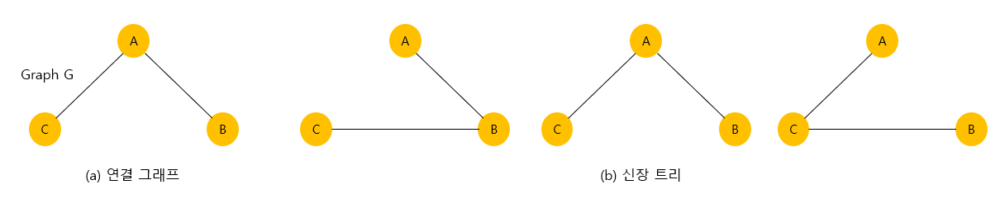

- 신장 트리는 깊이 우선이나 너비 우선 탐색 도중에 사용된 간선만 모으면 만들 수 있다. 신장 트리를 만들려면 깊이 우선이나 너비 우선 탐색 때 사용한 간선들을 표시하면 된다. 예를 들어 깊이 우선 탐색 알고리즘을 변경하여 신장 트리를 구해보면 다음과 같다. 큐를 사용하여 간선들을 저장할 수 있다.

  - 신장 트리

  ```
  depth_first_search(v):
  
  	v를 방문 방문되었다고 표시;
  	for all u ∈ (v에 인접한 정점) do
  		if (u가 아직 방문되지 않았으면)
  			then (v,u)를 신장 트리 간선이라고 표시;
  				depth_first_search(u)
  ```


- 신장 트리는 그래프의 최소 연결 부분 그래프가 된다. 여기서 최소의 의미는 간선의 수가 가장 적다는 의미이다. n개의 정점을 가지는 그래프는 최소한 (n-1)개의 간선을 가져야 하며 (n-1)개의 간선으로 연결되어 있으면 필연적으로 트리 형태가 되고 이것은 바로 신장 트리가 된다.

  신장 트리는 어디에 사용될까? 신장 트리는 통신 네트워크 구축에 많이 사용된다. 예를 들어 n개의 위치를 연결하는 통신 네트워크를 최소한 링크를 이용하여 구축하고자 할 경우, 최소 링크수는 (n-1)이 되고 따라서 신장 트리들이 가능한 대안이 된다.

  예를 들어, 회사 내의 모든 전화기를 가장 적은 수의 케이블을 사용하여 연결하고자 하면 신장 트리를 구함으로써 해결할 수 있다.

- 그러나 각 링크의 구축 비용은 똑같지가 않다. 따라서 단순히 가장 적은 링크만을 사용한다고해서 최소 비용이 얻어지는 것은 아니다. 따라서 각 링크, 즉 간선에 비용을 붙여서 링크의 구축 비용까지를 고려하여 최소 비용의 신장 트리를 선택할 필요가 있다. 바로 이것이 우리가 다음 절에 공부하게 될 **최소 비용 신장 트리**의 개념이다.


### 최소 비용 신장 트리

- 통신망, 도로망, 유통망 등은 간선에 가중치가 부여된 네트워크로 표현될 수 있다. 가중치는 길이, 구축 비용, 전송 시간 등을 나타낸다. 이러한 도로망, 통신망, 유통망을 가장 적은 비용으로 구축하고자 한다면, 네트워크에 있는 모든 정점들을 가장 적은 수의 간선과 비용으로 연결하는 최소 비용 신장 트리(MST : minimum spanning tree)가 필요하게 된다. 최소 비용 신장 트리는 신장 트리 중에서 사용된 간선들의 가중치 합이 최소인 신장 트리를 말한다.

  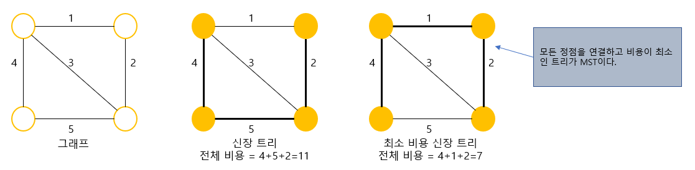

- 최소 비용 신장 트리를 구하는 방법으로는 Kruskal과 Prim이 제안한 알고리즘이 대표적으로 사용되고 있으며, 이 알고리즘들은 최소 비용 신장 트리가 간선의 가중치의 합이 최소이어야 하고, 반드시 (n-1)개의 간선만 사용해야하며, 사이클이 포함되어서는 안 된다는 조건들을 적절히 이용하고 있다.


## 11.2 Kruskal MST 알고리즘

- Kruskal의 알고리즘은 탐욕적인 방법(greedy method)을 이용한다. 탐욕적인 방법은 알고리즘 설계에 있어서 중요한 기법 중의 하나이다. 탐욕적인 방법이란 선택할 때마다 그 순간 가장 좋다고 생각되는 것을 선택함으로써 최종적인 해답에 도달하는 방법이다. 마치 음식을 먹을 때 가장 맛있는 것부터 먹는 것과 같다. "탐욕적"이라는 단어의 뉘앙스는 안좋지만 실제로는 상당히 좋은 알고리즘을 만들어 내는 설계 기법이다.

- 탐욕적인 알고리즘에서 순간의 선택은 그 당시에는 최적이다. 하지만 최적이라고 생각했던 지역적인 해답들을 모아서 최종적인 해답을 만들었다고 해서, 그 해답이 반드시 전역적으로 최적이라는 보장은 없다.
  따라서 탐욕적인 방법은 항상 최적의 해답을 주는지를 검증해야 한다. 다행히 Kruskal의 알고리즘은 최적의 해답을 주는 것으로 증명되어 있다.
  Kruskal의 알고리즘은 최소 비용 신장 트리가 최소 비용의 간선으로 구성됨과 동시에 사이클을 포함되지 않는다는 조건에 근거하여, 각 단계에서 사이클을 이루지 않는 최소 비용 간선을 선택한다.
  이러한 과정을 반복함으로써 네트워크의 모든 정점을 최소비용으로 연결하는 최적 해답을 구할 수 있다.
  Kruskal의 알고리즘은 먼저 그래프의 간선들을 가중치의 오름차순으로 정렬한다. 정렬된 간선들의 리스트에서 사이클을 형성하지 않는 간선을 찾아서 현재의 최소 비용 신장 트리의 집합에 추가한다. 만약 사이클을 형성하면 그 간선은 제외된다.

  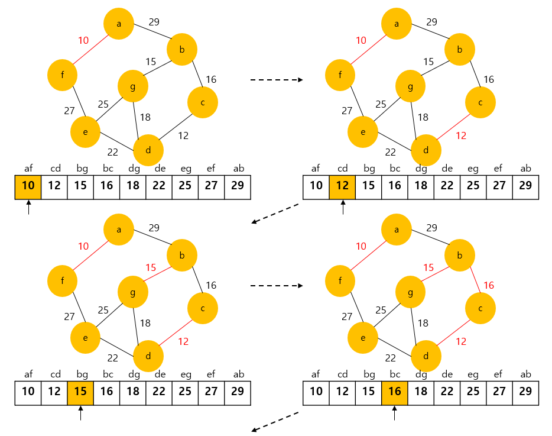

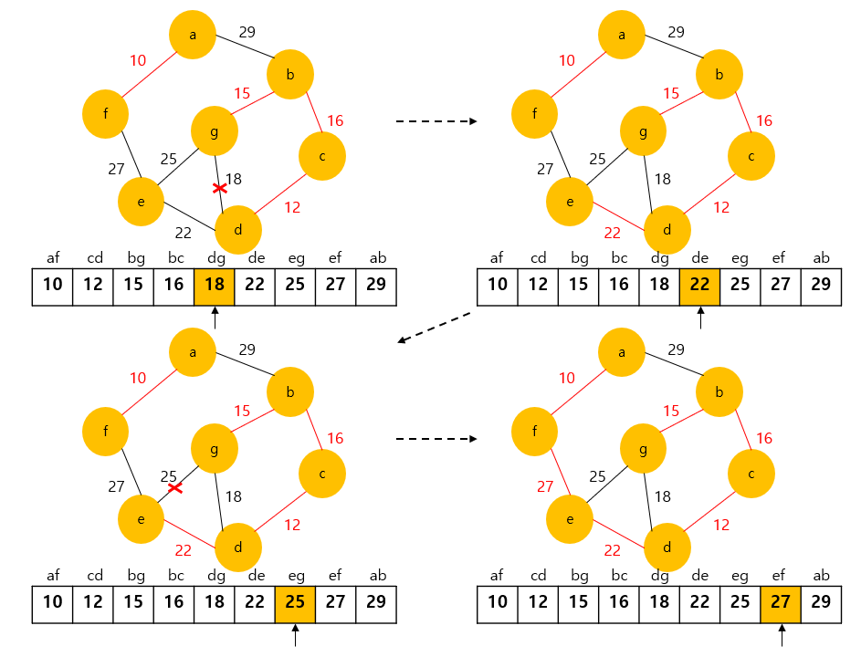

- 위의 그림은 Kruskal의 알고리즘을 이용하여 최소 비용 신장 트리를 만드는 과정을 보여준다. 먼저 간선들을 가중치의 오름차순으로 정렬한다. 먼저 가장 가중치가 낮은 간선을 먼저 선택한다. 예제 그래프에서는 (a, f)가 가중치 10으로서 가장 낮기 때문에 먼저 선택되고 E<sub>T</sub>에 포함 시킨다. 다음에도 계속 가중치가 낮은 간선들인 (c, d), (b, g), (b, c)까지 차례로 선택하여 E<sub>T</sub>에 포함시킨다.
  다음 차례는 간선 (d, g) 차례지만  (d, g)를 추가하게 되면 사이클 b, c, d, g, b가 형성된다. 따라서 (d, g)는 제외되고 다음 간선인 (d, e)가 선택된다. 다음 간선 (e, g)도 역시 사이클을 형성시키기 때문에 제외되고 (e, f)가 선택된다. (e, f)까지 선택되면 간선의 개수가 6개가 되어 정점의 개수인 7보다 하나 적어져서 알고리즘이 종료하게 된다.

- Kruskal의 알고리즘은 최소 비용 신장 트리를 구하는 다른 알고리즘보다 간단해 보인다. 하지만 다음 간선을 이미 선택된 간선들의 집합에 추가할 때 사이클을 생성하는 지를 체크하여야 한다. 새로운 간선이 이미 다른 경로에 의하여 연결되어 있는 정점들을 연결할 때 사이클이 형성된다. 

  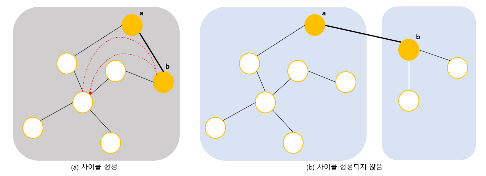

- 즉 위의 그림의 (a)처럼 간선의 양끝 정점이 같은 집합에 속하면 간선을 추가하였을 경우, 사이클이 형성된다. 반면 위의 그림의 (b)처럼 간선이 서로 다른 집합에 속하는 정점을 연결하면 사이클이 형성되지 않는다. 따라서 지금 추가하고자 하는 간선의 양끝 정점이 같은 집합에 속해 있는지를 먼저 검사하여야 한다. 이 검사를 위한 알고리즘을 union-find 알고리즘이라 부른다.


### union-find 연산

- union-find 연산은 Kruskal의 알고리즘에서만 사용되는 것은 아니고 일반적으로 널리 사용된다. union(x, y) 연산은 원소 x와 y가 속해있는 집합을 입력으로 받아 2개의 집합의 합집합을 만든다. find(x) 연산은 원소 x가 속해있는 집합을 반환한다.
  예를 들어 S = { 1, 2, 3, 4, 5, 6 }의 가정하자. 처음에는 집합의 원소를 하나씩 분리하여 독자적인 집합으로 만든다.

  {1},  {2},  {3},  {4},  {5},  {6}

- 여기서 union(1, 4)와 union(5, 2)를 하면 다음과 같은 집합으로 변화된다.

  {1,  4},  {5,  2},  {3},  {6}

- 또한 이어서 union(4, 5)와 union(3, 6)을 한다면 다음과 같은 결과를 얻을 수 있다.

  {1,  4,  5,  2},  {3,  6}


### union-find 연산의 구현

- 집합을 구현하는 데는 여러 가지 방법이 있을 수 있다. 즉 비트 벡터, 배열, 연결 리스트를 이용하여 구현될 수 있다. 그러나 가장 효율적인 방법은 트리 형태를 사용하는 것이다. 
  우리는 부모 노드만 알면 되므로 "부모 포인터 표현"을 사용한다. "부모 포인터 표현"이란 각 노드에 대해 그 노드의 부모에 대한 포인터만 저장하는 것이다.
  이것은 일반적인 목적에는 부적합하다. 즉 노드의 가장 왼쪽 자식 또는 오른쪽 자식을 찾는 것과 같은 중요한 작업에는 부적절하기 때문이다.
  하지만 "두 노드가 같은 트리에 있습니까?"와 같은 질문에 대답하는데 필요한 정보는 저장하고 있다.

  따라서 union-find 연산은 이것으로 구현할 수 있다. 부모 포인터 표현은 포인터를 사용하지 않고 1차원 배열로 구현이 가능하다. 배열은 부모 노드의 인덱스를 저장한다.
  배열의 값이 -1이면 부모 노드가 없다. 예를 들어서 다음과 같은 노드들이 있다고 하자. 처음에는 전부 분리되어 있다.

  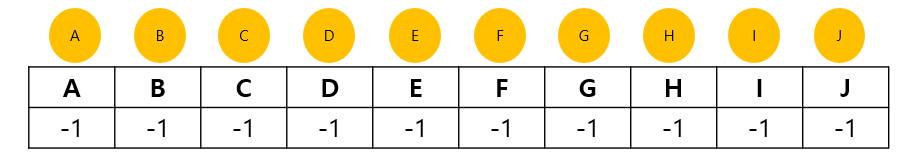

  여기서 union(A, B)가 실행되었다면 다음과 같이 변경된다.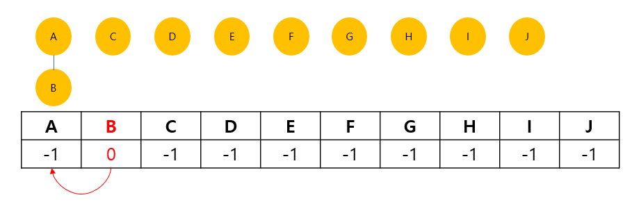

  이어서 union(C, H)가 호출되면 다음과 같이 변경된다.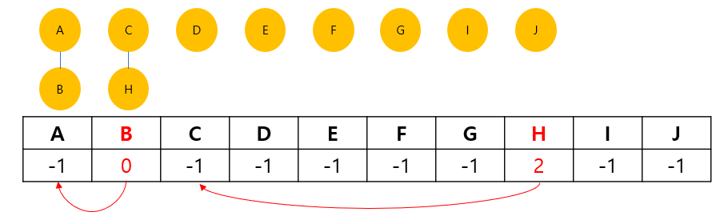

  아래의 알고리즘은 집합의 연산을 구현한 것이다. 트리는 부모 노드를 가리키는 배열로 구성된다. 루트 노드는 부모 노드 배열에서 -1을 가진다.

- union-find 알고리즘

  ```C
  UNION(a, b);
  	root1 = FIND(a);	// 노드 a의 루트를 찾는다.
  	root1 = FIND(b);	// 노드 b의 루트를 찾는다.
  	if root1 != root2	// 합한다.
          parent[root1] = root2;
  	
  	FIND(curr)			// curr의 루트를 찾는다.
      if (parent[curr] == -1)
          	return curr;// 루트
  	while (parent[curr] != -1) curr = parent[curr];
  	return curr;
  ```

  - 위의 알고리즘을 C언어로 구현하면 다음과 같다.

- union-find 프로그램

  ```C
  int parent[MAX_VERTICES];		// 부모 노드
  								// 초기화
  void set_init(int n) {
      for(int i=0; i<n; i++)
      	parent[i] = -1;
  }
  // curr가 속하는 집합을 반환한다.
  int set_find(int curr) {
      if(parent[curr] == -1)
          	return curr			// 루트
      while(parent[curr] != -1) curr = parent[curr];
      return curr;
  }
  
  // 두개의 원소가 속한 집합을 합친다.
  void set_union(int a, int b) {
      int root1 = set_find(a);	// 노드 a의 루트를 찾는다.
      int root2 = set_find(b);	// 노드 b의 루트를 찾는다.
      if(root1 != root2)			// 합한다.
          parent[root1] = root2;
  }
  ```


### Kruskal의 알고리즘 구현

- 위의 union 연산과 find 연산을 이용하여 Kruskal의 알고리즘을 구현해보면 다음과 같다. Kruskal의 알고리즘에서는 간선들을 정렬하여야 하므로 그래프가 간선들의 집합으로 저장되었다. 즉 GraphType 안에 간선들만을 저장한다. 정렬 알고리즘으로는 C언어에서 기본적으로 제공되는 qsort() 함수를 사용하였다. 최소 히프를 사용하여도 된다.

- Kruskal의 최소 비용 신장 트리 프로그램

  ```C
  
  #include <stdio.h>
  #include <stdlib.h>
  
  #define TRUE 1
  #define FALSE 0
  
  #define MAX_VERTICES 100
  #define INF 1000
  int scan[MAX_VERTICES];
  int parent[MAX_VERTICES];       // 부모 노드
                                  // 초기화
  void set_init(int n) {
      for(int i=0; i<n; i++)
          parent[i] = -1;
  }
  // curr가 속하는 집합을 반환한다.
  int set_find(int curr) {
      if(parent[curr] == -1)
          return curr;            // 루트
      while(parent[curr] != -1) curr = parent[curr];
      return curr;                // 부모를 타고 올라감
  }
  
  // 두개의 원소가 속한 집합을 합친다.
  void set_union(int a, int b) {
      int root1 = set_find(a);    // 노드 a의 루트를 찾는다.
      int root2 = set_find(b);    // 노드 b의 루트를 찾는다.
      if(root1 != root2)          // 합한다.
          parent[root1] = root2;
  }
  
  struct Edge {                   // 간선을 나타내는 구조체
      int start, end, weight;
  };
  
  typedef struct _GraphType {
      int n;                      //  간선의 개수
      int v;                      //  정점의 개수
      struct Edge edges[2 * MAX_VERTICES];
  } GraphType;
  
  // 그래프 초기화
  void graph_init(GraphType *g) {
      g->n = 0;
      for (int i=0; i< 2*MAX_VERTICES; i++) {
          g->edges[i].start = 0;
          g->edges[i].end = 0;
          g->edges[i].weight = INF;
      }
  }
  // 간선 삽입 연산
  void insert_edge(GraphType *g, int start, int end, int w) {
      g->edges[g->n].start = start;
      g->edges[g->n].end = end;
      g->edges[g->n].weight = w;
      g->n++;
      if(scan[start] != 1)
          g->v++;
      scan[start] = 1;
  }
  // qsort()에 사용되는 함수
  int compare(const void *a, const void *b) {
      struct Edge *x = (struct Edge*)a;
      struct Edge *y = (struct Edge*)b;
      return (x->weight - y->weight);     // 오름차순
  }
  
  // Kruskal의 최소 비용 신장 트리 프로그램
  void kruskal(GraphType *g) {
      int edge_accepted = 0;      // 현재까지 선택된 간선의 수
      int uset, vset;             // 정점 u와 정점 v의 집합 번호
      struct Edge e;
  
      set_init(g->n);             // 집합 초기화
      qsort(g->edges, g->n, sizeof(struct Edge), compare);
  
      printf("크루스칼 최소 신장 트리 알고리즘 \n");
      int i = 0;
      while(edge_accepted < (g->v) - 1)   // 간선의 수 < (n-1)
      {
          e = g->edges[i];
          uset = set_find(e.start);       // 정점 u의 집합 번호
          vset = set_find(e.end);         // 정점 v의 집합 번호
          if (uset != vset) {             // 서로 속한 집합이 다르면
              printf("간선 (%d,%d) %d 선택\n", e.start, e.end, e.weight);
              set_union(uset, vset);      // 두개의 집합을 합친다.
              edge_accepted++;
          }
          i++;
      }
  }
  int main() {
      GraphType *g;
      g = (GraphType*)malloc(sizeof(GraphType));
      graph_init(g);
      insert_edge(g, 0, 1, 29);
      insert_edge(g, 1, 2, 16);
      insert_edge(g, 2, 3, 12);
      insert_edge(g, 3, 4, 22);
      insert_edge(g, 4, 5, 27);
      insert_edge(g, 5, 0, 10);
      insert_edge(g, 6, 1, 15);
      insert_edge(g, 6, 3, 18);
      insert_edge(g, 6, 4, 25);
      kruskal(g);
      free(g);
    return 0;
  }
  ```
  
  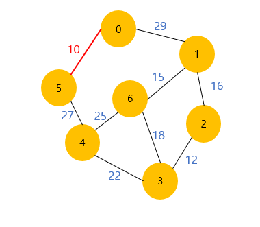

### 시간 복잡도 분석

- 이 union-find 알고리즘을 이용하면 Kruskal의 알고리즘의 시간 복잡도는 간선들을 정렬하는 시간에 좌우된다. 따라서 효율적인 정렬 알고리즘을 사용한다면 Kruskal의 알고리즘의 시간 복잡도는 (|e|log<sub>2</sub>|e|)이다.


## 11.3 Prim의 MST 알고리즘

- Prim의 알고리즘은 시작 정점에서부터 출발하여 신장 트리 집합을 단계적으로 확장해나가는 방법이다. 시작 단계에서는 시작 정점만이 신장 트리 집합에 포함된다. Prim의 방법은 앞 단계에서 만들어진 신장 트리 집합에, 인접한 정점들 중에서 최저 간선으로 연결된 정점을 선택하여 트리를 확장한다. 이 과정은 트리가 n-1개의 간선을 가질 때 까지 계속된다.

- Prim의 알고리즘을 이용하여 아래 그림의 그래프에서 정점 a를 시작정점으로 하여 최소 비용 신장 트리를 만드는 과정을 보였다. Kruskal 알고리즘과 그 결과는 동일함을 확인할 수 있다.

  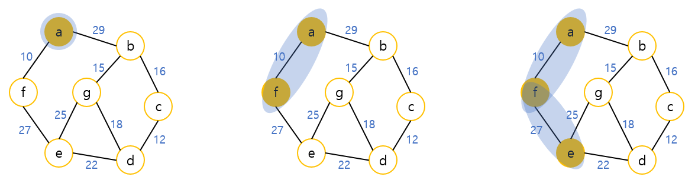

  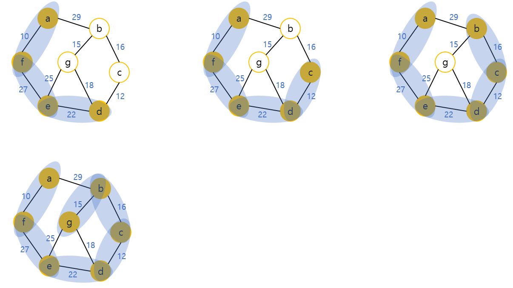

- 예제 그래프로 Prim 방법을 설명해보자. 
  정점 a에서 출발한다고 하면, 맨 처음에는 신장 트리의 집합은 { a }가 된다. 이 상태에서 인접 정점 중에서 최소 간선을 선택하면 신장 트리 집합은 { a, f }가 된다. 이 상태에서 신장 트리 집합을 살펴보면 b와 e가 있다.

  간선 (a, b)와 간선 (f, e)의 가중치를 비교해보면 (f, e)가 27로서 (a, b)의 29보다 작다. 따라서 (f, e)간선이 선택되고 정점 e가 신장 트리 집합에 포함된다. 다음 단계에서 신장 트리 집합은 { a, f, e }가 되고 같은 과정이 되풀이 된다.

  Kruskal의 알고리즘과 비교해보면 먼저 Kruskal의 알고리즘은 간선을 기반으로 하는 알고리즘인 반면 Prim의 알고리즘은 정점을 기반으로 하는 알고리즘이다.
  또한 Kruskal의 알고리즘에서는 이전 단계에서 만들어진 신장 트리와는 관계없이 무조건 최저 간선만을 선택하는 방법이었던데 반하여 Prim 알고리즘은 이전 단계에서 만들어진 신장 트리를 확장하는 방식이다. 


### Prim의 알고리즘 구현

- Prim의 알고리즘을 구현하기 위하여 보다 구체적으로 의사 코드로 알고리즘을 작성하여 보자.
  먼저  distance라는 정점의 개수 크기의 배열이 필요하다. distance는 현재까지 알려진, 신장 트리 정점 집합에서 각 정점까지의 거리를 가지고 있다.
  처음에는 시작 노드만 값이 0이고 다른 노드는 전부 무한대의 값을 가진다. 
  명백하게 처음에는 트리 집합에 아무것도 없으므로 당연하다. 

- Prim의 최소 비용 신장 트리 알고리즘

  ```c
  // 최소 비용 신장 트리를 구하는 Prim의 알고리즘
  // 입력 : 네트워크 G = (V, E), s는 시작 정점
// 출력 : 최소 비용 신장 트리를 이루는 정점들의 집합
  Prim(G, s):
  	for each u∈v do
          distance[u] <- ∞
      distance[s] <- 0
      우선 순위큐 Q에 모든 정점을 삽입(우선순위는 dist[])
      for i<-0 to n-1 do
          u <- delete_min(Q)
          화면에 u를 출력
          for each v∈(u의 인접 정점)
              if(v∈Q and weight[u][v]<dist[v])
                  then dist[v]<-weight[u][v]
  ```

- 정점들이 트리 집합에 추가되면서 distance 값은 변경된다. 다음에 우선 순위 큐 Q가 하나 필요하다. 
  배열로 구현할 수도 있고 아니면 히프를 사용하면 보다 효율적인 프로그램이 될 것이다. 우선 순위 큐에 모든 정점을 삽입한다. 이때의 우선 순위는 distance 배열값이 된다. 다음은 while 루프로 우선순위 큐에서 가장 작은 distance 값을 가지는 정점을 끄집어낸다. 바로 이 정점이 트리 집합에 추가된다. 여기서는 그냥 화면에 이 정점의 번호를 출력하기로 한다.
  다음에는 트리 집합에 새로운 정점 u가 추가되었으므로 u에 인접한 정점 v들의 distance값을 변경시켜준다.
  즉 기존의 distance[v]값보다 간선 (u, v)의 가중치 값이 적으면 간선 (u, v)의 가중치값으로 dist[v]를 변경시킨다. Q에 있는 모든 정점들이 소진될 때까지 이것을 되풀이하면 된다.
  한번 선택된 정점은 Q에서 삭제되므로 다시 선택되지는 않음을 명심해야 한다. 그리고 트리 집합에 인접하지 않은 정점들의 distance 값은 무한대이므로 역시 선택되지 않을 것이다.
  코드를 간단하게 하기 위하여 오류 처리를 생략했음을 유의해야 한다. 즉 만약 알고리즘 도중에 선택된 정점의 a값이 무한대이면 오류가 된다.
  다음은 위의 의사 코드를 배열만을 이용하여 구현한 것이다. 우선 순위 큐를 사용해서도 가능하나 문제는 우선 순위 큐에 들어 있는 우선 순위를 중간에 변경시켜야 한다.

- Prim의 최소 비용 신장 트리 프로그램

  ```C
  #include <stdio.h>
  #include <stdlib.h>
  
  #define TRUE 1
  #define FALSE 0
  #define MAX_VERTICES 100
  #define INF 1000
  
  typedef struct _GraphType {
      int n;      // 정점의 개수
      int weight[MAX_VERTICES][MAX_VERTICES];
  } GraphType;
  
  int selected[MAX_VERTICES];
  int distance[MAX_VERTICES];
  
  // 최소 dist[v] 값을 갖는 정점을 반환
  int get_min_vertex(int n) {
      int v, i;
      for (i=0; i<n; i++)
          if(!selected[i]) {
              v = i;
              break;
          }
      for (i=0; i<n; i++)
          if(!selected[i] && (distance[i] < distance[v])) v = i;
      return v;
  }
  
  void prim(GraphType *g, int s) {
      int i, u, v;
      for (u=0; u<g->n; u++)
          distance[u] = INF;
      distance[s] = 0;
      for (i=0; i<g->n; i++) {
          u = get_min_vertex(g->n);
          selected[u] = TRUE;
          if (distance[u] == INF) return;
          printf("정점 %d 추가\n", u);
          for (v=0; v<g->n; v++)
              if(g->weight[u][v] != INF)
                  if(!selected[v] && g->weight[u][v] < distance[v])
                      distance[v] = g->weight[u][v];
      }
  }
  
  int main() {
      GraphType g = { 7,
      { {0, 29, INF, INF, INF, 10, INF},  // a : 0
        {29, 0, 16, INF, INF, INF, 15},   // b : 1
        {INF, 16, 0, 12, INF, INF, INF},  // c : 2
        {INF, INF, 12, 0, 22, INF, 18},   // d : 3
        {INF, INF, INF, 22, 0, 27, 25},   // e : 4
        {10, INF, INF, INF, 22, 0, INF},  // f : 5
        {INF, 15, INF, 18, 25, INF, 0} }  // g : 6
      };
      prim(&g, 0);                        // a->f->e->d->c->b->g
      return 0;
  }
  ```

### Prim의 알고리즘 분석

- Prim의 알고리즘은 주 반복문이 정점의 수 n만큼 반복하고, 내부 반복문이 n번 반복하므로 Prim의 알고리즘은 O(n<sup>2</sup>)의 복잡도를 가진다.
  Kruskal의 알고리즘은 복잡도가 O(elog<sub>2</sub>e)이므로 희소 그래프를 대상으로 할 경우에는 Kruskal이 적합하고, 밀집 그래프의 경우에는 Prim의 알고리즘이 유리하다고 할 수 있다.


## 11.4 최단 경로

- 최단 경로(shortest path) 문제는 네트워크에서 정점 i와 정점 j를 연결하는 경로 중에서 간선들의 가중치 합이 최소가 되는 경로를 찾는 문제이다.
  간선의 가중치는 비용, 거리, 시간 등을 나타낸다.
  지도를 나타내는 그래프에서 정점은 각 도시들을 나타내고 가중치는 한 도시에서 다른 도시로 가는 거리를 의미한다. 여기서의 문제는 도시 u에서 도시 v로 가는 거리 중에서 전체 길이가 최소가 되는 경로를 찾는 것이다.

  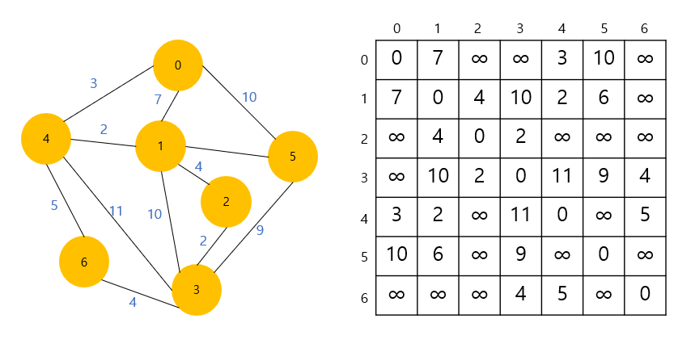

- 예를 들어 위의 그림의 그래프를 생각하자. 정점 0에서 정점 3으로 가는 최단 경로는 (0, 4, 1, 2, 3)이고 이때의 비용은 3+2+4+2=11이다. 정점 0에서 정점3으로 가는 다른 경로가 존재하지만 이 경로가 가장 최단 거리이다. 예를 들어 다른 경로인 (0, 1, 2, 3)은 비용이 7+4+2=13이 되어 이전의 경로보다 더 비용이 많이 든다. 문제는 이때 어떤 식으로 최단 경로를 발견할 것인가이다.
  2가지의 알고리즘이 있다. Dijkstra 알고리즘은 하나의 시작 정점에서 다른 정점까지의 최단 경로를 구한다. Floyd 알고리즘은 모든 정점에서 다른 모든 정점까지의 최단 경로를 구한다. 가중치는 가중치 인접 행렬에 저장되어 있다고 가정하자.
  여기서 인접 행렬과 가중치 인접 행렬과의 차이점을 주의 깊게 살펴보아야 한다. 인접 행렬에서는 간선이 없으면 인접 행렬의 값이 0이었다.
  그러나 가중치 인접 행렬에서는 간선의 가중치가 0일 수도 있기 때문에 0의 값이 간선이 없음을 나타내지 못한다. 따라서 다른 방법을 강구하여야 한다.
  이론적으로는 무한대의 값을 가중치 인접 행렬에 저장하면 된다. 즉 무한대의 값이면 간선이 없다고 생각하면 된다. 그러나 컴퓨터에서는 무한대의 값이 없다. 따라서 만약 간선이 존재하지 않으면 정수 중에서 상당히 큰 값을 무한대라고 생각하고 가중치 인접 행렬에 저장하는 것으로 한다.


## 11.5 Dijkstra의 최단 경로 알고리즘

- Dijkstra의 최단 경로 알고리즘은 네트워크에서 하나의 시작 정점으로부터 모든 다른 정점까지의 최단 경로를 찾는 알고리즘이다. 최단경로는 경로의 길이 순으로 구해진다. 먼저 집합 S를 시작 정점 v로부터의 최단경로가 이미 발견된 정점들의 집합이라고 하자.
  Dijkstra의 알고리즘에서는 시작 정점에서 집합 S에 있는 정점만을 거쳐서 다른 정점으로 가는 최단거리를 기록하는 배열이 반드시 있어야한다.
  이 1차원 배열을 distance라고 한다. 시작 정점을 v이라 하면 distance[v]=0이고 다른 정점에 대한 distance값은 시작정점과 해당 정점간의 가중치값이 된다.
  가중치는 보통 가중치 인접 행렬에 저장되므로 가중치 인접 행렬을 weight이라 하면 distance[w] = weight\[v][w]가 된다. 정점 v에서 정점 w로의 직접 간선이 없을 경우에는 무한대의 값을 저장한다.
  시작단계에서는 아직 최단경로가 발견된 정점이 없으므로 S = {v}일 것이다. 즉 처음에는 시작정점 v를 제외하고는 최단거리가 알려진 정점이 없다. 알고리즘이 진행되면서 최단거리가 발견되는 정점들이 S에 하나씩 추가될 것이다.

- 다음의 예제 그래프를 이용하여 알고리즘의 각 단계에서의 distance값을 알아보자.

  - STEP 1 : 다음의 예제 그래프에서 집합 S와 distance의 초기값을 구해보면 다음과 같다.

     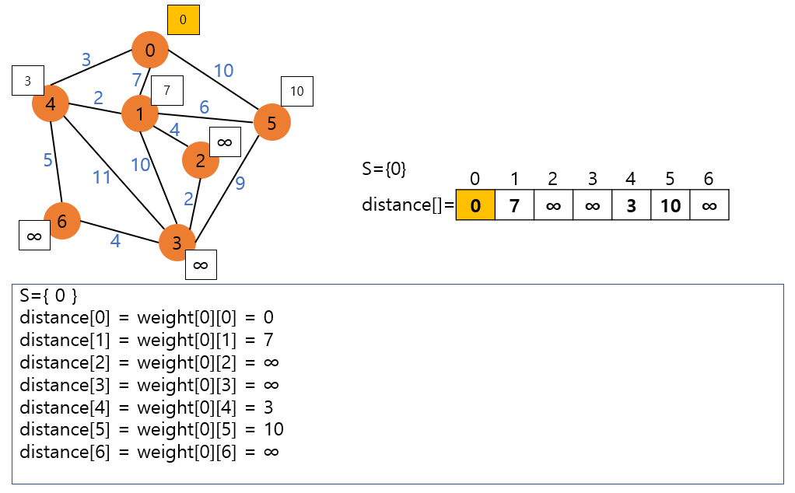
  
  - STEP 2 : 위의 예제에서는 정점 4가 가장 작은 값인 3을 가지고 있고 이것은 실제로 정점 0에서 정점 4까지의 최단 경로이다. 그 이유는 다른 정점을 통과해서 정점 4로 가더라도 그 값은 3보다 클 수 밖에 없다.
    그 이유는 다른 정점으로 가기위한 비용이 이미 3을 초과하기 때문이다.
    일단 새로운 정점이 S에 추가되면 다른 정점들의 distance 값이 변경된다. 새로운 정점을 통해서 그 정점에 갈 수 있는 경로값이 현재의 distance 값보다 더 작으면 현재의 distance 값을 새로운 경로값으로 변경한다. 위의 예에서는 정점 4를 통하여 6으로 갈 수 있고 그 경로값이 8이므로 현재의 값인 ∞를 8로 변경한다. 정점 3도 ∞에서 14로 변경한다. 정점 1까지의 값인 7도 정점 4를 통하여 가는 값인 5가 더 작으므로 5로 변경된다.
  
    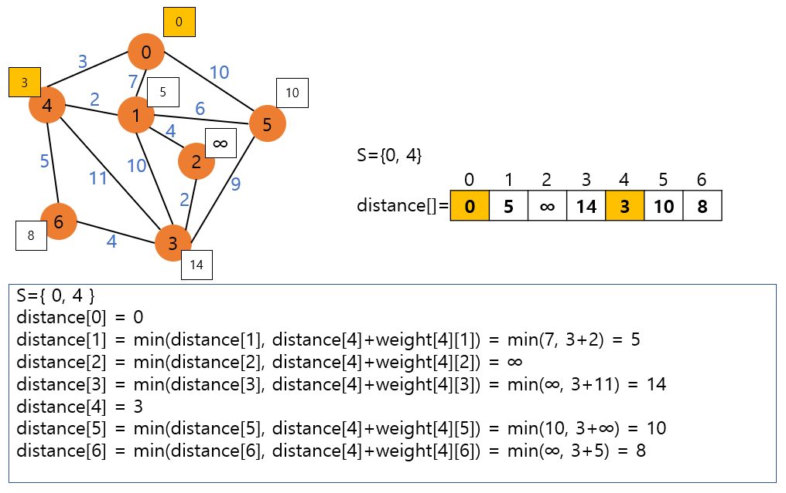
  
  - STEP 3 :
  
    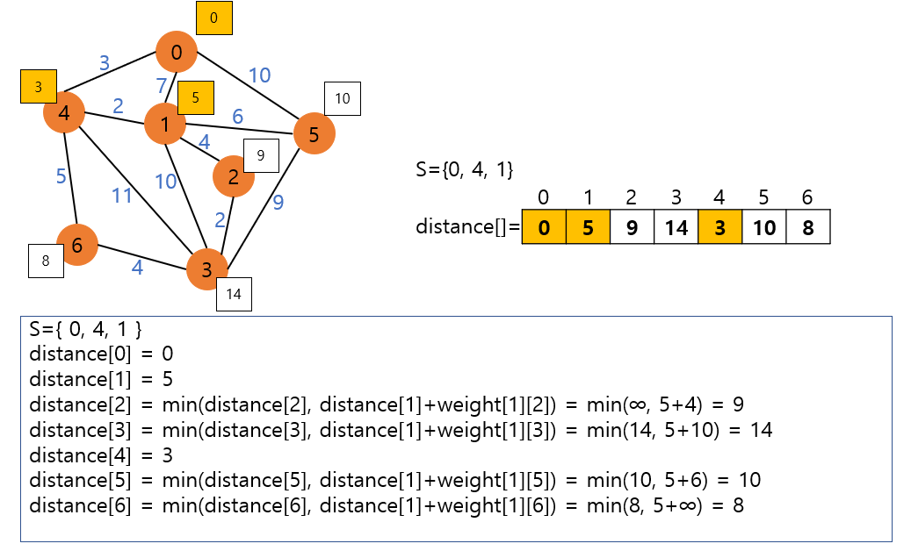
  
  - STEP 4 :
  
    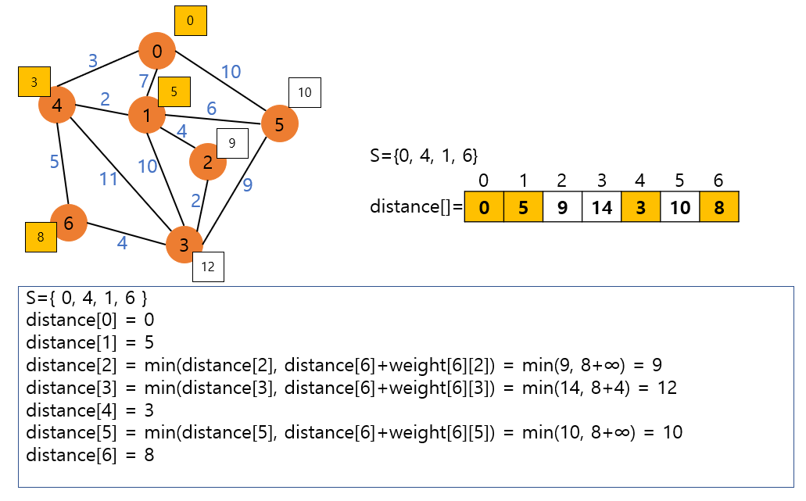
  
  - STEP 5 :
  
    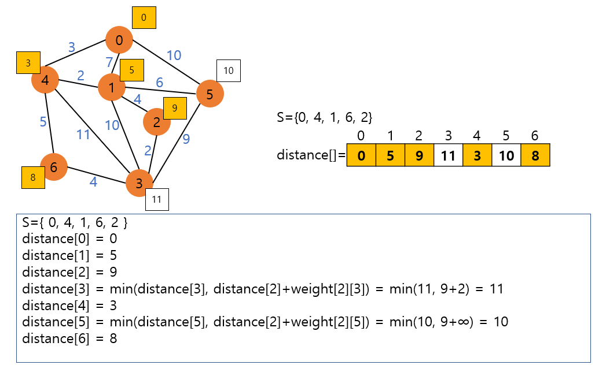
  
  - STEP 6 :
  
    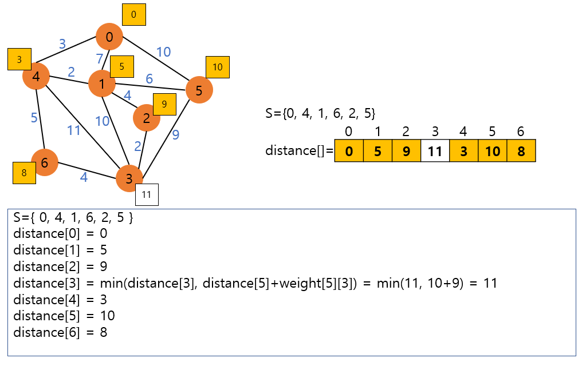
  
  - STEP 7 :
  
    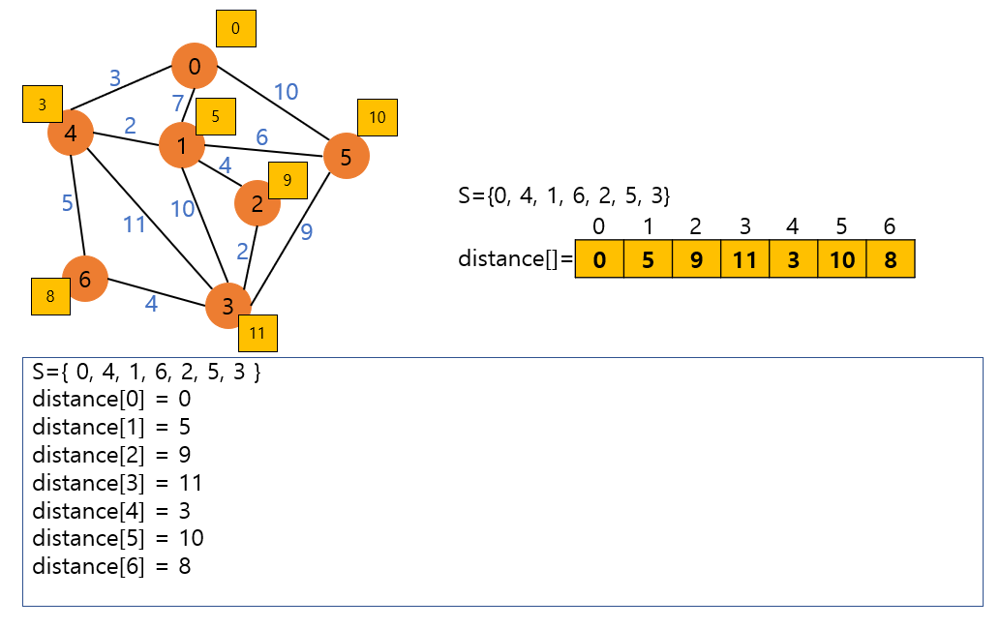


### Dijkstra의 알고리즘 구현

- 시작 정점이 0번인 경우, main() 함수는 shortest_path(0, MAX_VERTICES)로 Dijkstra의 최단 경로 알고리즘을 호출한다. 알고리즘 수행 결과로써 배열 distance에 0번 정점으로부터 다른 모든 정점으로의 최단 경로 거리를 저장하게 된다.

- 최단 경로 Dijkstra 프로그램

  ```c
  #include <stdio.h>
  #include <stdlib.h>
  #include <limits.h>
  
  #define TRUE 1
  #define FALSE 0
  #define MAX_VERTICES 100
  #define INF 1000000 /* 무한대 (연결이 없는 경우) */
  
  typedef struct _GraphType {
      int n;   // 정점의 개수
      int weight[MAX_VERTICES][MAX_VERTICES];
  } GraphType;
  
  int distance[MAX_VERTICES];     /* 시작정점으로부터의 최단경로 거리 */
  int found[MAX_VERTICES];        /* 방문한 정점 표시 */
  
  int choose(int distance[], int n, int found[]) {
      int i, min, minpos;
      min = INT_MAX;
      minpos = -1;
      for (i=0; i<n; i++)
          if(distance[i] < min && !found[i]) {
              min = distance[i];
              minpos = i;
          }
      return minpos;
  }
  void print_status(GraphType *g) {
      static int step = 1;
      printf("STEP %d ", step++);
      printf("distance: ");
      for(int i=0; i<g->n; i++) {
          if(distance[i] == INF)
              printf("* ");
          else
              printf("%d ", distance[i]);
      }
      printf("\n");
      printf("found: ");
      for(int i=0; i<g->n; i++)
          printf("%d ", found[i]);
      printf("\n\n");
  }
  void shortest_path(GraphType *g, int start) {
      int i, u, w;
      for(i=0; i<g->n; i++) {     /* 초기화 */
          distance[i] = g->weight[start][i];
          found[i] = FALSE;
      }
      found[start] = TRUE;        /* 시작 정점 방문 표시 */
      distance[start] = 0;
      for(i=0; i<g->n - 1; i++) {
          print_status(g);
          u = choose(distance, g->n, found);
          found[u] = TRUE;
          for(w=0; w<g->n; w++)
              if(!found[w])
                  if(distance[u] + g->weight[u][w] < distance[w])
                      distance[w] = distance[u] + g->weight[u][w];
      }
  }
  
  int main() {
      GraphType g = { 7,
      { {0, 7, INF, INF, 3, 10, INF}, 
        {7, 0, 4, 10, 2, 6, INF},   
        {INF, 4, 0, 2, INF, INF, INF}, 
        {INF, 10, 2, 0, 1, 9, 4},   
        {3, 2, INF, 11, 0, INF, 5},  
        {10, 6, INF, 9, INF, 0, INF},  
        {INF, INF, INF, 4, 5, INF, 0} }  
      };
      shortest_path(&g, 0);
      return 0;
  }
  ```


### Dijkstra의 분석

- 네트워크에 n개의 정점이 있다면, 최단 경로 알고리즘은 주반복문을 n번 반복하고 내부 반복문을 2n번 반복하므로 O(n<sup>2</sup>)의 복잡도를 가진다.


## 11.6 Floyd의 최단 경로 알고리즘

- 그래프 존재하는 모든 정점 사이의 최단 경로를 구하려면 Dijkstra의 알고리즘을 정점의 수만큼 반복 실행하면 된다. 그러나 모든 정점 사이의 최단 거리를 구하려면 더 간단하고 좋은 알고리즘이 존재한다.
  Floyd의 최단 경로 알고리즘은 2차원 배열 A를 이용하여 3중 반복을 하는 루프로 구성되어 있다. 알고리즘 자체는 아주 간단하다. 먼저 인접 행렬 weight는 다음과 같이 만들어진다. 
  i==j이면 weight\[i][j]=0으로 하고 만약 두개의 정점 i,j 사이에 간선이 존재하지 않으면 weight\[i][j]=∞라고 하자.
  정점 i,j사이에 간선이 존재하면 물론 weight\[i][j]는 간선(i, j)의 가중치가 된다.
  Floyd의 알고리즘은 다음과 같이 간단한 삼중 반복문으로 표현된다. 
  A의 초기값은 가중치 행렬인 weight가 된다.

- Floyd의 최단 경로 알고리즘

  ```c
  floyd(G):
  	for k <- 0 to n - 1
          for i <- 0 to n - 1
              for j <- 0 to n - 1
                  A[i][j] = min(A[i][j], A[i][k], A[k][j])
  ```

  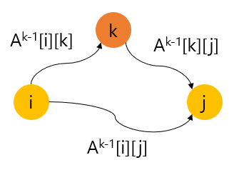

  - (1) 정점 k를 거쳐서 가지 않는 경우:
    - A<sup>k</sup>\[i][j]는 k보다 큰 정점은 통과하지 않으므로 이경우 최단 거리는 A<sup>k-1</sup>\[i][j]가 된다.
  - (2) 정점 k를 통과하는 경우:
    - 이 경우 i에서 k까지의 최단거리 A<sup>k-1</sup>\[i][k]에다가 k에서 j가지의 최단거리인 A<sup>k-1</sup>\[k][j]를 더한 값이 될 것이다.

- 따라서 최종적인 최단거리는 당연히 (1)과 (2)중에서 더 적은 값이 될 것이다. 따라서 최종적으로 A<sup>k-1</sup>\[i][j]와  A<sup>k-1</sup>\[i][k] +  A<sup>k-1</sup>\[k][j] 중 보다 적은 값이 A<sup>k</sup>\[i][j]가 된다. 이는 정점 k를 경유하는 것이 보다 좋은 경로이면 A<sup>k-1</sup>\[i][j]의 값이 변경되고, 그렇지 않으면 이전 값을 유지한다는 의미이다.


### Floyd 최단 경로 알고리즘의 구현

```C
#include <stdio.h>
#include <stdlib.h>

#define TRUE 1
#define FALSE 0
#define MAX_VERTICES 100
#define INF 1000000 /* 무한대 (연결이 없는 경우) */

typedef struct _GraphType {
    int n;      // 정점의 개수
    int weight[MAX_VERTICES][MAX_VERTICES];
} GraphType;

int A[MAX_VERTICES][MAX_VERTICES];

void printA(GraphType *g) {
    int i, j;
    printf("=================================\n");
    for(i=0; i<g->n; i++) {
        for(j=0; j<g->n; j++) {
            if(A[i][j] == INF)
                printf(" * ");
            else printf("%3d ", A[i][j]);
        }
        printf("\n");
    }
    printf("=================================\n");
}

void floyd(GraphType *g) {
    int i, j, k;
    for(i=0; i<g->n; i++)
        for(j=0; j<g->n; j++)
            A[i][j] = g->weight[i][j];
    printA(g);

    for(k=0; k<g->n; k++) {
        for(i=0; i<g->n; i++)
            for(j=0; j<g->n; j++)
                if(A[i][k] + A[k][j] < A[i][j])
                    A[i][j] = A[i][k] + A[k][j];
        printA(g);
    }
}

int main() {
    GraphType g = { 7,
        {
            {0, 7, INF, INF, 3, 10, INF}, 
            {7, 0, 4, 10, 2, 6, INF},   
            {INF, 4, 0, 2, INF, INF, INF}, 
            {INF, 10, 2, 0, 1, 9, 4},   
            {3, 2, INF, 11, 0, INF, 5},  
            {10, 6, INF, 9, INF, 0, INF},  
            {INF, INF, INF, 4, 5, INF, 0}
        }
    };
    floyd(&g);
    return 0;
}
```


### Floyd 최단 경로 알고리즘의 분석

- 두개의 정점 사이의 최단 경로를 찾는 Dijksta의 알고리즘은 시간 복잡도가 O(n<sup>2</sup>)이므로, 모든 정점 쌍의 최단 경로를 구하려면 Dijkstra의 알고리즘을 n번 반복해야 하므로 전체 복잡도는 O(n<sup>3</sup>)이 된다.
  한 번에 모든 정점 간의 최단 경로를 구하는 Floyd의 알고리즘은 3중 반복문이 실행되므로 시간 복잡도가 
  O(n<sup>3</sup>)으로 표현되고, 이는 Dijkstra의 알고리즘과 비교해 차이는 없다고 할 수 있다. 그러나 Floyd의 알고리즘은 매우 간결한 반복 구문을 사용하므로 Dijkstra의 알고리즘 보다 상당히 빨리 모든 정점간의 최단 경로를 찾을 수 있다.


## 11.7 위상 정렬

- 큰 프로젝트는 많은 작은 작업으로 나누어서 수행하게 된다. 이 경우 전체 프로젝트는 각각의 작업이 완료되어야만 끝나게 된다. 컴퓨터 관련 전공에서 과목을 수강하는 것도 비슷하다 성공적으로 학위를 취득하려면 각각의 교과목들을 순서에 따라 성공적으로 수강하여야만 한다.
  아래의 표는 많은 과목 중에서 몇 개의 과목을 나열하고 선수 과목을 보여준다. 예를 들어 자료 구조를 수강하려면 먼저 전산학 개론과 이산 수학을 수강하여야 한다. 즉 선수 과목은 과목들의 선행 관계를 표현하게 된다.
  그래프를 사용하면 이 같은 각각의 과목들 간의 선행 관계를 명확하게 표현할 수 있다. 다음 아래의 그림은 그래프를 사용하여 과목들 간의 선행 관계를 표현하여 본 것이다.

  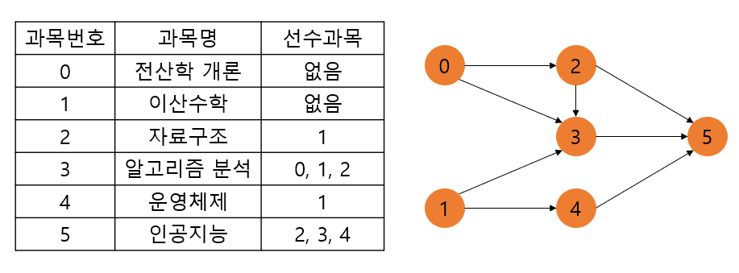

- 이러한 방향 그래프에서 간선 <u, v>가 있다면 정점 u는 정점 v를 선행한다고 말한다. 방향 그래프에 존재하는 각 정점들의 선행 순서를 위배하지 않으면서 모든 정점을 나열하는 것을 방향 그래프의 위상 정렬(topological sort)이라고 한다. 예를 들어 위의 그림의 예제 그래프에서는 많은 위상 정렬이 가능하다. 그중에서 몇 개만 들어보면 0,1,2,3,4,5    1,0,2,3,4,5 등을 들 수 있다. 0,1,3,2,4,5는 위상 순서가 아니다. 왜냐하면 3번 정점이 2번 정점 앞에 오기 때문이다. 간선 <2, 3>이 존재하기 때문에 2번 정점이 끝나야 만이 3번 정점을 시작할 수 있다.

- 방향 그래프를 대상으로 위상 정렬을 하기 위한 알고리즘은 간단하다. 먼저 진입 차수가 0인 정점을 선택하고, 선택된 정점과 여기에 부착된 모든 간선을 삭제한다. 이와 같은 진입 차수 0인 정점의 선택과 삭제 과정을 반복해서 모든 정점이 선택, 삭제되면 알고리즘이 종료된다.

  진입 차수 0인 정점이 여러 개 존재할 경우 어느 정점을 선택하여도 무방하다(따라서, 하나의 그래프에는 복수의 위상순서가 있을 수 있다). 이 과정에서 선택되는 정점의 순서를 위상 순서(topological order)라 한다.
  위의 과정 중에 그래프에 남아 있는 정점 중에 진입 차수 0인 정점이 없다면, 이러한 그래프로 표현된 프로젝트는 실행 불가능한 프로젝트가 되고 위상 정렬 알고리즘은 중단된다.

- 위 그림에 대한 위상 정렬을 해보면, 내차수가 0인 정점 1를 시작으로 정점 1의 간선을 제거하면, 다음 단계에서 정점 4의 진입 차수가 0이 되므로 후보 정점은 0, 4가 된다. 만약 정점 4를 선택하면 다음 단계에서는 오직 정점 0만이 후보가 된다. 다음에 정점 0이 선택되고 정점 2가 진입 차수가 0이 되어 선택 가능하게 된다. 다음에 정점 3, 정점 5를 선택하면 결과적으로 1, 4, 0, 2, 3, 5가 된다.


### 위상 정렬 알고리즘의 구현

- 먼저 in_degree라는 1차원 배열을 만들고 이 배열에 각 정점의 진입 차수를 기록한다. 즉 in_degree[i]는 정점 i로 들어오는 간선들의 개수이다. 정점 i는 in_degree[i]의 값이 0일 경우에 후보 정점이 된다. 알고리즘이 진행되면서 진입 차수가 0인 정점이 그래프에서 제거되면 그 정점에 인접한 정점의 in_degree[i]는 1만큼 감소하게 된다.
  앞의 예제 그래프에서 in_degree[0:5] = [ 0, 0, 1, 3, 1, 3 ]이 된다. 따라서 처음에 정점 0와 정점 1이 후보 정점이 된다. 후보 정점들을 어딘가 저장하여야 한다.  여기서는 스택을 선택하여 후보 정점들을 스택에 저장한다. 따라서 정점 0와 정점 1이 스택에 저장된다.
  다음 단계에서 스택에서 하나의 정점을 꺼내어 출력하고 그 정점에 인접해있는 정점들의 in_degree배열값을 감소 시킨다. 만약 정점 1이 스택에서 제거되었다면 in_degree[0:5] = [ 0, 0, 1, 2, 0 ,3 ]이 된다. 정점 4의 in_degree값이 0이 되었으므로 스택에 새롭게 추가가 된다. 이러한 과정은전체 정점이 출력이 될때까지 계속된다. 만약 전체 정점이 출력되지 못하면 그래프에 사이클 등이 존재하여 위상 정렬 순서가 존재하지 않는 것이다. 

- 그래프는 인접 리스트로 표현되었다고 가정한다. 인접 리스트에 간선 (v1, v2)를 추가하는 insert_edge(g, v1, v2)를 사용하였다. 그래프는 간선의 개수만큼 insert_edge 함수를 호출하게 되면 인접 리스트로 생성된다.
  또한 후보 정점들을 스택에 저장하기로 하였으므로 스택이 필요하다. 
  소스에서는 생략되었지만 main함수에서 topo_sort 호출이 종료되면 그래프의 모든 간선을 삭제하여야 한다.

- 그래프 위상 정렬 전체 프로그램

  ```C
  #include <stdio.h>
  #include <stdlib.h>
#define TRUE 1
  #define FLASE 0
  #define MAX_VERTICES 50
  
  typedef struct _GraphNode {
      int vertex;
      struct _GraphNode *link;
  } GraphNode;
  
  typedef struct _GraphType {
      int n; // 정점의 개수
      GraphNode *adj_list[MAX_VERTICES];
  } GraphType;
  
  // 그래프 초기화
  void graph_init(GraphType *g) {
      int v;
      g->n = 0;
      for(v=0; v<MAX_VERTICES; v++)
          g->adj_list[v] = NULL;
  }
  // 정점 삽입 연산
  void insert_vertex(GraphType *g, int v) {
      if(((g->n) + 1) > MAX_VERTICES) {
          fprintf(stderr, "그래프 : 정점 개수 초과");
          return;
      } 
      g->n++;
  }
  // 간선 삽입 연산
  void insert_edge(GraphType *g, int u, int v) {
      GraphNode *node;
      if(u >= g->n || v >= g->n) {
          fprintf(stderr, "그래프 : 정점 번호 오류");
          return;
      }
      node = (GraphNode*)malloc(sizeof(GraphNode));
      node->vertex = v;
      node->link = g->adj_list[u];
      g->adj_list[u] = node;
  }
  
  #define MAX_STACK_SIZE 100
  typedef int element;
  typedef struct {
      element stack[MAX_STACK_SIZE];
      int top;
  } StackType;
  
  // 스택 초기화 함수
  void init(StackType *s) {
      s->top = -1;
  }
  // 공백 상태 검출 함수
  int is_empty(StackType *s) {
      return (s->top == -1);
  }
  // 포화 상태 검출 함수
  int is_full(StackType *s) {
      return (s->top == (MAX_STACK_SIZE - 1));
  }
  // 삽입함수
  void push(StackType *s, element item) {
      if(is_full(s)) {
          fprintf(stderr, "스택 포화 에러\n");
          return;
      }
      else s->stack[++(s->top)] = item;
  }
  // 삭제함수
  element pop(StackType *s) {
      if(is_empty(s)) {
          fprintf(stderr, "스택 공백 에러\n");
          exit(1);
      }
      else return s->stack[(s->top)--];
  }
  
  // 위상정렬 수행.
  int topo_sort(GraphType *g) {
      int i;
      StackType s;
      GraphNode *node;
  
      // 모든 정점의 진입 차수를 계산
      int *in_degree = (int*)malloc(g->n * sizeof(int));
      for(i=0; i<g->n; i++)                   // 초기화   
          in_degree[i] = 0;
      for(i=0; i<g->n; i++) {
          node = g->adj_list[i];   // 정점 i에서 나오는 간선들
          while(node != NULL) {
              in_degree[node->vertex]++;
              node = node->link;
          }
      }
  
      // 진입 차수가 0인 정점을 스택에 삽입
      init(&s);
      for(i=0; i<g->n; i++) {
          if(in_degree[i] == 0) push(&s, i);
      }
  
      // 위상 순서를 생성
      while(!is_empty(&s)) {
          int w;
          w = pop(&s);
          printf("정점 %d ->", w); // 정점 출력
          node = g->adj_list[w];   // 각 정점의 진입차수를 변경
          while(node != NULL) {
              int u = node->vertex;
              in_degree[u]--;      // 진입 차수를 감소
              if(in_degree[u] == 0) push(&s, u);
              node = node->link;
          }
      }
      free(in_degree);
      printf("\n");
      return (i==g->n);           // 반환값이 1이면 성공, 0이면 실패
  }
   int main() {
       GraphType g;
       graph_init(&g);
       insert_vertex(&g, 0);
       insert_vertex(&g, 1);
       insert_vertex(&g, 2);
       insert_vertex(&g, 3);
       insert_vertex(&g, 4);
       insert_vertex(&g, 5);
  
       // 정점 0의 인접 리스트 생성
       insert_edge(&g, 0, 2);
       insert_edge(&g, 0, 3);
       // 정점 1의 인접 리스트 생성
       insert_edge(&g, 1, 3);
       insert_edge(&g, 1, 4);
       // 정점 2의 인접 리스트 생성
       insert_edge(&g, 2, 3);
       insert_edge(&g, 2, 5);
       // 정점 3의 인접 리스트 생성
       insert_edge(&g, 3, 5);
       // 정점 4의 인접 리스트 생성
       insert_edge(&g, 4, 5);
       // 위상 정렬
       topo_sort(&g);
       // 동적 메모리 반환 코드 생략
       return 0;
   }
  ```
  
  

