# 12. 정렬(Sort)

## 12.1 정렬이란?

- 정렬(sorting)은 물건을 크기순으로 오름차순(ascending order)이나 내림차순(descending order)으로 나열하는 것을 의미한다. 예를 들어 책들은 제목순이나 저자순, 또는 발간연도순으로 정렬이 가능하다. 사람도 나이나 키, 이름 등을 이용하여 정렬할 수 있다. 물건뿐만 아니라 어떤 형태의 것도 서로 비교만 가능하면 정렬할 수 있다.

- 정렬은 컴퓨터 공학에서 가장 기본적이고 중요한 알고리즘 중의 하나로 일상생활에서 많이 사용된다. 또한 정렬은 자료 탐색에 있어서 필수적이다. 예를 들면 사전에서 우리가 단어를 쉽게 찾을 수 있는 것은 사전안의 단어들이 알파벳 순으로 정렬되어 있기 때문이다. 만약 사전이 알파벳 순으로 정렬되어 있지 않다면 특정 단어를 찾는 것은 거의 불가능할 것이다. 이는 컴퓨터도 마찬가지다. 비록 컴퓨터가 사람보다 속도는 더 빠르지만 정렬되어 있지 않은 자료가 주어지면 탐색의 효율성이 크게 떨어진다.

- 일반적으로 보통 정렬시켜야 될 대상은 레코드(record)라고 불린다. 레코드는 다시 필드(field)라고 하는 단위로 나누어진다. 예를 들어 학생들의 레코드라면 이름, 학번, 주소, 전화번호 등이 필드가 될 것이다. 여러 필드 중에서 특별히 레코드와 레코드를 식별해주는 역할을 하는 필드를 키(key)라고 한다. 학생들의 레코드의 경우에는 학번이 키가 될 수 있다. 정렬이란 결국 레코드들을 키값의 순서로 재배열하는 것이다.

  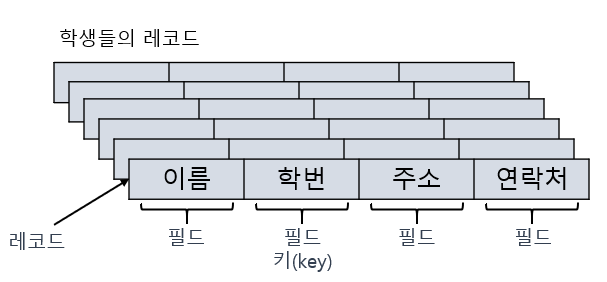

- 지금까지 개발된 정렬 알고리즘은 매우 많다. 그러나 아직까지도 모든 경우에 있어서 최상의 성능을 보여주는 최적 알고리즘은 존재하지 않는다. 따라서 이들 방법들 중에서 현재의 프로그램 수행환경에서 가장 효율적인 정렬 알고리즘을 선택하여야 한다. 대개 정렬 알고리즘을 평가하는 효율성의 기준으로는 정렬을 위해 필요한 비교 연산의 횟수와 이동 연산의 횟수이다. 이들 횟수를 정확하게 구하기는 힘들기 때문에 이들 횟수를 빅오 표기법을 이용하여 근사적으로 표현한다. 대개 이들 횟수는 자료의 초기화 여부에 의존적이다.
- 일반적으로 이동 횟수와 비교 횟수가 서로 비례하지 않는다. 즉 어떤 알고리즘은 비교 횟수는 많지만 이동 횟수는 적을 수 있고 또 그 반대도 가능하다. 숫자와 숫자를 비교하는 것은 시간이 걸리지 않지만 문자열과 문자열을 비교하는 것은 상당히 시간이 걸리는 작업이다. 또 숫자를 이동시키는 것은 간단하지만 큰 구조체를 이동시키려면 상당한 시간이 걸릴 것이다. 따라서 현재 개발 중인 응용에 맞추어서 가장 적절한 정렬 알고리즘을 선택하여야 한다.

<hr>

- 정렬 알고리즘은 대개 크게 2가지로 나누어진다. 단순하지만 비효율적인 정렬 알고리즘과 복잡하지만 효율적인 정렬 알고리즘이 그것이다. 단준한 정렬 알고리즘은 구현하기가 쉬운 대신에 비효율적이다. 반면 효율적인 알고리즘은 반대로 구현하기는 까다롭지만 효율적이다.
  - 단순하지만 비효율적인 방법 - 삽입 정렬, 선택 정렬, 버블 정렬 등
  - 복잡하지만 효율적인 방법 - 퀵 정렬, 히프 정렬, 합병 정렬, 기수 정렬 등
- 대개 자료의 개수가 적다면 단순한 정렬 방법을 사용하는 것도 괜찮지만 자료의 개수가 일정 개수를 넘어가면 반드시 효율적인 알고리즘을 사용하여야 한다.


- 정렬 알고리즘을 내부 정렬(internal sorting)과 외부 정렬(external sorting)로 구분할 수도 있다. 내부 정렬은 정렬하기 전에 모든 데이터가 메인 메모리에 올라와 있는 정렬을 의미한다. 반면, 외부정렬은 외부 기억 장치에 대부분의 데이터가 있고 일부만 메모리에 올려놓은 상태에서 정렬을 하는 방법이다. 여기서는 내부 정렬만을 다루기로 한다.

- 정렬 알고리즘을 안정성(stability)의 측면에서 분류할 수도 있다. 정렬 알고리즘에서 안정성이란 입력 데이터에 동일한 키값을 갖는 레코드가 여러 개 존재할 경우, 이들 레코드들의 상대적인 위치가 정렬 후에도 바뀌지 않음을 뜻한다. 이와 반대로 같은 키값을 갖는 레코드들이 정렬 후에 위치가 바뀌게 되면 안정하지 않다고 한다. 아래 그림에서는 키값 30을 갖는 두개의 레코드가 정렬 후에 위치가 바뀌었다.
  정렬의 안정성이 필수적으로 요구되는 경우에는 정렬 알고리즘 중에서 안정성을 충족하는 삽입정렬, 버블정렬, 합병정렬 등을 사용해야 한다.

  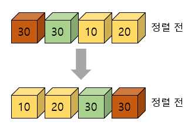


## 12.2 선택 정렬

### 선택 정렬의 원리

- 알고리즘을 본격적으로 설명하기 전에 정렬의 환경을 설명하기로 하자. 대상이 되는 것은 설명을 쉽게 하기 위하여 숫자 필드만 가지고 있는 레코드라고 가정하였다. 그리고 이들 숫자들은 1차원 배열에 들어 있다고 가정한다.
  선택 정렬(selection sort)은 가장 이해하기가 쉬운 정렬 방법이다. 먼저 왼쪽 리스트와 오른쪽 리스트, 두 개의 리스트가 있다고 가정하자. 왼쪽 리스트에는 정렬이 완료된 숫자들이 들어가게 되며 오른쪽 리스트에는 정렬되지 않은 숫자들이 들어 있다. 아래 표와 같이 초기 상태에서 왼쪽 리스트는 비어 있고 정렬되어야 할 숫자들은 모두 오른쪽 리스트에 들어 있다.
  선택 정렬은 오른쪽 리스트에서 가장 작은 숫자를 선택하여 왼쪽 리스트로 이동하는 작업을 되풀이 한다. 선택 정렬은 오른쪽 리스트가 공백상태가 될 때까지 아 과정을 되풀이하는 정렬 기법이다.

  |  왼쪽 리스트  | 오른쪽 리스트 |   설명   |
  | :-----------: | :-----------: | :------: |
  |      ()       | (5,3,8,1,2,7) | 초기상태 |
  |      (1)      |  (5,3,8,2,7)  |  1선택   |
  |     (1,2)     |   (5,3,8,7)   |  2선택   |
  |    (1,2,3)    |    (5,8,7)    |  3선택   |
  |   (1,2,3,5)   |     (8,7)     |  5선택   |
  |  (1,2,3,5,7)  |      (8)      |  7선택   |
  | (1,2,3,5,7,8) |      ()       |  8선택   |

- 위의 방법은 배열로 구현하기로 하였다면, 위의 방법을 구현하기 위해서는 입력 배열과는 별도로 똑같은 크기의 배열이 하나 더 필요하다. 따라서 메모리를 절약하기 위하여 입력 배열 외에 추가적인 공간을 사용하지 않는 선택 정렬 알고리즘을 생각해보자. 이렇게 입력 배열 이외에는 다른 추가 메모리를 요구하지 않는 정렬 방법을 제자리 정렬(in-place sorting)이라고 한다. 위의 표에서보면 오른쪽 리스트에 하나의 최소값이 선택되고 그 값이 왼쪽 배열로 이동되면 하나의 빈공간이 생기리라는 것을 예측할 수 있다. 따라서 이점을 이용한다.

- 즉 아래의 그림와 같이 입력 배열에서 최소값을 발견한 다음, 이 최소값을 배열의 첫번째 요소와 교환한다. 다음에는 첫번째 요소를 제외한 나머지 요소들 중에서 가장 작은 값을 선택하고 이를 두번째 요소와 교환한다. 이 절차를 (숫자 개수-1)만큼 되풀이하면 추가적인 배열을 사용하지 않고서도 전체 숫자들이 정렬된다.

  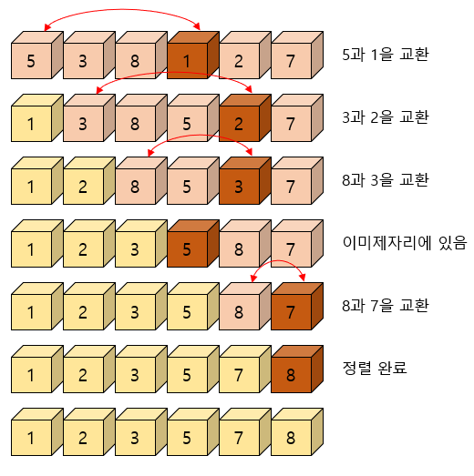


### 선택 정렬의 알고리즘

- 선택 정렬의 알고리즘은 다음과 같다. 여기서 주의할 것은 i 값이 0에서 n-2까지만 변화된다는 점이다. 만약 list[0] 부터 list[n-2]까지 정렬이 되었으면 이미 list[n-1]이 가장 큰 값이기 떄문에  n-1까지 정렬할 필요가 없다.

- 선택 정렬 알고리즘

  ```c
  selection_sort(A, n):
  
  for i<-0 to n-2 do
      least <- A[i], A[i+1], ... , A[n-1] 중에서 가장 작은 값의 인덱스;
  	A[i]와 A[least]의 교환;
  	i++;
  ```

  

### 전체 프로그램

- 앞에서 기술한 선택 정렬 함수를 호출하여 사용하는 프로그램은 다음과 같다. 입력 배열은 난수를 발생시켜 채웠다. main() 함수에서는 MAX_SIZE개의 난수를 발생시켜 배열 list에 저장한다. 이때 난수의 발생범위는 0~MAX_SIZE-1까지가 된다. 앞으로 학습하게 될 다른 정렬의 경우에도 전체 프로그램의 구조는 선택정렬과 같다.

- 선택 정렬 프로그램

  ```c
  #include <stdio.h>
  #include <stdlib.h>
  #include <time.h>
  #define MAX_SIZE 10
  #define SWAP(x, y, t) ( (t)=(x), (x)=(y), (y)=(t) )
  
  int list[MAX_SIZE];
  int n;
  
  void selection_sort(int list[], int n) {
      int i, j, least, temp;
      for(i=0; i<n-1; i++) {
          least = i;
          for(j=i+1; j<n; j++)    // 최소값 탐색
              if(list[j] < list[least]) least = j;
          SWAP(list[i], list[least], temp);
      }
  }
  
  int main() {
      int i;
      n = MAX_SIZE;
      srand(time(NULL));
      for(i=0; i<n; i++)              // 난수 생성 및 출력
          list[i] = rand() % 100;     // 난수 발생 범위 0~99
      
      selection_sort(list, n);        // 선택정렬 호출
      for(i=0; i<n; i++)
          printf("%d ", list[i]);
      printf("\n");
      return 0;
  }
  ```

  

### 선택 정렬의 분석

- 선택 정렬의 성능 분석을 위하여 비교 횟수와 이동 횟수를 따로 구하여 보자. 먼저 비교 횟수를 구하기 위하여 두개의 for 루프의 실행 횟수를 계산하여 보자. 외부 루프는 n-1번 실행될 것이며 내부루프는 0에서 n-2까지 변하는 i에 대하여 (n-1)-i번 반복될 것이다. 키값들의 비교가 내부 루프 안에서 이루어지므로 전체 비교횟수는 다음과 같이 된다.

  (n-1) + (n-2) + . . . + 1 = n(n-1)/2 = O(n<sup>2</sup>)

- 레코드 교환 횟수는 외부 루프의 실행 횟수와 같으며 한번 교환하기 위하여 3번의 이동이 필요하므로 전체 이동횟수는 3(n-1)이 된다.
  선택 정렬의 장점은 자료 이동 횟수가 미리 결정된다는 점이다. 그러나 이동 횟수는 3(n-1)으로 상당히 큰 편이다. 또한 자료가 정렬된 경우에는 불필요하게 자기 자신과의 이동을 하게 된다. 따라서 이 문제를 약간 개선하려면 다음과 같은 if문을 추가하면 된다.

  ```c
  if(i != least)
      SWAP(list[i], list[least], temp);
  ```

- 즉 최소값이 자기 자신이면 자료이동을 하지 않는다. 일반적으로 비교 연산 1개가 이동 연산 3개보다 시간이 적게 걸리므로 효과적이다. 선택 정렬의 문제점은 안정성을 만족하지는 않는다는 점이다. 즉 값이 같은 레코드가 있는 경우에 상대적인 위치가 변경될 수 있다.


## 12.3 삽입 정렬

### 삽입 정렬의 원리

- 삽입 정렬은 정렬되어 있는 리스트에 새로운 레코드를 적절한 위치에 삽입하는 과정을 반복한다. 선택 정렬과 마찬가지로 입력 배열을 선택 정렬과 유사하게 입력배열을 정렬된 부분과 정렬 되지 않은 부분으로 나누어서 사용하면 된다.

- 정렬되어 있지 않은 부분의 첫 번째 숫자가 정렬된 부분의 어느 위치에 삽입되어야 하는가를 판단한 후 해당 위치에 이 숫자를 삽입하게 되면, 정렬된 부분의 크기는 하나 커지게 되고, 정렬이 되지 않은 부분의 크기는 하나 줄어들게 된다. 이러한 삽입 연산을 정렬되지 않은 부분이 빌때까지 반복하게 되면 잔체 리스트가 정렬된다. 전체 리스트 (5,3,8,1,2,7)를 삽입 정렬하는 과정을 다음에 보였다.

  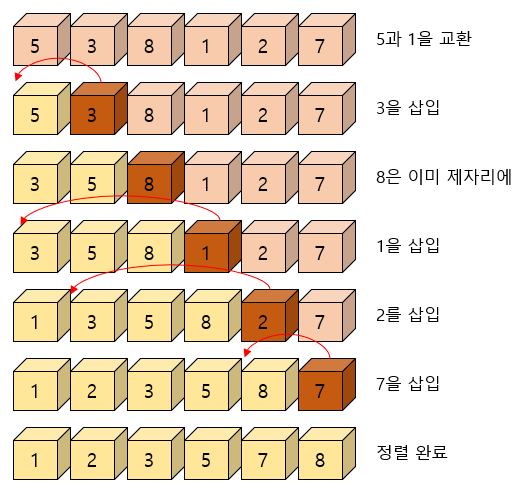


### 삽입 정렬의 알고리즘

- 삽입 정렬 알고리즘

  ```c
  insertion_sort(A, n):
  1. for i<-1 to n-1 do
  2.     key<-A[i];
  3.     j<-i-1;
  4.     while j>=0 and A[j]>key do
  5.         A[j+1]<-A[j];
  6.	       j<-j-1;
  7.	   A[j+1]<-key;
  ```

- 알고리즘 설명

  ```
  1. 인덱스 1부터 시작한다. 인덱스 0은 이미 정렬된 것으로 볼 수 있다.
  2. 현재 삽입될 숫자인 i번째 정수를 key 변수로 복사
  3. 현재 정렬된 배열은 i-1까지 이므로 i-1번째부터 역순으로 조사한다.
  4. j값이 음수가 아니어야 되고 key값보다 정렬된 배열에 있는 값이 크면
  5. j번째를 j+1번째로 이동한다.
  6. j를 하나 감소한다.
  7. j번째 정수가 key보다 작으므로 j+1번째가 key가 들어갈 위치이다.
  ```

  아래의 그림에서 i=3인 경우에 정렬된 왼쪽 리스트에 어떻게 삽입되는지를 보였다.

  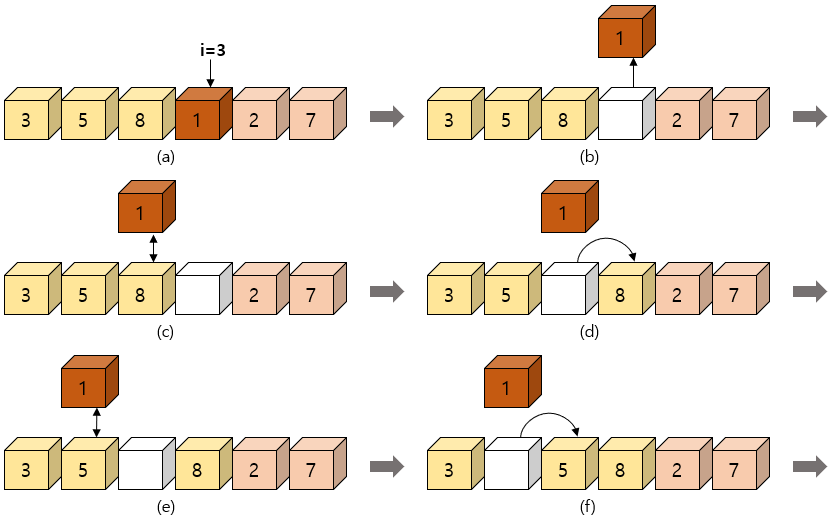

  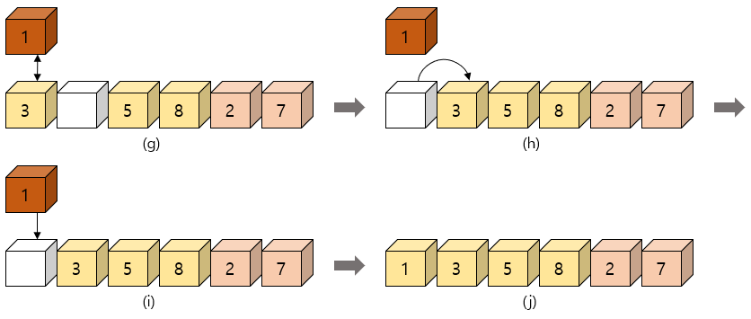


### 삽입 정렬의 C언어 구현

- 삽입 정렬 프로그램

  ```c
  // 삽입 정렬
  void insertion_sort(int list[], int n) {
      int i, j, key;
      for(i=1; i<n; i++) {
          key = list[i];
          for(j=i-1; j>=0 && list[j]>key; j--)
              list[j+1] = list[j];	/* 레코드의 오른쪽 이동 */
          list[j+1] = key;
      }
  }
  ```


### 삽입 정렬의 복잡도 분석

- 삽입 정렬의 복잡도는 입력 자료의 구성에 따라서 달라진다. 먼저 입력 자료가 이미 정렬되어 있는 경우는 가장 빠르다. 삽입 정렬의 외부 루프는 n-1번 실행되고 각 단계에서 1번의 비교와 2번의 이동만 이루어지므로 총비교횟수는 n-1번, 총 이동횟수는 2(n-1)번이 되어 알고리즘의 시간 복잡도는 O(n)이다.

- 최악의 복잡도는 입력 자료가 역순일 경우이다. 각 단계에서 앞에 놓인 자료들은 전부 한 칸씩 뒤로 이동하여야 한다.따라서 외부 루프안의 각 반복마다 i번의 비교가 수행되므로 총 비교횟수는 다음과 같다.

  1 + 2 + . . . + (n-1) = n(n-1)/2 = O(n<sup>2</sup>)

- 총 이동횟수는 외부 루프의 각 단계마다 i+2번의 이동이 이루어지므로 다음과 같다.

  n(n-1)/2 + 2(n-1) = (n<sup>2</sup>+3n-4)/2 = O(n<sup>2</sup>)

- 삽입 정렬은 비교적 많은 레코드들의 이동을 포함한다. 결과적으로 삽입정렬은 레코드 양이 많고 레코드 크기가 클 경우에 적합하지 않음을 알 수 있다. 반면에 삽입 정렬은 안정한 정렬 방법으로서 레코드의 수가 적을 경우 알고리즘 자체가 매우 간단하므로 다른 복잡한 정렬 방법보다 유리할 수 있다. 또한 삽입정렬은 대부분의 레코드가 이미 정렬되어 있는 경우에 매우 효율적일 수 있다.


## 12.4 버블 정렬

### 버블 정렬의 원리

- 버블 정렬(bubble sort)은 인접한 2개의 레코드를 비교하여 크기가 순서대로 되어 있지 않으면 서로 교환하는 비교-교환 과정을 리스트의 왼쪽 끝에서 시작하여 오른쪽 끝까지 진행한다. 이러한 리스트의 비교-교환 과정(스캔)이 한번 완료되면 가장 큰 레코드가 리스트의 오른쪽 끝으로 이동된다. 이러한 비교-교환 과정은 전체 숫자가 전부 정렬될 때까지 계속된다.
  정렬이 안 된 오른쪽 리스트를 한번 스캔하면 오른쪽리스트의 오른쪽 끝에 가장 큰 레코드가 위치하게 되고, 오른쪽 리스트는 추가된 레코드를 포함하여 정렬된 상태가 된다. 이러한 스캔 과정을 정렬이 안 된 왼쪽 리스트에서 반복하여 적용하면 정렬이 완료된다. 리스트 (5,3,8,1,2,7)를 버블 정렬하는 첫 번째 스캔 과정은 아래와 같다.

  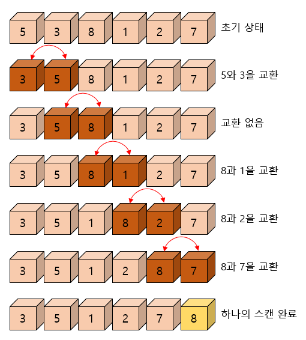

- 먼저 5과 3를 비교하면 5가 더 크므로 서로 교환하고, 다음으로 5과 8을 비교하게 되면 8이 더 크므로 교환 없이 다음 단계로 진행한다. 이러한 과정이 반복되면 8이 가장 리스트의 오른쪽 끝으로 이동하게 된다. 이미 자기 위치에 자리 잡은 8을 제외한 나머지 왼쪽 리스트를 대상으로 이 과정을 반복한다.
  한 번의 스캔에 의해 가장 큰 레코드가 리스트의 오른쪽 끝으로 이동하게 된다. 이러한 반복과정이 왼쪽 리스트가 빌 때까지 수행되어 전체 리스트가 정렬되는 과정은 아래와 같다.

  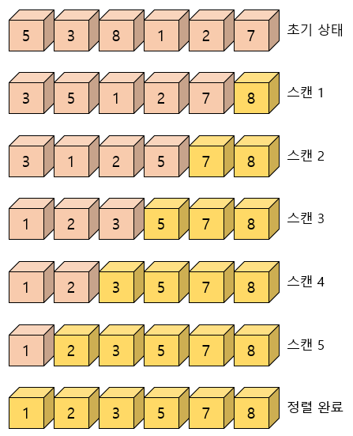


### 버블정렬의 알고리즘

- 버블 정렬 알고리즘

  ```c
  BubbleSort(A, n):
  
  for i<-n-1 to 1 do
      for j<-0 to i-1 do
          j와 j+1번째의 요소가 크기순이 아니면 교환
          j++;
  	i--;
  ```

- 버블 정렬의 알고리즘은 그야 말로 간단하다. 먼저 하나의 스캔은 j=0부터 j=i-1까지 반복하는 루프로 구성되고 j번째 요소와 j+1번째 요소를 비교하여 크기순으로 되어 있지 않으면 교환한다. i는 하나의 스캔이 끝날 때마다 1씩 감소한다. 이런 스캔 과정이 n-1번 되풀이되면 정렬이 끝나게 된다.


### 버블 정렬의 C언어 구현

- 버블 정렬 프로그램

  ```C
  #define SWAP(x, y, t) ( (t)=(x), (x)=(y), (y)=(t) )
  void bubble_sort(int list[], int n) {
      int i, j, temp;
      for(i=n-1; i>0; i--) {
          for(j=0 j<i; j++)
              /* 앞뒤의 레코드를 비교한 후 교체 */
              if(list[j]>list[j+1])
                  SWAP(list[j], list[j+1], temp);
      }
  }
  ```


### 버블 정렬의 복잡도 분석

- 버블 정렬의 비교 횟수와 이동 횟수를 계산하여 보자. 버블 정렬의 비교 횟수는 최선, 평균, 최악의 어떠한 경우에도 항상 일정하고 다음과 같다.

  n(n-1)/2 = O(n<sup>2</sup>)

- 다음은 이동 횟수인데 최악의 이동 횟수는 입력 자료가 역순으로 정렬되어 있는 경우에 발생하고 그 횟수는 비교 연산의 횟수에 3을 곱한 값이다. 왜냐하면 하나의 SWAP 함수가 3개의 이동을 포함하고 있기 때문이다.
  최선의 경우는 입력 자료가 이미 정렬이 되어 있는 경우이다. 이런 경우에는 자료 이동이 한 번도 발생하지 않는다. 평균적인 경우에는 자료 이동이 0번에서 i번까지 같은 확률로 일어날 것이다. 따라서 이를 기반으로 계산하여 보면 O(n<sup>2</sup>)의 알고리즘임을 알 수 있다.

- 버블 정렬의 가장 큰 문제점은 순서에 맞지 않은 요소를 인접한 요소와 교환한다는 것이다. 하나의 요소가 가장 왼쪽에서 가장 오른쪽으로 이동하기 위해서는 배열에서 모든 다른 요소들과 교환되어야 한다. 특히 특정 요소가 최종 정렬 위치에 이미 있는 경우라도 교환되는 일이 일어난다. 일반적으로 자료의 교환(swap) 작업이 자료의 이동(move) 작업보다 더 복잡하기 때문에 버블정렬은 그 단순성에도 불구하고 거의 쓰이지 않고 있다.


## 12.5 쉘 정렬

### 쉘 정렬의 원리

- 쉘 정렬(shell sort)은 Donald L. Shell이라는 사람이 제안한 방법으로 삽입 정렬이 어느 정도 정렬된 배열에 대해서는 대단히 빠른 것에 착안한 방법이다. 셀정렬은 삽입 정렬의 O(n<sup>2</sup>)보다 빠르다. 삽입 정렬의 최대 문제점은 요소들이 삽입 될때, 이웃한 위치로만 이동한다는 것이다. 만약 삽입되어야 할 위치가 연재 위치에서 상당히 멀리 떨어진 곳이라면 많은 이동을 해야 만이 제자리로 갈 수 있다. 쉘정렬에서는 요소들이 멀리 떨어진 위치로도 이동할 수 있다.
  삽입 정렬과는 다르게 셀 정렬은 전체의 리스트를 한 번에 정렬하지 않는다. 대신에 먼저 정렬해야할 리스트를 일정한 기준에 따라 분류하여 연속적이지 않은 여러 개의 부분 리스트를 만들고, 각 부분 리스트를 더 적은 개수의 부분 리스트로 만든 후에 알고리즘을 되풀이한다. 위의 과정은 부분 리스트의 개수가 1이 될 때까지 되풀이 한다.

- 예를 들어 입력 리스트가 (10, 8, 6, 20, 4, 3, 22, 1, 0, 15, 16)와 같을 때 셀정렬이 수행되는 과정은 아래의 그림과 같다 먼저 아래의 그림(a)와 같이 입력 리스트의 각 5번째 요소를 추출하여 부분 리스트들을 만든다. 첫 번째 부분 리스트는 10, 3, 16을 포함하고 있고 두 번째 부분 리스트는 8, 22를 포함하고 있고 이런식으로 부분 리스트들이 구성된다.
  다음으로 각각의 부분 리스트에 대하여 삽입 정렬이 수행된다. 부분 리스트들이 정렬된 후에는 전체 리스트도 약간은 정렬된 것을 확인하라. 여기서 실제로 부분 리스트들이 만들어지는 것은 아니고 일정한 간격으로 삽입 정렬을 수행하는 것뿐이다. 따라서 추가적인 공간은 필요 없다.

  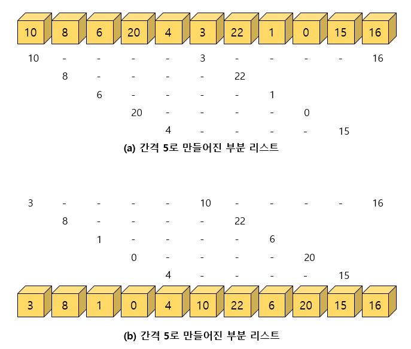

- 쉘 정렬의 첫 번째 패스가 끝나면 비슷한 방식으로 다시 부분 리스트를 구성하는데 이번에는 간격을 1/2 줄여서 입력 배열의 각 2번째 요소를 추출하여 부분 리스트를 만든다. 간격은 처음에는 n/2정도로 하고 각 패스마다 간격을 절반으로 줄이는 방식을 많이 사용한다. 쉘 정렬의 전체 과정은 다음의 표를 참조하라.

  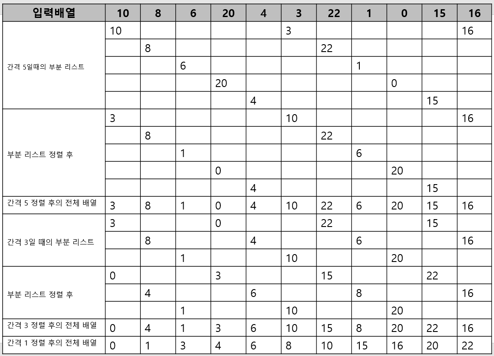


### 쉘 정렬의 구현

- gap가 간격을 나타낸다. shell_sort 함수에서는 간격이 1이 될 때까지 간격을 1/2로 줄이면서 반복한다. 부분 리스트의 개수는 gap이 된다. 각 부분 리스트에 대하여 일정한 간격으로 떨어져 있는 요소들을 삽입 정렬하는 함수인 inc_insertion_sort를 호출하였다. inc_insertion_sort 함수는 앞의 삽입 정렬 함수와 비교하여 보면 쉽게 이해할 수 있다. 만약 간격이 짝수이면 1을 더하는 것이 좋은 것으로 분석되었다. 따라서 소스에서도 짝수인 경우 간격에 1을 더해주었다.

- 쉘 정렬 프로그램

  ```c
  #include <stdio.h>
  // gab 만큼 떨어진 요소들을 삽입 정렬
  // 정렬의 범위는 first에서 last
  void inc_insertion_sort(int list[], int first, int last, int gap) {
      int i, j, key;
      for(i=first+gap; i<=last; i=i+gap) {
          key = list[i];
          for(j=i-gap; j>=first && key<list[j]; j=j-gap)
              list[j+gap] = list[j];
          list[j+gap] = key;
      }
  }
  
  void shell_sort(int list[], int n) {    // n = size
      int i, gap;
      for(gap = n/2; gap>0; gap=gap/2) {
          if((gap % 2) == 0) gap++;
          for(i=0; i<gap; i++)            // 부분 리스트의 개수는 gap
              inc_insertion_sort(list, i, n-1, gap);
      }
  }  
  
  int main() {
      int list[11] = {10, 8, 6, 20, 4, 3, 22, 1, 0, 15, 16};
      shell_sort(list, 11);
      for(int i=0; i<11; i++)
          printf("%d ", list[i]);
  }
  ```


### 쉘 정렬의 분석

- 삽입 정렬에 비하여 쉘 정렬은 2가지의 장점이 있다.
  - 연속적이지 않은 부분 리스트에서 자료의 교환이 일어나면 더 큰 거리를 이동한다. 반면 삽입 정렬에서는 한 번에 한 칸씩만 이동한다. 따라서 교환되는 아이템들이 삽입 정렬보다는 최종 위치에 더 가까이 있을 가능성이 높아진다.
  - 부분 리스트는 어느 정도 정렬이 된 상태이기 때문에 부분 리스트의 개수가 1이 되게 되면 셀정렬은 기본적으로 삽입 정렬을 수행하는 것이지만 빠르게 수행된다. 이것은 삽입정렬이 거의 정렬된 리스트에 대해서는 빠르게 수행되기 때문이다.
- 실험적인 연구를 통하여 셀 정렬의 시간 복잡도는 대략 최악의 경우에는 O(n<sup>2</sup>)이지만 평균적인 경우에는 O(n<sup>1.5</sup>)로 나타난다.


## 12.6 합병 정렬

- 우리가 앞에서 살펴본 정렬 방법들은 비효율적이지만 간단하기 때문에 입력 데이터가 많지 않을 때는 충분히 사용할 수 있는 방법이다. 그러나 입력 데이터가 많으면서 자주 정렬해야 할 필요가 있으면 이들 방법은 충분하지 못한다. 본 장에서는 앞장의 방법보다 훨씬 빠른 방법들을 소개한다.


### 합병 정렬의 개념

- 합병 정렬(merge sort)은 하나의 리스트를 두 개의 균등한 크기로 분할하고 분할된 부분 리스트를 정렬한 다음, 두 개의 정렬된 부분 리스트를 합하여 전체가 정렬된 리스트를 얻고자 하는 것이다.
  합병 정렬은 분할 정복(divide and conquer) 기법에 바탕을 두고 있다. 분할 정복 기법은 문제를 작은 2개의 문제로 분리하고 각각을 해결한 다음, 결과를 모아서 원래의 문제를 해결하는 전략이다. 분리된 문제가 아직도 해결하기 어렵다면, 즉 충분히 작지 않다면 분할 정복 방법을 연속하여 다시 적용한다.
  분할 정복 기법은 대개 순환 호출을 이용하여 구현된다. 합병 정렬은 다음의 단계들로 이루어진다.

  - 1. 분할(Divide) : 입력 배열을 같은 크기의 2개의 부분 배열로 분할한다.
    2. 정복(Conquer) : 부분 배열을 정렬한다. 부분 배열의 크기가 충분히 작지 않으면 순환 호출을 이용하여 다시 분할 정복 기법을 적용한다.
    3. 결합(Combine) : 정렬된 부분 배열들을 하나의 배열에 통합한다.

  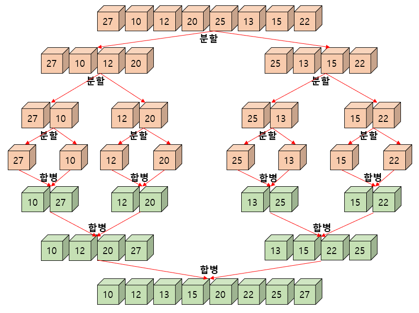


### 합병 정렬 알고리즘

- 합병 정렬 알고리즘

  ```c
  merge_sort(list, left, right) :
  
  1.	if left < right
  2.		mid = (left+right)/2;
  3.		merge_sort(list, left, mid);
  4.		merge_sort(list, mid+1, right);
  5.		merge(list, left, mid, right);
  ```

- 알고리즘 설명

  ```
  1.	만약 나우어진 구간의 크기가 1이상이면
  2.	중간 위치를 계산한다.
  3.	앞쪽 부분 배열을 정렬하기 위하여 merge_sort 함수를 순환 호출한다.
  4.	뒤쪽 부분 배열을 정렬하기 위하여 merge_sort 함수를 순환 호출한다.
  5.	정렬된 2개의 부분 배열을 통합하여 하나의 정렬된 배열로 만든다.
  ```

- 합병 정렬에서 실제로 정렬이 이루어지는 시점은 2개의 리스트를 합병(merge)하는 단계이다.
  정렬된 2개의 배열을 합병하는 알고리즘을 작성하여 보자. 합병정렬이 이 알고리즘을 이용하게 된다.
  합병 정렬 자체는 어렵지 않으나 추가적인 리스트를 필요로 한다. 합병 알고리즘은 2개의 리스트의 요소들을 처음부터 하나씩 비교하여 두개의 리스트의 요소 중에서 더 작은 요소를 새로운 리스트로 옮긴다.
  둘 중에서 하나가 끝날 때 까지 이 과정을 되풀이한다. 만약 둘 중에서 하나의 리스트가 먼저 끝나게 되면 나머지 리스트의 요소들을 전부 새로운 리스트로 복사하면 된다.

  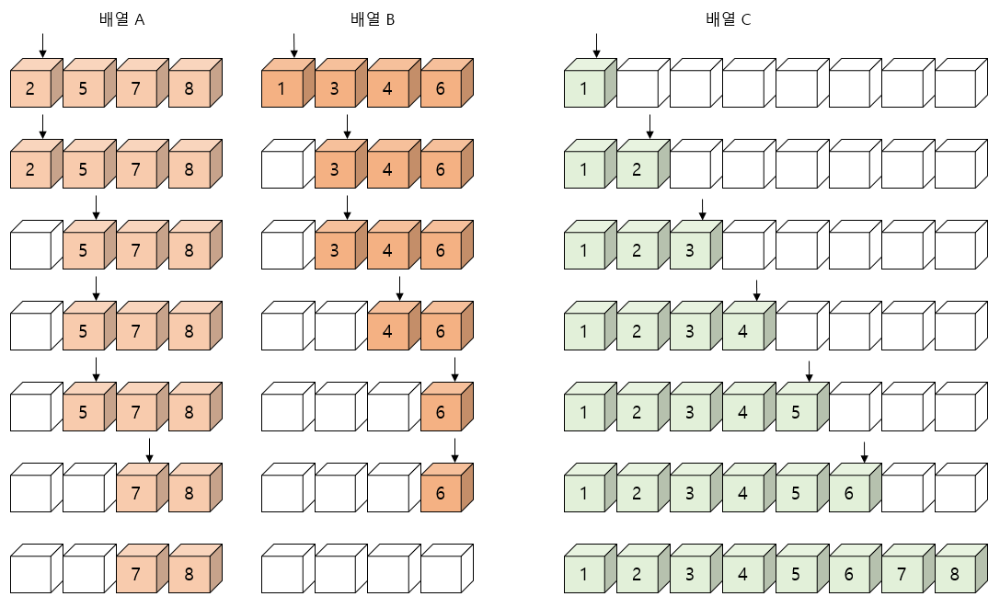

- 합병 알고리즘

  ```c
  merge(list, left, mid, last):
  // 2개의 인접한 배열 list[left..mid]와 list[mid+1..right]를 합병
  
  i<-left;
  j<-mid+1;
  k<-left;
  sorted 배열을 생성;
  while i<=mid and j<=right do
      if(list[i]<list[j])
          then
          	sorted[k]<-list[i];
  			k++;
  			i++;
  	else
          sorted[k]<-list[i];
  		k++;
  		j++;
  요소가 남아있는 부분배열을 sorted로 복사한다;
  sorted를 list로 복사한다;
  ```

- 위의 합병 알고리즘에서는 하나의 배열 안에 두 개의 정렬된 부분 리스트가 저장되어 있다고 가정하였다. 즉 첫번째 부분 리스트는 list[left]부터 list[mid]까지 이고, 두 번째 부분 리스트는 list[mid+1]부터 list[right]까지이다. 합병된 리스트를 임시로 저장하기 위해 배열 sorted를 사용한다.

  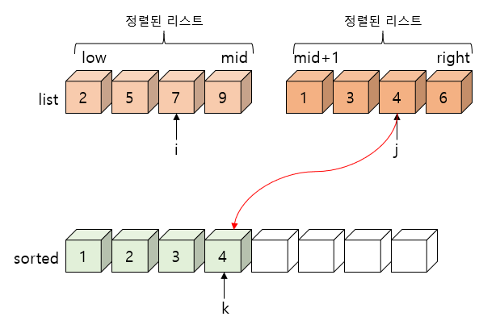


### 합병 정렬의 C언어 구현

- 합병 정렬 알고리즘을 C언어를 이용하여 구현하면 다음과 같다. merge_sort 함수에서 주어진 list 배열을 2등분하여 각각의 부분 배열에 대하여 다시 merge_sort 함수를 순환 호출한다. 이러한 과정은 결국 부분 배열에 숫자가 하나 남을 때까지 계속된다. 분할 과정이 끝나면 정렬된 부분 배열을 merge 함수를 이용하여 합병하는 과정이 시작된다. 실제로 숫자들이 정렬되는 곳은 바로 이 합병 과정이다. merge함수는 부분 배열들의 숫자를 임시 배열에 정렬된 상태로 이것을 다시 원래의 배열에 복사한다.

- merge 알고리즘의 구현

  ```c
  #define MAX_SIZE 100
  int sorted[MAX_SIZE];
  
  /* i는 정렬된 왼쪽 리스트에 대한 인덱스
     j는 정렬된 오른쪽 리스트에 대한 인덱스
     k는 정렬될 리스트에 대한 인덱스 */
  void merge(int list[], int left, int mid, int right) {
      int i, j, k, l;
      i = left; j = mid+1; k = left;
  
      /* 분할 정렬된 list의 합병 */
      while(i <= mid && j <= right) {
          if(list[i] <= list[j])
              sorted[k++] = list[i++];
          else
              sorted[k++] = list[j++];
      }
      if(i>mid)   /* 남아 있는 레코드의 일괄 복사 */
          for(l = j; j <= right; l++)
              sorted[k++] = list[l];
      else        /* 남아 있는 레코드의 일괄 복사 */
          for(l = i; l <= right; l++)
              sorted[k++] = list[l];      
      for(l = left; l <= right; l++)
          list[l] = sorted[l];
  }
  
  void merge_sort(int list[], int left, int right) {
      int mid;
      if(left < right) {
          mid = (left + right) / 2;         /* 리스트의 균등 분할 */
          merge_sort(list, left, mid);      /* 부분 리스트 정렬 */
          merge_sort(list, mid + 1, right); /* 부분 리스트 정렬 */
          merge(list, left, mid, right);    /* 합병 */
      }
  }
  ```


## 12.7 퀵 정렬

### 퀵 정렬의 개념

- 퀵 정렬(quick sort)은 평균적으로 매우 빠른 수행 속도를 자랑하는 정렬 방법이다. 퀵정렬도 분할-정복법에 근거한다. 퀵정렬은 합병 정렬과 비슷하게 전체 리스트를 2개의 부분 리스트로 분할하고, 각각의 부분 리스트를 다시 퀵정렬하는 전형적인 분할-정복법을 사용한다.
  그러나 합병 정렬과는 달리 퀵정렬은 리스트를 다음과 같은 방법에 의해 비균등하게 분할한다. 먼저 리스트 안에 있는 한 요소를 피벗(pivot)으로 선택한다. 
  여기서는 리스트의 첫 번째 요소를 피벗으로 하자. 피벗보다 작은 요소들은 모두 피벗의 왼쪽으로 옮겨지고 피벗보다 큰 요소들은 모두 피벗의 오른쪽으로 옮겨진다.
  결과적으로 피벗을 중심으로 왼쪽은 피벗보다 작은 요소들도 구성되고, 오른쪽은 피벗보다 큰 요소들로 구성된다. 이 상태에서 피벗을 제외한 왼쪽 리스트와 오른쪽 리스트를 다시 정렬하게 되면 전체 리스트가 정렬된다.

  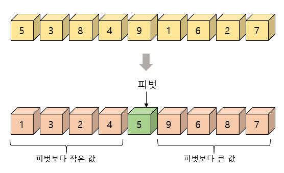

- 그러면 퀵 정렬은 어떻게 피벗을 기준으로 나누어진 왼쪽 부분 리스트와 오른쪽 부분 리스트를 정렬할까? 지금까지 많은 순환 호출의 예제가 나왔기 때문에 이미 알아차렸겠지만 합병 정렬과 마찬가지로 퀵 정렬 함수가 다시 부분 리스트에 대하여 순환 호출된다. 부분 리스트에서도 다시 피봇을 정하고 피봇을 기준으로 2개의 부분 리스트로 나누는 과정이 되풀이 된다. 부분 리스트들이 더 이상 분한이 불가능할 때까지 나누어진다.


### 퀵 정렬 알고리즘

- 앞에서 설명한 퀵 정렬을 C언어로 작성하여 보면 다음과 같다. 정렬 대상은 배열 list로서 정렬하여야 할 범위는 left에서 right까지라고 가정하자.

- 퀵 정렬

  ```c
  void quick_sort(int list[], int left, int right) {
      if(left < right) {
          int q = partition(list, left, right);
          quick_sort(list, left, q-1);
          quick_sort(list, q+1, right);
      }
  }
  ```

  - 퀵정렬에서 가장 중요한 함수가 partition 함수가 된다. partition 함수는 데이터가 들어 있는 배열 list의 left부터 right까지의 리스트를, 피봇을 기준으로 2개의 부분 리스트로 나누게 된다.
    피벗보다 작은 데이터는 모두 왼쪽 부분 리스트로, 큰 데이터는 모두 오른쪽 부분 리스트로 옮겨진다.
    이를 위하여 아래 그림의 (5, 3, 8, 4, 9, 1, 6, 2, 7) 리스트를 두개의 부분 리스트로 나누는 과정을 자세히 살펴보자.

  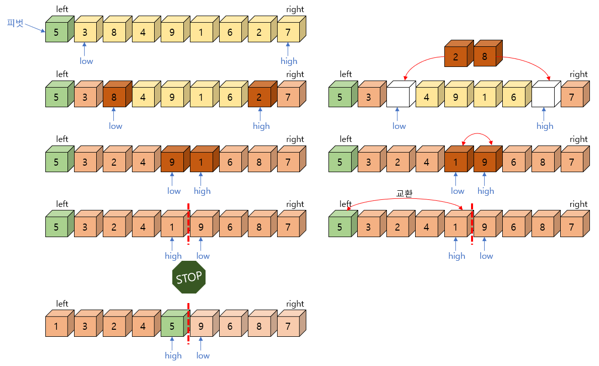

  - 먼저 간단히 하기 위하여 피봇값을 입력 리스트의 첫번째 데이터로 하자. 따라서 이 경우 피봇값은 5가 된다. 2개의 인덱스 변수 low와 high를 이용하도록 하자.
    low는 왼쪽 부분 리스트를 만드는데 사용되고 high는 오른쪽 부분 리스트를 만드는데 사용된다. 인덱스 변수 low는 왼쪽에서 오른쪽으로 탐색해가다가 피벗 보다 큰 데이터(8)을 찾으면 멈춘다.
    인덱스 변수 high는 오른쪽  끝에서부터 왼쪽으로 탐색해가다가 피벗보다 작은 데이터(2)를 찾으면 멈춘다. 탐색이 멈추어진 위치는 각 부분 리스트에 적합하지 않은 데이터이다.
    따라서 low와 high가 가르키는 두 데이터를 서로 교환한다. 이러한 탐색-교환 과정은 low와 high가 엇갈려서 지나지 않는 한 계속 반복한다.
    알고리즘이 진행되면서 언젠가는 low와 high가 엇갈려서 지나가게 되면서 멈추게 된다.
    이 때 high가 가르키는 데이터(1)와 피벗(5)을 서로 쇼환하게 되면, 피벗을 중심으로 왼쪽 리스트에는 피벗보다 작은 데이터만 존재하게 되고 오른쪽 리스트에는 피벗보다 큰 데이터만 존재하게 된다.
  - 정리하자면, low와 high를 왼쪽과 오른쪽에서 출발시켜서 부적절한 데이터를 만나게 되면 교환하고 아니면 계속 진행하다가 서로 엇갈리게 되면 멈춰서 피벗을 중앙으로 이동시키게 되면 피봇을 기준으로 2개의 리스트로 나누어지게 된다.
    이상과 같은 알고리즘을 C언어로 구현해보면 다음과 같다.

  - partition 함수

    ```c
    int partition(int list[], int left, int right) {
        int pivot, temp;
        int low, high;
        
        low = left;
        high = right + 1;
        pivot = list[left];
        do {
            do
                low++;
            while(list[low]<pivot);
            do
                high--;
            while(list[high]>pivot);
            if(low<high) SWAP(list[low], list[high], temp);
        } while(low<high);
    }
    ```

- 아래 그림의 마지막 상태는 피벗(5)을 기준으로 왼쪽 리스트는 피벗 보다 작은 데이터로 구성되고 오른족 리스트는 피벗보다 큰 데이터들로 구성되어 리스트가 분할된 것을 보여준다. 이 상태에서 피벗(5)은 전체 리스트가 정렬될 상태에서 이미 제 위치에 있음을 알 수 있다. 따라서 피벗을 제외한 왼쪽리스트 (1, 3, 2, 4)를 독립적으로 다시 퀵정렬하고, 또한 오른쪽 리스트(9, 6, 8, 7)를 다시 퀵정렬하면 아래와 같이 전체 리스트가 정렬된다. 전체 리스트가 정렬되는 과정은 아래 그림과 같다.

  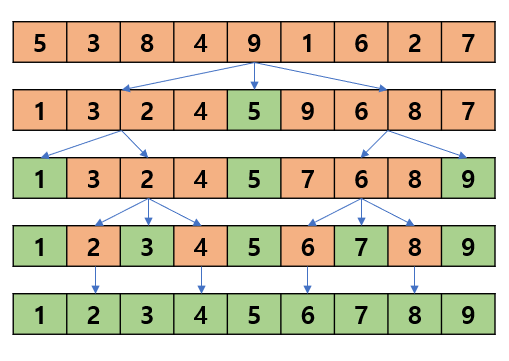


### 전체 프로그램

- 이러한 과정을 수행하는 코드를 아래의 프로그램에 보였다. left와 right는 인수로 전달된 정렬할 리스트의 범위를 뜻한다. main()에서는 n개의 요소를 전체 리스트를 퀵정렬 하기 위해 quick_sort(0, n-1)를 호출한다.

- 퀵정렬

  ```c
  #include <stdio.h>
  #include <stdlib.h>
  #include <time.h>
  
  #define MAX_SIZE 10
  #define SWAP(x, y, t) ( (t)=(x), (x)=(y), (y)=(t) )
  
  int list[MAX_SIZE];
  int n;
  
  int partition(int list[], int left, int right) {
      int pivot, temp;
      int low, high;
      
      low = left;
      high = right + 1;
      pivot = list[left];
      do {
          do
              low++;
          while(list[low]<pivot);
          do
              high--;
          while(list[high]>pivot);
          if(low<high) SWAP(list[low], list[high], temp);
      } while(low<high);
  
      SWAP(list[left], list[high], temp);
      return high;
  }
  void quick_sort(int list[], int left, int right) {
      if(left < right) {
          int q = partition(list, left, right);
          quick_sort(list, left, q-1);
          quick_sort(list, q+1, right);
      }
  }
  
  int main() {
      int i;
      n = MAX_SIZE;
      srand(time(NULL));
      for(i=0; i<n; i++)          // 난수 생성 및 출력
          list[i] = rand() % 100;
      
      quick_sort(list, 0, n-1);   // 퀵정렬 호출
      for(i=0; i<n; i++)
          printf("%d ", list[i]);
      printf("\n");
      return 0;
  }
  ```

  

### 퀵 정렬 라이브러리 함수의 사용

-  대개의 C언어 실행시간 라이브러리에 퀵 정렬 함수가 제공된다. 대개 qsort란 이름으로 제공되며 다음과 같은 함수 원형을 가진다. qsort 함수는 일반적인 구조체 배열을 정렬하기 위하여 제작되었다. 
  따라서 어떤 식으로 qsort 함수의 사용자 인터페이스를 제공하는지를 아는 것도 유용할 것이다.


#### 함수의 원형

```c
void qsort(
	void *base,			// 배열의 시작주소
    size_t num,			// 배열 요소의 개수
    size_t width,		// 배열 요소 하나의 크기(바이트 단위)
    int (*compare)(const void *, const void *)
    	// 포인터를 통하여 두개의 요소를 비교하여 비교 결과를 정수로
    	// 반환하는 함수
);
```


#### 함수의 설명

- 이 함수는 각 요사 width 바이트인 num개의 요소를 가지는 배열에 대하여 퀵정렬을 수행한다.
  입력 배열은 정렬된 값으로 덮어 씌워진다. compare는 배열 요소 2개를 서로 비교하는 사용자 제공 함수로 qsort 함수가 요소들을 비교할 때마다 다음과 같이 호출하여 사용한다.

  ```c
  compare( (void *) elem1, (void *) elem2 );
  ```

  | 반환값 |          설명          |
  | :----: | :--------------------: |
  |  < 0   |        테스트2         |
  |   0    | elem1이 elem2과 같으면 |
  |  \> 0  | elem1이 elem2보다 크면 |


#### 함수의 사용예

- qsort.c

  ```c
  #include <stdlib.h>
  #include <string.h>
  #include <stdio.h>
  
  int compare(const void *arg1, const void *arg2) {
      // 매개변수를 역참조
      if(*(double*)arg1 > *(double*)arg2) return 1;   
      else if(*(double*)arg1 == *(double*)arg2) return 0;   
      else return -1;
  }
  
  int main() {
      int i;
      double list[5] = { 2.1, 0.9, 1.6, 3.8, 1.2 };
      qsort((void *)list, (size_t)5, sizeof(double), compare);
      for(i=0; i<5; i++)
          printf("%f ", list[i]);
      return 0;
  }
  ```

  - 만약 구조체 배열을 정렬하려면 compare 함수 안에서 정렬하고자 하는 구조체 필드를 비교하여 적절한 값을 반환하면 된다.


## 12.8 히프 정렬

### 히프 정렬의 개념

- 히프는 우선순위 큐를 완전 이진 트리로 구현하는 방법으로 히프는 최댓값이나 최솟값을 쉽게 추출할 수 있는 자료 구조이다. 히프에는 최소 히프와 최대 히프가 있고 정렬에서는 최소 히프를 사용하는 것이 프로그램이 더 쉬워진다. 최소 히프는 부모 노드의 값이 자식 노드의 값보다 작다. 따라서 최소 히프의 루트 노드는 가장 작은 값을 가지게 된다. 최소 히프의 이러한 특성을 이용하여 정렬할 배열을 먼저 최소 히프로 변환한 다음, 가장 작은 원소부터 차례대로 추출하여 정렬하는 방법을 히프 정렬(heap sort)이라 한다.
  히프는 1차원 배열로 쉽게 구현될 수 있음을 기억하여야 한다. 먼저 최소 히프를 만들고 숫자들을 차례대로 삽입한 다음, 최솟값부터 삭제하면 된다.
- 자세한 내용은 PriorityQueue(우선순위 큐)를 참조하라.


## 12.9 기수 정렬

### 기수 정렬의 원리

- 이때까지의 정렬 방법들은 모두 레코드들을 비교하여 정렬한다. 따라서 비교가 불가능한 레코드들은 정렬할 수 없다. 기수 정렬은 레코드를 비교하지 않고도 정렬하는 방법이다.
  기수 정렬(radix sort)은 입력 데이터에 대해서 어떤 비교 연산도 실행하지 않고 데이터를 정렬할 수 있는 색다른 정렬 기법이다.
  정렬에 기초한 방법들은 절대 O(nlog<sub>2</sub>n)이라는 이론적인 하한선을 깰 수 없는데 반하여 기수 정렬은 이 하한선을 깰 수 있는 유일한 기법이다. 사실 기수 정렬은 O(kn)의 시간 복잡도 가지는데 대부분 k<4이하이다.
  다만 문제는 기수 정렬이 추가적인 메모리를 필요로 한다는 것인데 이를 감안하더라도 기수 정렬이 다른 정렬 기법보다 빠르기 때문에 데이터를 정렬하는 상당히 인기 있는 정렬 기법 중의 하나이다.
  기수 정렬의 단점은 정렬할 수 있는 레코드의 타입이 한정된다는 점이다. 즉 기수 정렬을 사용하려면 레코드의 키들이 동일한 길이를 가지는 숫자나 문자열로 구성되어 있어야 한다.

- 기수(radix)란 숫자의 자리수이다. 예를 들면 숫자 42는 4와 2의 두개의 자리수를 가지고 이 것이 기수가 된다.
  기수 정렬은 이러한 자리수의 값에 따라서 정렬하기 때문에 기수 정렬이라는 이름을 얻었다. 단계의 수는 데이터의 자리수의 개수와 일치한다. 기수 정렬의 동작 원리에 대하여 알아보자. 기수 정렬을 이용하여 다음과 같은 정수를 정렬한다고 가정하자. 일단 한자리로만 이루어진 수만을 먼저 고려해보자.

  (8, 2, 7, 3, 5)


- 어떻게 서로 비교를 하지 않고 정렬을 할 수 있을까? 십진수에서는 각 자리수가 0에서 9까지의 값만 가지는 것에 착안하면 다음과 같은 10개의 버킷(bucket)을 만들어서 입력 데이터를 각 자리수의 값에 따라 상자에 넣는다. 각 왼쪽 상자부터 순차적으로 버킷 안에 들어 있는 숫자를 순차적으로 읽는다. 그러면 정렬된 숫자를 얻을 수 있다.

  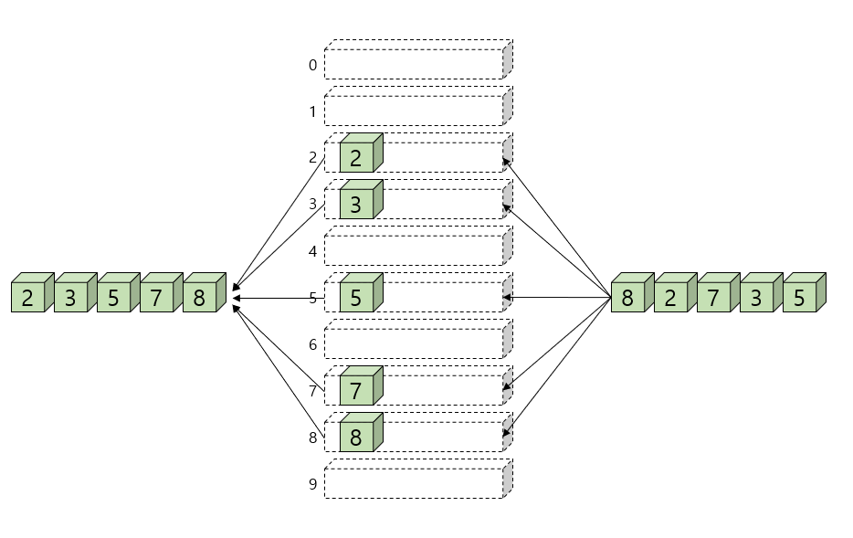

- 자 그러면 여러 자리로 이루어진 수는 어떻게 정렬해야 하는가? 예를 들면 다음과 같은 정수를 들 수 있다.

  (28, 93, 39, 81, 62, 72, 38, 26)


- 0에서 99번까지 번호가 매겨진 100개의 버킷을 사용하여 앞에서와 마찬가지로 정렬을 할 수 있다. 그러나 보다 효과적인 방법이 있다. 즉 1의 자리수와 10의 자리수를 따로 따로 사용하여 정렬을 하면 10개의 버킷만을 사용하여 2자리 정수도 정렬할 수 있다.
  그러면 어떤 자리수를 먼저 사용하여야 할까? 정답은 먼저 낮은 자리수로 정렬한 다음 차츰 높은 자리수로 정렬해야 한다는 것이다.

- 예를 들어 (28, 93, 39, 81, 62, 72, 38, 26)을 먼저 10의 자리수를 먼저 사용하고 1의 자리수를 나중에 사용하면 (28, 26, 39, 38, 61, 72, 81, 93) -> (61, 81, 72, 93, 26, 28, 38, 39)이 되어 잘못된 결과가 나온다. 그러나 1의 자리수를 먼저 사용하면 같은 버킷을 사용하더라도 올바른 결과가 나와 정렬하는 것이 가능해진다.
  아래의 그림을 참고하라.

  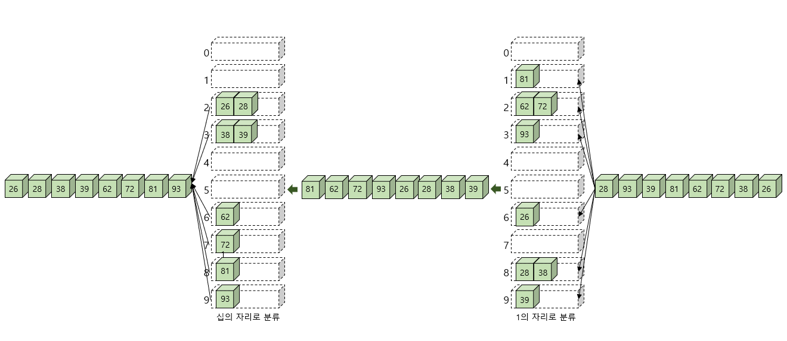


### 기수 정렬의 알고리즘

- LSD(least significant digit)는 가장 낮은 자리수이고 MSD(most significant digit)는 가장 높은 자리수이다. 의사 코드로 기수 정렬의 알고리즘을 작성하여 보면 다음과 같다.

- 기수 정렬 알고리즘

  ```c
  RadixSort(list, n):
  
  for d<-LSD의 위치 to MSD의 위치 do {
      d번째 자리수에 따라 0번부터 9번 버킷에 집어넣는다.
          버킷에서 숫자들을 순차적으로 읽어서 하나의 리스트로 합친다.
          d++;
  }
  ```

- 각각의 버킷에서 먼저 들어간 숫자들은 먼저 나와야 한다. 따라서 각각의 버킷은 큐로 구현되어야 한다. 큐로 구현되어야 리스트 상에 있는 요소들의 상대적인 순서가 유지된다. 버킷에 숫자를 집어넣는 연산은 큐의 삽입 연산이 되고 버킷에서 숫자를 읽는 연산은 삭제 연산으로 대치하면 된다.
  버킷의 개수는 키의 표현 방법과 밀접한 관계가 있다. 만약 키를 2진법을 사용하여 표현하고 정렬한다면 버킷은 2개만 있으면 된다. 또한 키가 알파벳 문자로 되어 있다면 26개의 버킷이 필요하다.
  기수정렬은 숫자로 이루어진 키의 경우에는 위와 같이 10개의 버킷을 가지고 분류할 수 있지만 만약 숫자의 이진 표현을 이용해서도 기수정렬을 할 수 있다. 예를 들어 32비트의 정수의 경우, 8비트씩 나누어 기수정렬의 개념을 적용시킬 수 있다. 이럴 경우, 필요한 상자의 수는 256개가 된다. 대신에 필요한 패스의 수는 4개로 십진수 표현보다 줄어든다.


### 기수 정렬의 구현

- 버킷으로는 큐를 사용한다. 십진수의 경우, 10개의 버킷이 필요하므로 큐도 10개의 큐가 필요하다. 현재의 2자리수로 된 정수만을 취급한다.

- 기수 정렬 프로그램

  ```c
  #include <stdio.h>
  #include <stdlib.h>
#include <time.h>
  
  #define MAX_QUEUE_SIZE 100
  typedef int element;
  typedef struct {    // 큐 타입
      element data[MAX_QUEUE_SIZE];
      int front, rear;
  } QueueType;
  
  // 오류 함수
  void error(char *message) {
      fprintf(stderr, "%s\n", message);
      exit(1);
  }
  
  // 큐 초기화 함수
  void init_queue(QueueType *q) {
      q->front = q->rear = 0;
  }
  
  // 공백 상태 검출 함수
  int is_empty(QueueType *q) {
      return (q->front == q->rear);
  }
  
  // 포화 상태 검출 함수
  int is_full(QueueType *q) {
      return ((q->rear + 1) % MAX_QUEUE_SIZE == q->front);
  }
  
  // 삽입 함수
  void enqueue(QueueType *q, element item) {
      if(is_full(q))
          error("큐가 포화상태입니다.");
      q->rear = (q->rear + 1) % MAX_QUEUE_SIZE;
      q->data[q->rear] = item;
  }
  
  // 삭제 함수
  element dequeue(QueueType *q) {
      if(is_empty(q))
          error("큐가 공백상태입니다.");
      q->front = (q->front + 1) % MAX_QUEUE_SIZE;
      return q->data[q->front];
  }
  
  #define BUCKETS 10
  #define DIGITS 2
  void radix_sort(int list[], int n) {
      int i, b, d, factor = 1;
      QueueType queues[BUCKETS];
  
      for(b=0; b<BUCKETS; b++) init_queue(&queues[b]);    // 큐들의 초기화
  
      for(d=0; d<DIGITS; d++) {
          for(i=0; i<n; i++)               // 데이터들을 자리수에 따라 큐에 삽입
              enqueue(&queues[(list[i] / factor) % 10], list[i]);
          
          for(b=i=0; b<BUCKETS; b++)      // 버킷에서 꺼내어 list로 합친다.
              while(!is_empty(&queues[b]))
                  list[i++] = dequeue(&queues[b]);
          factor *= 10;                   // 그 다음 자리수로 간다.
      }
  }
  
  #define SIZE 10
  
  int main() {
      int list[SIZE];
      srand(time(NULL));
      for(int i=0; i<SIZE; i++) // 난수 생성 및 출력
          list[i] = rand() % 100;
      
      radix_sort(list, SIZE);   // 기수 정렬 호출
      for(int i=0; i<SIZE; i++)
          printf("%d ", list[i]);
      printf("\n");
      return 0;
  }
  ```
  
  

