# 13. 탐색(Search)

## 13.1 탐색이란?

- 탐색은 기본적으로 여러 개의 자료 중에서 원하는 자료를 찾는 작업이다. 탐색을 위하여 사용되는 자료 구조는 배열, 연결 리스트, 트리, 그래프 등 매우 다양할 수 있다.
  탐색 중에서 가장 기초적인 방법은 배열을 사용하여 자료를 저장하고 찾는 것이다. 그러나 탐색 성능을 향상하고자 한다면 이진 탐색 트리와 같은 보다 진보된 방법으로 저장하고 탐색해야 한다.
- 탐색의 단위는 항목이다. 항목은 가장 간단하게는 숫자일 수도 있고 아니면 구조체가 될 수도 있다. 항목 안에는 항목과 항목을 구별시켜주는 키(key)가 존재한다. 이를 탐색키(search key)라고 한다.
  탐색이란 탐색키와 데이터로 이루어진 여러 개의 항목 중에서 원하는 탐색키를 가지고 있는 항목을 찾는 것이다.
- 이번 장에서는 배열과 연결 리스트, 이진 탐색 트리를 사용하여 항목들을 저장하고 탐색하는 방법을 배운다.
  제시되는 예제 프로그램들은 이해를 쉽게 하기 위해서 항목안의 데이터로 정수가 저장된다고 가정하였으나 이는 쉽게 구조체 등의 다른 자료형으로도 쉽게 확장할 수 있다.


## 13.2 정렬되지 않은 배열에서의 탐색

### 순차 탐색

- 순차 탐색(sequential search)은 탐색 방법 중에서 가장 간단하고 직접적인 탐색 방법이다. 순차 탐색은 정렬되지 않은 배열의 항목들을 처음부터 마지막까지 하나씩 검사하여 원하는 항목을 찾아가는 방법으로서 아래 프로그램과 같다. 탐색의 대상이 되는 배열은 list[]라고 가정하고 탐색의 범위는 low에서 high까지로 함수의 매개변수로 주어진다. 탐색 함수는 탐색에 성공하면 그 항목이 발견된 위치를 반환하고 그렇지 않으면 -1을 반환한다.

- 순차 탐색

  ```c
  int seq_search(int key, int low, int high) {
      int i;
      
      for(i=low; i<=high; i++)
          if(list[i] == key)
              return i;// 탐색에 성공하면 키 값의 인덱스 반환
      return -1;		 // 탐색에 실패하면 -1 반환
  }
  ```


### 개선된 순차 탐색

- 순차 탐색에서 비교 횟수를 줄이는 방법을 생각해 보자. 리스트의 끝을 테스트하는 비교 연산을 줄이기 위해 리스트의 끝에 찾고자 하는 키 값을 저장하고 반복문의 탈출 조건을 키 값을 찾을 때까지로 설정한다.

- 개선된 순차 탐색

  ```c
  int seq_search2(int key, int low, int high) {
      int i;
      
      list[high +1] = key;
      for(i=low; list[i] != key; i++);	// 키값을 찾으면 종료
      if(i==(high+1)) return -1;			// 탐색 실패
      else return i;						// 탐색 성공
  }
  ```

  

## 13.3 정렬된 배열에서의 탐색

- 정렬되어 있지 않은 배열의 순차 탐색은 이해하고 구현하기는 쉽다. 만약 배열의 항목이 얼마 되지 않는 경우에는 충분히 가능한 알고리즘이다. 그러나 배열이 많은 항목을 가지는 경우에는 순차 탐색은 너무나 비효율적인 방법이다. 예를 들어 10개중의 하나를 찾는 것은 순차 탐색으로 가능하지만 10000000개 정도라면 상당한 시간이 소요된다. 따라서 보다 빠른 방법이 요구된다. 아주 효율적인 탐색 알고리즘인 이진 탐색을 살펴보자.


### 정렬된 배열에서의 이진 탐색

- 정렬된 배열의 탐색에는 이진 탐색(binary search)이 가장 적합하다. 이진 탐색은 배열의 중앙에 있는 값을 조사하여 찾고자 하는 항목이 왼쪽 또는 오른쪽 부분 배열에 있는지를 알아내어 탐색의 범위를 반으로 줄인다.

  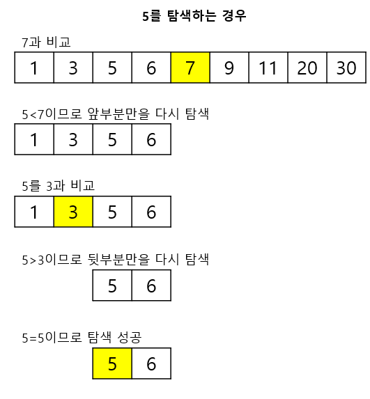


### 이진 탐색 구현(순환 호출 버전)

- 어떤 시점에서 탐색되어야할 범위는 low에서 high까지이다. 맨 처음에는 low가 0, high가 n-1이 될 것이다. 그리고 순환 호출에는 항상 순환 호출을 끝내기 위한 코드가 들어가야 한다. 만약 이러한 코드가 없다면 무한히 호출이 이루어질 것이다. 이 문제에서는 탐색 범위가 1보다 작다면 즉 탐색해야 될 항목이 없는 경우에는 순환 호출을 하지 않으면 된다.

- 순환 호출을 이용한 이진탐색

  ```c
  #define MAX_SIZE 10
  typedef int element;
  element list[MAX_SIZE];
  int search_binary(int key, int low, int high) {
      int middle;
  
      if(low <= high) {
          middle = (low + high) / 2;
          if(key == list[middle])         // 탐색 성공
              return middle;
          else if(key < list[middle])     // 왼쪽 부분리스트 탐색
              return search_binary(key, low, middle-1);
          else                            // 오른쪽 부분리스트 탐색
              return search_binary(key, middle+1, high);
      }
      return -1;
  }
  ```


### 이진 탐색 구현(반복적인 버전)

- 이진 탐색은 재귀 호출로도 구현할 수 있지만 반복문을 사용하여 구현할 수도 있다. 효율성을 위해서는 반복 구조를 사용하는 것이 더 낫다.

- 반복을 이용한 이진탐색

  ```c
  #define MAX_SIZE 10
  typedef int element;
  element list[MAX_SIZE];
  int search_binary2(int key, int low, int high) {
      int middle;
  
      while(low <= high) {    // 아직 숫자들이 남아있으면
          middle = (low + high) / 2;
          if(key == list[middle])
              return middle;
          else if(key > list[middle])
              low = middle + 1;
          else
              high = middle - 1;
      }
      return -1;              // 발견되지 않음
  }
  ```


### 정렬된 배열에서의 색인 순차 탐색

- 색인 순차  탐색(indexed sequential search) 방법은 인덱스(index)라 불리는 테이블을 사용하여 탐색의 효율을 높이는 방법이다. 인덱스 테이블은 주 자료 리스트에서 일정 간격으로 발췌한 자료를 가지고 있다.
  인덱스 테이블에 m개의 항목이 있고, 주 자료 리스트의 데이터 수가 n이면 각 인덱스 항목은 주 자료 리스트의 각 n/m번째 데이터를 가지고 있다. 이 때 주 자료 리스트와 인덱스 테이블은 모두 정렬되어 있어야 한다.

  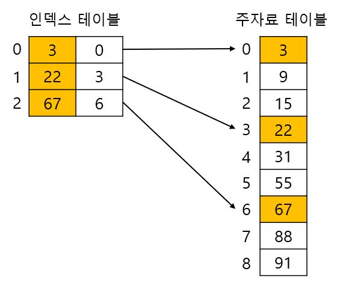

- 색인 순차 탐색 알고리즘은 우선 인덱스 테이블에서 index[i] <= key < index[i+1]을 만족하는 항목을 찾는다. 인덱스 테이블에서 위의 조건을 만족하는 항목으로부터 주 자료 리스트에서 순차 탐색을 수행한다.

- 색인 순차 탐색

  ```c
  #define INDEX_SIZE 256
  typedef struct {
      int key;
      int index;
  } itable;
  itable index_list[INDEX_SIZE];
  
  // INDEX_SIZE는 인덱스 테이블의 크기, n은 전체 데이터의 수
  int search_index(int key, int n) {
      int i, low, high;
  
      // 키 값이 리스트 범위 내의 값이 아니면 탐색 종료
      if(key<list[0] || key>list[n-1])
          return -1;
  
      // 인덱스 테이블을 조사하여 해당키의 구간 결정
      for(i=0; i<INDEX_SIZE; i++)
          if(index_list[i].key <= key &&
          index_list[i+1].key > key)
          break;
      if(i == INDEX_SIZE) {   // 인덱스 테이블의 끝이면
          low = index_list[i-1].index;
          high = n;
      }
      else {
          low = index_list[i].index;
          high = index_list[i+1].index;
      }
      // 예상되는 범위만 순차 탐색
      return seq_serch(key, low, high);
  }
  ```


### 보간 탐색

- 보간 탐색(interpolation search)은 사전이나 전화번호부를 탐색하는 방법과 같이 탐색키가 존재할 위치를 예측하여 탐색하는 방법이다 이는 우리가 사전을 찾을 때 'ㅎ'으로 시작하는 단어는 사전의 뒷부분에서 찾고 'ㄱ'으로 시작하는 단어는 앞부분에서 찾는 것과 같은 원리이다. 보간 탐색은 이진 탐색과 유사하나 리스트를 반으로 분할하지 않고 불균등하게 분할하여 탐색한다.
  이진 탐색에서 탐색 위치는 항상 (low+high)/2이나, 보간 탐색에서는 찾고자하는 키값과 현재의 low, high 위치의 값을 고려하여 다음과 같이 다음 탐색위치를 결정한다.

  - 탐색 위치 = ( k-list[low] / ( list[high]-list[low] ) ) = <sup>*</sup>(high-low)+low

- 여기에서 k는 찾고자 하는 키 값을, low나 high는 각각 탐색할 범위의 최소, 최대 인덱스 값을 나타낸다.
  즉, 위의 식은 탐색 위치를 결정할 때 찾고자 하는 키 값이 있는 곳에 근접하게 되도록 가중치를 주는 것이다.
  위의 식은 다음의 비례식을 정리한 것으로 생각할 수 있다. 즉 값과 위치는 비례한다는 가정에서 탐색캐ㅣ에 해당되는 위치를 비례식으로 구한 것이다.

  - ( list[high]-list[low] ) : ( k-list[low] ) = ( high-low ) : ( 탐색 위치-low )

  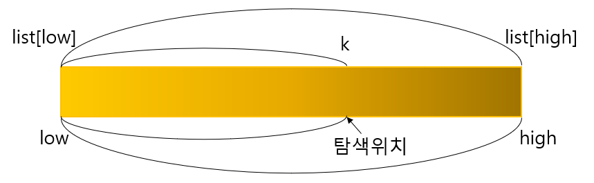

- 간단한 예를 들어보자. (3, 9, 15, 22, 31, 55, 67, 88, 89, 91)으로 구성된 리스트에서 탐색 구간이 0-9이고, 찾을 키 값이 55인 경우를 살펴보자. 주어진 식에 의해 탐색위치를 구해보면 다음과 같다.
  - 탐색 위치 = (55-3)/(91-3)*(9-0)+0=5.31 --> 5
- 여기서 주의해야 할 점은 계산되어 나오는 값은 일반적으로 실수이며 따라서 이 실수를 정수로 변환하여 주어야 한다. 보통은 소수점 이하를 버리는 방법을 사용한다.

- 보간탐색

  ```c
  #define MAX_SIZE 10
  typedef int element;
  element list[MAX_SIZE];
  int interpol_search(int key, int n) {
      int low, high, j;
  
      low = 0;
      high = n - 1;
      while((list[high] >= key) && (key > list[low])) {
          j = ((float)(key - list[low]) / (list[high] - list[low]) * (high - low)) + low;
          if(key > list[j]) low = j + 1;
          else if(key < list[j]) high = j - 1;
          else low = j;
      }
      if(list[low] == key) return (low);  // 탐색성공
      else return -1; // 탐색실패
  }
  ```


## 13.4 이진 탐색 트리

- 먼저 앞에서 설명된 이진 탐색(binary search)과 이진 탐색 트리(binary search tree)와의 차이점을 살펴보자. 이진 탐색과 이진 탐색 트리는 근본적으로 같은 원리에 의한 탐색 구조이다.
  하지만 이진 탐색은 자료들이 배열에 저장되어 있으므로 삽입과 삭제가 상당히 힘들다. 즉 자료를 삽입하고 삭제할 때마다 앞뒤의 원소들을 이동시켜야 한다.  반면에 이진 탐색 트리는 비교적 빠른 시간 안에 삽입과 삭제를 끝마칠 수 있는 구조로 되어 있다.
  따라서 삽입과 삭제가 심하지 않은 정적인 자료를 대상으로 탐색이 이루어지는 경우에는 이진 탐색도 무난한 방법이나 삽입, 삭제가 빈번히 이루어진다면 반드시 이진 탐색 트리를 사용하여야 한다.

  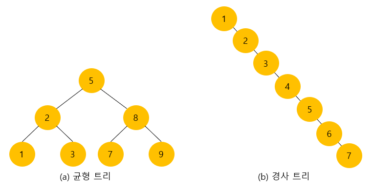

- (a)의 이진 탐색 트리에서 최대 비교 횟수는 3회인 반면, (b)의 트리에서는 7회가 된다. 
  만약 이진 탐색 트리가 (b)와 같이 경사 트리가 되면 탐색 시간은 순차 탐색과 같게 되어 아주 효율이 떨어지게 된다. 따라서 이진 탐색 트리에서는 균형을 유지하는 것이 무엇보다 중요하다.
- 따라서 이번 절에서는 스슷로 균형트리를 만드는 AVL트리를 비롯한 몇 가지 탐색 트리들을 살펴본다. 그러나 이들은 상당히 복잡하기 때문에 전체의 토픽을 다루지는 않는다. 또한 설명을 간단하게 하기 위하여 트리의 노드들에 저장된 자료는 정수라고 가정하자.


## 13.5 AVL트리

- AVL 트리는 Adelson-Velskii와 Landis에 의해 1962년에 제안된 트리로서 각 노드에서 왼쪽 서브 트리의 높이와 오른쪽 서브 트리의 높이 차이가 1이하인 이진 탐색 트리를 말한다.
  AVL트리는 트리가 비균형 상태로 되면 스스로 노드들을 재배치 하여 균형 상태로 만든다. 따라서 AVL 트리는 균형 트리가 항상 보장되기 때문에 탐색이 O(log n)시간 안에 끝나게 된다. 또한 삽입과 삭제 연산도 O(log n)시간 안에 할 수 있다.

- 아래 그림에서 (a)는 모든 노드에서 양쪽 서브 트리의 높이의 차이가 1이하이다. 그러나 (b)는 노드 7에서 왼쪽 서브 트리의 높이가 2인 반면 오른쪽 서브 높이가 0이므로 높이 균형을 이루지 못하고 따라서 AVL트리가 아니다.

- 설명을 쉽게 하기 위하여 먼저 균형 인수(balance factor)를 먼저 정의하여 보자. 균형 인수는(왼쪽 서브 트리의 높이 - 오른쪽 서브 트리의 높이)로 정의된다. 모든 노드의 균형 인수가 +-1이하이면 AVL 트리이다. 

  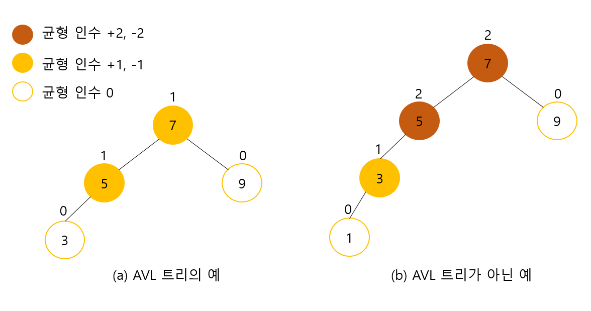

 

### AVL 트리의 탐색 연산

- AVL 트리도 탐색에서는 일반적인 이진 탐색 트리와 동일하다. 따라서 시간 복잡도는 O(log n)이다.


### AVL 트리의 삽입 연산

- 균형을 이룬 이진 탐색 트리에서 균형 상태가 깨지는 것은 삽입 연산과 삭제 연산 시이다. 삽입 연산 시에는 삽입되는 위치에서 루트까지의 경로에 있는 조상 노드들의 균형 인수에 영향을 줄 수 있다.
  따라서 즉 새로운 노드의 삽입 후에 불균형 상태로 변한 가장 가까운 조상 노드, 즉 균형 인수가 +-2가 된 가장 가까운 조상 노드의 서브 트리들에 대하여 다시 균형을 잡아야 한다.
  그외의 다른 노드들은 일체 변경할 필요가 없다. 예를 들어 아래 그림(a)는 균형을 이룬 AVL트리이다.
  여기에 정수 1을 삽입하면 그림(b)처럼 노드 5와 노드 7이 균형 인수가 2가되어 균형이 깨지게 된다. 따라서 여기서는 균형 인수가 2가 된 가장 가까운 조상 노드인 노드 5부터 그 아래에 있는 노드들을 다시 배치하여 균형 상태로 만들어야 한다.

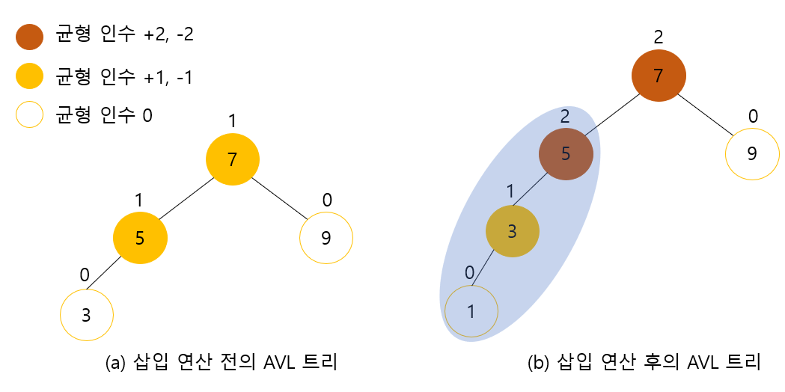

- 그러면 어떻게 하면 균형이 깨진 트리를 다시 균형 있게 만들 수 있을까? 이를 해결하는 방법은 새로운 노드부터 균형 인수가 +-가 된 가장 가까운 조상 노드까지를 회전시키는 것이다.
  위의 그림의 경우 노드 1, 3, 5를 오른쪽으로 회전시키면 아래 그림처럼 되어서 다시 균형트리가 된다. 다른 노드들은 변경시키지 않음을 유의하라.
  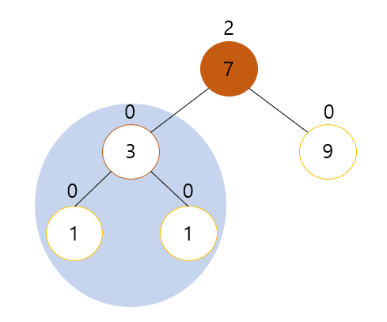


### 4가지의 경우

- AVL 트리에 새로운 노드를 추가하면 균형이 깨어질 수 있다. 이때는 트리를 부분적으로 회전하여 균형 트리로 되돌려야 한다. 균형이 깨지는 경우에는 다음의 4가지의 경우가 있다. 새로 삽입된 노드 J로부터 가장 가까우면서 균형 인수가 +-2가 된 조상 노드를 X라고 하자.

  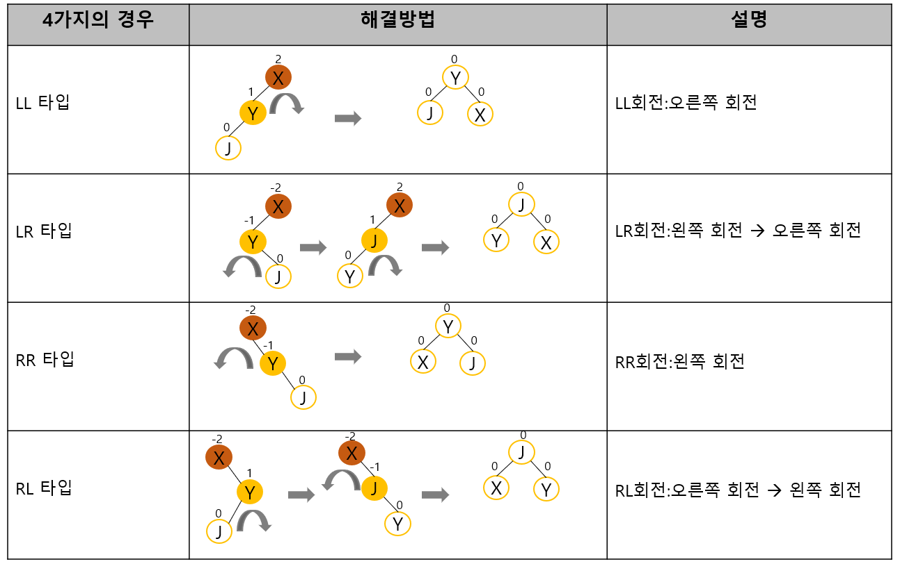

- 각각의 경우에 대하여 좀 더 자세히 살펴보자.


### LL 타입

- 노드 X의 왼쪽 자식의 왼쪽에 노드가 추가됨으로 해서 발생한다. 노드들을 오른쪽으로 회전시키면 된다.

  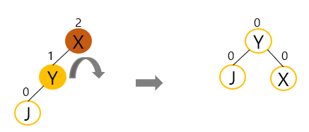


### RR 타입

- 노드 X의 오른쪽 자식의 오른쪽에 노드가 추가됨으로 해서 발생한다. 노드들을 왼쪽으로 회전시키면 된다.

  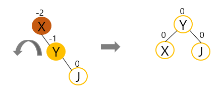


### RL 타입

- 노드 X의 오른쪽 자식의 왼쪽에 노드가 추가됨으로 해서 발생한다. RL 타입은 균형 트리를 만들기 위하여 2번의 회전이 필요하다.

  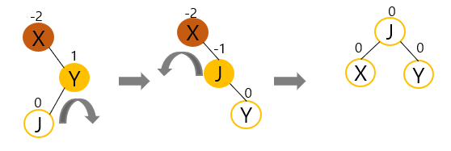


### LR 타입

- 노드 X의 왼쪽 자식의 왼쪽에 노드가 추가됨으로 해서 발생한다. LR 타입도 균형 트리를 만들기 위하여 2번의 회전이 필요하다.

  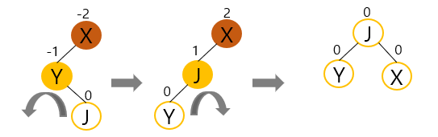


### AVL 트리의 정의

- AVL 트리를 구현해보자. 먼저 유의할 점은 AVL 트리도 이진 탐색 트리의 일종이란 점이다. 따라서 노드의 구조는 이진 탐색 트리와 동일하게 왼쪽과 오른쪽 자식을 가리키는 포인터와 데이터가 저장되어 있는 필드로 구성된다. 여기서는 데이터는 단순히 정수라고 가정하였다.

- AVL트리 구현 #1

  ```c
  #include <stdio.h>
  #include <stdlib.h>
  
  // AVL 트리 노드 정의
  typedef struct _AVLNode {
      int key;
      struct _AVLNode *left;
      struct _AVLNode *right;
  } AVLNode;
  ```

  

### rotate_right() 함수 구현

- AVL 트리를 구현하려면 2가지의 기본 회전 함수가 필요하다. 왼쪽으로 회전시키는 함수 rotate-left()와 오른쪽으로 회전시키는 함수 rotate-right()을 작성한다. 이중에서 rotate-right() 함수를 살펴보자. rotate-right() 함수는 주어진 트리를 다음과 같이 오른쪽으로 회전시키는 함수이다.

  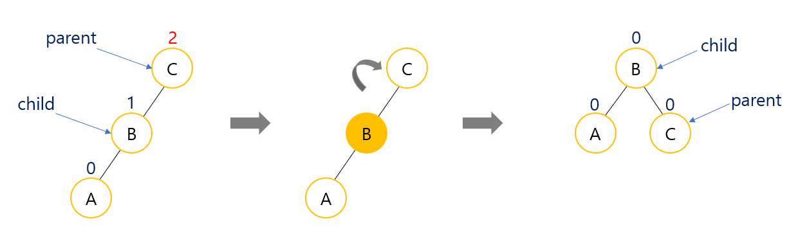

- 모든 것은 포인터로 되어 있으므로 포인터만 이동시키면 된다.

- AVL트리 구현 #2

  ```c
  // 오른쪽으로 회전시키는 함수
  AVLNode *rotate_right(AVLNode *parent) {
      AVLNode *child = parent->left;
      parent->left = child->right;
      child->right = parent;
      //새로운 루트를 반환
      return child;
  }
  ```


### rotate_left() 함수 구현

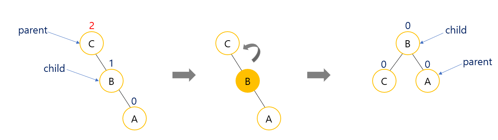

```c
// 왼쪽으로 회전시키는 함수
AVLNode *rotate_left(AVLNode *parent) {
    AVLNode *child = parent->right;
    parent->right = child->left;
    child->left = parent;
    // 새로운 루트를 반환
    return child;
}
```


### 트리의 높이 계산

- AVL 트리의 구현에서 중요한 것은 트리의 높이를 측정하는 것이다. 트리의 높이 계산은 순환 호출을 이용하여 구현된다. 즉, 루트 노드의 왼쪽 서브 트리와 오른쪽 서브 트리에 대하여 각각 순환 호출을 하여 각각의 높이를 구한 다음, 이들 중에서 더 큰 값에 1을 더하면 트리의 높이가 된다.
  또한 양쪽 서브 트리의 높이의 차이는 각각의 서브트리에 대하여 높이를 구한 다음, 왼쪽 서브 트리의 높이에서 오른쪽 서브 트리의 높이를 빼면 구할 수 있다.

- AVL트리 구현 #3

  ```c
  // 트리의 높이를 반환
  int get_height(AVLNode *node) {
      int height = 0;
      
      if(node != NULL)
          height = 1 + max(get_height(node->left), get_height(node->right));
      return height;
  }
  // 노드의 균형 인수를 반환
  int get_balance(AVLNode *node) {
      if(node == NULL) return 0;
      
      return get_height(node->left) - get_height(node->right);
  }
  ```


### 새로운 노드 추가 함수

- 새로운 노드가 추가되면 트리의 균형이 깨질 수 있다. 이때 오른쪽 회전과 왼쪽 회전을 이용하여 트리의 균형을 맞춘다. 이중 회전은 rotate_left()와 rotate_right()를 이어서 부르면 된다. 소스의 주석을 참조하여 이해해보자.

  ```c
  // AVL 트리에 새로운 노드 추가 함수
  // 새로운 루트를 반환한다.
  AVLNode *insert(AVLNode *node, int key) {
      // 이진 탐색 트리의 노드 추가 수행
      if(node == NULL) // 이진 탐색 트리와 같이 탐색이 실패한 위치가 삽입 위치가 된다.
          return (create_node(key));
      
      if(key < node->key)
          node->left = insert(node->left, key);
      else if(key > node->key)
          node->right = insert(node->right, key);
      else	// 동일한 키는 허용되지 않음
          return node;
      
      // 노드들의 균형인수 재계산
      int balance = get_balance(node);	// 균형 인수를 계산한다.
      
      // LL 타입 처리
      if(balance > 1 && key < node->left->key)
          return rotate_right(node);
      
      // RR 타입 처리
      if(balance < -1 && key > node->right->key)
          return rotate_left(node);
      
      // LR 타입 처리
      if(balance > 1 && key > node->left->key) {
          node->left = rotate_left(node->left);
          return rotate_right(node);
      }
      
      // RL 타입 처리
      if(balance < -1 && key < node->right->key) {
          node->right = rotate_right(node->right);
          return rotate_left(node);
      }
      return node;
  }
  ```


### 전체 프로그램

- AVL트리 전체 프로그램

  ```c
  #include <stdio.h>
  #include <stdlib.h>
  #define max(a, b)	(((a) > (b)) ? (a) : (b))
   
  typedef struct _node
  {
  	int data;
  	struct _node *left_node;
  	struct _node *right_node;
  }tree_node;
   
  tree_node *root;
   
  tree_node *tree_ll(tree_node *p)
  {
  	tree_node *child;
   
  	child = p->left_node;
  	p->left_node = child->right_node;
  	child->right_node = p;
  	return child;
  }
   
  tree_node *tree_rr(tree_node *p)
  {
  	tree_node *child;
   
  	child = p->right_node;
  	p->right_node = child->left_node;
  	child->left_node = p;
  	return child;
  }
   
  tree_node *tree_lr(tree_node *p)
  {
  	tree_node *child;
   
  	child = p->left_node;
  	p->left_node = tree_rr(child);
  	return tree_ll(p);
  }
   
  tree_node *tree_rl(tree_node *p)
  {
  	tree_node *child;
   
  	child = p->right_node;
  	p->right_node = tree_ll(child);
  	return tree_rr(p);
  }
   
  int get_height(tree_node *node)
  {
  	int height;
   
  	height = 0;
  	if (node != NULL) {
  		height = 1 + max(get_height(node->left_node), get_height(node->right_node));
  	}
  	return height;
  }
   
  int get_balance(tree_node *node)
  {
  	if (node == NULL) {
  		return 0;
  	}
  	return get_height(node->left_node) - get_height(node->right_node);
  }
   
  tree_node *tree_balance(tree_node *node)
  {
  	int height;
   
  	height = get_balance(node);
  	if (height > 1) {
  		if (get_balance(node->left_node) > 0) {
  			printf("LL\n");
  			node = tree_ll(node);
  		}
  		else {
  			printf("LR\n");
  			node = tree_lr(node);
  		}
  	}
  	else if (height < -1) {
  		if (get_balance(node->right_node) < 0) {
  			printf("RR\n");
  			node = tree_rr(node);
  		}
  		else {
  			printf("RL\n");
  			node = tree_rl(node);
  		}
  	}
  	return node;
  }
   
  tree_node *tree_insert(tree_node *root,int data)
  {
  	if (root == NULL) {
  		root = (tree_node*)malloc(sizeof(tree_node));
  		if (root == NULL) {
  			perror("메모리 할당 실패 \n");
  			exit(-1);
  		}
  		root->data = data;
  		root->left_node = root->right_node = NULL;
  	}
  	else if (root->data > data) {
  		root->left_node = tree_insert(root->left_node,data);
  		root = tree_balance(root);
  	}
  	else if (root->data < data) {
  		root->right_node = tree_insert(root->right_node,data);
  		root = tree_balance(root);
  	}
  	else {
  		printf("중복된 data로 인하여 삽입 실패 \n");
  	}
  	return root;
  }
   
  void tree_print(tree_node *root)   //전위 순회로 구현
  {
  	if (root != NULL) {
  		printf("%d ",root->data);
  		tree_print(root->left_node);
  		tree_print(root->right_node);
  	}
  }
   
  int main()
  {
   
      root = tree_insert(root, 10);
      root = tree_insert(root, 20);
      root = tree_insert(root, 30);
      root = tree_insert(root, 40);
      root = tree_insert(root, 50);
      root = tree_insert(root, 29);
  	tree_print(root);	
  	printf("\n");
  
  	return 0;
  }
  ```

  