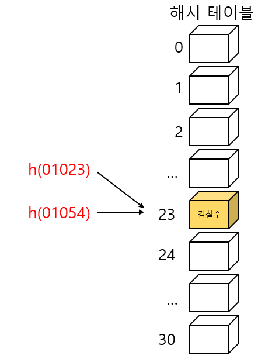
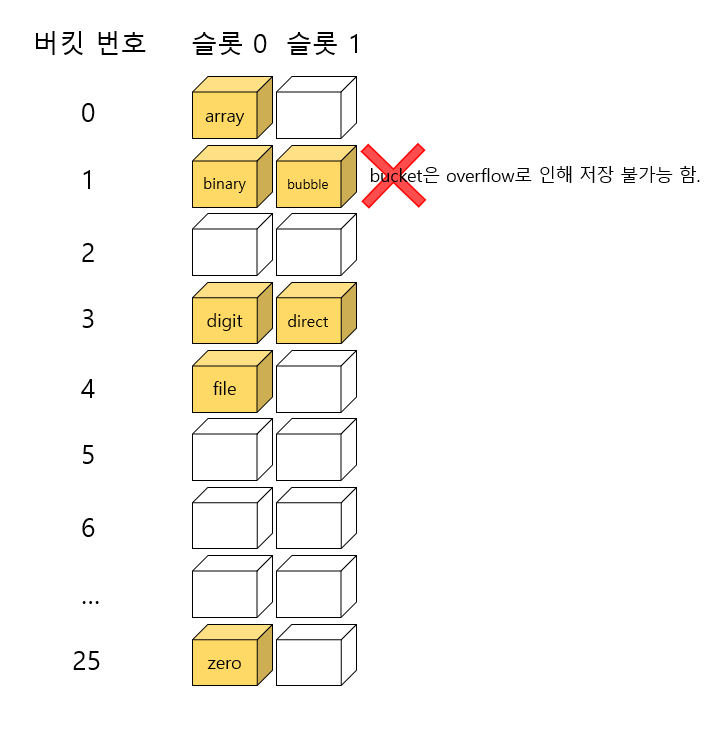
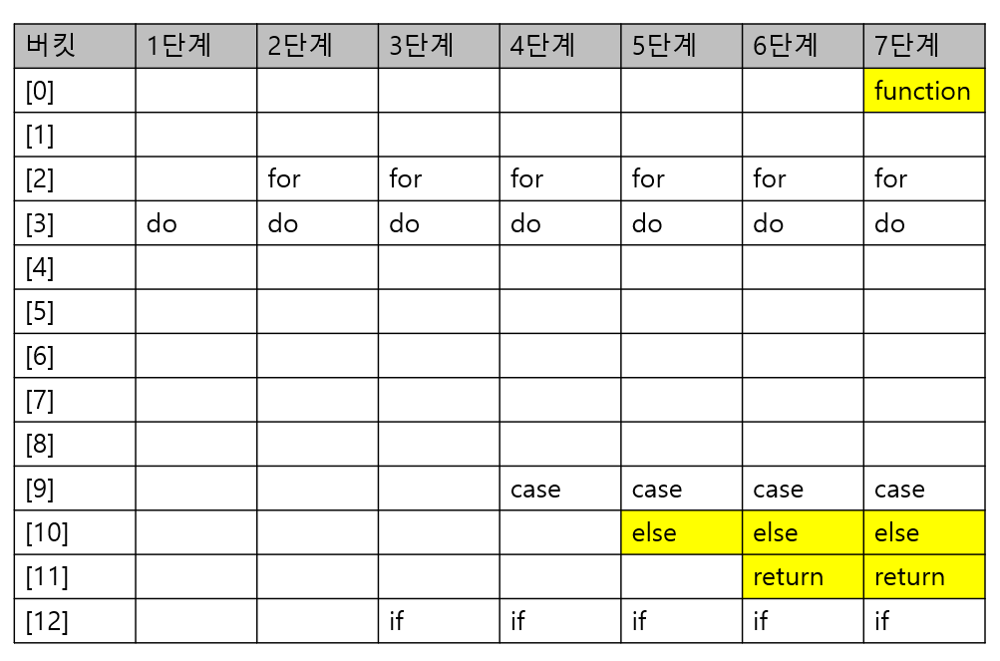
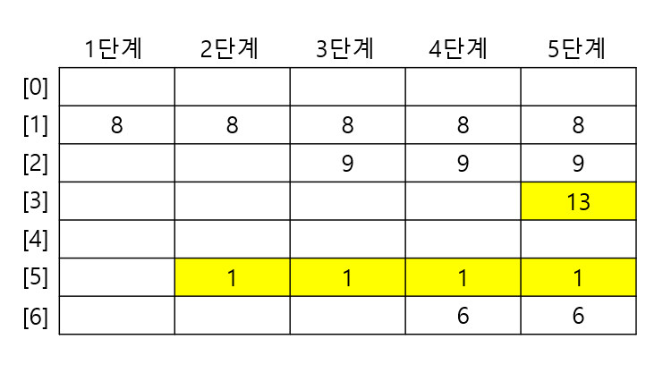
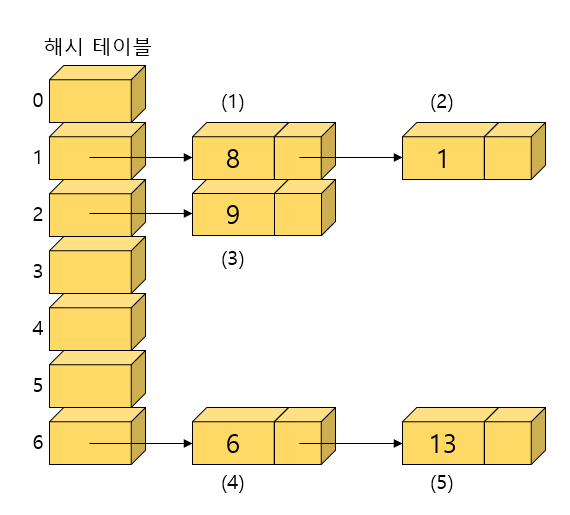

# 14. 해싱(Hashing)

## 14.1 해싱이란?

- 지금까지 배운 선형 탐색이나 이진 탐색은 모두 키를 저장된 키값과 반복적으로 비교함으로써 탐색하고자 하는 항목에 접근한다. 이런 방법들은 최대 가능한 시간 복잡도가 <strong>O(log n)</strong>에 그친다. 이정도의 시간 복잡도만 되어도 괜찮은 응용도 있지만, 어떤 응용에서는 더 빠른 탐색 알고리즘을 요구한다.
  예를 들어 전화번호로 주소를 확인하는 긴급 출동 시스템에서는 빠른 검색이 필수적일 것이다. 이번 장에서 학습하는 해싱은 <strong>O(1)</strong>의 시간 안에 탐색을 끝마칠 수도 있다.
- 해싱은 키(key)에 산술적인 연산을 적용하여 항목이 저장되어 있는 테이블의 주소를 계산하여 항목에 접근한다. 이렇게 키에 대한 연산에 의해 직접 접근이 가능한 구조를 해시 테이블(hash table)이라 부르며, 해시 테이블을 이용한 탐색을 해싱(hashing)이라 한다. 해싱은 많은 응용 프로그램에서 사용된다. 예를 들어서 컴파일러가 사용하는 심볼 테이블, 철자 검사기, 데이터베이스 등에서 해싱을 사용한다.

- 해싱은 물건을 잘 정리하는 것과 같다. 각 물건마다 고유한 위치가 있고 그 위치에 그 물건을 보관하는 것이다. 그 물건이 필요하면 바로 그 위치를 찾아가면 된다. 해싱은 보통 "사전(dictionary)"이라는 자료 구조를 구현할 때에 최상의 선택이 된다. 해싱에 대하여 구체적으로 진행하기 전에 먼저 추상 자료형 "사전"에 대하여 살펴보자.


## 14.2 추상 자료형 사전

### 사전의 개념

- 사전(dictionary)은 (키, 값)쌍의 집합이다. 사전은 키와 관련된 값을 동시에 저장하는 자료 구조이다. (키, 값) 쌍을 저장할 수도 있고 (키, 값)쌍을 삭제할 수도 있으며 키를 가지고 값을 검색할 수 있다. 사전은 맵(map)이나 테이블(table)로 불리기도 한다.
- 키(key) : 사전의 단어처럼 항목과 항목을 구별시켜주는 것
- 값(value) : 단어의 설명에 해당한다.


### 사전의 연산

- 추상 자료형 Ditionary

  ```
  객체 : 일련의 (key, value) 쌍의 집합
  연산 :
  	add(key, value) ::= (key, value)를 사전에 추가한다.
  	delete(key) ::= key에 해당되는 (key, value)를 찾아서 삭제한다. 관련된 value를 반환한다.						만약 탐색이 실패하면 NULL을 반환한다.
  	search(key) ::= key에 해당되는 value를 찾아서 반환한다. 만약 탐색이 실패하면 NULL을 반환
  					한다.
  ```

- 사전을 효율적으로 구현하기 위해서는 이들 3가지 연산을 효율적으로 구현하여야 한다. 우리는 이진 탐색 트리를 가지고도 추상자료형 사전을 구현할 수 있다. 만약 이진 탐색 트리를 사용한다면 최악의 경우, 시간 복잡도는 O(n)이 될 것이다. 사전 구조를 가장 효율적으로 구현할 수 있는 방법은 이번 장에서 기술할 해싱이다. 해싱은 키의 비교가 아닌 키에 수식을 적용시켜서 바로 키가 저장된 위치를 얻는 방법이다.


## 14.3 해싱의 구조

- 해싱의 기본적인 아이디어는 간단하다. 만약 어떤 회사의 직원이 100명이라고 하자. 100명의 직원들은 0에서 99까지의 아이디를 부여받는다. 직원들에 대한 정보를 가장 빠르게 저장하고 탐색하려면 어떻게 해야 할까?
  단순히 크기가 100인 배열을 만들면 된다. 자료를 저장하거나 탐색하려면 직원의 아이디를 키(배열의 인덱스)로 생각하고 단지 배열의 특정 요소를 읽거나 쓰면 된다.

- 이들 연산들의 시간 복잡도는 명백하게 O(1)이다. 즉 상수 시간 안에 종료할 수 있다. 그러나 현실적으로는 탐색 키들이 문자열이거나 매우 큰 숫자이기 때문에 탐색 키를 직접 배열의 인덱스로 사용하기에는 무리가 있으므로 각 탐색 키를 작은 정수로 사상(mapping)시키는 어떤 함수가 필요하다.

  | 키(key) |      값(value)      |
  | :-----: | :-----------------: |
  |    0    | 직원 #0의 인사기록  |
  |    1    | 직원 #1의 인사기록  |
  |    2    | 직원 #2의 인사기록  |
  |   ...   |         ...         |
  |   98    | 직원 #98의 인사기록 |
  |   99    | 직원 #99의 인사기록 |

- 해싱에서는 자료를 저장하는데 배열을 사용한다. 배열은 단점도 있지만 만약 원하는 항목이 들어 있는 위치를 알고 있다면 매우 빠르게 자료를 삽입하거나 꺼낼 수 있다. 이 경우, 배열의 다른 요소들에는 전혀 접근할 필요가 없다. 해싱이란 이런식으로 어떤 항목의 키만을 가지고 바로 항목이 들어있는 배열의 인덱스를 결정하는 기법이다.
- 해시 함수(hash function)란 키를 입력으로 받아 해시 주소(hash address)를 생성하고 이 해시 주소를 해시 테이블(hash table)의 인덱스로 사용한다. 이 배열의 인덱스 위치에 자료를 저장할 수도 있고 거기에 저장된 자료를 꺼낼 수도 있다. 예를 들어 영어사전에서는 단어가 키가 되고 이 단어를 해싱 함수를 이용하여 적절한 정수 i로 변환한 다음, 배열 요소 h[i]에 단어의 정의를 저장하는 것이다.


### 실제의 해싱

- 실제로는 해시 테이블의 크기가 제한되어 있으므로 하나의 키당 해시테이블에서 하나의 공간을 할당할 수가 없다. 보통의 경우에 키는 매우 많고, 해시 테이블의 크기는 상당한 제약을 받는 것이 일반적인 상황이다.
  예를 들어 주민등혹번호가 키라고 가정해보면  만약 키당 하나의 공간을 할당하는 경우에는 해시테이블에 엄청나게 많은 공간이 필요함을 알 수 있다. 보통 주민등록번호는 13자리의 십진수이므로 10<sup>13</sup>개 정도의 공간이 필요함을 알 수 있다. 따라서 일반적인 경우에는 키에 비하여 해시 테이블의 크기가 작다. 또 일반적으로 키 중에 일부만 사용되기 때문에 전체를 위한 공간을 항상 준비할 필요는 없다. 따라서 우리는 더 작은 해시 테이블을 사용하는 해시 함수를 고안해보자.

- 간단하면서도 강력한 방법은 키를 해시테이블의 크기로 나누어서 그 나머지를 해시 테이블의 주소로 하는 것이다. 정수 i를 해시 테이블 크기 M으로 나누어서 나머지를 취하면 0에서 M-1까지의 숫자가 생성된다. 이 값은 해시 테이블을 위한 유효한 인덱스가 된다. 나머지를 구하는 연산자인 mod를 사용하면 해시함수는 다음과 같이 표시된다.

  h(k) = k mod M

- 위의 해시 함수는 완벽한 해시 함수가 아니다. 따라서 두개 이상의 키가 동일한 해시 테이블의 공간으로 사상될 수 있다. 예를 들어 테이블의 크기를 31이라고 하면 h(01023)와 h(01054)가 같은 주소로 매핑된다. 이러한 상황을 충돌이라고 한다. 해싱에서는 이러한 충돌을 해결하는 일이 무엇보다도 중요하다.

  

- 두 번째 예제로 하나의 버킷에 여러 개의 슬록이 있는 경우를 살펴보자. 아래 그림의 해시 테이블에는 26개의 버킷이 있고 , 각 버킷에는 2개의 슬롯이 할당되어 있다. 여기서의 키는 알파벳으로 되어 있다고 하자. 해시함수는 각 키의 첫 번째 문자를 숫자로 바꾼다. 즉 a이면 0이고 b이면 1이다.

- 아래그림에서 (array, binary, bubble, file, digit, direct, zero, bucket)의 순으로 키값이 입력될 경우 이러한 키값들이 저장되는 과정을 보였다. 저장되는 과정에서 계속 충돌과 오버플로우가 발생한다. 현재까지는 충돌 해결책을 마련하지 않았기 때문에 오버플로우가 일어나면 그 키는 저장될 수 없다. bucket의 경우 , 오버플로우 때문에 저장되지 않았다.

  

- 따라서 실제의 해싱에서는 충돌과 오버플로우가 빈번하게 발생하므로 시간 복잡도는 이상적인 경우의 O(1)보다는 떨어지게 된다. 충돌 해결책을 본격적으로 살펴보기 전에 먼저 해시 함수에 대하여 좀 더 자세하게 알아보자.


## 14.4 해시 함수

- 해싱에서는 키값을 해시테이블의 주소로 변환하는 해시 함수가 잘 설계되어야만 탐색의 효율이 증대될 수 있다. 좋은 해시 함수의 조건은 다음의 3가지이다.

  - 충돌이 적어야 한다.
  - 해시함수 값이 해시테이블의 주소 영역 내에서 고르게 분포되어야 한다.
  - 계산이 빨라야 한다.

  예를 들면 영문으로 되어 있는 은행 지점명의 첫 번째 글자를 취하여 해시함수로 사용하는 것은 균일하지가 않다. 왜냐하면 x로 시작하는 지점명은 별로 없기 때문이다. 즉 이경우, 해시 테이블을 균일하게 사용하지 않는다.
  해시 테이블의 크기가 M인 경우 해시 함수는 키(주로 정수이거나 문자열)들을 [0, M-1]의 범위의 정수로 변환시켜야 한다. 먼저 키가 정수라고 가정하자. 문자열의 경우는 나중에 자세히 설명하기로 한다.


### 재산 함수

- 재산함수는 나머지 연산자(mod)를 사용하여 키를 해시 테이블의 크기로 나눈 나머지를 해시 주소로 사용하는 방법이다. 즉 키 k에 대하여 해시함수는 

  h(k) = k mod M

  으로 하는 것이다. 여기서 M은 해시 테이블의 크기로서 해시 함수의 값의 범위는 0 ~ (M-1)이 된다. 따라서 해시 테이블의 인덱스로 사용하기에는 이상적인 값이 된다. 이는 가장 일반적인 해시 함수로서 해시 테이블의 크기 M는 주로 소수(prime number)로 선택한다. 이 방법은 다양한 응용 분야에 쉽게 적용할 수 있을 뿐만 아니라, 해시 주소를 상당히 고르게 분포시키는 좋은 방법이다.

- 그러면 왜 M의 선택이 중요한지를 살펴보자. 예를 들어서 M이 짝수라면 k mod M은 k가 짝수이면 짝수가 되고 k가 홀수라면 홀수가 된다. 만약 메모리 주소를 가지고 해싱을 한다면 k가 한쪽으로 편향된다면 해시 테이블을 골고루 사용하지 않는 것이 되서 이는 결과적으로 좋지 않다. 따라서 테이블의 크기인 M은 항상 홀수여야 한다. 만약 M이 소수라면 즉 자기 자신과 1만을 약수로 가지는 수라면 k mod M은 0에서 M-1을 골고루 사용하는 값을 만들어 낸다.

- 만약 나머지 연산을 수행했을 때 음수가 나올 가능성에도 대비해야 한다. 따라서 k mod M이 음수라면 여기에 M을 더해서 결과값이 항상 0에서 M-1이 되도록 하여야 한다. 따라서 최종적인 해시 함수는 다음과 같이 된다.

  ```c
  int hash_function(int key) {
      int hash_index = key % M;
      if(hash_index < 0)
          hash_index += M;
      return hash_index;
  }
  ```


### 폴딩 함수

- 폴딩 함수는 주로 기가 해시 테이블의 크기보다 더 큰 정수일 경우에 사용한다. 예를 들어 키는 32비트이고 해시 테이블의 인덱스는 16비트인 정수이다. 만약 이런 경우, 키의 앞의 16비트를 무시하고 뒤의 16비트를 해시 코드로 사용한다면, 앞의 16비트만 다르고 뒤의 16비트는 같은 키의 경우, 충돌이 발생할 것이다. 따라서 키의 일부만 사용하는 것이 아니고, 키를 몇 개의 부분으로 나우어 이를 더하거나 비트별로 XOR같은 부울 연산을 하는 것이 보다 좋은 방법이다. 이것을 폴딩(folding)이라고 한다. 예를 들어 32비트 키를 2개의 16비트로 나누어 비트별로 XOR 연산을 하는 코드는 다음과 같다.

  ```
  hash_index = (short)(key ^ (key>>16))
  ```

- 폴딩 함수는 키를 여러 부분으로 나누어 모두 더한 값을 해시 주소로 사용한다. 키를 나누고 더하는 방법에는 이동 폴딩(shift folding)과 경계 폴딩(boundary folding)이 대표적이다. 이동 폴딩은 키를 여러 부분으로 나눈 값들을 더하여 해시 주소로 사용하고, 경계 폴딩은 키의 이웃한 부분을 거꾸로 더하여 해시 주소를 얻는다.

- 폴딩 방법을 구현할 때는 키 값을 해시 테이블 크기만큼의 수를 가지는 부분으로 분할한 후, 분할된 부분을 합하여 해시 주소를 만들어준다. 다음은 키 값이 "12320324111220"이고 해시주소가 10진수 3자리로 구성되어 있는 경우의 이동 폴딩과 경계 폴딩의 예를 보여준다.

  탐색키 : 123 203 241 112 20

  이동폴딩 : 123 + 203 + 241 + 112 + 20 = 699

  경계폴딩 : 123 + 302 + 241 + 211 + 20 = 897


### 중간 제곱 함수

- 중간 제곱 함수는 키를 제곱한 다음, 중간의 몇 비트를 취해서 해시 주소를 생성한다. 제곱한 값의 중간 비트들은 대개 키의 모든 문자들과 관련이 있기 때문에 서로 다른 키는 몇 개의 문자가 같을 지라도 서로 다른 해싱 주소를 갖게 된다. 키 값을 제곱한 값의 중간 비트들의 값은 비교적 고르게 분산된다.


### 비트 추출 방법

- 비트 추출 방법은 해시 테이블의 크기가 M=2<sup>k</sup>일 때 키를 이진수로 간주하여 임의의 위치의 k개의 비트를 해시 주소로 사용하는 것이다. 이 방법은 아주 간단하다. 그러나 키의 일부 정보만을 사용하므로 해시 주소의 집중 현상이 일어날 가능성이 높다.


### 숫자 분석 방법

- 숫자 분석 방법은 숫자로 구성된 키에서 각각의 위치에 있는 수의 특징을 미리 알고 있을 때 유용하다. 키의 각각의 위치에 있는 숫자 중에서 편중되지 않는 수들을 해시 테이블의 크기에 적합한 만큼 조합하여 해시 주소로 사용하는 방법이다. 예를 들어 학생의 학번이 200212345라 한다면 입학년도를 의미하는 앞의 4 자릿수는 편중되어 있으므로 가급적 사용하지 않고 나머지 수를 조합하여 해시 주소로 사용한다.


### 탐색키가 문자열일 경우 주의할 점

- 키들이 정수일 때는 비교적 쉽게 해시 주소로 변환할 수 있다. 그러나 많은 경우, 키들은 문자열일 수 있다, 따라서 문자열부터 좋은 해시 주소를 생성하는 것이 중요하다. 대개 문자열안의 문자에 정수를 할당하여 바꾸게 된다. 예를 들면 a부터 z에 1부터 26을 할당할 수 있다. 그러나 가장 보편적인 방법은 문자의 아스키 코드값이나 유니 코드값을 사용하는 것이다.
  더 좋은 방법은 글자들의 아스키 코드 값의 위치에 기초한 값을 곱하는 것이다. 즉 문자열 s가 n개의 문자를 가지고 있다고 가정하고 s안의 i번째 문자가 u<sub>i</sub>라고 하면 해시 주소를 다음과 같이 하는 것이다.


  u<sub>0</sub>g<sup>n-1</sup> + u<sub>1</sub>g<sup>n-2</sup> + ... + u<sub>n-2</sub>g + u<sub>n-1</sub>

  여기서 g는 양의정수이다 계산량을 줄이기 위하여 호너의 방법(Honor's method)을 사용할 수 있다.

- 이 방법을 함수로 만들어보면 다음과 같다.

  ```c
  int hash_function(char *key) {
      int hash_index = 0;
      while(*key)
          hash_index = g * hash_index + *key++;
      return hash_index;
  }
  ```

- 이 방법은 키가 긴 문자열로 되어 있을 경우, 오버플로우를 일으킬 수 있다. 그러나 C언어에서는 오버플로우를 무시하므로 여전히 유효한 해시 주소를 얻을 수 있다. 보통 g의 값으로는 31을 사용한다. 오버플로우가 발생하면 해시코드의 값이 음수가 될 수도 있다. 따라서 이런 경우를 검사해야 한다.


## 14.5 개방 주소법

### 충돌과 오버플로우

- 충돌(collision)이란 서로 다른 키를 갖는 항목들이 같은 해시주소를 가지는 현상이다. 충돌이 발생하고, 해시 주소에 더 이상 빈 버킷이 남아 있지 않으면 오버플로우가 발생한다. 오버플로우가 발생하면 해시테이블에 항목을 더 이상 저장하는 것이 불가능해진다. 따라서 오버플로우를 효과적으로 해결하는 방법이 필요하다. 우리는 2가지의 해결책을 생각할 수 있다.
  - 개방 주소법(open addressing) : 충돌이 일어난 항목을 해시 테이블의 다른 위치에 저장한다.
  - 체이닝(chaining) : 해시 테이블의 하나의 위치가 여러 개의 항목을 저장할 수 있도록 해시테이블의 구조를 변경한다.

-  이번 절에서는 개방 주소법을 자세히 살펴보자. 개방 주소법에는 선형 조사법(linear probing), 이차 조사법(quadratic probing), 이중 해싱법(double hashing), 임의 조사법(random probing) 등이 있다.


### 선형 조사법

- 개방 주소법은 특정 버킷에서 충돌이 발생하면, 비어있는 버킷을 찾는 방법이다. 이 비어있는 버킷에 항목을 저장하면 된다. 해시테이블에서 비어있는 공간을 찾는 것을 조사(probing)이라고 한다. 여러 가지 방법의 조사가 가능하다.
  선형 조사법(linear probing)에서는 만약 충돌이 ht[k]에서 충돌이 발생했다면 hk[k+1]이 비어 있는지를 살펴본다. 만약 비어 있지 않다면 hk[k+2]를 살펴본다. 이런 식으로 비어있는 공간이 나올 때까지 계속하여 조사하는 방법이다. 만약 테이블의 끝에 도달하게 되면 다시 테이블의 처음으로 간다. 만약 조사를 시작했던 곳으로 되돌아오게 되면 테이블이 가득 찬 것으로 판단 한다.

- 선형 조사법을 구현하여 보자. 먼저 해시 테이블은 1차원 배열로 구현된다. 이 배열은 키필드와 키와 관련된 자료 필드를 가진다. 여기서는 키가 문자열로 되어 있다고 가정한다. 다음은 C언어를 이용하여 해시 테이블을 생성한 예이다. 버킷당 하나의 슬롯을 가정하자.

  - 선형조사법의 구현 part1

  ```c
  #define KEY_SIZE 10     // 탐색키의 최대길이
  #define TABLE_SIZE 13   // 해싱 테이블의 크기 = 소수
  
  typedef struct {
      char key[KEY_SIZE];
      // 다른 필요한 필드들
  } element;
  
  element hash_table[TABLE_SIZE]; // 해싱테이블
  ```

- 해시 테이블의 각 요소들은 초기화 과정을 거쳐야 한다. 초기화 과정이란 각 버킷들을 공백상태로 만드는 것이다. 여기서는 문자열이 키이므로 키의 첫 번째 문자가 NULL 값이면 버킷이 비어있는 것으로 생각할 수 있다. 다음은 해시 테이블을 초기화 시키는 함수이다.

  - 선형조사법의 구현 part2

  ```c
  void init_table(element ht[]) {
      int i;
      for(i=0; i<TABLE_SIZE; i++) {
          ht[i].key[0] = NULL;
      }
  }
  ```

- 해시 테이블에 키를 삽입하기 위해서는 먼저 키를 정수로 바꾸어주는 해시 함수가 필요하다. 여기서는 문자열을 먼저 정수로 바꾸고 여기에 다시 제산 함수를 적용시켰다. 문자열을 정수로 전환하는 함수는 문자열의 각 문자 아스키 코드를 전부 합하는 방법을 사용하였다. 여기서는 설명을 쉽게 하기 위하여 이 방법을 사용한 것이고 실제로는 앞에서 설명한 방법이 많이 사용된다.

  - 선형조사법의 구현 part3

  ```c
  // 문자로 된 키를 숫자로 변환
  int transform(char *key) {
      int number = 0;
      while(*key)
          number = number + *key++;
      return number;
  }
  // 제산 함수를 사용한 해싱 함수
  int hash_function(char *key) {
      // 키를 자연수로 변환한 다음 테이블의 크기로 나누어 나머지를 반환
      return transform(key) % TABLE_SIZE; 
  }
  ```

- 간단한 예제로 다음과 같은 키들이 삽입된다고 가정하자.

  "do", "for", "if", "case", "else", "return", "function"

- 각 키에 대하여 문자열에서 정수로의 변환과정을 거쳐서 해시 주소를 구해보면 다음과 같다.

|    키    |        덧셈식 변환과정         | 덧셈합계 | 해싱 주소 |
| :------: | :----------------------------: | :------: | :-------: |
|    do    |            100+111             |   211    |     3     |
|   for    |          102+111+114           |   327    |     2     |
|    if    |            105+102             |   207    |    12     |
|   case   |         99+97+115+101          |   412    |     9     |
|   else   |        101+108+115+101         |   425    |     9     |
|  return  |    114+101+116+117+114+110     |   672    |     9     |
| function | 102+117+110+99+116+105+111+110 |   870    |    12     |

- 위의 표에서 키 "case", "else", "return"은 모두 같은 해시 주소로 계산됨을 알 수 있다. 또한 "if"와 "function"도 마찬가지이다. 따라서 충돌이 일어나게 되고 충돌은 앞에서 설명한 선형 조사법으로 해결된다. 버킷 조사는 원형으로 회전함을 기억해야 한다. 테이블의 마지막에 도달하면 다시 처음으로 간다. 다음은 키들이 삽입이 끝난 후의 테이블의 모습을 보여준다. 아래의 그림은 한번 충돌이 시작되면 그 위치에 항목들이 집중되는 현상을 보여준다. 이것을 군집화(clustering)현상이라고 한다.



- 다음의 삽입 함수인 hash_lp_add 함수에서는 먼저 키에 대하여 해시 주소를 계산한다. 그 주소가 비어 있는지를 검사해서 비어 있지 않으면 먼저 그 주소에 저장된 키와 현재 삽입하려고 하는 키가 동일한지를 체크한다. 동일하면 키가 중복되었다는 것을 화면에 출력하고 복귀한다. 저장된 키가 중복되지 않았으면 현재 주소를 나타내는 변수 i를 증가하여 다음 버킷을 가리키도록 한다. 만약 증가된 주소가 만약 시작 주소로 되돌아온 경우에는 다은 모든 버킷을 조사했는데도 빈 버킷이 없는 경우이므로 더 이상 삽입이 불가능한 오류 상태임을 알리고 복귀한다.
  프로그램 소스 안의 2개의 매크로 함수 중에서 empty함수는 현재 버킷이 비어 있는지를 검사하는 함수이고 equal함수는 두 개의 항목이 동일한지를 검사하는 함수이다. 이들 2개의 함수는 저장되는 자료의 종류에 따라 달라진다.

  - 선형조사의 구현 part4

  ```c
  #define empty(item) (strlen(item.key) == 0)
  #define equal(item1, item2) (!strcmp(item1.key, item2.key))
  
  // 선형 조사법을 이용하여 테이블에 키를 삽입하고,
  // 테이블이 가득 찬 경우는 종료
  void hash_lp_add(element item, element ht[]) {
      int i, hash_value;
      hash_value  = i = hash_function(item.key);
      // printf("hash_address=%d\n", i);
  
      while(!empty(ht[i])) {
          if(equal(item, ht[i])) {
              fprintf(stderr, "탐색키가 중복되었습니다.\n");
              exit(1);
          }
          i = (i + 1) % TABLE_SIZE;
          if(i == hash_value) {
              fprintf(stderr, "테이블이 가득찼습니다.\n");
              exit(1);
          }
      }
      ht[i] = item;
  }
  ```

- 다음으로 저장된 항목을 탐색하는 함수를 작성하여 보자. 탐색도 마찬가지로 먼저 키에 해시 함수를 적용시켜서 계산된 주소에서 항목을 찾지 못하면 해당 항목을 찾을 때까지 연속된 버킷을 탐색한다. 탐색하다가 시작 주소로 되돌아오면 해당 항목이 테이블에 없다고 결론내릴 수 있다. 예제 프로그램은 단순히 키만을 찾았으나 실제 응용에서는 키에 관련된 자료를 찾을 것이다. 즉 영어 사전을 해싱을 이용하여 구현한다면 단어의 설명이 테이블에 키와 함께 저장될 것이다.

  - 선형조사법의 구현 part5

  ```c
  // 선형조사법을 이용하여 테이블에 저장된 키를 탐색
  void hash_lp_search(element item, element ht[]) {
      int i, hash_value;
      hash_value = i = hash_function(item.key);
      while(!empty(ht[i])) {
          if(equal(item, ht[i])) {
              fprintf(stderr, "탐색 %s: 위치 = %d\n", item.key, i);
              return;
          }
          i = (i + 1) % TABLE_SIZE;
          if(i == hash_value) {
              fprintf(stderr, "찾는 값이 테이블에 없음\n");
              return;
          }
      }
      fprintf(stderr, "찾는 값이 테이블에 없음\n");
  }
  ```

- 위의 함수들을 호출하여 사용하는 main 함수를 만들어 보면 아래와 같다. hash_lp_print 함수는 현재 테이블에 저장된 키들을 출력하는 함수이다.

  - 선형조사법의 구현 part6

  ```c
  // 해싱 테이블의 내용을 출력
  void hash_lp_print(element ht[]) {
      int i;
      printf("====================================\n");
      for(i=0; i<TABLE_SIZE; i++)
          printf("[%d] %s\n", i, ht[i].key);
      printf("====================================\n");
  }
  
  // 해싱 테이블을 사용한 예제
  int main() {
      char *s[7] = {"do", "for", "if", "case", "else", "return", "function"};
      element e;
  
      for(int i=0; i<7; i++) {
          strcpy(e.key, s[i]);
          hash_lp_add(e, hash_table);
          hash_lp_print(hash_table);
      }
      for(int i=0; i<7; i++) {
          strcpy(e.key, s[i]);
          hash_lp_search(e, hash_table);
      }
      return 0;
  }
  ```

  

- 삭제함수까지 포함한 전체 코드

  ```c
  #include <stdio.h>
  #include <string.h>
  #include <stdlib.h>
  #define empty(item) (strlen(item.key) == 0)
  #define deleted(item) (item.deleted == 1)
  #define equal(item1, item2) (!strcmp(item1.key, item2.key))
  #define KEY_SIZE 10     // 탐색키의 최대길이
  #define TABLE_SIZE 13   // 해싱 테이블의 크기 = 소수
  
  typedef struct {
      char key[KEY_SIZE];
      int deleted;
      // 다른 필요한 필드들
  } element;
  
  element hash_table[TABLE_SIZE]; // 해싱테이블
  
  void init_table(element ht[]) {
      int i;
      for(i=0; i<TABLE_SIZE; i++) {
          ht[i].key[0] = 0; // NULL
          ht[i].deleted = 0;
      }
  }
  
  // 문자로 된 키를 숫자로 변환
  int transform(char *key) {
      int number = 0;
      while(*key)
          number = number + *key++;
      return number;
  }
  // 제산 함수를 사용한 해싱 함수
  int hash_function(char *key) {
      // 키를 자연수로 변환한 다음 테이블의 크기로 나누어 나머지를 반환
      return transform(key) % TABLE_SIZE; 
  }
  
  // 선형 조사법을 이용하여 테이블에 키를 삽입하고,
  // 테이블이 가득 찬 경우는 종료
  void hash_lp_add(element item, element ht[]) {
      int i, hash_value;
      hash_value  = i = hash_function(item.key);
      // printf("hash_address=%d\n", i);
  
      while(!empty(ht[i])) {
          if(equal(item, ht[i])) {
              fprintf(stderr, "탐색키가 중복되었습니다.\n");
              exit(1);
          }
          i = (i + 1) % TABLE_SIZE;
          if(i == hash_value) {
              fprintf(stderr, "테이블이 가득찼습니다.\n");
              exit(1);
          }
      }
      ht[i] = item;
  }
  
  // 삭제
  void hash_lp_delete(element item, element ht[]) {
      int i, hash_value;
      hash_value = i = hash_function(item.key);
  
      while(!empty(ht[i]) || deleted(ht[i])) {
          if(equal(item, ht[i])) {
              fprintf(stderr, "삭제 %s: 위치 = %d\n", item.key, i);
              ht[i].key[0] = 0;
              ht[i].deleted = 1;
              return;
          }
          i = (i + 1) % TABLE_SIZE;
          if(i == hash_value) {
              fprintf(stderr, "찾는 값이 테이블에 없음\n");
              return;            
          }
      }
      fprintf(stderr, "찾는 값이 테이블에 없음\n");
  }
  
  // 선형조사법을 이용하여 테이블에 저장된 키를 탐색
  void hash_lp_search(element item, element ht[]) {
      int i, hash_value;
      hash_value = i = hash_function(item.key);
      while(!empty(ht[i]) || deleted(ht[i])) {
          if(equal(item, ht[i])) {
              fprintf(stderr, "탐색 %s: 위치 = %d\n", item.key, i);
              return;
          }
          i = (i + 1) % TABLE_SIZE;
          if(i == hash_value) {
              fprintf(stderr, "찾는 값이 테이블에 없음\n");
              return;
          }
      }
      fprintf(stderr, "찾는 값이 테이블에 없음\n");
  }
  
  // 해싱 테이블의 내용을 출력
  void hash_lp_print(element ht[]) {
      int i;
      printf("====================================\n");
      for(i=0; i<TABLE_SIZE; i++)
          printf("[%d] %s\n", i, ht[i].key);
      printf("====================================\n");
  }
  
  // 해싱 테이블을 사용한 예제
  int main() {
      char *s[7] = {"do", "for", "if", "case", "else", "return", "function"};
      element e;
  
      for(int i=0; i<7; i++) {
          strcpy(e.key, s[i]);
          hash_lp_add(e, hash_table);
          hash_lp_print(hash_table);
      }
  
      strcpy(e.key, s[4]);
      hash_lp_delete(e, hash_table);
  
      for(int i=0; i<7; i++) {
          strcpy(e.key, s[i]);
          hash_lp_search(e, hash_table);
      }
      return 0;
  }
  ```

  

### 이차 조사법

- 이차 조사법(quadratic probing)은 선형 조사법과 유사하지만, 다음 조사할 위치를 다음 식에 의하여 결정한다.

  (h(k) + inc*inc) mod M for inc=0, 1, ..., M,-1

- 따라서 조사되는 위치는 다음과 같이 된다.

  h(k), h(k)+1, h(k)+4, h(k)+9, ...

- 여기서 주의할 것은 모든 위치를 조사하게 만들려면 여전히 테이블 크기는 소수여야 한다는 점이다. 이 방법은 선형 조사법에서의 문제점인 집중과 결함을 크게 완화시킬 수 있다. 다만 이 방법도 2차 집중 문제를 일으킬 수 있지만 1차 집중처럼 심각한 것은 아니다.
  2차 집중의 이유는 동일한 위치로 사상되는 여러 키들이 같은 순서에 의하여 빈 버킷을 조사하기 때문이다. 이것은 다음에 소개할 이중 해싱법으로 해결할 수 있다. 이차 조사법을 구현하려면 다음 조사 위치를 찾는 부분만 변경시키면 된다.

- 이차조사법의 구현

  ```c
  void hash_qp_add(element item, element ht[]) {
      int i, hash_value, inc = 0;
      hash_value = i = hash_function(item.key);
  
      while(!empty(ht[i])) {
          if(equal(item, ht[i])) {
              fprinrf(stderr, "탐색키가 중복되었습니다\n");
              exit(1);
          }
          i = (hash_value + inc*inc) % TABLE_SIZE;
          inc = inc + 1;
          if(i == hash_value) {
              fprintf(stderr, "테이블이 가득찼습니다\n");
              exit(1);
          }
      }
      ht[i] = item;
  }
  ```

  

### 이중 해싱법

- 이중 해싱법(double hashing) 또는 재해싱(rehashing)은 오버플로우가 발생함에 따라 항목을 저장할 다음 위치를 결정할 때, 원래 해시 함수와 다른 별개의 해시 함수를 이용하는 방법이다.
  이 방법은 항목들을 해시 테이블에 보다 균일하게 분포시킬 수 있으므로 효과적인 방법이라 할 수 있다.
  선형 조사법과 이차 조사법은 충돌이 발생했을 경우에 해시 함수값에 어떤 값을 더해서 다음위치를 얻는다. 선형 조사법에서는 더해지는 값이 1이고 이차 조사법에서는 inc*inc가 된다.
  따라서 해시 함수값이 같으면 차후에 조사되는 위치도 같게 된다. 예를 들어 크기가 10인 해시테이블에서 제산함수를 해싱함수로 사용한다고 할 때, 15와 25는 이차 조사법에서 5, 6, 9, 14...와 같은 조사 순서를 생성한다.

- 이중 해싱법에서는 키를 참조하여 더해지는 값이 결정된다. 따라서 이중 해싱법은 이차집중을 피할 수 있다. 두 번째 해시함수는 조사 간격을 결정하게 된다. 일반적인 형태는 다음과 같다.

  step = C - (k mod C)

- 이런 형태의 함수는 [1..C]사이의 값을 생성한다. 충돌이 발생했을 경우, 조사되는 위치는 다음과 같이 된다.

  h(k), h(k)+step, h(k)+2*step, h(k)+3\*step, ...

- C는 보통 테이블의 크기인 M보다 약간 작은 소수이다. 이중 해싱에서는 보통 집중 현상이 매우 드물다. 이유는 같은 버킷과 같은 탐색 순서를 가지는 요소들이 거의 없기 때문이다.
  크기가 7인 해시테이블에서 첫 번째 해시 함수가 h(k) = k mod 7 이고 오버플로우 발생시의 해시 함수가 h'(k) = 5 - (k mod 5)일 때, 다음의 탐색 키들이 삽입되는 예를 살펴보자.

  8, 1, 9, 6, 13

- 1단계(8) :
  
  - h(8) = 8 mod 7 = 1(저장)
- 2단계(1) :
  - h(1) = 1 mod 7 = 1(충돌발생)
  - (h(1) + h'(1)) mod 7 = (1+5-(1 mod 5)) mod 7 = 5(저장)
- 3단계(9) :
  
  - h(9) = 9 mod 7 = 2(저장)
- 4단계(6) :
  
  - h(6) = 6 mod 7 = 6(저장)
- 5단계(13) :
  - h(13) = 13 mod 7 = 6(충돌발생)
  - (h(13)+h'(13)) mod 7 = (6+5-(13 mod 5)) mod 7 = 1(충돌발생)
  - (h(13)+2*h'(13)) mod 7 = (6+2\*2) mod 7 = 3(저장)



- 앞의 예의 마지막 키인 13을 삽입할 때를 자세히 살펴보자. 키 13에 대하여 해시함수를 적용시키면 다음과 같은 값을 얻는다.

  - h(13) = 13 mod 7 = 6
  - h'(13) = 5-(13 mod 5) = 2
  - 첫 번째 조사위치 = h(13) = 6
  - 두 번째 조사위치 = (h(13) + h'(13)) mod 7 = (6+2) mod 7 = 1
  - 세 번째 조사위치 = (h(13) + 2*h'(13)) mod 7 = (6+2\*2) mod 7 = 3

- 따라서 조사는 인덱스 6에서 시작하여 2씩 증가하게 된다. 여기서 한 가지 유의할 점은 테이블의 끝에 도달하면 다시 처음으로 간다는 점이다. 조사가 되는 인덱스를 나열해 보면 6, 1, 3, 5, 0, 2, 4...가 되어 테이블의 모든 위치를 조사하게 된다. 이런 결과는 물론 테이블의 크기가 소수일 경우만 적용된다.

- 선형 조사법의 문제점은 한 번도 사용되지 않은 위치가 있어야 만이 탐색이 빨리 끝나게 된다는 것이다. 만약 거의 모든 위치가 사용되고 있거나 사용된 적이 있는 위치하면 실패하는 탐색인 경우, 테이블의 거의 모든 위치를 조사하게 된다. 다음에 소개하는 체이닝 방법은 이러한 문제점이 없다.

- 이중 해싱법이 구현

  ```c
  void hash_dh_add(element item, element ht[]) {
      int i, hash_value, inc;
      hash_value = i = hash_function(item.key);
      inc = hash_function2(item.key);
  
      while(!empty(ht[i])) {
          if(equal(item, ht[i])) {
              fprintf(stderr, "탐색키가 중복되었습니다\n");
              exit(1);
          }
          i = (i + inc) % TABLE_SIZE;
          if(i == hash_value) {
              fprintf(stderr, "테이블이 가득찼습니다\n");
              exit(1);
          }
      }
      ht[i] = item;
  }
  ```


## 14.6 체이닝

- 선형 조사법이 탐색 시작이 많이 걸리는 이유는 충돌 때문에 해시 주소가 다른 키하고도 비교를 해야 하는데 있다. 만약 해시 주소가 같은 키만을 하나의 리스트로 묶어둔다면 불필요한 비교는 하지 않아도 될 것이다. 리스트는 그 크기를 예측할 수 없으므로 연결 리스트로 구현하는 것이 가장 바람직하다.

- 충돌을 해결하는 두 번째 방법은 해시 테이블의 구조를 변경하여 각 버킷이 하나 이상의 값을 저장할 수 있도록 하는 것이다.
  버킷은 여러 가지 방법으로 구현될 수 있다. 체이닝(chaining)은 오버플로우 문제를 연결 리스트로 해결한다. 즉, 각 버킷에 고정된 슬롯을 할당하는 것이 아니라 찾을 때는 연결 리스트를 순차 탐색한다.
  크기가 7인 해시테이블에 h(k) = k mod 7의 해시 함수를 이용하여 8, 1, 9, 6, 13 을 삽입할 때에의 체이닝에 의한 충돌 처리를 보여준다.

  8, 1, 9, 6, 13

  - 1단계(8) : h(8) = 8 mod 7 = 1(저장)
  - 2단계(1) : h(1) = 1 mod 7 = 1(충돌발생->새로운 노드 생성 저장)
  - 3단계(9) : h(9) = 9 mod 7 = 2(저장)
  - 4단계(6) : h(6) = 6 mod 7 = 6(저장)
  - 5단계(13) : h(13) = 13 mod 7 = 6(충돌발생->새로운 노드 생성 저장)

  

- 여기서 한가지 결정해야 할 것은 연결 리스트의 어디에다 새로운 항목을 삽입하느냐 하는 것이다. 만약 키들의 중복을 허용한다면 연결 리스트의 처음에다 삽입하는 것이 가장 능률적이다.
  만약 중복이 허용이 되지 않는다면 연결 리스트를 처음부터 탐색하여야 하므로 어짜피 연결 리스트의 뒤로 가야하고 여기에다 삽입하는 것이 자연스럽다. 정수형 키에 대한 체이닝 해싱의 구현을 위해 다음과 같은 구조체를 선언한다.

  ```c
  #define TABLE_SIZE 7	// 해싱 테이블의 크기 = 소수
  
  typedef struct {
      int key;
  } element;
  
  struct list {
      element item;
      struct list *link;
  };
  struct list *hash_table[TABLE_SIZE];
  ```

- hash_table은 ListNode 구조체를 가리키는 포인터의 배열로 되어 있다. 키가 버킷으로 들어오면 먼저 동적 메모리 할당을 이용하여 연결 리스트의 노드를 생성한 다음, 이 새로운 노드에 키를 복사한다. 다음 단계로 버킷에 연결되어 있는 기존의 연결 리스트에서 동일한 키가 있는지를 검사한다. 만약 동일한 키가 발견되면 오류 메시지를 출력하고 복귀한다.
  동일한 키가 없으면 연결 리스트의 맨 끝에 새로운 키를 포함하는 새로운 노드를 연결한다. 만약 기존의 연결 리스트가 없으면 해시테이블의 포인터에 새로운 노드를 연결한다.

- 체인법의 구현

  ```c
  // 제산 함수를 사용한 해싱 함수
  int hash_funcion(int key) {
      return key % TABLE_SIZE;
  }
  
  // 체인법을 이용하여 테이블에 키를 삽입
  void hash_chain_add(element item, struct list *ht[]) {
      int hash_value = hash_funcion(item.key);
      struct list *ptr;
      struct list *node_before = NULL, *node = ht[hash_value];
      for(; node; node_before = node, node = node->link) {
          if(node->item.key == item.key) {
              fprintf(stderr, "이미 탐색키가 저장되어 있음\n");
              return;
          }
      }
      ptr = (struct list*)malloc(sizeof(struct list));
      ptr->item = item;
      ptr->link = NULL;
      if(node_before)
          node_before->link = ptr;
      else
          ht[hash_value] = ptr;
  }
  
  // 체인법을 이용하여 테이블에 저장된 키를 탐색
  void hash_chain_search(element item, struct list *ht[]) {
      struct list *node;
  
      int hash_value = hash_funcion(item.key);
      for(node = ht[hash_value]; node; node = node->link) {
          if(node->item.key == item.key) {
              fprintf(stderr, "탐색 %d 성공 \n", item.key);
              return;
          }
      }
      printf("키를 찾지 못했음\n");
  }
  ```

- 체이닝에서 항목을 탐색하거나 삽입하고자 하면 키 값의 버킷에 해당하는 연결 리스트에서 독립적으로 탐색이나 삽입이 이루어진다. 체이닝은 해시 테이블을 연결 리스트로 구성하므로 필요한 만큼의 메모리만 사용하게 되어 공간적 사용 효율이 매우 우수하다. 또한 오버플로우가 발생할 경우에도 해당 버킷에 할당된 연결 리스트만 처리하게 되므로 수행 시간 면에서도 매우 효율적이다.
  전체 프로그램은 다음과 같다.

- 체인법 전체 소스

  ```c
  #include <stdio.h>
  #include <stdlib.h>
  #define TABLE_SIZE 7
  #define SIZE 5
  typedef struct {
      int key;
  } element;
  struct list {
      element item;
      struct list *link;
  };
  struct list *hash_table[TABLE_SIZE];
  
  // 제산 함수를 사용한 해싱 함수
  int hash_funcion(int key) {
      return key % TABLE_SIZE;
  }
  
  // 체인법을 이용하여 테이블에 키를 삽입
  void hash_chain_add(element item, struct list *ht[]) {
      int hash_value = hash_funcion(item.key);
      struct list *ptr;
      struct list *node_before = NULL, *node = ht[hash_value];
      for(; node; node_before = node, node = node->link) {
          if(node->item.key == item.key) {
              fprintf(stderr, "이미 탐색키가 저장되어 있음\n");
              return;
          }
      }
      ptr = (struct list*)malloc(sizeof(struct list));
      ptr->item = item;
      ptr->link = NULL;
      if(node_before)
          node_before->link = ptr;
      else
          ht[hash_value] = ptr;
  }
  
  // 체인법을 이용하여 테이블에 저장된 키를 탐색
  void hash_chain_search(element item, struct list *ht[]) {
      struct list *node;
  
      int hash_value = hash_funcion(item.key);
      for(node = ht[hash_value]; node; node = node->link) {
          if(node->item.key == item.key) {
              fprintf(stderr, "탐색 %d 성공 \n", item.key);
              return;
          }
      }
      printf("키를 찾지 못했음\n");
  }
  
  // 해싱 테이블의 내용을 출력
  void hash_chain_print(struct list *ht[]) {
      struct list *node;
      int i;
      printf("\n===============================\n");
      for(i=0; i<TABLE_SIZE; i++) {
          printf("[%d]->", i);
          for(node=ht[i]; node; node=node->link) {
              printf("%d->", node->item.key);
          }
          printf("\n");
      }
      printf("=================================\n");
  }
  
  // 해싱 테이블을 사용한 예제
  int main() {
      int data[SIZE] = { 8, 1, 9, 6, 13 };
      element e;
  
      for(int i=0; i<SIZE; i++) {
          e.key = data[i];
          hash_chain_add(e, hash_table);
          hash_chain_print(hash_table);
      }
      for(int i=0; i<SIZE; i++) {
          e.key = data[i];
          hash_chain_search(e, hash_table);
      }
      return 0;
  }
  ```

  