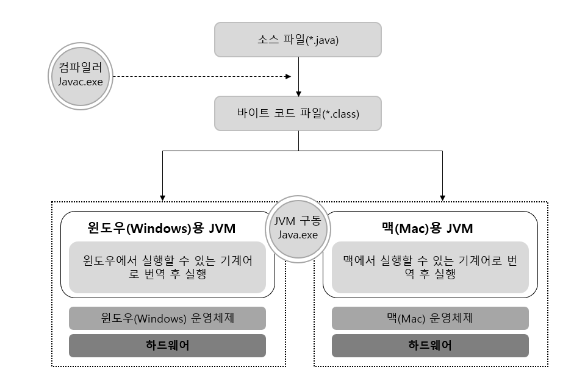
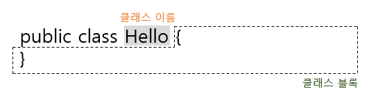
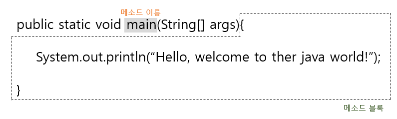

# 01. 자바 시작하기

## 1.2 자바란?

### 1.2.2 자바의 특징

<hr>

<strong><u>이식성이 높은 언어이다.</u></strong>
  이식성이란 서로 다른 실행 환경을 가진 시스템 간에 프로그램을 옮겨 실행할 수 있는 것을 말한다.
예를 들어 MS 윈도우 에서 실행하는 프로그램을 리눅스 또는 유닉스에서 실행할 수 있다면 이식성이 높은 것이고, 실행할 수 없다면 이식성이 낮다고 볼 수 있다.

  MS 윈도우에서 실행되는 대부분의 프로그램들은 MS 윈도우 환경에 최적화되어 있기 때문에 유닉스나 리눅스에서 실행하려면 프로그램 소스 파일을 수정한 후, 재컴파일 과정을 거쳐야 한다.
하지만 자바 언어로 개발된 프로그램은 소스 파일을 다시 수정하지 않아도, 자바 실행 환경(<strong>JRE: Java Runtime Environment</strong>)이 설치되어 있는 모든 운영체제에서 실행 가능하다.

  따라서, 자바 언어는 이식성이 높은 프로그래밍 언어라고 볼 수 있다.

<hr>

<b><u>객체 지향 언어이다.</u></b>
  프로그램을 개발하는 기법으로 부품에 해당하는 객체들을 먼저 만들고, 이것들을 하나씩 조립 및 연결해서 전체프로그램을 완성하는 기법을 객체 지향 프로그래밍(<b>OOP: Object Oriented Programming</b>)이라고 한다.
이때 사용되는 언어를 객체 지향 언어라고 한다.

  자바는 100% 객체 지향 언어이다. 객체를 만들기 위해 설계도인 클래스를 작성해야 하고, 객체와 객체를 연결하여 목적에 맞는 프로그램을 만들어 낸다. 자바는 아무리 작은 프로그램이라도 객체를 만들어 사용한다.
처음부터 객체를 고려하여 설계되었기 때문에 객체 지향 언어가 가져야 할 캡슐화, 상속, 다형성 기능을 완벽하게 지원하고 있다.

<hr>

<b><u>함수적 스타일 코딩을 지원한다.</u></b>
  자바는 객체 지향 프로그래밍이 소프트웨어 개발의 주요 패러다임이었던 1990년대에 디자인되었다.
객체 지향 프로그래밍이 나오기 오래전부터 Lisp 또는 Scheme와 같은 함수적 프로그래밍 언어들이 있었는데, 학계를 제외하고는 현업에서 큰 호응을 얻지 못했다.

  최근 들어 함수적 프로그래밍이 다시 부각되고 있는데, 대용량 데이터의 병렬 처리 그리고 이벤트 지향 프로그래밍을 위해 적합하기 때문이다.
자바는 함수적 프로그래밍을 위해 람다식(<b>Lambda Expression</b>)을 자바 8부터 지원한다. 람다식을 사용하면 컬렉션의 요소를 필터링, 매핑, 집계 처리하는데 쉬워지고, 코드가 매우 간결해진다.

<hr>

<b><u>다양한 애플리케이션을 개발할 수 있다.</u></b>
  자바는 윈도우, 리눅스, 유닉스, 맥 등 다양한 운영체제(<b>OS: Operating System</b>)에서 실행되는 프로그램을 개발할 수 있다. 단순한 콘솔 프로그램에서부터 클라이언트용 윈도우 애플리케이션, 서버용 웹 애플리케이션 그리고 모바일용 안드로이드 앱에 이르기까지 거의 모든 곳에서 실행되는 프로그램을 개발할 수 있다.

  자바는 다양한 운영체제에서 사용할 수 있는 개발 도구와 <b>API</b>를 묶어 에디션(<b>Edition</b>) 형태로 정의하고 있다.

<hr>
<strong><u>`JAVA SE (Standard Edition) - 기본 에디션`</u></strong>
`Java SE는 자바 프로그램들이 공통적으로 사용하는 자바 가상 기계(JVM: Java Virtual Machine)를 비롯해서 자바 프로그램 개발에 필수적인 도구와 라이브러리 API를 정의한다.`
`클라이언트와 서버 프로그램에 상관없이 자바 프로그램을 개발하고 실행하기 위해서는 반드시 Java SE 구현체인 자바 개발 키드(JDK: Java Development Kit)를 설치해야 한다.`

<strong><u>`JAVA EE (Enterprise Edition) - 서버용 애플리케이션 개발 에디션`</u></strong>
`Java EE는 분산 환경(네트워크, 인터넷)에서 서버용 애플리케이션을 개발하기 위한 도구 및 라이브러리 API를 정의한다.`
`서버용 애플리케이션으로는 Servlet/JSP를 이용한 웹 애플리케이션, 분산 처리 컴포넌트인 EJB(Enterprise Java Bean) 그리고 XML 웹 서비스(Web Services) 등이 있다.`

<hr>

<b><u>멀티 스레드(Muti-Thread)를 쉽게 구현할 수 있다.</u></b>
  하나의 프로그램이 동시에 여러 가지 작업을 처리해야 할 경우와 대용량 작업을 빨리 처리하기 위해 서브 작업으로 분리해서 병렬 처리하려면 멀티 스레드 프로그래밍이 필요하다.

  프로그램이 실행되는 운영체제에 따라서 멀티 스레드를 구현하는 방법이 다르지만, 자바는 스레드 생성 및 제어와 관련된 라이브러리 API를 제공하기 있기 때문에 실행되는 운영체제에 상관없이 멀티 스레드를 쉽게 구현할 수 있다.

<hr>

<b><u>동적 로딩(Dynamic Loading)을 지원한다.</u></b>
  자바 애플리케이션은 여러 개의 객체가 서로 연결되어 실행되는데, 이 객체들은 클래스로부터 생성된다. 애플리케이션이 실행될 때 모든 객체가 생성되지 않고, 객체가 필요한 시점에 클래스를 동적 로딩해서 객체를 생성한다.

  또한, 개발 완료 후 유지보수가 발생하더라도 해당 클래스만 수정하면 되므로 전체 애플리케이션을 다시 컴파일할 필요가 없다. 따라서 유지보수를 쉽고 빠르게 진행할 수 있다.

<hr>

<b><u>막강한 오픈소스 라이브러리가 풍부하다.</u></b>
  자바는 오픈소스(<b>Open Source</b>) 언어이기 때문에 자바 프로그램에서 사용하는 라이브러리 또한 오픈소스가 넘쳐난다. 고급 기능을 구현하는 코드를 직접 작성할 경우, 시간과 노력이 필요하고, 실행 안전성을 보장할 수 없지만,
검증된 오픈소스 라이브러리를 사용하면 개발 기간을 단축하면서 안전성이 높은 애플리케이션을 쉽게 개발할 수 있다.

  많은 회사들이 자바를 선택하는 이유 중의 하나가 막강하고 풍부한 자바 오픈소스 라이브러리가 있기 때문이다.


### 1.2.3 자바 가상 기계(JVM)

  운영체제는 자바 프로그램을 바로 실행할 수 없는데, 그 이유는 <u>자바 프로그램은 완전한 기계어가 아닌, 중간 단계의 바이트 코드</u>이기 때문에 이것을 해석하고 실행할 수 있는 가상의 운영체제가 필요하다.

  이것이 자바 가상 기계(<b>JVM: Java Virtual Machine</b>)이다. JVM은 실 운영체제를 대신해서 자바 프로그램을 실행하는 가상의 운영체제 역할을 한다. 운영체제별로 프로그램을 실행하고 관리하는 방법이 다르기 때문에 운영체제 별로 자바 프로그램을 별도로 개발하는 것보다는 운영체제의 자바 프로그램을 중계하는 JVM을 두어 자바 프로그램이 여러 운영체제에서 동일한 실행 결과가 나오도록 설계한 것이다.
따라서 개발자는 운영체제와 상관없이 자바 프로그램을 개발할 수 있다.

  바이트 코드는 모든 JVM에서 동일한 실행 결과를 보장하지만, JVM은 운영체제에 종속적이다. 자바 프로그램을 운영체제가 이해하는 기계어로 번역해서 실행해야 하므로 JVM은 운영체제에 맞게 설치되어야 한다.

  JVM은 JDK 또는 JRE를 설치하면 자동으로 설치되는데, JDK와 JRE가 운영체제 별로 제공된다. 

  자바 프로그램은 확장자가 .java인 파일을 작성하는 것부터 시작된다. 이것을 소스 파일이라고 하는데, 이 소스 파일을 컴파일러로(javac.exe)로 컴파일하면 확장자가 .class인 바이트 코드 파일이 생성된다.

  바이트 코드 파일은 JVM 구동 명령어(java.exe)에 의해 JVM에서 해석되고 해당 운영체제에 맞게 기계어로 번역된다. 바이트 코드는 하나지만, JVM에 의해서 번역되는 기계어는 운영체제에 맞게 따라서 달라진다.

  자바의 가장 큰 장점 중의 하나인 "Write once, run anywhere.(한 번 작성하면 어디서든 실행된다.)"는 매우 매력적임에는 틀림없지만, 한 번의 컴파일링으로 실행 가능한 기계어가 만들어지지 않고, JVM에 의해 기계어로 번역되고 실행되기 때문에, C와 C++의 컴파일 단계에서 만들어지는 완전한 기계어보다는 속도가 느리다는 단점을 가지고 있다.

  그러나 기계어로 빠르게 변환해주는 JVM내부의 최적화된 JIT 컴파일러를 통해서 속도의 격차는 많이 줄어들고 있다.


### 1.3.2 API 도큐먼트

  자바 프로그램을 개발하기 위해서는 JDK에서 제공하는 표준 클래스 라이브러리를 반드시 사용해야 한다. 이 클래스는 API(<b>Appliaction Programming Interface</b>)라고도 하는데, JDK에 포함되어 있는 API들은 매우 방대하기 때문에 쉽게 찾을 수 있도록 API 도큐먼트를 제공한다.

  API 도큐먼트는 HTML 페이지로 작성되어 있어 웹 브라우저로 "http://docs.oracle.com/javase/8/docs/api/"에 접속해보면 볼 수 있다.


## 1.4 자바 프로그램 개발 순서

### 1.4.1 소스 작성에서부터 실행까지

  자바 프로그램을 개발하려면 다음과 같은 순서로 진행해야 한다.

1. .java 소스 파일 작성 
2. 컴파일러(javac.exe)로 바이트 코드 파일(.class) 생성
3. JVM 구동 명령어(java.exe)로 실행

  자바 프로그램을 개발하기 위해서는 우선 파일 확장명이 .java인 텍스트 파일을 생성하고 프로그램 소스를 작성한다. 이렇게 만들어진 파일을 자바 소스 파일이라고 한다.
작성 완료된 자바 소스 파일은 컴파일러(javac.exe)로 컴파일해야 한다. 컴파일이 성공되면 확장명이 .class인 바이트 코드 파일이 생성된다.


### 1.4.2 프로그램 소스 분석

  자바 실행 프로그램은 반드시 클래스(class) 블록과 main() 메소드(method) 블록으로 구성되어야 한다.
메소드 블록은 단독으로 작성될 수 없고 항상 클래스 블록 내부에서 작성되어야 한다. 클래스와 메소드를 간단하게 설명하면 다음과 같다.

- 클래스 : 필드 또는 메소드를 포함하는 블록
- 메소드 : 어떤 일을 처리하는 실행문들을 모아 놓은 블록

  클래스에는 이름이 있는, Hello가 클래스 이름이고, 그 다음에 있는 중괄호({)부터 그와 짝을 이루는 중괄호(})까지가 클래스 블록이다.


  클래스의 이름은 개발자가 마음대로 정할 수 있다. 주의할 점은 소스 파일명과 대소문자가 일치해야 한다. 그리고 숫자로 시작할 수 없고, 공백을 포함해서도 안 된다. 
클래스 블록에는 메소드를 작성할 수 있는데, 메소드는 클래스처럼 이름과 블록을 가진다. main이 메소드 이름이고, 중괄호({)부터 그와 짝을 이루는 중괄호(})까지가 메소드 블록이다.
 

  메소드 이름도 개발자가 마음대로 정할 수 있지만 main() 메소드 만큼은 다른 이름으로 바꾸면 안된다. 왜냐하면 java.exe로 JVM을 구동시키면 먼저 main() 메소드를 찾아서 실행시키기 때문이다.
그래서 main() 메소드를 프로그램 실행 진입점(entry point)이라고 한다. 만약 클래스 내부에 main() 메소드가 없거나 잘못 작성하면 클래스를 실행할 수 없다.


## 1.5 주석과 실행문

### 1.5.1 주석 사용하기

  주석은 프로그램 실행과는 상관 없이 코드에 설명을 붙인 것을 말한다. 컴파일 과정에서 주석은 무시되고 실행문만 바이트 코드로 번역된다. 
따라서 주석을 많이 작성한다고 해서 전체 프로그램의 크기가 커지는 것은 아니므로 가급적이면 설명이 필요한 코드에 주석을 달아 두는 것이 좋다.

  복접한 코드일수록 주석을 달면 전체 코드를 이해하기 쉽고, 수정이 용이하다. 특히 다른 사람이 작성한 코드를 주석 없이 해석하는 작업은 쉬운 일이 아니다. 본인이 작성한 코드를 다른 사람이 볼 필요가 있다면 주석을 꼭 넣어주는 것이 좋다.

  주석의 내용에는 작성자, 작성일과 시간, 프로그램의 버전과 변경이력 등의 정보, 주요 코드에 대한 설명 등이 포함된다. 코드에서 사용하는 주석문의 종류에는 다음과 같이 두 가지가 있다.
| 주석 기호 | 설명                                                         |
| :-------- | :----------------------------------------------------------- |
| //        | //부터 라인 끝까지 주석으로 처리한다. (행 주석)              |
| /* ~ */   | /*와 */사이에 있는 모든 범위를 주석으로 처리한다. (범위 주석) |

  주석문은 코드 내 어디서든 작성 가능하지만, 문자열("") 내부에는 올 수 없다. 문자열 안에서의 주석문은 주석이 아니라 문자열 데이터로 인식된다.

  행 주석과 범위 주석 외에도 자바 API 도큐먼트 문서에 포함되는 도큐먼트 주석(/** ~ */)도 있다. 도큐먼트 주석은 javadoc.exe 명령어로 API 도큐먼트를 생성하는데 사용된다.


### 1.5.2 실행문과 세미콜론(;)

  실행문은 변수 선언, 값, 저장, 메소드 호출에 해당하는 코드를 말한다. 실행문을 작성할 때 주의할 점은 실행문의 마지막에 반드시 세미콜론(;)을 붙여서 실행문이 끝났음 표시해주어야 한다. 다음은 실행문을 작성한 예를 보여준다.

```java
int x = 1;						//변수 x를 선언하고 1을 저장
int y = 2;						//변수 y를 선언하고 2을 저장
int result = x + y;				//변수 result를 선언하고 변수 x와 y를 더한 값을 저장
System.out.println(result);		//콘솔에 출력하는 메소드 호출
```

  컴파일러는 세미콜론(;)이 나올 때까지 실행문이 계속해서 연결된 것으로 보기 때문에 한 실행문이 여러 줄에 걸쳐 있어도 되고, 한 줄에 여러 개의 실행문이 있어도 된다. 예를 들어, 앞의 코드를 다음과 같이 바꾸어 작성해도 전혀 문제가 없다.

```java
int x = 1; int y = 2;
int result =
    x + y;
System.out.println(result);
```


