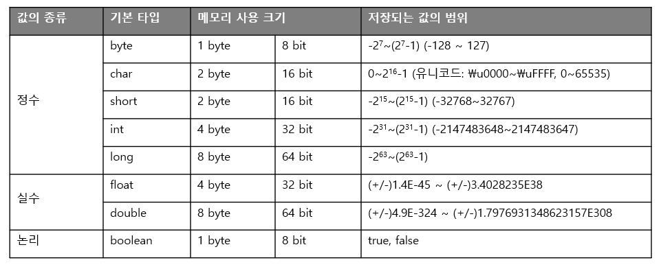
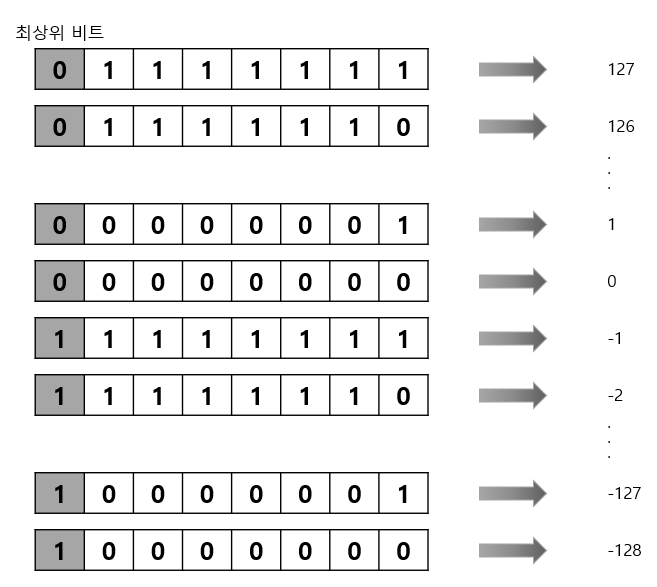
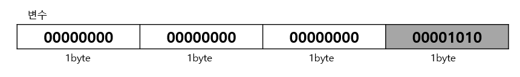
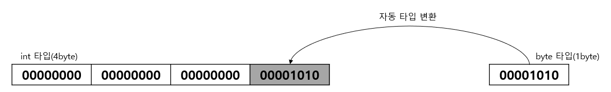
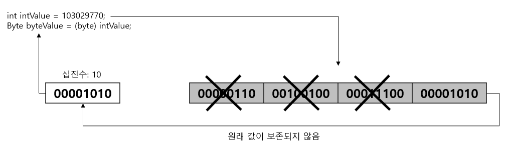

# 02. 변수와 타입

## 2.1 변수

### 2.1.1 변수란?

  프로그램은 작업을 처리하는 과정에서 필요에 따라 데이터를 메모리에 저장한다. 이때 변수를 사용하는데, <u>변수(Variable)는 값을 저장할 수 있는 메모리의 공간</u>을 의미한다.

  변수란 이름을 갖게된 이유는 프로그램에 의해서 수시로 값이 변동될 수 있기 때문이다. 변수에는 복수 개의 값을 저장할 수 없고, 하나의 값만 저장할 수 있다.

*<b>변수란, 하나의 값을 저장할 수 있는 메모리 공간이다.</b>*

  변수에는 다양한 타입의 값을 저장할 수 없고, 한 가지 타입의 값만 저장할 수 있다. 예를 들어 정수 타입 변수에는 정수값만 저장할 수 있고, 실수 타입 변수에는 실수값만 저장할 수 있다.


### 2.1.2 변수의 선언

  변수를 사용하기 위해서는 먼저 변수를 선언해야 한다. 변수 선언은 어떤 타입의 데이터를 저장할 것인지 그리고 변수 이름이 무엇인지를 결정한다. 변수 선언은 다음과 같다.

```java
int age;		//정수(int)값을 저장할 수 있는 age 변수 선언
double value;	//실수(double)값을 저장할 수 있는 value 변수 선언
```

  <u><b>타입</b>은 변수에 저장되는 값의 종류와 범위를 결정짓는 요소</u>이기 때문에 어떤 값을 변수에 저장할지 충분히 생각한 다음 결정해야 한다.
예를 들어, 변수에 정수를 저장하고 싶다면 정수 타입(int)을 사용할 수 있고, 실수를 저장하고 싶다면 실수 타입(double)을 사용할 수 있다. 같은 타입의 변수는 콤마(,)를 이용해서 한꺼번에 선언할 수도 있다.

  변수 이름은 메모리 주소에 붙여진 이름이다. 프로그램은 변수 이름을 통해서 메모리 주소에 접근하고, 그곳에 값을 저장하거나 그곳에 있는 값을 읽는다. 변수 이름은 자바 언어에서 정한 명명 규칙(naming convention)을 따라야 한다. 변수 명명 규칙은 다음과 같다.

| 제목                                                         | 예                                                           |
| ------------------------------------------------------------ | ------------------------------------------------------------ |
| 첫 번째 글자는 문자이거나 '$', '_'이어야 하고 숫자로 시작할 수 없다.(필수) | 가능: price, $price, _companyName<br />안됨: 1v, @speed, \$#value |
| 영어 대소문자가 구분된다.(필수)                              | firstname과 firstName은 다른 변수                            |
| 첫 문자는 영어 소문자로 시작하되, 다른 언어가 붙을 경우 첫 문자를 대문자로 한다.(관례) | maxSpeed, firstName, carBodyColor                            |
| 문자 수(길이)의 제한은 없다.                                 |                                                              |
| 자바 예약어는 사용할 수 없다.(필수)                          | 아래 표 참조                                                 |

  자바는 다음 표에 언급되어 있는 예약어를 가지고 있다. 이 예약어들로 변수 이름을 지정하면 컴파일 에러가 발생하기 때문에 주의해야 한다.
| 분류                  | 예약어                                                       |
| --------------------- | ------------------------------------------------------------ |
| 기본 데이터 타입      | boolean, byte, char, int, long, float, double                |
| 접근 지정자           | private, protected, public                                   |
| 클래스와 관련된 것    | class, abstract, interface, extends, implements, enum        |
| 객체와 관련된 것      | new, instaceof, this, super, null                            |
| 메소드와 관련된 것    | void, return                                                 |
| 제어문과 관련된 것    | if, else, switch, case, default, for, do, while, break, continue |
| 논리값                | true, false                                                  |
| 예외 처리와 관련된 것 | try, catch, finally, thow, thows                             |
| 기타                  | transient, volatile, package, import, synchronized, native, final, static, strictfp, assert |

  개발자는 변수 이름을 보고, 이 변수가 어떤 값을 저장하고 있는지 쉽게 알 수 있도록 <u>의미 있는 변수 이름</u>을 지어주는 것이 좋다. 변수 이름의 길이는 프로그램 실행과는 무관하기 때문에 충분히 길어도 상관없다.

  필수적인 것은 아니지만 명명 규칙과 관련된 자바 개발자들 간에 지켜져오는 관례가 있는데, 관례란 필수적인 것은 아니지만 개발자 간의 코드 작성 패턴을 공유하고자 하는 약속이기 때문에 가급적 지켜주는 것이 좋다.

  변수 이름에 한글도 사용이 가능하지만 가급적이면 한글을 포함하지 않는 것이 좋다. 한국어를 모르는 다른 사람도 소스 코드를 볼 수 있기 때문이다.


### 2.1.3 변수의 사용

  변수를 사용한다는 것은 변수에 값을 저장하고 읽는 행위를 말한다.

<b><u>변수값 저장</u></b>
  변수에 값을 저장할 때에는 대입 연산자(=)를 사용한다. 일반 수학에서 =은 같다는 의미지만, 자바언어에서는 우측의 값을 좌측 변수에 저장한다는 의미를 갖는다.

  변수를 선언하고 처음 값을 저장할 경우, 이러한 값을 초기값이라고 한다. 그리고 변수에 초기값을 주는 행위를 변수의 초기화라고 한다. 예를 들어, 90이라는 값을 변수 score에 저장하려면 먼저 정수 타입(int)으로 score 변수를 선언하고 초기값 90을 다음과 같이 기술하면 된다.

```java
int score;		//변수 선언
score = 90;		//값 저장
```

  초기값은 변수를 선언함과 동시에 줄 수도 있다.

```java
int score = 90;
```

  변수의 초기값은 코드에서 직접 입력하는 경우가 많은데, 소스 코드 내에서 직접 입력된 값을 리터럴(literal)이라고 부른다. 리터럴은 값의 종류에 따라 정수 리터럴, 실수 리터럴, 문자 리터럴, 논리 리터럴로 구분된다.

  이 리터럴들은 정해진 표기법대로 작성되어야 한다. 사실 리터럴은 상수(constant)와 같은 의미지만, 프로그램에서는 <u>상수를 "값을 한 번 저장하면 변경할 수 없는 변수"</u>로 정의하기 때문에 이와 구분하기 위해 "리터럴"이라는 용어를 사용한다.


<b><u>|정수 리터럴|</u></b>
  소수점이 없는 정수 리터럴은 10진수로 간주한다.

```java
0, 75, -100
```

  0으로 시작되는 리터럴은 8진수로 간주한다.

```java
02, -04
```

  0x 또는 0X로 시작하고 0~9 숫자나 A, B, C, D, E, F 또는 a, b, c, d, e, f로 구성된 리터럴은 16진수로 간주한다.

```java
0x5, 0xA, 0xB3, 0xAC08
```


<b><u>|실수 리터럴|</u></b>
  소수점이 있는 리터럴은 10진수 실수로 간주한다.

```java
0.25, -3.14
```

  대문자 E또는 소문자 e가 있는 리터럴은 10진수 지수와 가수로 간주한다.

```java
5E7		//5 x 10^7
0.12E-5 //0.12 x 10^-5
```

  실수 리터럴을 저장할 수 있는 타입은 float, double이 있다.


<b><u>|문자 리터럴|</u></b>

  작은 따옴표(')로 묶은 텍스트는 하나의 문자 리터럴로 간주한다.

```java
'A', '한', '\t', '\n'
```

   역슬래쉬(\\)가 붙은 문자 리터럴은 이스케이프(escape)문자하고도 하느데, 다음과 같이 특수한 용도로 사용한다.

| 이스케이프 문자 | 용도                       | 유니코드        |
| --------------- | -------------------------- | --------------- |
| '\\t'           | 수평 탭                    | 0x0009          |
| '\\n'           | 줄 바꿈                    | 0x000a          |
| '\\r'           | 리턴                       | 0x000d          |
| '\\"'           | "(큰따옴표)                | 0x0022          |
| '\\''           | '(작은따옴표)              | 0x0027          |
| '\\\\'          | \\                         | 0x005c          |
| '\\u16진수'     | 16진수에 해당하는 유니코드 | 0x0000 ~ 0xffff |

  문자 리터럴을 저장할 수 있는 타입은 char 하나뿐이다. 


<b><u>|문자열 리터럴|</u></b>
  큰따옴표(")로 묶은 텍스트는 문자열 리터럴로 간주한다. 큰따옴표 안에는 텍스트가 없어도 문자열 리터럴로 간주된다. 문자열 리터럴 내부에서도 이스케이프 문자를 사용할 수 있다.

```java
"대한민국"
"탭 만큼 이동 \t 합니다. "
"한줄 내려 쓰기 \n 합니다. "
```

  문자열 리터럴을 저장할 수 있는 타입은 String 하나뿐이다.


<b><u>|논리 리터럴|</u></b>

true와 false는 논리 리터럴로 간주된다.

```java
true, false
```

  논리 리터럴을 저장할 수 있는 타입은 boolean 하나뿐이다.


<b><u>변수값 읽기</u></b>
  변수는 초기화가 되어야 읽을 수가 있고, 초기화되지 않은 변수는 읽을 수가 없다. 다음은 잘못된 코딩 예를 보여준다.

```java
int value;					//변수 value 선언 (초기화 안 됨)
int result; = value + 10;	//변수 value 값을 읽고 10을 더한 결과값을 변수 result에 저장
```

  변수 value가 선언되었지만, 초기화가 되지 않았기 때문에 산술 연산식 value + 10에서 사용할 수 없다.
이런 경우 컴파일 에러가 발생한다. 위 코드는 다음과 같이 변경해야 한다.

```java
int value = 30;				//변수 value가 30으로 초기화 됨
int result; = value + 10;	//변수 value 값을 읽고 10을 더한 결과값(40)을 변수 result에 저장
```


- [VariableExample.java] 변수 선언과 초기화

  ```java
  package Variable;
  
  public class VariableExample {
      public static void main(String[] args) {
          //10을 변수 value의 초기값으로 저장
          int value = 10;
  
          //변수 value 값을 읽고 10을 더하는 산술 연산을 수행
          //연산의 결과값을 변수 result의 초기값으로 저장
          int result = value + 10;
  
          //변수 result 값을 읽고 콘솔에 출력
          System.out.println(result);
      }
  }
  ```


### 2.1.4 변수의 사용 범위

  변수는 중괄호 {} 블록 내에서 선언되고 사용된다. 중괄호 블록을 사용하는 곳은 클래스, 생성자, 메소드인데, 클래스와 생성자는 클래스를 학습할 때 살펴보도록하고, 지금은 모든 변수는 메소드 블록 내에 존재한다고 생각하자.

  메소드 블록 내에서 선언된 변수를 특히 로컬 변수(local variable)라고 부른다. 로컬 변수는 메소드 실행이 끝나면 메모리에서 자동으로 없어진다. 

  변수는 메소드 블록 내 어디에서든 선언할 수 있지만, 변수 사용은 제한이 따른다. 기본적으로 변수는 다음과 같은 사용 규칙이 있다.

<b>`변수는 선언된 블록 내에서만 사용이 가능하다.`</b>

  메소드 블록 내에서도 여러 가지 중괄호 {} 블록들이 있을 수 있다. 조건문에 해당하는 if() {}, 반복문에 해당하는 for() {}, while() {} 등이 중괄호를 가질 수 있다.
이러한 if, for, while을 제어문이라고 하는데, 제어문 블록에서 선언된 변수는 해당 제어문 블록 내에서만 사용이 가능하고 블록 밖에서는 사용할 수 없다. 

```java
public static void main(String[] args) {
    int var1;
    
    if(...) {
        int var2;		//if 블록에서 선언
        //var1, var2 사용가능
    }
    
    for(...) {
        int var3;		//for 블록에서 선언
        //var1, var3 사용가능
        //var2는 사용 못함
    }
    
    //var1 사용 가능
    //var2, var3는 사용 못함
}
```

  따라서 변수를 선언할 때에는 변수가 어떤 범위에서 사용될 것인지를 생각하고, 선언 위치를 결정해야 한다.
메소드 블록에서 어떤 위치에서건 사용할 수 있도록 한다면 메소드 블록 첫머리에 선언하는 것이 좋을 것이다. 만약 제어문 내에서 잠깐 사용되는 변수라면 제어문 내에서 선언하는 것이 좋다.


## 2.2 데이터 타입

  모든 변수에는 타입(type)이 있으며, 타입에 따라 저장할 수 있는 값의 종류와 범위가 달라진다. 변수를 선언할 때 주어진 타입은 변수를 사용하는 도중에 변경할 수 없다. 따라서 변수를 선언할 때 어떤 타입을 사용할지 충분히 고려해야 한다.


### 2.2.1 기본(원시: primitive) 타입

  기본(원시) 타입이란 정수, 실수, 문자, 논리 리터럴을 직접 저장하는 타입을 말한다. 정수 타입에는 byte, char, short, int, long이 있고, 실수 타입에는 float, double이 있다.
그리고 논리 타입에는 boolean이 있다. 다음은 각 기본 타입의 메모리 크기와 저장되는 값의 범위를 보여준다.



  메모리에는 0과 1을 저장하는 최소 기억 단위인 비트(bit)가 있다. 그리고 8개의 비트를 묶어서 바이트(byte)라고 한다.  기본 타입은 정해진 메모리 사용 크기(바이트 크기)로 값을 저장하는데 바이트 크기가 클수록 표현하는 값의 크기가 크다.


### 2.2.2 정수 타입(byte, char, short, int, long)

  정수 타입에는 모두 다섯 개의 타입이 있으며 저장할 수 있는 값의 범위가 서로 다르다. 메모리 크기 순으로 나열하면 다음과 같다.

| 정수 타입 | byte | char | short | int  | long |
| :-------: | :--: | :--: | :---: | :--: | :--: |
| 바이트 수 |  1   |  2   |   2   |  4   |  8   |

  자바는 기본적으로 정수 연산을 int 타입으로 수행한다. 그렇기 때문에 저장하려는 값이 정수 리터럴이라면 특별한 이유가 없는 한 int 타입 변수에 저장하는 것이 좋다. byte와 short가 int보다는 메모리 사용 크기가 작아서 메모리를 절약할 수는 있지만, 값의 범위가 작은 편이라서 연산 시에 범위를 초과하면 잘못된 결과를 얻기 쉽다.


<b><u>byte 타입</u></b>
  byte 타입은 색상 정보 및 파일 또는 이미지 등의 이진(바이너리) 데이터를 처리할 때 주로 사용된다. byte 타입은 정수 타입 중에서 가장 작은 범위의 수를 저장하는데, 표현할 수 있는 값의 범위는 -128 ~ 127(-2<sup>7</sup>~2<sup>7</sup>-1)이다.
양수부분이 2<sup>7</sup>-1인 이유는 0이 포함되기 때문이다.

  만약 -128~127을 초과하는 값이 byte 타입 변수에 저장될 경우 컴파일 에러("Type mismatch: cannot convert from int ti byte")가 발생한다. 

  byte 타입이 왜 -128 ~ 127까지 정수값을 저장하는지 알아보자. byte타입은 1byte, 즉 8bit 크기를 가지므로 다음과 같이 0과 1이 8개로 구성된 이진수로 표현이 가능하다.


  최상위 비트(MSB: Most Significant Bit)는 정수값의 부호를 결정한다. 최상위 비트가 0이면 양의 정수, 1이면 음의 정수를 뜻한다. 실제 정수값은 나머지 7개의 bit로 결정된다.
최상위 비트가 1인 음수의 경우에는 나머지 7개의 bit를 모두 1의 보수로 바꾸고 1을 더한 값에 -를 붙여주면 십진수가 된다.

  byte 타입보타 크기가 큰 short, int, long 타입도 전체 바이트 수만 다를 뿐 동일한 원리로 정수값을 표현한다.


  코드에서 정상적으로 변수에 올바른 값을 저장하더라도 프로그램이 실행되는 도중에 변수의 값은 변경된다. 만약 실행 중에 저장할 수 있는 값의 범위를 초과하면 최소값부터 다시 반복 저장되는데, byte일 경우 -128부터 시작해서 127을 넘으면 다시 -128부터 시작하게 된다.

  또 다른 정수 타입인 short, int, long 역시 저장할 수 있는 값의 범위를 넘어서면 이와 같은 방식으로 처리된다. 이와 같이 저장할 수 있는 값의 범위를 초과해서 값이 저장될 경우 엉터리 값이 변수에 저장되는데, 이러한 값을 쓰레기값이라고 한다.
개발자는 쓰레기값이 생기지 않도록 주의해야 한다. 

  다음 예제는 byte 변수와 int 변수를 각각 125로 초기화하고 5회에 걸쳐 1씩 더하기한 다음 출력한 결과를 보여준다.

- [GarbageValueExample.java] byte 타입 변수

  ```java
  package Variable;
  
  public class GarbageValueExample {
      public static void main(String[] args) {
          byte var1 = 125;
          int var2 = 125;
          for(int i=0; i<5; i++) {
              var1++;
              var2++;
              System.out.println("var1: " + var1 + "\t" + "var2: " + var2);
          }
      }
  }
  ```

  - 실행결과
    `var1: 126	var2: 126
    var1: 127	var2: 127
    var1: -128	var2: 128
    var1: -127	var2: 129
    var1: -126	var2: 130`

  byte 변수는 127을 넘어서는 순간 최소값인 -128부터 다시 저장되는 것을 볼 수 있고, int 타입의 변수는 정상적으로 1증가된 것을 계속 저장하는 것을 볼 수 있다.


<b><u>char 타입</u></b>
  자바는 모든 문자를 유니코드(Unicode)로 처리한다. 유니코드는 세계 각국의 문자들을 코드값으로 매핑한 국제 표준 규약이다.

  유니코드는 하나의 문자에 대해 하나의 코드값을 부여하기 때문에 영문 'A' 및 한글 '가'도 하나의 코드값을 갖는다. 유니코드는 0~65535 범위의 2byte 크기를 사진 정수값이다.

  0~127까지는 아스키(ASCII) 문자(특수기호 및 영어 알파벳)가 할당되어 있고, 44032~55203까지는 한글 11172자가 할당되어 있다. 유니코드에 대한 자세한 정보는 유니코드 홈페이지("https://www.unicode.org")에서 찾을 수 있다.

  자바는 하나의 유니코드를 저장하기 위해 2byte 크기인 char 타입을 제공한다. 유니코드는 음수가 없기 때문에 char 타입의 변수에는 음수 값을 저장할 수 없다. char 타입에 저장할 수 있는 값은 0~65535까지 2<sup>16</sup>개이다.

  char 타입 변수에 작은 따옴표(')로 감싼 문자를 대입하면 해당 문자의 유니코드가 저장된다. 예를 들어, 'A', 'B', '가', '각' 문자를 char 변수에 저장할 경우 변수에 저장되는 유니코드 값은 다음과 같다.

```java
char var1 = 'A';	//유니코드: 0x0041 -> 2진수: 00000000 01000001
char var2 = 'B';	//유니코드: 0x0042 -> 2진수: 00000000 01000010
char var3 = '가';   //유니코드: 0xAC00 -> 2진수: 10101100 00000000
char var3 = '각';   //유니코드: 0xAC01 -> 2진수: 10101100 00000001
```

  char 변수에 작은 따옴표(')로 감싼 문자가 아니라 직접 유니코드 정수값을 저장할 수도 있다. 특정 문자의 유니코드를 안다면 10진수 또는 16진수로 저장하면 되는데, 예를 들어 문자 A는 10진수로 65이고, 16진수로 0x0041이므로 다음과 같이 char 변수에 저장할 수 있다.
  16진수로 저장할 경우에는 유니코드라는 의미에서 '\\u + 16진수값'형태로 값을 저장하면 된다.

```java
char c = 65;
char c = '\u0041';
```

  프로그램 코드에서 char 변수에 저장된 유니코드를 알고 싶다면 char 타입 변수를 int 타입 변수에 저장하면 된다.

```java
char c = 'A';
int uniCode = c;
```


  char 타입 변수는 단 하나의 문자만 저장한다. 만약 문자열을 저장하고 싶다면 String 타입을 사용해야 하는데, 다음과 같이 String 변수를 선언하고, 큰 따옴표(")로 감싼 문자열 리터럴을 대입하면 된다.

```java
String name = "홍길동"
```

  String은 기본 타입이 아니다. String은 클래스 타입이고, String 변수는 참조 변수이다.
문자열을 String 변수에 대입하면 문자열이 변수에 직접 저장되는 것이 아니라, String 객체가 생성되고, String 변수는 String 객체의 번지를 참조하게 된다.


  char 타입의 변수에 어떤 문자를 대입하지 않고 단순히 초기화를 할 목적으로 다음과 같이 작은 따옴표 두 개를 연달아 붙인 빈 문자를 대입하면 컴파일 에러가 발생한다. 그렇기 때문에 공백(유니코드 : 32) 하나를 포함해서 초기화해야 한다.

```java
char c = ''; //컴파일 에러 -> char c = ' ';
```

  하지만 String 변수는 큰 따옴표(") 두 개를 연달아 붙인 빈 문자를 대입해도 괜찮다.

```java
String str = "";
```


<b><u>short 타입</u></b>
  short 타입은 2byte(16bit)로 표현되는 정수값을 저장할 수 있는 데이터 타입이다. 저장할 수 있는 값의 범위는 -32768~32767이다. C언어와의 호환을 위해 사용되며 비교적 자바에서는 잘 사용되지 않는 타입이다.


<b><u>int 타입</u></b>
  int 타입은 4byte(32bit)로 표현되는 정수값을 저장할 수 있는 데이터 타입이다. 저장할 수 있는 값의 범위는 -2147483648~2147483647이다. 
int 타입은 자바에서 정수 연산을 하기 위한 기본 타입이다. 쉽게 설명하면 byte 타입 또는 short 타입의 변수를 + 연산하면 int 타입으로 변환된 후 연산되고 연산의 결과 역시 int 타입이 된다.

  이것은 자바에서 정수 연산을 4 byte로 처리하기 때문이다. 따라서 byte타입이나 short타입으로 변수를 선언한 것과 int타입으로 변수를 선언한 것의 성능 차이는 거의 없다.

  정수값을 직접 코드에서 입력할 경우 8진수, 10진수, 16진수로 표현할 수 있다. 8진수일 경우 숫자 앞에 '0'을 붙이면 되고, 16진수는 '0x'를 붙이면 된다.
다음은 10진수 10을 각각 8진수와 16진수로 표현해 변수에 저장한다.

```java
int number = 10;
int octNumber = 012;
int hexnumber = 0xA;
```

  변수에 어떤 진수로 입력을 하더라도 동일한 값이 2진수로 변환되어 저장된다. 10이 int 타입 변수에 저장되면 메모리에 생성되는 변수는 다음과 같다. int가 4byte의 크기를 가지기 때문에 4byte의 공간을 차지하면서 총 32bit로 10을 표현한다.


  10은 1byte로 충분히 표현이 가능하기 때문에 나머지 상위 3byte의 bit값은 모두 0이다.

- [IntExample.java] int 타입 변수

  ```java
  package Variable;
  
  public class IntExample {
      public static void main(String[] args) {
          int var1 = 10;  //10진수로 저장
          int var2 = 012; //8진수로 저장
          int var3 = 0xA; //16진수로 저장
  
          System.out.println(var1);	//10
          System.out.println(var2);	//10
          System.out.println(var3);	//10
      }
  }
  ```

  

<b><u>long 타입</u></b>
  long 타입은 8byte(64bit)로 표현되는 정수값을 저장할 수 있는 데이터 타입이다.
수치가 큰 데이터를 다루는 프로그램에서는 long 타입이 필수적으로 사용된다. 대표적인 예가 은행 및 우주와 관련된 프로그램들이다.

  <u>long 타입의 변수를 초기화할 때에는 정수값 뒤에 소문자 'l'이나 대문자 'L'을 붙일 수 있다.</u> 이것은 4byte 정수 데이터가 아니라 8byte 정수 데이터임을 컴파일러에게 알려주기 위한 목적이다.

  <b>int 타입의 저장 범위를 넘어서는 큰 정수는 반드시 소문자 'l'이나 대문자 'L'을 붙여야한다.</b>
그렇지 않으면 컴파일 에러가 난다.

  일반적으로 소문자 'l'은 숫자 '1'과 비슷해 혼돈하기 쉬우므로 대문자 'L'을 사용한다.

- [LongExample.java] long 타입 변수

  ```java
  package Variable;
  
  public class LongExample {
      public static void main(String[] args) {
          long var1 = 10;
          long var2 = 20L;
          //long var3 = 1000000000000;    //컴파일 에러
          long var4 = 1000000000000L;
          
          System.out.println(var1);
          System.out.println(var2);
          System.out.println(var4);
      }
  }
  ```

    5라인에서 에러가 나는 이유는 int타입의 저장 범위를 넘어서는 정수 리터럴에 'L'을 붙이지 않았기 때문이다.


### 2.2.3 실수 타입(float, double)

  실수 타입은 소수점이 있는 실수 데이터를 저장할 수 있는 타입으로, 메모리 사용 크기에 따라 float과 double이 있다.
| 실수 타입 | float | double |
| :-------- | :---: | :----: |
| 바이트 수 |   4   |   8    |

  float과 double의 메모리 사용 크기는 각각 int와 long의 크기와 같지만, 정수 타입과는 다른 저장 방식 때문에 정수 타입보다 훨씬 더 큰 범위의 값을 저장할 수 있다.(부동 소수점 방식으로 저장됨.)

  <b>자바는 실수 리터럴의 기본 타입을 double로 간주한다.</b> 이 말은 실수 리터럴을 float 타입 변수에 그냥 저장할 수 없다는 뜻이다. 
실수 리터럴을 float 타입 변수에 저장하려면 리터럴 뒤에 소문자 'f'나 대문자 'F'를 붙여야 한다.

```java
double var1 = 3.14;
float var2 = 3.14; //컴파일 에러
float var3 = 3.14F;
```

  만약 정수 리터럴에 10의 지수를 나타내는 E 또는 e를 포함하고 있으면 정수 타입 변수에 저장할 수 없고 실수 타입 변수에 저장해야 한다.

```java
int var6 = 300000;	//300000
double var7 = 3e6   //300000
float var8 = 3e6f;	//300000
double var9 = 2e-3  //0.002
```


### 2.2.4 논리 타입(boolean)

  boolean 타입은 1byte(8bit)로 표현되는 논리값(true/false)을 저장할 수 있는 데이터 타입이다. boolean 타입은 두 가지 상태값을 저장할 필요성이 있을 경우에 사용되며, 상태값에 따라 조건문과 제어문의 실행 흐름을 변경하는데 주로 이용된다.

```java
public class BooleanExample {
    public static void main(String[] args) {
        boolean stop = true;
        if(stop) {
            System.out.println("중지합니다.");
        }
        else {
            System.out.println("시작합니다.")
        }
    }
}
```

- 출력결과

  ```
  중지합니다.
  ```


## 2.3 타입 변환

  타입 변환이란 데이터 타입을 다른 데이터 타입으로 변환하는 것을 말한다. 
타입 변환에는 자동(묵시적) 타입 변환과 강제(명시적)타입 변환 두 가지 종류가 있다.


### 2.3.1 자동 타입 변환

  자동 타입 변환은 프로그램 실행 도중에 자동적으로 타입 변환이 일어나는 것을 말한다. <b>자동 타입 변환은 작은 크기를 가지는 타입이 큰 크기를 가지는 타입에 저장될 때 발생한다.</b>

```java
byte byteValue = 10;
int intValue = byteValue;	// 자동 타입 변환이 일어난다.
```




  

  정수 타입이 실수 타입으로 변환하는 것은 무조건 자동 타입 변환이 된다. 실수 타입으로 변환된 이후의 값은 정수값이 아닌 .0이 붙은 실수값이 된다. 그 이유는 표현할 수 있는 값의 범위가 float가 더 크기 때문이다.

```java
int intValue = 200;
double doubleValue = intValue;	//200.0
```


  char 타입의 경우 int 타입으로 자동 변환되면 유니코드 값이 int 타입에 저장된다.

```java
char charValue = 'A';
int intValue = charValue;	//65
```

- 예외
  byte -> char 는 불가능 (char의 범위는 0~65535이므로 음수가 저장될 수 없기 때문.)


### 2.3.2 강제 타입 변환

  강제적으로 큰 데이터 타입을 작은 데이터 타입으로 쪼개어서 저장하는 것을 강제 타입 변환(캐스팅: Casting)이라고 한다.
강제 타입 변환은 캐스팅 연산자 ()를 사용하는데, 괄호 안에 들어가는 타입은 쪼개는 단위이다.


```Java
int intValue = 103029770;
byte byteValue = (byte)intValue;	//강제 타입 변환(캐스팅)
```



  끝 1byte만 byte타입 변수에 담게 되므로 원래 int 값은 보존되지 않는다.


  int 타입은 char 타입으로 자동 변환되지 않기 때문에 강제 타입 변환을 사용해야 한다. int 타입에 저장된 값이 유니코드 범위(0~65535)라면 다음과 같이 (char)캐스팅 연산자를 사용해서 char 타입으로 변환할 수 있다.

```java
int intValue = 65;
char charValue = (char)intValue;
System.out.println(charValue);		//A
```


강제 타입 변환시 주의점
[FromIntFloat.java] 정수 타입을 실수 타입으로 변환할 때 정밀도 손실을 피한다.

```java
package Variable;

public class FromIntFloat {
    public static void main(String[] args) {
        int num1 = 123456780;
        int num2 = 123456780;

        float num3 = num2;
        num2 = (int)num3;

        int result = num1 - num2;
        System.out.println(result);
    }
}
```

- 출력결과

  `4`

  float: 부호(1비트) + 지수(8비트) + 가수(23비트)
즉 int 값을 손실 없이 float 타입의 값으로 변환할 수 있으려면 가수 23비트로 표현 가능한 값이어야 한다.
123456780은 23비트로 표현할 수 없기때문에 근사치로 변환된다. 즉, 정밀도 손실이 발생한다.

  doubl: 부호(1비트) + 지수(11비트) + 가수(52비트)
int의 크기는 32비트이므로 double의 가수 52비트보다는 작기 때문에 어떠한 int 값이라도 안전하게 정밀도 손실 없이 double 타입으로 변환 될 수 있다.


### 2.3.3 연산식에서의 자동 타입 변환

  서로 다른 타입의 피연산자가 있을 경우 두 피연산자 중 크기가 큰 타입으로 자동 변환된 후 연산을 수행한다.

```java
int intValue = 10;
double doubleValue = 5.5;
double result = intValue + doubleValue;		//result에 15.5가 저장
				//intValue가 double 값으로 변환
```

  자바는 정수 연산일 경우 int 타입을 기본으로 한다. 
크기가 4byte보다 작은 타입(byte, char, short)은 4byte인 int 타입으로 변환된 후 연산이 수행된다.

```java
char ai = 'A';
int result = ai + 1;		//'A'의 유니코드보다 1이 큰 유니코드가 저장
char na = (char)result;		//'B'가 저장됨
```


[OperationsPromotionExample.java] 연산식에서 자동 타입 변환

```java
package Variable;

public class OperationsPromotionExample {
    public static void main(String[] args) {
        byte byteValue1 = 10;
        byte byteValue2 = 20;
        // byte byteValue3 = byteValue1 + byteValue2; //컴파일 에러
        int intValue = byteValue1 + byteValue2;
        System.out.println(intValue);

        char charValue1 = 'A';
        char charValue2 = 1;
        // char charValue3 = charValue1 + charValue2; //컴파일 에러
        int intValue2 = charValue1 + charValue2;
        System.out.println("유니코드 : " + intValue2);
        System.out.println("출력문자 : " + (char)intValue2);
        
        int intValue3 = 10;
        int intValue4 = intValue3/4;
        System.out.println(intValue4);

        int intValue5 = 10;
        // int intValue6 = 10 / 4.0 //컴파일 에러
        double doubleValue = intValue5 / 4.0;
        System.out.println(doubleValue);
    }
}
```

- 출력 결과
  `30
  유니코드 : 66
  출력문자 : B
  2
  2.5`


