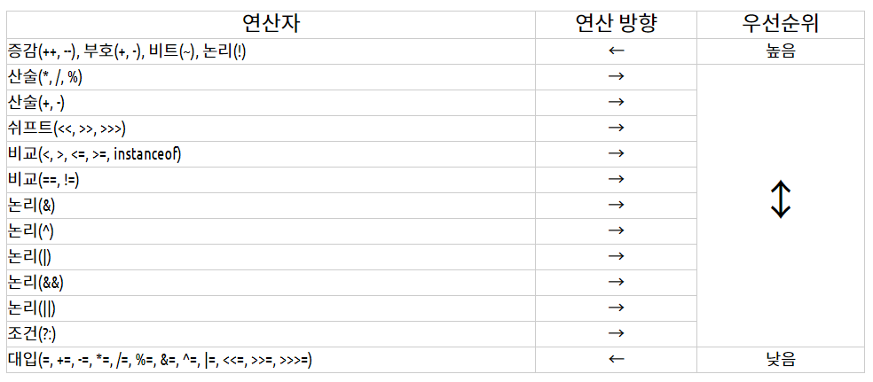
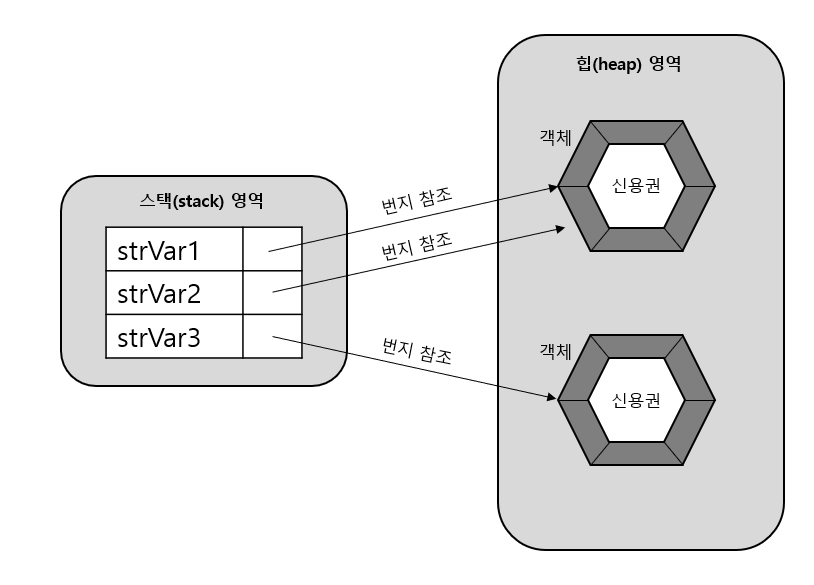
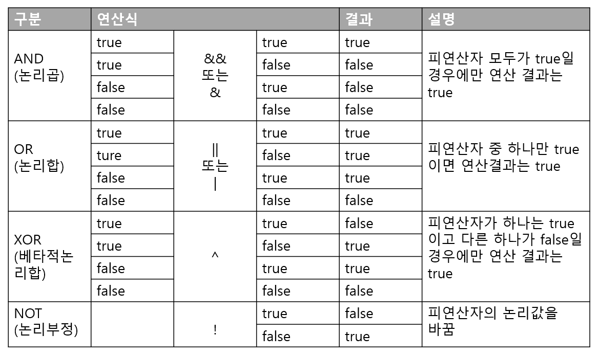
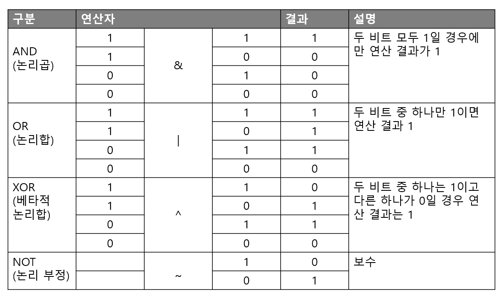
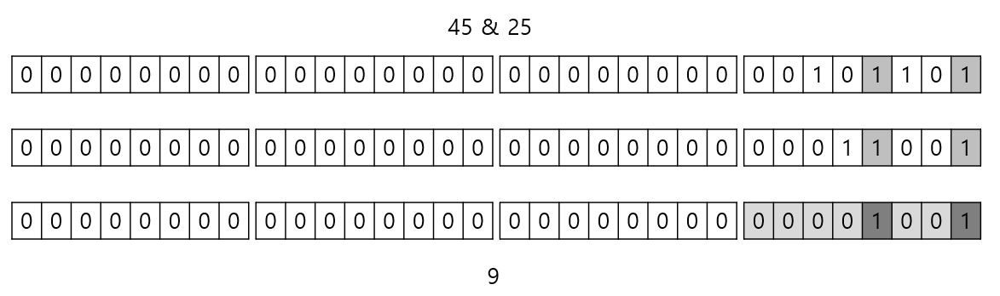
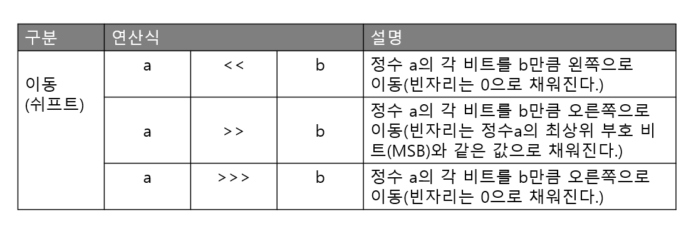
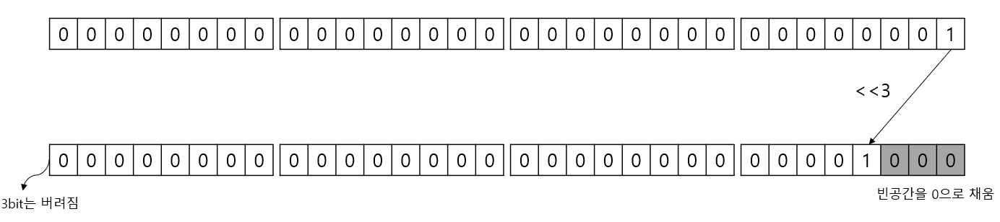
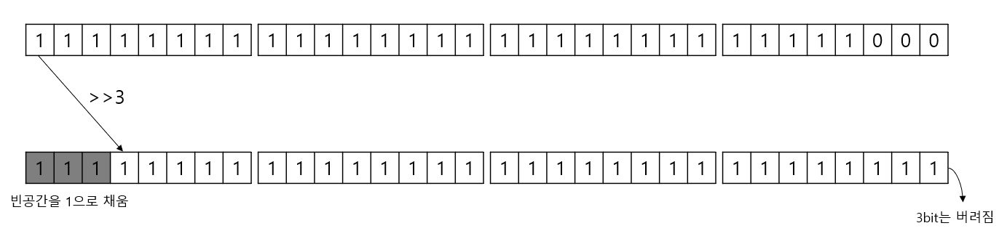
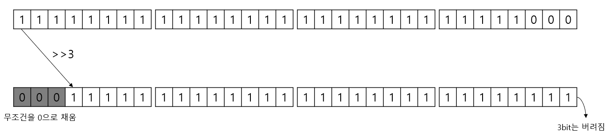
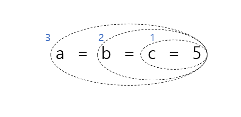

# 03. 연산자

## 3.1 연산자와 연산식

 프로그램에서 데이터를 처리하여 결과를 산출하는 것을 연산(operations)라고 한다.
연산에 사용되는 표시나 기호를 연산자(operator), 연산되는 데이터는 피연산자(operand)라고 한다.

  연산자와 피연산자를 이용하여 연산의 과정을 기술한 것을 연산식(expressions)라고 한다.
예를들어, +, -, *, ==은 연산자이고, x, y, z 등의 변수는 피연산자이다.

- 요구되는 피연산자의 갯수에 따라서,
  `단항 연산자: ++x`;
  `이항 연산자: x + y;`
  `삼항 연산자: (sum>90) ? 'A' : 'B'`;


## 3.2 연산의 방향과 우선순위



  괄호 ()를 사용해서 먼저 처리해야 할 연산식을 묶을 수도 있음.

```java
int result = (var1 + var2) * var3; //var1 + var2이 먼저 계산된다
```

- 연산의 방향과 우선순위를 정리하면 다음과 같다.

<ol>
    <li>단항, 이항 삼항 연산자 순으로 우선순위를 가진다.</li>
    <li>산술, 비교, 논리, 대입 연산자 순으로 우선순위를 가진다.</li>
    <li>단항과 대입 연산자를 제외한 모든 연산의 방향은 왼쪽에서 오른쪽이다.(->)</li>
    <li>복잡한 연산식에는 괄호()를 사용해서 우선순위를 정해준다.</li>
</ol>


## 3.3 단항 연산자

  피연산자가 단 하나뿐인 연산자. 
부호 연산자(+, -), 증감 연산자(++, --), 논리 부정 연산자(!), 비트 반전 연산자(~)가 있다.


### 3.3.1 부호 연산자(+, -)

  부호 연산자는 양수 및 음수를 표시하는 +, -를 말한다.
+, -는 산술 연산자이기도 하고, 부호 연산자이기도 하다. 부호 연산자로 쓰일 때에는 하나의 피연산자만 필요하다.

```java
int x = -100;
int result1 = +x;	//-100, 부호 유지
int result2 = -x;	//100, 부호가 바뀜
```

  부호 연산자를 사용할 때 <u>주의할 점은 부호 연산자의 산출 타입은 <b>int 타입</b>이 된다는 점.</u>
다음의 코드는 컴파일 에러가 발생한다.

```java
short s = 100;
short result = -s	//컴파일 에러, int result = -s로 변경되어야 함
```


### 3.3.2 증감 연산자(++, --)

  증감 연산자는 변수의 값을 1증가 시키거나 1감소시키는 연산자이다.

| 연산식     | 설명                                                |
| ---------- | --------------------------------------------------- |
| ++피연산자 | 다른 연산을 수행하기 전에 피연산자의 값을 1증가시킴 |
| --피연산자 | 다른 연산을 수행하기 전에 피연산자의 값을 1감소시킴 |
| 피연산자++ | 다른 연산을 수행한 후에 피연산자의 값을 1 증가시킴  |
| 피연산자-- | 다른 연산을 수행한 후에 피연산자의 값을 1 감소시킴  |

```java
int x = 1;
int y = 1;
int result1 = ++x + 10;
int result2 = y++ + 10;
```

  result1에는 12가 저장되고, result2에는 11이 저장된다.


### 3.3.3 논리 부정 연산자(!)

| 연산식    | 설명                                                         |
| --------- | ------------------------------------------------------------ |
| !피연산자 | 피연산자가 true이면 false 값을 산출<br />피연산자가 false이면 true 값을 산출 |


### 3.3.4 비트 반전 연산자(~)

  비트 반전 연산자는 정수 타입(byte, short, int, long)의 피연산자에만 사용되며, 피연산자를 2진수로 표현했을 때 비트값인 0을 1로 1은 0으로 반전한다.

  부호 비트인 최상위 비트를 포함해서 모든 비트가 반전되기 때문에, 부호가 반대인 새로운 값이 산출된다.
<u>주의할 점은 비트 반전 연산자 <b>산출 타입은 int 타입</b>이 된다는 것이다.</u>

  피연산자는 연산을 수행하기 전에 int 타입으로 변환되고, 비트 반전이 일어난다. 그래서 다음 코드는 컴파일 에러가 발생한다.

```java
byte v1 = 10;
byte v2 = ~v1;	//컴파일 에러, int v2 = ~v1과 같이 변경되어야 함
```


  자바는 정수값을 총 32비트의 이진 문자열로 리턴하는 <b>Integer.toBinaryString()</b> 메소드를 제공한다.

```java
String v1BinaryString = Integer.toBinaryString(10);		//1010
```

  앞의 비트가 모두 0이면 0은 생략되고 나머지 문자열만 리턴하기 때문에 총 32개의 문자열을 모두 얻기 위해서는 다음과 같은 메소드가 필요하다.

```java
public static String toBinaryString(int value) {
    String str = Integer.toBinaryString(value);
    while(str.length() < 32) {
        str = "0" + str;
    }
    return str;
}
```


- [BitReverseOperatorExample.java] 비트 반전 연산자

  ```java
  public class BitReverseOperatorExample {
    public static void main(String[] args) {
      int v1 = 10;
      int v2 = ~v1;
      int v3 = ~v1 + 1;
  
      System.out.println(toBinaryString(v1) + " (십진수 " + v1 + ")");
      System.out.println(toBinaryString(v2) + " (십진수 " + v2 + ")");
      System.out.println(toBinaryString(v3) + " (십진수 " + v3 + ")");
    }
  
    public static String toBinaryString(int value) {
      String str = Integer.toBinaryString(value);
      while(str.length() < 32) {
        str = "0" + str;
      }
      return str;
    }
  }
  ```

  - 출력결과
    `00000000000000000000000000001010 (십진수 10)`
    `11111111111111111111111111110101 (십진수 -11)`
    `11111111111111111111111111110110 (십진수 -10)`


## 3.4 이항 연산자

  이항 연산자는 피연산자가 두 개인 연산자이다.


### 3.4.1 산술 연산자(+, -, *, /, %)

| 연산식              | 설명                                                      |
| ------------------- | --------------------------------------------------------- |
| 피연산자 + 피연산자 | 덧셈 연산                                                 |
| 피연산자 - 피연산자 | 뺄셈 연산                                                 |
| 피연산자 * 피연산자 | 곱셈 연산                                                 |
| 피연산자 / 피연산자 | 좌측 피연산자를 우측 피연산자로 나눗셈 연산               |
| 피연산자 % 피연산자 | 좌측 피연산자를 우측 피연산자로 나눈 나머지를 구하는 연산 |

  피연산자들의 타입이 동일하지 않을 경우 다음과 같은 규칙을 사용해서 피연산들의 타입을 일치시킨 후 연산을 수행한다.

- byte + byte --> int + int = int
- int + long --> long + long = long
- int + double --> double + double = double

```java
byte byte1 = 1;
byte byte2 = 1;
byte byte3 = byte1 + byte2;	//컴파일 에러, int byte3 = byte1 + byte2로 변경해야함
```


  char 타입도 정수 타입이므로 산술 연산이 가능하다.

- [CharOperationExample.java] char 타입 연산

  ```java
  public class CharOperationExample {
    public static void main(String[] args) {
      char c1 = 'A' + 1;
      char c2 = 'A';
      //char c3 = c2 + 1; //컴파일 에러
      System.out.println("c1: " + c1);
      System.out.println("c2: " + c2);
    }
  }
  ```

    'A' + 1은 리터럴 문자 'A'에 1을 더할 것인데, 문자 A는 65라는 유니코드를 가지므로 66이된다.
  따라서 c1에는 B가 저장된다.

    <b>자바는 리터럴 간의 연산은 타입변환 없이 해당 타입으로 계산</b>하기 때문에 c1 = 'A' + 1는 아무런 문제가 없다.
  그러나 c3 = c2 + 1처럼 변수 c2에 1을 더하면 c2는 int 타입으로 변환되고 1과 연산이 되기 때문에 산출 타입은 int가 된다.

    따라서, char 타입 변수 c3에 대입을 할 수 없어 컴파일 에러가 발생한다.
  다음과 같이 타입 캐스팅을 해서 char 타입으로 얻어야 한다.

  ```java
  char c3 = (char)(c2 + 1);
  ```


<b><u>오버플로우 탐지</u></b>
  일반적으로, 피연산자의 값을 직접 리터럴로 주는 경우는 드물다. 대부분은 사용자로부터 입력받거나 프로그램 실행 도중에 생성되는 데이터로 산술 연산이 수행된다.

  이런 경우 산술 연산자를 사용하지 말고 메소드를 이용하는 것이 좋다. 메소드는 산술 연산을 하기 전에 피연산자들의 값을 조사해서 오버플로우를 탐지할 수 있기 때문이다.
(예외 처리는 10장에서 배운다.)

- [CheckOverflowExample.java] 산술 연산 전에 오버플로우를 탐지

  ```java
  public class CheckOverflowExample {
    public static void main(String[] args) {
      try {
        int result = safeAdd(2000000000, 2000000000);
        System.out.println(result);
      }
      catch(ArithmeticException e) {
        System.out.println("오버플로우가 발생하여 정확하게 계산할 수 없음");
      }
    }
  
    public static int safeAdd(int left, int right) {
      if(right > 0) {
        if(left > Integer.MAX_VALUE - right) {
          throw new ArithmeticException("오버플로우 발생");
        }
      }
      else {
        if(left < Integer.MAX_VALUE + right) {
          throw new ArithmeticException("오버플로우 발생");
        }
      }
      return left + right;
    } 
  }
  ```


<b><u>NaN Infinity 연산</u></b> 

  / 또는 % 연산자를 사용할 때 주의할 점이 있다.

```java
5 / 0 	//ArithmeticException 예외 발생
5 % 0 	//ArithmeticException 예외 발생    
```

  자바는 프로그램 실행 도중 예외가 발생하면 실행이 즉시 멈추고 프로그램은 종료된다.
ArithmeticException이 발생했을 경우 프로그램이 종료되지 않도록 하려면 예외 처리를 해야 한다. 예외 처리는 예외가 발생되었을 경우, catch 블록을 실행하도록 하는 것이다.

```java
try {
    //int z = x/y;	//y가 0일경우 ArithmeticException 발생
	int z = x % y;  //
    System.out.println("z: " + z);
} catch(ArithmeticException e) {
    System.out.println("0으로 나누면 안됨");	//예외 처리
}
```

  실수 타입 0.0

```java
5 / 0.0 --> Infinity
5 % 0.0 --> NaN
    
Infinity + 2 --> Infinity
NaN + 2 --> NaN
```

  프로그램 코드에서 /와 % 연산의 결과가 Infinity 또는 NaN인지 확인하려면 Double.isInfinity()와 Double.isNaN() 메소드를 이용하면 된다.

- [InfinityAndNaNCheckExample.java] Infinity와 NaN

  ```java
  public class InfinityAndNaNCheckExample {
    public static void main(String[] args) {
      int x = 5;
      double y = 0.0;
  
      double z = x / y;
      //double z = x % y;
  
      System.out.println(Double.isInfinite(z));
      System.out.println(Double.isNaN(z));
  
      System.out.println(z + 2);
    }
  }
  ```

  - 출력결과
    `ture`
    `false`
    `Infinity`


<b><u>NaN 예외처리</u></b>

- [InputDataCheckNaNExample2.java] "NaN"을 체크하고 연산 수행

  ```java
  public class InputDataCheckNaNExample2 {
    public static void main(String[] args) {
      String userInput = "NaN";
      double val = Double.valueOf(userInput);
  
      double currentBalance = 10000.0;
  
      if(Double.isNaN(val)) {
        System.out.println("NaN이 입력되어 처리할 수 없음");
        val = 0.0;
      }
  
      currentBalance += val;
      System.out.println(currentBalance);
    }
  }
  ```

  - 출력결과
    `NaN이 입력되어 처리할 수 없음`
    `10000.0`

    Double.valueOf() 메소드는 문자열 "NaN"을 double 타입인 NaN으로 변환시켜준다.
  따라서 val에는 NaN이 저장된다.


### 3.4.2 문자열 연결 연산자(+)

  피연산자 중 한쪽이 문자열이면 + 연산자는 문자열 연결 연산자로 사용되어 다른 피연산자를 문자열로 변환하고 서로 결합한다.

```java
String str1 = "JDK" + 6.0 //JDK6.0
String str2 = str1 + " 특징"
```


  헷갈리는 점.

```java
"JDK" + 3 + 3.0; //JDK33.0
3 + 3.0 + "JDK"  //6.0JDK
```

   문자열과 숫자가 혼합된 + 연산식은 왼쪽에서부터 오른쪽으로 연산이 진행된다.


### 3,4,3 비교 연산자(<, <=, >, >=, ==, !=)

  비교 연산자는 대소 또는 동등을 비교해서 boolean타입인 true/false를 산출한다.
비교 연산자는 흐름 제어문인 조건문(if), 반복문(for, while)에서 주로 이용되어 실행 흐름을 제어할 때 사용된다.

  만약 피연산자가 char 타입이면 유니코드 값으로 비교 연산을 수행한다.

```java
('A' < 'B')  --> (65 < 66)
```


<b><u>동등(==)</u></b>

```java
'A' == 65 --> true //A가 int 타입으로 변환되어 65가 된다음 65 == 65를 비교
3 == 3.0 --> true  //int타입보다 큰 double타입으로 3을 3.0으로 변환한 후 
                   // 3.0 == 3.0을 비교
```

<b><u>예외</u></b>
  0.1 == 0.1f와 같은 경우는 false가 산출된다.
그 이유는 이진 포맷의 가수를 사용하는 모든 부동소수점 타입은 0.1을 정확히 표현할 수가 없어서 0.1f는 0.1의 근사값으로 표현되어 0.10000000149011612와 같은 값이 되기 때문에 0.1보다 큰 값이 되어 버린다.

  따라서 다음 예제와 같이 강제 캐스팅을 통해서 변환한 후 비교 연산을 하든지, 정수로 변환해서 비교하면 된다.

- [CompareOperatorExample2.java] 비교 연산자

  ```java
  public class CompareOperatorExample2 {
    public static void main(String[] args) {
      int v2 = 1;
      double v3 = 1.0;
      System.out.println(v2 == v3); //true
      
      double v4 = 0.1;
      float v5 = 0.1f;
      System.out.println(v4 == v5); //false
      System.out.println((float)v4 == v5); //true
      System.out.println((int)(v4*10) == (int)(v5*10)); //true
    }
  }
  ```

  

<b><u>String</u></b>
  String 타입의 문자열을 비교할 때는 ==, != 또는 equals() 메소드를 이용한다.

```java
String strvar1 = "신용권";
String strvar2 = "신용권";
String strvar3 = new String("신용권");
```

  자바는 문자열 리터럴이 동일하다면 동일한 String 객체를 참조하도록 되어 있다. 그래서 변수 strVar1과 strVar2는 동일한 String 객체의 번지값을 가지고 있다.

  그러나 변수 strVar3은 객체 생성 연산자인 new로 생성한 새로운 String 객체의 번지값을 가지고 있다.


```java
strVar1 == strVar2 --> true
strVar2 == strVar3 --> false
```

  객체끼리의 비교가 아닌, String 객체의 문자열만을 비교하고 싶다면 equals() 메소드를 사용해야 한다.

```java
strVal1.equals(strVar1) --> true;
strVal2.equals(strVar3) --> true;
```


### 3.4.4 논리 연산자(&&, ||, &, |, ^, !)

  논리 연산자의 피연산자는 boolean 타입만 사용할 수 있다. 


  &&와 &, ||와 |의 차이

- &&는 앞의 피연산자가 false라면 뒤의 피연산자를 평가하지 않고 바로 false라는 산출 결과를 냄.
  그러나 &는 두 피연산자를 모두 평가함.
  따라서 &보다는 &&가 더 효율적으로 동작한다.
- ||는 앞의 피연산자가 true라면 뒤의 피연산자를 평가하지 않고 바로 true라는 산출 결과를 냄.
  그러나 |는 두 피연산자를 모두 평가함.
  따라서 |보다 ||가 더 효율적으로 동작한다.


### 3.4.5 비트 연산자(&, |, ^, ~, <<, >>, >>>)

  비트 연산자는 데이터를 비트(bit) 단위로 연산한다. 즉 0과 1이 피연산자가 된다.
0과 1로 표현이 가능한 정수 타입만 비트연산을 할 수 있음.


#### 비트 논리 연산자(&, |, ^, ~)



- 비트 연산자는 피연산자를 int 타입으로 자동 타입 변환한 후 연산을 수행한다. 그렇기 때문에 byte, short, char 타입을 비트 논리 연산하면 그 결과는 int 타입이 된다. 그래서 다음은 컴파일 에러가 난다.

  ```java
  byte num1 = 45;
  byte num2 = 25;
  byte result1 = num1 & num2 //컴파일 에러 --> int result = num1 && num2;
  ```

  


#### 비트 이동 연산자(<<, >>, >>>)

  비트 이동(shift) 연산자는 정수 테이터의 비트를 좌측 또는 우측으로 밀어서 이동시키는 연산을 수행한다.


```java
int result = 1 << 3;	//8
```



```java
int result = -8 >> 3;	//-1
```



```java
int result = -8 >>> 3;	//536870911
```



### 3.4.6 대입 연산자(=, +=, -=, *=, /=, %=, &=, ^=, |=, <<=, >>=, >>>=)

- 단순 대입 연산자(=) : 오른쪽 피연산자의 값을 좌측 피연산자인 변수에 저장한다.

- 복합 대입 연산자 : 정해진 연산을 수행한 후 결과를 변수에 저장한다.

  ```java
  result1 += 1; 		//result1 = result1 + 1; 
  result2 >>>= 1;		//result2 = result2 >>> 1;
  ```

대입 연산자는 모든 연산자들 중에서 가장 낮은 연산 순위를 가지고 있기 때문에 제일 마지막에 수행된다.


연산의 진행방향은 오른쪽에서 왼쪽으로 수행된다.


## 3.5 삼항 연산자

  삼항 연산자(?:)는 세 개의 피연산자를 필요로 하는 연산자를 말한다. 삼항 연산자는 ? 앞의 조건식에 따라 콜론(:) 앞뒤의 피연산자가 선택된다고 해서 조건 연산식이라고 부르기도 한다.

<b>조건식(피연산자1)    ?    값 또는 연산식(피연산자2)    :    값 또는 연산식(피연산자3)</b>

  조건식을 연산하여 true가 나오면 삼항 연산자의 결과는 피연산자2가 된다. 반면에 false가 나온다면 삼항 연산자의 결과는 피연산자3이 된다.

  삼항 연산자는 if문으로 변경해서 작성할 수도 있지만, 한 줄에 간단하게 삽입해서 사용할 경우에는 삼항 연산자를 사용하는 것이 효율적이다. 

- [ConditionalOperationExample.java] 삼항 연산자

  ```java
  package junseok.java.basic;
  
  public class ConditionalOperationExample {
      public static void main(String[] args) {
          int score = 85;
          char grade = (score > 90) ? 'A' : ( score > 80 ? 'B' : 'C' );
          System.out.println(score + "점은 " + grade + "등급입니다.");
      }
  }
  ```

  - 출력결과
    `85점은 B등급입니다.`

