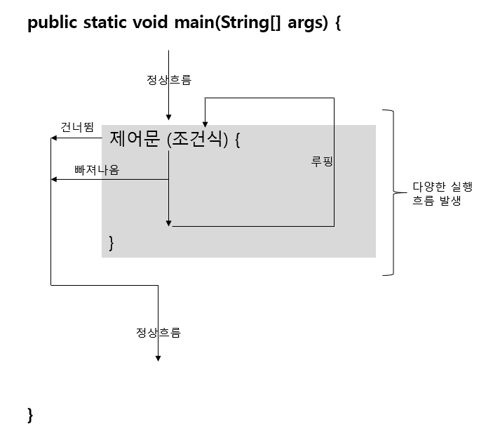
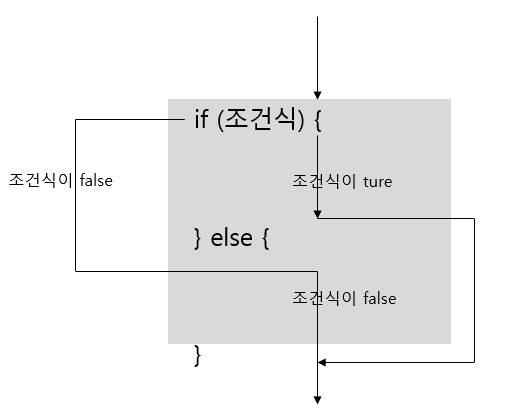
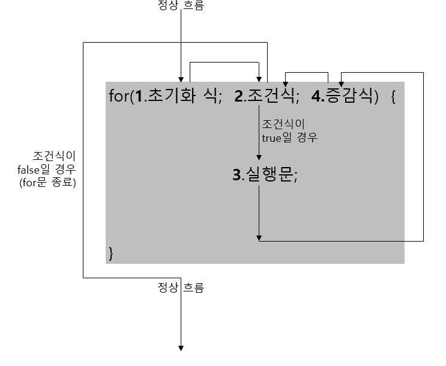
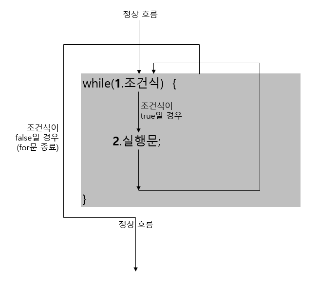
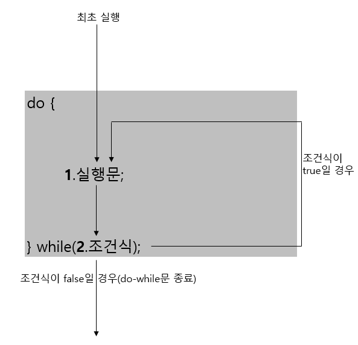

# 04. 조건문과 반복문

## 4.1 코드 실행 흐름 제어

  자바 프로그램을 시작하면 main() 메소드의 시작 중괄호에서 시작해서 끝 중괄호까지 위에서부터 아래로 실행하는 흐름을 가지고 있다.

  이러한 실행 흐름을 개발자가 원하는 방향으로 바꿀 수 있도록 해주는 것이 흐름 제어문이다.
흐름 제어문을 간단히 제어문이라고 한다.

  제어문을 사용할 경우 다향한 실행 흐름이 생성된다.


## 4.2 조건문(if문, switch문)

### 4.2.1 if문

  if문은 조건식의 결과에 따라 블록 실행 여부가 결정된다.
조건식에는 true또는 false 값을 산출할 수 있는 연산식이나, boolean 변수가 올 수 있다. 조건식이 true이면 블록을 실행하고 false이면 블록을 실행하지 않는다.

  중괄호 {}블록은 여러개의 실행문을 하나로 묶기 위해 작성된다.
만약 조건식이 true일때 <b>실행 할 문장이 하나라면 중괄호 블록을 생략할 수 있다.</b>

- [IfExample.java] If문

  ```java
  public class IfExample {
      public static void main(String[] args) {
          int score = 93;
  	
          if(score >= 90) {
              System.out.println("점수가 90보다 큽니다.");
              System.out.println("등급은 A 입니다.");
          }
          if(score < 90)									    //line10
              System.out.println("점수가 90보다 작습니다.");	  //line11
              System.out.println("등급은 B 입니다.");			//line12
      }
  }
  ```

  - 출력결과

    점수가 90보다 큽니다.
    등급은 A 입니다.
    등급은 B 입니다.

    - 12라인은 점수와는 상관없이 무조건실행된다. 그 이유는 10라인의 if문은 중괄호 블록이 없어 11라인까지만 영향을 미치기 때문에 12라인은 들여쓰기만 되었을 뿐 if문과는 아무런 관련이 없다.


### 4.2.2 if - else문

  if문은 else 블록과 함께 사용되어 조건식의 결과에 따라 실행 블록을 선택한다.
if문의 조건식이 true이면 if문의 블록이 실행되고, 조건식이 false이면 else 블록이 실행된다.

  조건식의 결과에 따라 이 두 개의 블록 중 어느 한 블록의 내용만 실행하고, 전체 if문을 벗어나게 된다. 다음은 if-else문의 형식과 실행 흐름을 보여준다.


- [IfElseExample.java] if-else문

  ```java
  public class IfElseExample {
      public static void main(String[] args) {
          int score = 85;
          if(score >= 90) {
              System.out.println("점수가 90보다 큽니다.");
              System.out.println("등급은 A 입니다.");
          }
          else {
              System.out.println("점수가 90보다 작습니다.");
              System.out.println("등급은 B 입니다.");
          }
      }
  }
  ```

  - 출력결과
    점수가 90보다 작습니다.
    등급은 B 입니다.


### 4.2.3 if - else if - else문

  조건문이 여러 개인 if문도 있다. 처음 if문의 조건식이 false일 경우 다른 조건식의 결과에 따라 실행 블록을 선택할 수 있는데, if 블록의 끝에 else if문을 붙이면 된다.

  else if문의 수는 제한이 없으며 여러 개의 조건식 중 true가 되는 블록만 실행하고 전체 if문을 벗어나게 된다. 모든 조건식이 false일 경우 else 블록을 실행하고 벗어나게 된다.

- [IfElseIfElseExample.java] if-else if-else 문

  ```java
  public class IfElseIfElseExample {
      public static void main(String[] args) {
          int score = 75;
  
          if(score >= 90) {
              System.out.println("점수가 100-90 입니다.");
              System.out.println("등급은 A 입니다.");
          } else if(score >= 80) {
              System.out.println("점수가 80-89 입니다.");
              System.out.println("등급은 B 입니다.");
          } else if(score >= 70) {
              System.out.println("점수가 70-79 입니다.");
              System.out.println("등급은 C 입니다.");
          } else {
              System.out.println("점수가 70 미만 입니다.");
              System.out.println("등급은 D 입니다.");
          }
      }
  }
  ```


### 4.2.4 중첩 if문

- [IfNestedExample.java] 중첩 if문

  ```java
  public class IfNestedExample {
      public static void main(String[] args) {
          int score = (int)(Math.random()*20) + 81; //Math.random()는 0이상 1.0미만의 														double 타입의 난수를 하나 리턴
          System.out.println("점수: " + score);
  
          String grade;
  
          if(score >= 90) {
              if(score >= 95) {
                  grade = "A+";
              }
              else {
                  grade = "A";
              }
          }
          else {
              if(score >= 85) {
                  grade = "B+";
              }
              else {
                  grade = "B";
              }
          }
  
          System.out.println("학점: " + grade);
      }
  }
  ```

  - 출력결과
    점수: 81
    학점: B


### 4.2.5 switch문

  switch문은 변수가 어떤 값을 갖느냐에 따라 실행문이 선택된다. 
switch문은 괄호 안의 값과 동일한 값을 갖는 case로 가서 실행문을 실행시킨다. 만약 괄호안의 값과 동일한 값을 갖는 case가 없으면 default로 가서 실행문을 실행시킨다.

  default는 생략 가능하다.

- [SwitchExample.java] Switch문

  ```java
  public class SwitchExample {
      public static void main(String[] args) {
          int num = (int)(Math.random() * 6) + 1;
  
          switch(num) {
              case 1:
                  System.out.println("1번이 나왔습니다.");
                  break;
              case 2:
                  System.out.println("2번이 나왔습니다.");
                  break;
              case 3:
                  System.out.println("3번이 나왔습니다.");
                  break;
              case 4:
                  System.out.println("4번이 나왔습니다.");
                  break;
              case 5:
                  System.out.println("5번이 나왔습니다.");
                  break;
              default:
                  System.out.println("6번이 나왔습니다.");
                  break;
          }
      }
  }
  ```

  - 출력결과
    6번이 나왔습니다.


  case 끝에 break가 붙어 있는 이유는 다음 case를 실행하지 말고 switch문을 빠져나가기 위해서이다. break가 없다면 다음 case가 연달아 실행되는데, 이때에는 case값과는 상관없이 실행된다.

  자바 7부터는 String 타입의 변수도 올 수 있다.

- [SwitchStringExample.java] String 타입의 Switch문

  ```java
  public class SwitchStringExample {
      public static void main(String[] args) {
          String position = "과장";
  
          switch(position) {
              case "부장":
                  System.out.println("700만원");
                  break;
              case "과장":
                  System.out.println("500만원");
                  break;
              default:
                  System.out.println("300만원");
          }
      }
  }
  ```

  - 출력결과
    500만원


## 4.3 반복문(for문, while문, do-while문)

  반복문은 어떤 작업(코드들)이 반복적으로 실행되도록 할 때 사용되며, 반복문의 종류로는 for문, while문, do-while문이 있다.

  for문과 while문은 서로 변환이 가능하기 때문에 반복문을 작성할 때 어느 쪽을 선택해도 좋지만, for문은 반복 횟수를 알고 있을 때 주로 사용하고, while문은 조건에 따라 반복할 때 주로 사용한다.

  while문과 do-while문의 차이점은 조건을 먼저 검사하느냐 나중에 검사하느냐일 뿐 동작 방식은 동일하다.


### 4.3.1 for문



  for문이 실행될 때 1초기화식이 제일 먼저 실행된다. 그런 다음 2조건식을 평가해서 ture이면 3실행문을 실행시키고, false이면 for문 블록을 실행하지 않고 끝나게 된다.

  블록 내부의 3실행문들이 모두 실행되면 4증감식을 실행시키고 다시 2조건식을 평가하게 된다. 평가 결과가 true이면 3 --> 4 --> 2로 다시 진행하고, false이면 for문이 끝나게 된다.

- [ForPrintFrom1To10Example.java] 1부터 10까지 출력

  ```java
  public class ForPrintFrom1To10Example {
      public static void main(String[] args) {
          for(int i=1; i<=10; i++) {
              System.out.println(i);
          }
      }
  }
  ```

  - 출력결과
    1
    2
    3
    4
    5
    6
    7
    8
    9
    10

 

  초기화식의 역할은 조건식과 실행문, 증감식에서 사용할 변수를 초기화 하는 역할을 한다.
초기화식이 필요 없을 경우에는 다음과 같이 초기화를 생략할 수 있다.

```java
int i = 1;
for (; i<=100; i++) {...}
```

  어떤 경우에는 초기화식이 둘 이상이 있을 수도 있고, 증감식도 둘 이상이 있을 수 있다. 이런 경우에는 쉼표(,)로 구분해서 작성하면 된다.

```java
for(int i=0, j=100; i<=50 && j >= 50; i++, j--) {...}
```

  초기화식에 선언된 변수는 for문 블록 내부에서 사용되는 로컬 변수이다. 따라서 for문을 벗어나서는 사용할 수 없다. 


  for문을 작성할 때 주의할 점은 초기화식에서 루프 가운트 변수를 선언할 때 부동소수점 타입을 사용하지 말아야한다.

- [ForFloatCounterExample.java] float 타입 카운터 변수

  ```java
  public class ForFloatCounterExample {
      public static void main(String[] args) {
          for(float x=0.1f; x<=1.0f; x+=0.1f) {
              System.out.println(x);
          }
      }
  }
  ```

  - 출력결과
    0.1
    0.2
    0.3
    0.4
    0.5
    0.6
    0.70000005
    0.8000001
    0.9000001

  이론적으로 위 코드의 for문은 10번 반복해야 한다. 하지만 0.1은 float 타입으로 정확하게 표현할 수 없기 때문에 x에 더해지는 실제 값은 0.1보다 약간크다. 결국 루트는 9번만 실행된다.

  for문은 또 다른 for문을 내포할 수 있는데, 이것을 중첩된 for문이라고 한다.

- [ForMutiplicationTableExample.java] 구구단 출력하기

  ```java
  public class ForMutiplicationTableExample {
      public static void main(String[] args) {
          for(int m=2; m<=9; m++) {
              System.out.println("*** " + m + "단 ***");
              for(int n=1; n<=9; n++) {
                  System.out.println(m + " x " + n + " = " + (m*n));
              }
          }
      }
  }
  ```

  - 출력결과
    \*** 2단 ***
    2 x 1 = 2
    2 x 2 = 4
    2 x 3 = 6
    2 x 4 = 8
    2 x 5 = 10
    2 x 6 = 12
    2 x 7 = 14
    2 x 8 = 16
    2 x 9 = 18

    ...


### 4.3.2 while문

  for문이 정해진 횟수만큼 반복한다면, while문은 조건식이 true일 경우에 계속해서 반복한다.



  while문이 처음 실행될 때 1조건식을 평가한다. 평가 결과가 true이면 2실행문을 실행한다. 2실행문이 모두 실행되면 다시 조건식으로 되돌아가서 1조건식을 다시 평가한다.

  만약 조건식이 true하면 2 --> 1로 다시 진행하고, false하면 while문을 종료한다.

- [WhileSumFrom1To100Example.java] 1부터 100까지 합을 출력

  ```java
  public class WhileSumFrom1To100Example {
      public static void main(String[] args) {
          int sum = 0;
  
          int i = 1;
  
          while(i <= 100) {
              sum += i;
              i++;
          }
  
          System.out.println("1~" + (i-1) + " 합 : " + sum);
      }
  }
  ```

  - 출력결과
    1~100 합 : 5050


### 4.3.3 do-while문

  do-while문은 조건식에 의해 반복 실행한다는 점에서는 while문과 동일하다.
while문은 시작 할 때 부터 조건식을 검사하여 블록 내부를 실행할지 결정하지만, 경우에 따라서는 블록 내부의 실행문을 우선 실행시키고 실행 결과에 따라서 반복 실행을 계속할지 결정하는 경우도 발생한다.


  do-while문이 처음 실행될 때 1실행문을 우선 실행한다. 1실행문이 모두 실행되면 2조건식을 평가하는데, 그 결과가 true이면 1 --> 2와 같이 반복실행을 하고, 조건식의 결과가 false이면 do-while문을 종료한다.

- [DoWhileExample.java] do-while문

  ```java
  import java.util.Scanner;   //Scanner 클래스를 사용하기위해 필요
  
  public class DoWhileExample {
      public static void main(String[] args) {
          System.out.println("메시지를 입력하세요");
          System.out.println("시스템을 종료하려면 q를 입력하세요.");
  
          Scanner scanner = new Scanner(System.in);   //Scanner 클래스의 객체 생성
          String inputString;
  
          do {
              System.out.print(">");
              inputString = scanner.nextLine();       //키보드로 입력한 문자열을 얻음
              System.out.println(inputString);
          } while(!inputString.equals("q"));
  
          System.out.println();
          System.out.println("프로그램 종료");
      }
  }
  ```

  - 출력결과
    메시지를 입력하세요
    시스템을 종료하려면 q를 입력하세요.
    안녕하세요
    안녕하세요
    반갑습니다
    반갑습니다
    q
    q

    프로그램 종료


### 4.3.4 break문

  break문은 반복문인 for문, while문, do-while문을 실행 중지할 때 사용된다. 또한 이전의 학습한 switch문에서도 break문을 사용하여 switch문을 종료한다. 

  break문은 대개 if문과 같이 사용되어 if문의 조건식에 따라 for문과 while문을 종료할 때 사용한다.

- [BreakExample.java] break로 while문 종료

  ```java
  public class BreakExample {
      public static void main(String[] args) {
          while(true) {
              int num = (int)(Math.random() * 6) + 1;
              System.out.println(num);
              if(num == 6) {
                  break;
              }
          }
          System.out.println("프로그램 종료");
      }
  }
  ```

  - 출력결과
    4
    2
    2
    3
    5
    3
    2
    4
    6
    프로그램 종료


  만약 반복문이 중첩되어 있을 경우 break문은 가장 가까운 반복문만 종료하고 바깥쪽 반복문은 종료시키지 않는다. 
<b>중첩된 반복문에서 바깥쪽 반복문까지 종료시키려면 <u>바깥쪽 반복문에 이름(라벨)을 붙이고, "break 이름;"을 사용</u>하면 된다.</b>

- [BreakOutterExample.java] 바깥쪽 반복문 종료

  ```java
  public class BreakOutterExample {
      public static void main(String[] args) {
          Outter: for(char upper='A'; upper <= 'Z'; upper++) {
              for(char lower='a'; lower <= 'z'; lower++) {
                  System.out.println(upper + "-" + lower);
                  if(lower == 'g') {
                      break Outter;
                  }
              }
          }
          System.out.println("프로그램 종료");
      }
  }
  ```

  - 출력결과
    A-a
    A-b
    A-c
    A-d
    A-e
    A-f
    A-g
    프로그램 종료


### 4.3.5 continue문

  continue문은 반복문인 for문, while문, do-while문에서만 사용되는데, 블록 내부에서 continue문이 실행되면 for문의 증감식 또는 while문, do-while문의 조건식으로 이동한다.

- [ContinueExample.java] continue를 사용한 for문

  ```java
  public class ContinueExample {
      public static void main(String[] args) {
          for(int i=1; i<=10; i++) {
              if(i%2 != 0) {
                  continue;
              }
              System.out.println(i);
          }
      }
  }
  ```

  - 출력결과
    2
    4
    6
    8
    10