# 05. 참조 타입

## 5.1 데이터 타입 분류

  프로그램이 하는 일은 결국 데이터를 처리하는 것이다. 따라서 데이터를 얼마나 잘 다루느냐가 좋은 프로그램을 작성할 수 있는 관건이 된다.

  자바의 데이터 타입에는 크게 기본 타입(원시 타입 : primitive type)과 참조 타입(reference type)으로 분류된다.
기본 타입이란 정수, 실수, 문자, 논리 리터럴을 저장하는 타입을 말한다.

  참조 타입이란 객체(Object)의 번지를 참조하는 타입으로 배열, 열거, 클래스, 인터페이스 타입을 말한다.
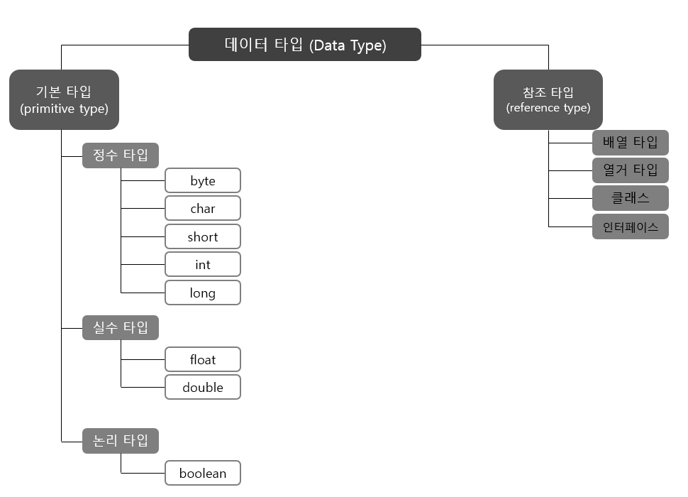

  기본 타입으로 선언된 변수와 참조 타입으로 선언된 변수의 차이점은 저장되는 값이 무엇이냐이다.
<b>기본타입을 이용해서 선언된 변수는 실제 값을 변수 안에 저장</b>하지만, <b>참조타입을 이용해서 선언된 변수는 <u>메모리의 번지를 값으로 갖는다.</u></b> 번지를 통해 객체를 참조한다는 뜻에서 참조 타입이라고 부른다.

```java
// 기본 타입 변수
int age = 25;
double price = 100.5;

// 참조 타입 변수
String name = "신용권";
String hobby = "독서";
```

  메모리상에서 이 변수들이 갖는 값을 그림으로 표현하면 다음과 같다.
(변수가 스택 영역에 생성되고 객체는 힙 영역에 생성)


  int와 double 변수인 age와 price는 직접 값을 저장하고 있지만, String 클래스 변수인 name과 hobby는 힙 영역의 String <u>객체 주소 값을 가지고 있다.</u>

  주소를 통해 객체를 객체를 참조한다는 뜻에서 String 클래스 변수를 참조 타입 변수라고 한다. 


## 5.2 메모리 사용 영역

  본격적으로 참조 타입을 알아보기 전에 우선 JVM이 사용하는 메모리 영역에 대해서 알아보기로 하자. java.exe로 JVM이 시작되면 JVM은 운영체제에서 할당받은 메모리 영역(Runtime Data Area)을 다음과 같이 세부 영역으로 구분해서 사용한다.

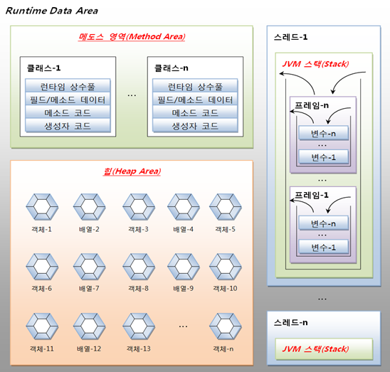


### 5.2.1 메소드(Method) 영역

  메소드 영역에서는 코드에서 사용되는 클래스(~.class)들을 클래스 로더로 읽어 클래스별로 런타임  상수풀(runtime constant pool), 필드(field) 데이터, 메소드(method) 데이터, 메소드 코드. 생성자(constuctor) 코드 등을 분류해서 저장한다.

  메소드 영역은 JVM이 시작할 때 생성되고 모든 스레드가 공유하는 영역이다.

### 힙(Heap) 영역

  힙 영역은 객체와 배열이 생성되는 영역이다. 힙 영역에 생성된 객체와 배열은 JVM 스택 영역의 변수나 다른 객체의 필드에서 참조한다.

  참조하는 변수나 필드가 없다면 의미 없는 객체가 되기 때문에 이것을 쓰레기로 취급하고 JVM은 쓰레기 수집기(Garbage Collector)를 실행시켜 쓰레기 객체를 힙 영역에서 자동으로 제거한다.

  그렇기 때문에 개발자는 객체를 제거하기 위해 별도의 코드를 작성할 필요가 없다. 사실 자바는 코드로 객체를 직접 제거시키는 방법을 제공하지 않는다.


### JVM 스택(Stack) 영역

  JVM 스택 영역은 각 스레드마다 하나씩 존재하며 스레드가 시작될 때 할당된다. 자바 프로그램에서 추가적으로 스레드를 생성하지 않았다면 main 스레드만 존재하므로 JVM 스택도 하나이다.

  JVM 스택은 메소드를 호출할 때마다 프레임(Frame)을 추가(push)하고 메소드가 종료되면 해당 프레임을 제거(pop)하는 동작을 수행한다.

  프레임 내부에는 로컬 변수 스택이 있는데, 기본 타입 변수와 참조 타입 변수가 추가(push)되거나 제거(pop)된다.
변수가 이 영역에 생성되는 시점은 초기화 될 때, 즉 최초로 변수에 값이 저장될 때이다.
변수는 선언된 블록 안에서만 스택에 존재하고 블록을 벗어나면 스택에서 제거된다. 다음 코드를 보자.

```java
char v1 = 'A'			//1

if (v1=='A') {			//2
    int v2 = 100;
    double v3 = 3.14;
}

boolean v4 = true;		//3
```

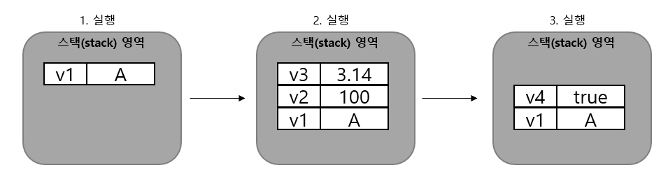

  기본 타입 변수는 스택 영역에 직접 값을 가지고 있지만, 참조 타입 변수는 값이 아니라 힙 영역이나 메소드 영역의 객체 주소를 가진다.

```java
int[] scores = {10, 20, 30};
```

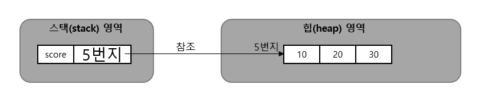


## 5.3 참조 변수의 ==, != 연산

  참조 타입 변수들 간의 ==, != 연산은 동일한 객체를 참조하는지, 다른 객체를 참조하는지 알아볼 때 사용된다.
참조 타입 변수의 값은 힙 영역의 객체 주소이므로 결국 주소 값을 비교하는 것이 된다.

  동일한 주소 값을 갖고 있다는 것은 동일한 객체를 참조한다는 의미이다. 따라서 동일한 객체를 참조하고 있을 경우 == 연산의 결과는 true이고 != 연산의 결과는 false이다.


## 5.4 null과 NullPointerException

  참조 타입 변수는 힙 영역의 객체를 참조하지 않는다는 뜻으로 null 값을 가질 수 있다. null 값도 초기값으로 사용할 수 있기 때문에 null로 초기화된 참조 변수는 스택 영역에 생성된다.
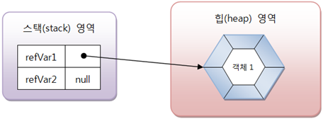

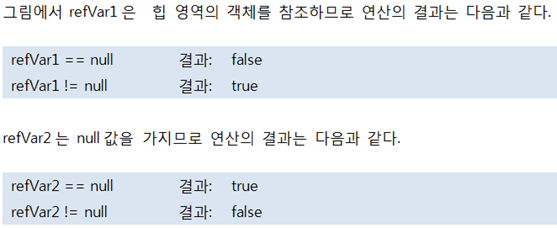


  자바는 프로그램 실행 도중에 발생하는 오류를 예외(Exception)라고 부른다. 예외는 사용자의 잘못된 입력으로 발생할 수도 있고, 프로그래머가 코드를 잘못 작성해서 발생할 수도 있다.

  참조 변수를 사용하면서 가장 많이 발생하는 예외 중 하나로 NullPointerException이 있다. 이 예외는 참조 타입 변수를 잘못 사용하면 발생한다.

  참조 타입 변수가 null을 가지고 있을 경우, 참조 타입 변수는 사용할 수 없다. 참조 타입 변수를 사용하는 것은 곧 객체를 사용하는 것을 의미하는데, 참조할 객체가 없으므로 사용할 수가 없는 것이다.

  그러나 프로그래머의 실수로 null 값을 가지고 있는 참조 타입 변수를 사용하면 NullPointerException이 발생한다.

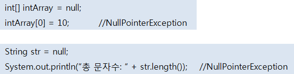


## 5.5 String 타입

  자바는 문자열을 String 변수에 저장하기 때문에 다음과 같이 String 변수를 우선 선언해야 한다.
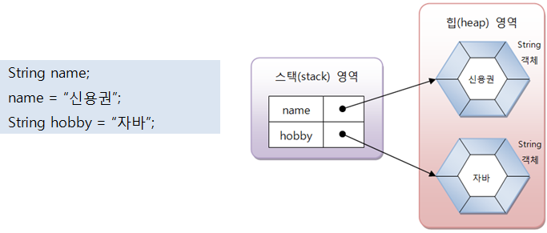

  문자열은 String 객체로 생성되고 <b>변수는 String 객체를 참조한다.</b>
name 변수와 hobby 변수에는 String 객체의 주소 값이 저장된다.

  자바는 문자열 리터럴이 동일하다면 String 객체를 공유하도록 되어 있다. 다음과 같이 name1과 name2 변수가 동일한 문자열 리터럴인 "신용권"을 참조할 경우 name1과 name2는 동일한 String 객체를 참조하게 된다.
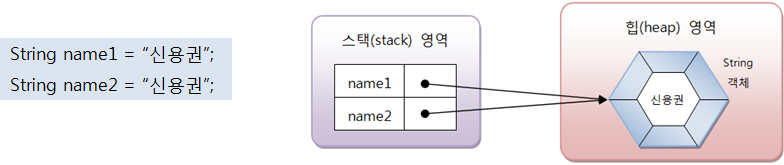

  일반적으로 변수에 문자열을 저장할 경우에는 문자열 리터럴을 사용하지만, new 연산자를 사용해서 직접 String 객체를 생성시킬 수도 있다.

  new 연산자는 힙 영역에 새로운 객체를 만들 때 사용하는 연산자로 <b>객체 생성 연산자</b>라고 한다.

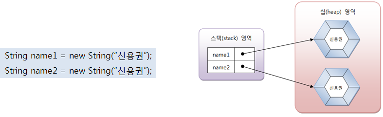

- String객체를 생성한뒤 주소값을 리턴한다.


  동일한 String 객체이건 다른 String 객체이건 상관없이 문자열만을 비교할 때에는 String 객체의 equals() 메소드를 사용해야 한다. equals() 메소드는 원본 문자열과 매개값으로 주어진 비교 문자열이 동일한지 비교한 후 true 또는 false를 리턴한다.

- [StringEqualsExample.java] 문자열 비교

  ```java
  public class StringEqualsExample {
      public static void main(String[] args) {
          String strVar1 = "신민철";
          String strVar2 = "신민철";
  
          if(strVar1 == strVar2) {
              System.out.println("strVar1과 strVar2는 참조가 같음");
          }
          else {
              System.out.println("strVar1과 strVar2는 참조가 다름");
          }
  
          if(strVar1.equals(strVar2)) {
              System.out.println("strVar1과 strVar2는 문자열이 같음");
          }
  
          String strVar3 = new String("신민철");
          String strVar4 = new String("신민철");
  
          if(strVar3 == strVar4) {
              System.out.println("strVar3과 strVar4는 참조가 같음");
          }
          else {
              System.out.println("strVar3과 strVar4는 참조가 다름");
          }
  
          if(strVar3.equals(strVar4)) {
              System.out.println("strVar3과 strVar4는 문자열이 같음");
          }
      }
  }
  ```

  - 출력결과

    strVar1과 strVar2는 참조가 같음

    strVar1과 strVar2는 문자열이 같음

    strVar3과 strVar4는 참조가 다름

    strVar3과 strVar4는 문자열이 같음


  String 변수는 참조 타입이므로 초기값으로 null을 대입할 수 있다. null은 String 변수가 참조하는 String 객체가 없다는 뜻이다.

```java
String hobby = null;
```

  다음 코드처럼 hobby 변수가 String 객체를 참조하였으나, null을 대입함으로써 더 이상 String 객체를 참조하지 않도록 할 수도 있다.

```java
String hobby = "여행";
hobby = null;
```

  JVM은 참조되지 않은 객체를 쓰레기 객체로 취급하고 쓰레기 수집기를 구동시켜 메모리에서 자동 제거한다.


## 5.6 배열 타입

### 5.6.1 배열이란?

  배열이란 <b>같은 타입의 데이터를 연속된 공간에 저장</b>하는 자료구조이다.
각 데이터 저장 위치는 인덱스를 부여해 접근할 수 있다.
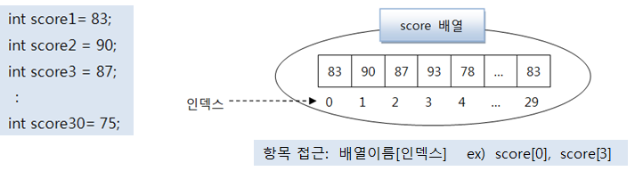


### 5.6.2 배열 선언

  배열을 사용하기 위해서는 우선 배열 변수를 선언해야 한다. 배열 변수 선언은 다음과 같이 두 가지 형태로 작성할 수 있다.
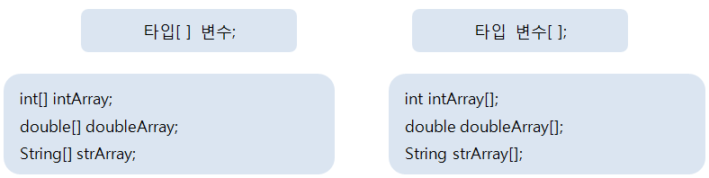

  배열 변수는 참조 변수에 속한다. 배열도 객체이므로 힙 영역에 생성되고 배열 변수는 힙 영역의 배열 객체를 참조하게 된다. 참조할 배열 객체가 없다면 배열 변수는 null 값으로 초기화될 수 있다.

배열 변수가 null 값을 가진 상태에서 변수[인덱스]로 값을 읽거나 저장하게 되면 NullPointerException이 발생한다. <b>배열 변수는 배열을 생성하고 참조하는 상태에서 값을 저장하거나 읽어야 한다.</b>


### 5.6.3 값 목록으로 배열 생성

  배열 항목에 저장될 값의 목록이 있다면, 다음과 같이 간단하게 배열 객체를 만들 수 있다.
(<u>변수 선언과 동시에 값 목록 대입</u>)

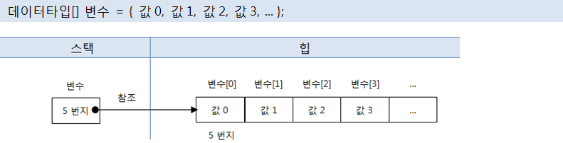

  중괄호는 주어진 값들을 항목으로 가지는 배열 객체를 힙에 생성하고, 배열 객체의 번지를 리턴한다.
<b>배열 변수는 리턴된 번지를 저장함으로써 참조가 이루어진다.</b>

- [ArrayCreateByValueListExample1.java] 값 목록으로 배열 생성

  ```java
  public class ArrayCreateByValueListExample1 {
      public static void main(String[] args) {
          int[] scores = { 83, 90, 87 };
  
          System.out.println("scores[0] : " + scores[0]);
          System.out.println("scores[1] : " + scores[1]);
          System.out.println("scores[2] : " + scores[2]);
  
          int sum = 0;
          for(int i=0; i<3; i++) {
              sum += scores[i];
          }
          System.out.println("총합 : " + sum);
          double avg = (double)sum / 3;
          System.out.println("평균 : " + avg);
      }
  }
  ```

  - 출력결과
    scores[0] : 83

    scores[1] : 90

    scores[2] : 87

    총합 : 260

    평균 : 86.66666666666667


  값의 목록으로 배열 객체를 생성할 때 주의할 점이 있는데, 배열 변수를 이미 선언한 후에 다른 실행문에서 중괄호를 사용한 배열 생성은 허용되지 않는다.

```java
타입[] 변수;
변수 = { 값0, 값1, 값2, 값3, ... };	//컴파일 에러
```


  <b>배열 변수를 미리 선언한 후, 값 목록들이 나중에 결정되는 상황</b>이라면 다음과 같이 new 연산자를 사용해서 값 목록을 지정해주면 된다.
(<u>변수 선언후 값 목록 대입</u>)

```java
String[] names = null;
names = new String[] {"신용권", "홍길동", "감자바"};
```

  메소드의 매개값이 배열일 경우에도 마찬가지이다.
매개 변수로 int[] 배열이 선언된 add() 메소드가 있을 경우, 값 목록으로 배열을 생성함과 동시에 add() 메소드의 매개값으로 사용하고자 할 때는 반드시 new 연산사를 사용해야 한다.

- [ArrayCreateByValueListExample2.java] 값의 리스트로 배열 생성

  ```java
  public class ArrayCreateByValueListExample2 {
      public static void main(String[] args) {
          int[] scores;
          scores = new int[] { 83, 90, 87 };
          int sum1 = 0;
          for(int i=0; i<3; i++) {
              sum1 += scores[i];
          }
          System.out.println("총합 : " + sum1);
  
          int sum2 = add( new int[] { 83, 90, 87 } );
          System.out.println("총합 : " + sum2);
          System.out.println();
      }
  
      public static int add(int[] scores) {
          int sum = 0;
          for(int i=0; i<3; i++) {
              sum += scores[i];
          }
          return sum;
      }
  }
  ```

  - 출력결과

    총합 : 260

    총합 : 260


### 5.6.4 new 연산자로 배열 생성

  값의 목록을 가지고 있지 않지만, 향후 값들을 저장할 배열을 미리 만들고 싶다면 new 연산자로 다음과 같이 배열 객체를 생성시킬 수 있다.
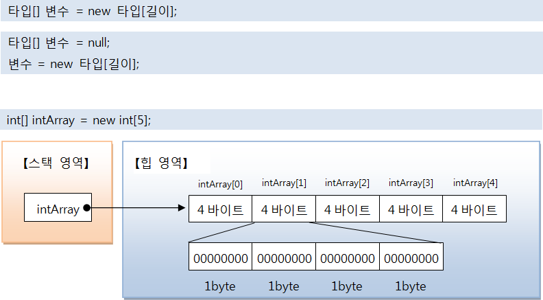

  new 연산자로 배열을 처음 생성할 경우, 배열은 자동적으로 기본값(0)으로 초기화 된다.


  다음은 타입별로 배열의 초기값을 보여준다.
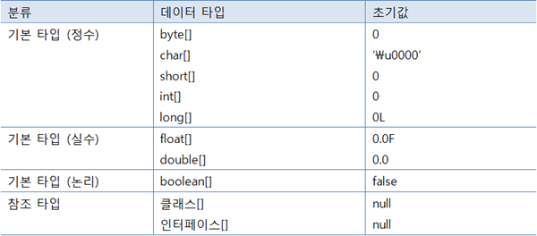


- [ArrayCreateByNewExample.java] new 연산자로 배열 생성

  ```java
  public class ArrayCreateByNewExample {
      public static void main(String[] args) {
          //int 타입의 값들을 저장하는 배열 선언
          int[] arr1 = new int[3];
          for(int i=0; i<3; i++) {
              System.out.println("arr1[" + i + "] : " + arr1[i]);
          }
          arr1[0] = 10;
          arr1[1] = 20;
          arr1[2] = 30;
          for(int i=0; i<3; i++) {
              System.out.println("arr1[" + i + "] : " + arr1[i]);
          }
  
          //double 타입의 값들을 저장하는 배열 선언
          double[] arr2 = new double[3];
          for(int i=0; i<3; i++) {
              System.out.println("arr2[" + i + "] : " + arr2[i]);
          }
          arr2[0] = 0.1;
          arr2[1] = 0.2;
          arr2[2] = 0.3;
          for(int i=0; i<3; i++) {
              System.out.println("arr2[" + i + "] : " + arr2[i]);
          }
  
          //String 타입의 값들을 저장하는 배열 선언
          String[] arr3 = new String[3];
          for(int i=0; i<3; i++) {
              System.out.println("arr3[" + i + "] : " + arr3[i]);
          }
          arr3[0] = "1월";
          arr3[1] = "2월";
          arr3[2] = "3월";
          for(int i=0; i<3; i++) {
              System.out.println("arr3[" + i + "] : " + arr3[i]);
          }
      }
  }
  ```

  - 출력결과
    arr1[0] : 0

    arr1[1] : 0

    arr1[2] : 0

    arr1[0] : 10

    arr1[1] : 20

    arr1[2] : 30

    arr2[0] : 0.0

    arr2[1] : 0.0

    arr2[2] : 0.0

    arr2[0] : 0.1

    arr2[1] : 0.2

    arr2[2] : 0.3

    arr3[0] : null

    arr3[1] : null

    arr3[2] : null

    arr3[0] : 1월

    arr3[1] : 2월

    arr3[2] : 3월


### 5.6.5 배열 길이

  배열의 길이랑 배열에 저장할 수 있는 전체 항목 수를 말한다.

```java
int[] intArray = { 10, 20, 30 };
int num = intArray.lenth;		//num=3
```

  length 필드는 읽기 전용 필드이기 때문에 값을 바꿀 수가 없다.

```java
intArray.length = 10;			//잘못된 코드
```

  배열의 길이는 for문의 조건식에서 주로 사용한다.

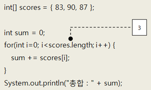


### 5.6.6 커맨드 라인 입력

  우리는 이제 프로그램 실행을 위해 main() 메소드가 필요하다는 것을 알고있다. 하지만 main() 메소드의 매개값인 String[] args가 왜 필요한 것인지 궁금하였을 것이다.

```java
public static void main(String[] args) { ... }
```

  "java 클래스"로 프로그램을 실행하면 JVM은 길이가 0인 String 배열을 먼저 생성하고 main() 메소드를 호출할 때 매개값으로 전달한다.

  만약 다음과 같이 "java 클래스"뒤에 공백으로 구분된 문자열 목록을 주고 실행하면, 문자열 목록으로 구성된 String[]배열이 생성되고 main() 메소드를 호출할 때 매개값으로 전달된다.

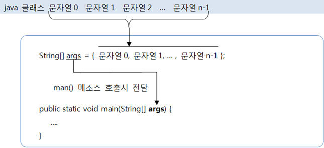

- [MainStringArrayArgument.java] main() 메소드의 매개 변수

  ```java
  public class MainStringArrayArgument {
      public static void main(String[] args) {
          if(args.length != 2) {                  //입력된 데이터의 개수가 두 개가 아닐 경우
              System.out.println("프로그램의 사용법");
              System.out.println("java MainStringArrayArgument num1 num2");
              System.exit(0);              //프로그램 강제 종료
          }
  
          String strNum1 = args[0];
          String strNum2 = args[1];
  
          int num1 = Integer.parseInt(strNum1);  //문자열을 정수로 변환
          int num2 = Integer.parseInt(strNum2);
  
          int result = num1 + num2;
          System.out.println(num1 + " + " + num2 + " = " + result);
      }
  }
  ```

  - 위의 예제를 그냥 실행한다면,

    <b>프로그램의 사용법</b>

    <b>java MainStringArrayArgument num1 num2</b>

    와 같은 결과를 얻는다.

  - 매개값을 주었을 경우,

    <b>10 + 20 = 30</b>


### 5.6.7 다차원 배열

  다차원 배열이란 2차원 배열 이상의 배열이다. (수학의 행렬과 같은 자료 구조)
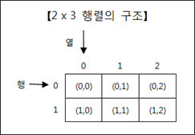


  자바는 1차원 배열을 이용하여 2차원 배열을 구현한다.

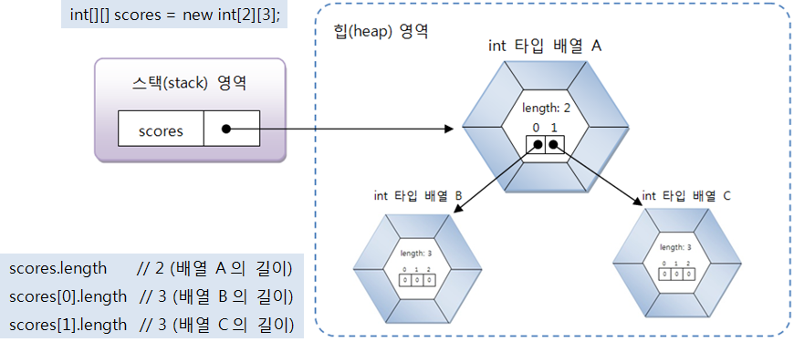


  자바는 일차원 배열이 서로 연결된 구조로 다차우너 배열을 구현하기 때문에 수학 행렬 구조가 아닌 계단식 구조를 가질 수 있다.

```java
int[][] scores = new int[2][];
scores[0] = new int[2];
scores[1] = new int[3];
```

```java
scores.length		//2
scores[0].length	//2    
scores[1].length	//3    
```


  만약 그룹화 된 값 목록을 가지고 있다면 다음과 같이 중괄호 안에 다시 중괄호를 사용해서 값 목록을 나열하면 된다.

```java
int[][] scores = { {95, 80}, {92, 96} };
```

  위 코드로 생성된 scores 배열에서 항목 값은 다음과 같이 읽을 수 있다.

```java
int score1 = scores[0][0];	//95
int score2 = scores[1][1];	//96
```

- [ArrayInArrayExample.java] 배열 속의 배열

  ```java
  public class ArrayInArrayExample {
      public static void main(String[] args) {
          int[][] mathScores = new int[2][3];
          for(int i=0; i<mathScores.length; i++) {
              for(int k=0; k<mathScores[i].length; k++) {
                  System.out.println("mathScores["+i+"]["+k+"]="+mathScores[i][k]);
              }
          }
          System.out.println();
  
          int[][] englishScores = new int[2][];
          englishScores[0] = new int[2];
          englishScores[1] = new int[3];
          for(int i=0; i<englishScores.length; i++) {
              for(int k=0; k<englishScores[i].length; k++) {
                  System.out.println("englishScores["+i+"]["+k+"]="+englishScores[i][k]);
              }
          }
          System.out.println();
  
          int[][] javaScores = { {95, 80}, {92, 96, 80} };
          for(int i=0; i<javaScores.length; i++) {
              for(int k=0; k<javaScores[i].length; k++) {
                  System.out.println("javaScores["+i+"]["+k+"]="+javaScores[i][k]);
              }
          }
      }
  }
  ```

  - 출력결과

    mathScores\[0][0]=0

    mathScores\[0][1]=0

    mathScores\[0][2]=0

    mathScores\[1][0]=0

    mathScores\[1][1]=0

    mathScores\[1][2]=0
    

    englishScores\[0][0]=0

    englishScores\[0][1]=0

    englishScores\[1][0]=0

    englishScores\[1][1]=0

    englishScores\[1][2]=0
    

    javaScores\[0][0]=95

    javaScores\[0][1]=80

    javaScores\[1][0]=92

    javaScores\[1][1]=96

    javaScores\[1][2]=80


### 5.6.8 객체를 참조하는 배열

  기본 타입(byte, char, short, int, long, float, double, boolean) 배열은 각 항목에 직접 값을 갖고 있지만,

  참조 타입(클래스, 인터페이스) 배열은 각 항목에 객체의 번지를 가지고 있다.


  따라서 String[] 배열의 각 항목도 결국 String 변수와 동일하게 취급되어야 한다.
예를 들어 Stringp[] 배열 항목 간에 문자열을 비교하기 위해서는 == 연산자 대신 equals() 메소드를 사용해야 한다.

  ==는 객체의 번지 비교이기 때문에 문자열 비교에 사용할 수 없다.

- [ArrayReferenceObjectExample.java] 객체를 참조하는 배열

  ```java
  public class ArrayReferenceObjectExample {
      public static void main(String[] args) {
          String[] strArray = new String[3];
          strArray[0] = "Java";
          strArray[1] = "Java";
          strArray[2] = new String("Java");
  
          System.out.println( strArray[0] == strArray[1] );
          System.out.println( strArray[0] == strArray[2] );
          System.out.println( strArray[0].equals(strArray[2]) );
      }
  }
  ```

  - 출력결과

    true

    false

    true


### 5.6.9 배열 복사

  배열은 한 번 생성하면 크기를 변경할 수 없기 때문에 더 많은 저장 공간이 필요하다면 보다 큰 배열을 새로 만들고 이전 배열로부터 항목 값들을 복사해야 한다.

  배열 간의 항목 값들을 복사하려면 for문을 사용하거나 System.arraycopy() 메소드를 사용하면 된다. for문으로 배열을 복사하는 코드는 다음과 같다.

- [ArrayCopyByForExample.java] for문으로 배열 복사

  ```java
  public class ArrayCopyByForExample {
      public static void main(String[] args) {
          int[] oldIntArray = { 1, 2, 3 };
          int[] newIntArray = new int[5];
  
          for(int i=0; i<oldIntArray.length; i++) {
              newIntArray[i] = oldIntArray[i];
          }
  
          for(int i=0; i<newIntArray.length; i++) {
              System.out.print(newIntArray[i] + ", ");
          }
      }
  }
  ```

  - 출력결과

    1, 2, 3, 0, 0, 


  이번에는 System.arraycopy() 메소드를 이용해서 배열을 복사해보자. 호출하는 방법은 다음과 같다.

```java
System.arraycopy(Object src, int srcPos, Object dest, int destPos, int length)
```

  src 는 원본 배열, srcPos는 원본배열에서 복사할 항목의 시작인덱스

  dest는 새 배열, destPos는 새 배열에서 붙여넣을 시작 인덱스이다.

  마지막으로 length는 복사할 개수이다.

  예를 들어 원본 배열이 arr1이고 새 배열이 arr2인 경우 arr1의 모든 항목을 arr2에 복사하려면 다음과 같이 호출하면 된다.

```java
System.arraycopy(arr1, 0, arr2, 0, arr1.length);
```

- [ArrayCopyExample.java] System.arraycopy()로 배열 복사

  ```java
  public class ArrayCopyExample {
      public static void main(String[] args) {
          String[] oldStrArray = { "java", "array", "copy" };
          String[] newStrArray = new String[5];
  
          System.arraycopy( oldStrArray, 0, newStrArray, 0, oldStrArray.length );
  
          for(int i=0; i<newStrArray.length; i++) {
              System.out.print(newStrArray[i] + ", ");
          }
      }
  }
  ```

  - 출력결과

    java, array, copy, null, null, 

  <b>참조 타입 배열일 경우, 배열 복사가 되면 복사되는 값이 객체의 번지이므로 새 배열의 항목은 이전 배열의 항목이 참조하는 객체와 동일하다. 이것을 얕은 복사(shallow copy)라고 한다.  반대로 깊은 복사(deep copy)는 참조하는 객체도 별도로 생성하는 것을 말한다.</b>


### 5.6.10 향상된 for문

  자바 5부터 배열 및 컬렉션 객체(15장)를 좀 더 쉽게 처리할 목적으로 향상된 for문을 제공한다. 향상된 for문은 반복 실행을 하기 위해 카운터 변수와 증감식을 사용하지 않는다.
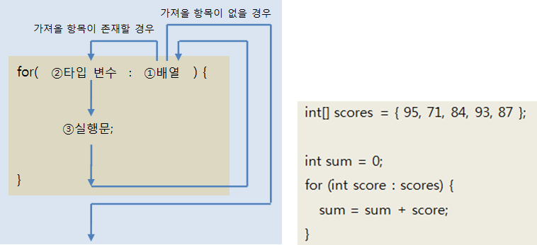

- [AdvanceForExample.java] 향상된 for문

  ```java
  public class AdvanceForExample {
      public static void main(String[] args) {
          int[] scores = { 95, 71, 84, 93, 87 };
  
          int sum = 0;
          for(int score : scores) {
              sum += score;
          }
          System.out.println("점수 총합 = " + sum);
  
          double avg = (double)sum / scores.length;
          System.out.println("점수 평균 = " + avg);
      }
  }
  ```

  - 출력결과

    점수 총합 = 430

    점수 평균 = 86.0


## 5.7 열거 타입

  데이터 중에는 몇 가지로 한정된 값만을 갖는 경우가 흔히 있다. 예를 들어 요일에 대한 데이터는 월, 화, 수, 목, 금, 토, 일이라는 일곱 개의 값만을 갖고,

  계절에 대한 데이터는 봄, 여름, 가을, 겨울이라는 네 개의 값만 가진다. 이와 같이 한정된 값만을 갖는 데이터 타입이 열거 타입(enumeration type)이다. 

  열거 타입은 몇 개의 열거 상수(enumeration constant) 중에서 하나의 상수를 저장하는 데이터 타입이다.


### 5.7.1 열거 타입 선언

  열거 타입을 선언하기 위해서는 먼저 열거 타입의 이름을 정하고 열거 타입 이름으로 소스 파일(.java)을 생성해야 한다.

  열거 타입 이름은 관례적으로 첫 문자를 대문자로 하고 나머지는 소문자로 구성한다.
만약 여러 단어로 구성된 이름이라면 단어 첫 문자는 대문자로 하는 것이 관례이다. 다음은 잘 만들어진 열거 타입 소스 파일들의 이름이다.

```java
Week.java
MemberGrade.java
ProductKind.java
```


  소스 파일의 내용으로는 다음과 같이 열거 타입 선언이 온다.
<b>public enum 키워드는 열거 타입을 선언하기 위한 키워드이다. 반드시 소문자로 작성해야 한다.</b>

  <b>열거 타입 이름은 소스 파일명과 대소문자가 모두 일치해야 한다.</b>


  열거 타입을 선언했다면 이제는 열거 상수를 선언하면 된다.
열거 상수는 열거 타입의 값으로 사용되는데, 관례적으로 열거 상수는 모두 대문자로 작성한다.
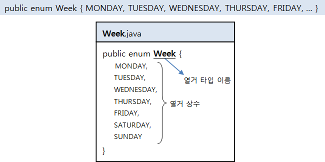

  만약 열거 상수가 여러 단어로 구성될 경우에는 단어 사이를 밑줄(_)로 연결하는 것이 관례이다. 예를 들면 다음과 같다.


- [Week.java] 열거 타입 선언

  ```java
  public enum Week {
      MONDAY,
      TUESDAY,
      WEDNESDAY,
      THURSDAY,
      FRIDAY,
      SATURDAY,
      SUNDAY
  }
  ```

  

### 5.7.2 열거 타입 변수

  열거 타입을 선언했다면 이제 열거 타입을 사용할 수 있다. 열거 타입도 하나의 데이터 타입 이므로 변수를 선언하고 사용해야 한다. 다음은 열거 타입 변수를 선언하는 방법이다.
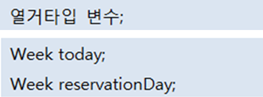

  열거 타입 변수를 선언했다면 다음과 같이 열거 상수를 저장할 수 있다. 열거 상수는 단독으로 사용할 수는 없고 반드시 열거타입.열거상수로 사용된다.

  예를 들어 today 열거 변수에 열거 상수인 SUNDAY를 저장하면 다음과 같다.
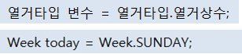

  열거 타입 변수는 null 값을 저장할 수 있는데 열거 타입도 참조 타입이기 때문이다.


  참조 타입 변수는 객체를 참조하는 변수라고 알고있는데, 그렇다면 열거 상수는 객체일까? 그렇다.

  열거 상수는 열거 객체로 생성된다. 열거 타입 Week의 경우 MONDAY부터 SUNDAY까지의 열거 상수는 다음과 같이 총 7개의 Week 객체로 생성된다.

  그리고 메소드 영역에 생성된 열거 상수가 해당 Week 객체를 각각 참조하게 된다.

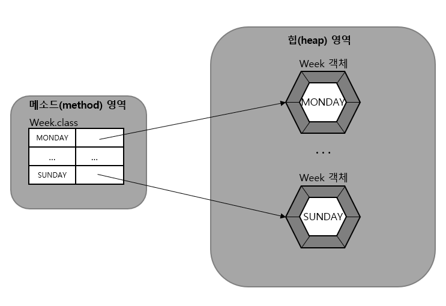

  그렇다면 다음 코드를 어떻게 이해하면 좋을까?

```java
Week today = Week.SUNDAY;
```

  열거 타입 변수 today는 스택 영역에 생성된다. today에 저장되는 값은 Week.SUNDAY 열거 상수가 잠초하는 객체의 번지이다.

  따라서 열거 상수 Week.SUNDAY와 today 변수는 서로 같은 Week 객체를 참조하게 된다.
그렇기 때문에 today 변수와 Week.SUNDAY 상수의 == 연산 결과는 true가 된다.
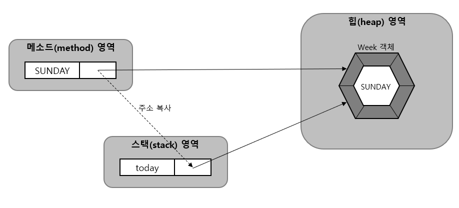


```java
today == Week.SUNDAY //true
```

  다음의 코드에서 week1과 week2는 모두 Week.SATURDAY 상수와 같이 동일한 Week 객체 참조하기 때문에 ==연산 결과는 true가 된다.

```java
Week week1 = Week.SATURDAY;
Week week2 = Week.SATURDAY;
System.out.println( week1 == week2 );	//true
```


  자바는 컴퓨터의 날짜 및 요일, 시간을 프로그램에서 사용할 수 있도록 하기 위해 Data, Calendar, LocalDateTime 등의 클래스를 제공한다.

  LocalDateTime은 자바 8부터 지원하는 API이다. 이전 버전과 호환성을 위해 Calendar를 이용해서 날짜와 시간을 얻는 방법을 알아보자.

  우선 Calendar 변수를 선언하고 Calendar.getInstance() 메소드가 리턴하는 Calendar 객체를 얻는다.

```java
Calendar now = Calendar.getInstance();
```

   Calendar 객체를 얻었다면 get() 메소드를 이용해서 년, 월, 일, 요일, 시간, 분, 초를 다음과 같이 얻을 수 있다.

 ```java
int year = now.get(Calendar.YEAR);				//년
int month = now.get(Calendar.MONTH) + 1;		//월(1~12)
int year = now.get(Calendar.DAY_OF_MONTH);		//일
int year = now.get(Calendar.DAY_OF_WEEK);		//요일(1~7)
int year = now.get(Calendar.HOUR);				//시간
int year = now.get(Calendar.MINUTE);			//분
int year = now.get(Calendar.SECOND);			//초
 ```

  Calendar를 이용해서 오늘의 요일을 얻고 나서 열거 타입 변수 today에 해당 열거 상수를 대입하는 예제를 살펴보자.

- [EnumWeekExample.java] 열거 타입과 열거 상수

  ```java
  import java.util.Calendar; //java.util 패키지에 있는 Calendar 클래스를 import
  
  public class EnumWeekExample {
      public static void main(String[] args) {
          Week today = null;  //열거 타입 변수 선언
  
          Calendar cal = Calendar.getInstance();
          int week = cal.get(Calendar.DAY_OF_WEEK);   //일(1)~토(7)까지의 숫자를 리턴
  
          switch (week) {
              case 1:
                  today = Week.SUNDAY; break;
              case 2:
                  today = Week.MONDAY; break;
              case 3:
                  today = Week.TUESDAY; break;
              case 4:
                  today = Week.WEDNESDAY; break;
              case 5:
                  today = Week.THURSDAY; break;
              case 6:
                  today = Week.FRIDAY; break;
              case 7:
                  today = Week.SATURDAY; break;
          }
  
          System.out.println("오늘 요일: " + today);
  
          if(today == Week.SUNDAY) {
              System.out.println("일요일에는 축구를 합니다.");
          }
          else {
              System.out.println("열심히 자바 공부를 합니다.");
          }
      }
  }
  ```

  - 출력결과

    오늘 요일: THURSDAY

    열심히 자바 공부를 합니다.


### 5.7.3 열거 객체의 메소드

  열거 객체는 열거 상수의 문자열을 내부 데이터로 가지고 있다. 
아래 그림은 열거 객체가 가지는 데이터 및 메소드들을 보여준다. 메소드는 java.lang.Enum 클래스에 선언된 메소드인데, 열거 객체에서 사용할 수 있는 이유는

  <b>모든 열거 타입은 컴파일 시에 Enum 클래스를 상속하게 되어 있기 때문이다.</b>
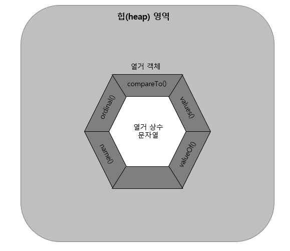

| 리턴 타입 | 메소드(매개 변수)    | 설명                                  |
| --------- | -------------------- | ------------------------------------- |
| String    | name()               | 테스트3                               |
| int       | ordinal              | 열거 객체의 순번(0부터 시작)을 리턴   |
| 테스트1   | compareTo()          | 열거 객체를 비교해서 순번 차이를 리턴 |
| 열거 타입 | valueOf(String name) | 주어진 문자열의 열거 객체를 리턴      |
| 열거 배열 | values()             | 모든 열거 객체들을 배열로 리턴        |


### name() 메소드

  name() 메소드는 열거 객체가 가지고 있는 문자열을 리턴한다.
이때 리턴되는 문자열은 열거 타입을 정의할 때 사용한 상수 이름과 동일하다.

 아래 코드는 today가 참조하는 열거 객체에서 name() 메소드를 호출하여 문자열을 얻어낸다.
name() 메소드는 열거 객체 내부의 문자열인 "SUNDAY"를 리턴하고 name변수에 저장한다.

```java
Week today = Week.SUNDAY;
String name = today.name();
```


### ordinal() 메소드

  ordinal() 메소드는 전체 열거 객체 중 몇 번째 열거 객체인지 알려준다. 열거 객체의 순번은 열거 타입을 정의할 때 주어진 순번을 말한다.

```java
Week today = Week.SUNDAY
int ordinal = today.ordinal();
```

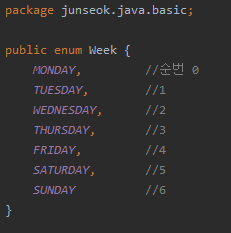


### compareTo() 메소드

  compareTo() 메소드는 매개값으로 주어진 열거 객체를 기준으로 전후로 몇 번째 위치하는 지를 비교한다. 
만약 열거 객체가 매개값의 열거 객체보다 순번이 빠르다면 음수가, 순번이 늦다면 양수가 리턴된다.

```java
Week day1 = Week.MONDAY;
Week day2 = Week.WEDNESDAY;
int result1 = day1.compareTo(day2);	//-2
int result2 = day2.compareTo(day1);	//2
```


### valueOf() 메소드

  valueOf() 메소드는 매개값으로 주어지는 문자열과 동일한 문자열을 가지는 열거 객체를 리턴한다.
<b>이 메소드는 외부로부터 문자열을 입력받아 열거 객체로 변환할 때 유용하게 사용할 수 있다.</b>
다음 코드에서 weekDay 변수는 Week.SATURDAY 열거 객체를 참조하게 된다.

```java
Week weekDay = Week.valueOf("SATURDAY");
```


### values() 메소드

  values() 메소드는 열거 타입의 모든 열거 객체들을 배열로 만들어 리턴한다. 

```java
Week[] days = Week.values();
for(Week day : days) {
    System.out.println(day);
}
```

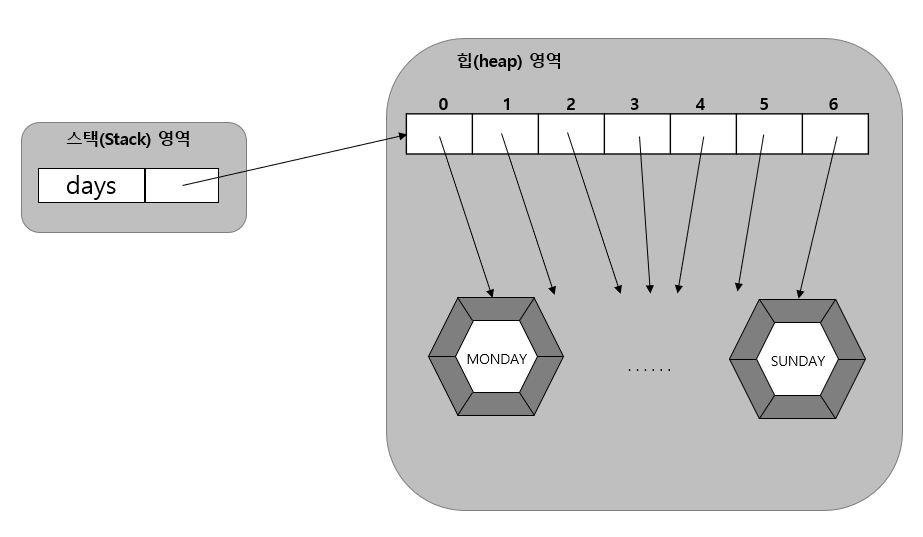

- [EnumMethodExample.java] 열거 객체의 메소드

  ```java
  public class EnumMethodExample {
      public static void main(String[] args) {
          //name() 메소드
          Week today = Week.SUNDAY;
          String name = today.name();
          System.out.println(name);
  
          //ordinal() 메소드
          int ordinal = today.ordinal();
          System.out.println(ordinal);
  
          //compareTo() 메소드
          Week day1 = Week.MONDAY;
          Week day2 = Week.WEDNESDAY;
          int result1 = day1.compareTo(day2);
          int result2 = day2.compareTo(day1);
          System.out.println(result1);
          System.out.println(result2);
  
          //valueOf() 메소드
          if(args.length == 1) {
              String strDay = args[0];
              Week weekDay = Week.valueOf(strDay);
              if(weekDay == Week.SATURDAY || weekDay == Week.SUNDAY) {
                  System.out.println("주말 이군요");
              }
              else {
                  System.out.println("평일 이군요");
              }
          }
  
          //values() 메소드
          Week[] days = Week.values();
          for(Week day : days) {
              System.out.println(day);
          }
      }
  }
  ```

  - 출력결과

    SUNDAY

    6

    -2

    2

    평일 이군요

    MONDAY

    TUESDAY

    WEDNESDAY

    THURSDAY

    FRIDAY

    SATURDAY

    SUNDAY
    