# 06. 클래스

## 6.1 객체 지향 프로그래밍

  현실 세계에서 어떤 제품을 만들 때, 부품을 먼저 개발하고 이 부품들을 하나씩 조립해서 완성된 제품을 만들 듯이, 소프트웨어를 개발할 때에도 부품에  해당하는 객체들을 먼저 만들고, 이것들을 하나씩 조립해서 완성된 프로그램을 만드는 기법을 객체 지향 프로그래밍(OOP : Object Oriented Programming)이라고 한다.

  객체 지향 프로그래밍을 이해하기 위해서는 우선 객체의 개념과 객체 상호작용에 대해서 알아두어야 한다.


### 6.1.1 객체란?

  객체(Object)란 물리적으로 존재하거나 추상적으로 생각할 수 있는 것 중에서 자신의 속성을 가지고 있고 다른 것과 식별 가능한 것을 말한다.
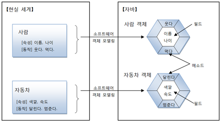

  객체는 속성과 동작으로 구성되어 있다. 예를 들어 사람은 이름, 나이 등의 속성과 웃다, 먹다 등의 동작이 있다.
자바는 이 속성과 동작들을 각각 필드(field)와 메소드(method)라고 부른다.

  현실세계의 객체를 소프트웨어 객체로 설계하는 것을 객체 모델링(Object Modeling)이라고 한다. 객체 모델링은 현실 세계 객체의 속성과 동작을 추려내어 소프트웨어 객체의 필드와 메소드로 정의하는 과정이라고 볼 수 있다.


### 6.1.2 객체의 상호작용

  객체들은 서로 간에 기능(동작)을 이용하고 데이터를 주고받는다.
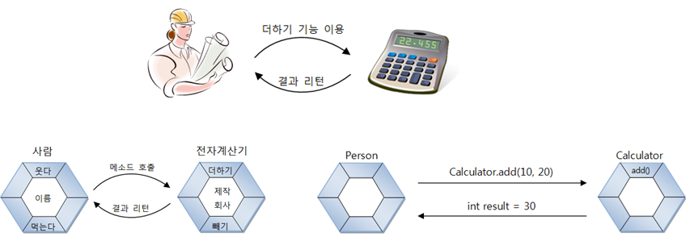

  객체들은 각각 독립적으로 존재하고, 다른 객체와 서로 상호작용하면서 동작한다. 객체들 사이의 <u>상호작용 수단은 메소드</u>이다. 객체가 다른 객체의 기능을 이용하는 것이 바로 메소드 호출이다.

```java
int result = Calculator.add(10, 20);
// 리턴한 값을 int형 변수 result에 저장
```

  객체의 상호작용은 객체 간의 메소드 호출을 의미하며 매개값과 리턴값을 통해서 데이터를 주고 받는다.


### 6.1.3 객체 간의 관계

  객체는 개별적으로 사용될 수 있지만, 대부분 다른 객체와 관계를 맺고 있다.
이 관계의 종류에는 <u>집합 관계, 사용 관계, 상속 관계</u>가 있다.

- 집합 관계 : 완성품과 부품의 관계
- 사용 관계 : 객체가 다른 객체를 사용하는 관계
- 상속 관계 : 종류 객체와 구체적인 사물 객체 관계
  


### 6.1.4 객체 지향 프로그래밍의 특징

#### 캡슐화(Encapsulation)

  캡슐화란 객체의 필드, 메소드를 하나로 묶고, 실제 구현 내용을 감춘것을 말한다.
외부 객체는 객체 내부 구조를 알지 못하며 객체가 노출해 제공하는 필드와 메소드만 이용할 수 있다.

  필드와 메소드를 캡슐화하여 보호하는 이유는 외부의 잘못된 사용으로 인해 객체가 손상되지 않도록하기 위함이다.

  자바 언어는 캡슐화된 맴버를 노출시킬 것인지 숨실 것인지 결정하기 위해 접근 제한자(Access Modifier)를 사용한다.
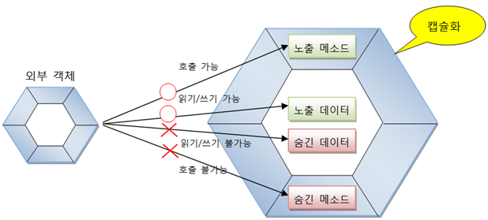


#### 상속(Inheritance)

  상위(부모) 객체의 필드와 메소드를 하위(자식) 객체에게 물려주는 행위이다.
하위 객체는 상위 객체를 확장해서 추가적인 필드와 메소드를 가질 수 있다.

- 상속 대상 : 필드와 메소드
- 상속의 효과
  - 상위 객체를 재사용해서 하위 객체를 빨리 개발 가능
  - 반복된 코드의 중복을 줄임
  - 유지 보수의 편리성 제공
  - 객체의 다형성 구현

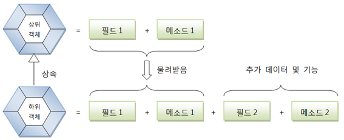


#### 다형성(Polymorphism)

  다형성은 같은 타입이지만 실행 결과가 다양한 객체를 이용할 수 있는 성질을 말한다.
코드 측면에서 보면 다형성은 하나의 타입에 여러 객체를 대입함으로써 다양한 기능을 이용할 수 있도록 해준다.

  자바는 다형성을 위해 부모 클래스 또는 인터페이스의 타입 변환을 허용한다.
부모 타입에는 모든 자식 객체가 대입될 수 있고, 인터페이스 타입에는 모든 구현 객체가 대입될 수 있다.

  다형성의 효과로 객체는 부품화가 가능하다.
예를 들어 자동차를 설계할 때 타이어 인터페이스 타입을 적용했다면 이 인터페이스를 구현한 실제 타이어들은 어떤 것이든 상관없이 장착(대입)이 가능하다.
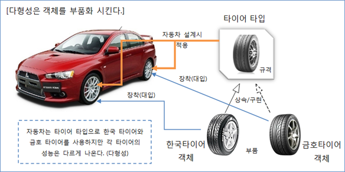


## 6.2 객체와 클래스

  현실세계에서는 설계도를 통해서 객체를 만들게 된다.
예를 들어 사람들이 자동차를 이용하기 위해서는 우선 공장에서 설계도를 보고 자동차를 만들어야 한다.

  객체 지향 프로그래밍에서도 마찬가지다. 
메모리에서 사용하고 싶은 객체가 있다면 우선 설계도로 새당 객체를 만드는 작업이 필요하다.

  자바에서는 설계도가 바로 클래스(class)이다. 클래스에는 객체를 생성하기 위한 필드와 메소드가 정의되어 있다.
클래스로부터 만들어진 객체를 해당 클래스의 인스턴스(instance)라고 한다.


## 6.3 클래스 선언

  사용하고자 하는 객체를 구상했다면, 그 객체의 대표 이름을 하나 결정하고 이것을 클래스 이름으로 한다.

  예를 들어 사람 객체의 클래스는 Person으로, 자동차 객체의 클래스는 Car라는 이름으로 줄 수 있다.

  <b>클래스 이름은 다른 클래스와 식별할 목적으로 사용되므로 자바의 식별자 작성 규칙에 따라서 만들어져야 한다.</b>
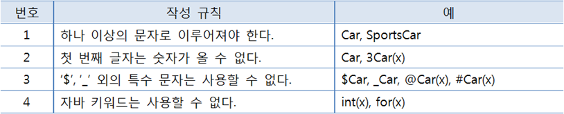

- 한글 이름도 가능하나, 영어 이름으로 작성
- 알파벳 대소문자는 서로 다른 문자로 인식
- 첫 글자와 연결된 다른 단어의 첫 글자는 대문자로 작성하는 것이 관례
  


  클래스 이름을 정했다면 "클래스이름.java"로 소스 파일을 생성해야 한다. 소스 파일 이름 역시 대소문자를 구분하므로 반드시 클래스 이름과 대소문자가 같도록 해야 한다.

  소스 파일을 생성했다면 소스 파일을 열고 다음과 같이 클래스를 선언해준다.

```java
public class 클래스이름 {
    
}
```

  여기서 public class 키워드는 클래스를 선언할 때 사용하며 반드시 소문자로 작성해야 한다.
클래스 이름 뒤에는 반드시 중괄호 {}를 붙여주는데, 중괄호 시작 {은 클래스 선언의 시작을 알려주고 중괄호 끝 }은 클래스 선언의 끝을 알려준다.

  다음은 Car 클래스를 선언할 것이다.

```java
public class Car {
}
```

  일반적으로 소스 파일당 하나의 클래스를 선언한다. 하지만 두 개 이상의 클래스 선언도 가능하다.

```java
public class Car {    
}

class Tire {
}
```

- 소스 파일당 하나의 클래스를 선언하는 것이 관례
  - 두 개 이상의 클래스도 선언가능
  - 소스 파일 이름과 동일한 클래스만 public으로 선언 가능
  - 선언한 개수만큼 바이트 코드 파일이 생성
    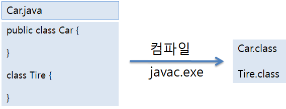


## 6.4 객체 생성과 클래스 변수

  클래스를 선언한 다음, 컴파일을 했다면 객체를 생성할 설계도가 만들어진 셈이다. 클래스로 부터 객체를 생성하는 방법은 다음과 같이 new 연산자를 사용하면 된다.

```java
new 클래스();
```

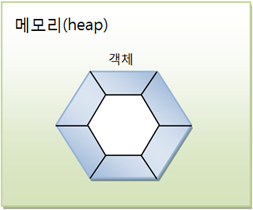

  new는 클래스로부터 객체를 생성시키는 연산자이다. new 연산자 뒤에는 생성자가 오는데, 생성자는 클래스() 형태를 가지고 있다. new연산자로 생성된 객체는 메모리 힙(heap)영역에 생성된다.

  new 연산자는 힙 영역에 객체를 생성시킨 후, 객체의 주소를 리턴하도록 되어있다. 이 주소를 참조 타입인 클래스 변수에 저장해 두면, 변수를 통해 객체를 사용할 수 있다.

```java
클래스 변수;
변수 = new 클래스();
```

  클래스 변수 선언과 객체 생성을 한 개의 실행문으로 작성할 수도 있다.

```java
클래스 변수 = new 클래스();
```

  이렇게 new 연산자로 객체를 생성하고 리턴된 객체의 주소를 변수에 저장하면 다음 그림과 같이 변수가 객체를 참조하게 된다.
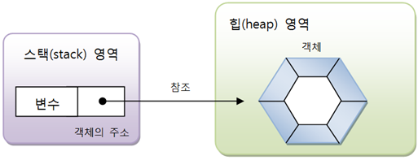

  클래스 선언에서 부터 생성까지 예제를 통해 익혀보자. 다음 예제는 Student 클래스를 선언하고 StudentExample 클래스의 main() 메소드에서 Student 객체를 생성한다.

- [Student.java] 클래스 선언

  ```java
  public class Student {
  }
  ```

- [StudentExample.java] 클래스로부터 객체 생성

  ```java
  public class StudentExample {
      public static void main(String[] args) {
          Student s1 = new Student();
          System.out.println("s1 변수가 Student 객체를 참조합니다.");
  
          Student s2 = new Student();
          System.out.println("s2 변수가 또 다른 Student 객체를 참조합니다.");
      }
  }
  ```

  - 출력결과

    s1 변수가 Student 객체를 참조합니다.

    s2 변수가 또 다른 Student 객체를 참조합니다.


  여기서 우리는 Student와 StudentExample 클래스의 용도에 대해 알아볼 필요가 있다. 클래스는 두 가지 용도가 있다. 하나는 라이브러리(API : Application Program Interface)용이고 다른 하나는 실행용이다.

  라이브러리 클래스는 다른 클래스에서 이용할 목적으로 설계된다. 프로그램 전체에서 사용되는 클래스가 100개라면 99개는 라이브러리이고 단 하나가 실행 클래스이다.

  실행 클래스는 프로그램의 실행 진입점인 main() 메소드를 제공하는 역할을 한다.
Student는 라이브러리 클래스이고 StudentExample은 실행 클래스이다.


## 6.5 클래스의 구성 맴버

  클래스에는 객체가 가져야할 구성 맴버가 선언된다.

- 필드(Field)
- 생성자(Constructor)
- 메소드(Method)

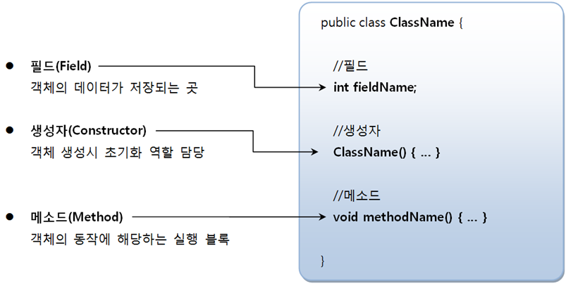


### 6.5.1 필드

  필드는 객체의 고유 데이터, 부품 객체, 상태 정보를 저장하는 곳이다. 선언 형태는 변수와 비슷하지만, 필드를 변수라고 부르지 않는다.

  변수는 생성자와 메소드 내에서만 사용되고 생성자와 메소드가 실행 종료되면 자동 소멸된다.

  하지만, 필드는 생성자와 메소드 전체에서 사용되며 객체가 소멸되지 않는 한 객체와 함께 존재한다.
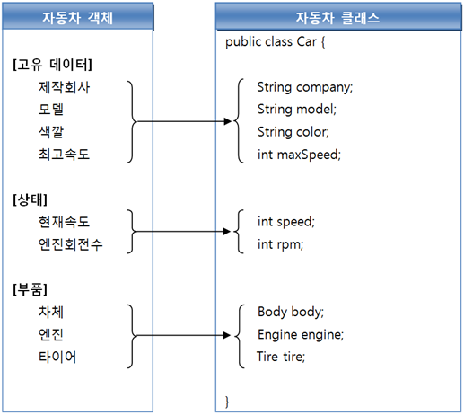


  초기화하지 않은 필드의 기본 초기값
(객체 생성시 자동으로 기본값으로 초기화)

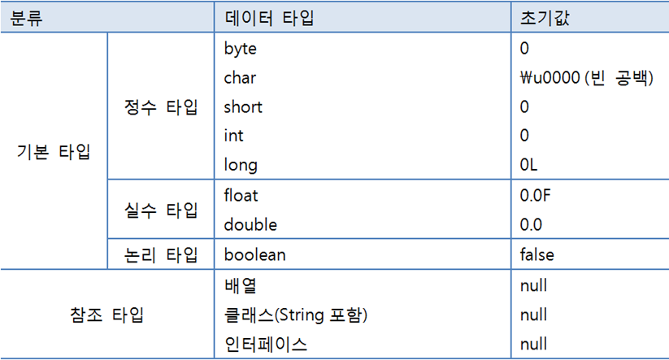


#### 필드 선언

  필드 선언은 클래스 중괄호 {} 블록 어디서근 존재할 수 있다. 생성자 선언과 메소드 선언의 앞과 뒤 어떤 곳에서도 필드 선언이 가능하다. 하지만 생성자와 메소드 중괄호 블록 내부에는 선언될 수 없다.

  <b>생성자와 메소드 중괄호 블록 내부에 선언된 것은 모두 로컬 변수가 된다.</b> 필드 선언은 변수의 선언 형태와 비슷하다.


#### 필드 사용

  필드를 사용한다는 것은 필드값을 읽고, 변경하는 작업을 말한다.
클래스 내부의 생성자나 메소드에서 사용할 경우 단순히 필드 이름으로 읽고 변경하면 되지만, 
클래스 외부에서 사용할 경우 우선적으로 클래스로부터 객체를 생성한 뒤 필드를 사용해야 한다.

  <b>그 이유는 필드는 객체에 소속된 테이터이므로 객체가 존재하지 않으면 필드도 존재하지 않기 때문이다.</b>

- 필드 사용 위치

  - 객체 내부 : "필드이름" 으로 바로 접근

  - 객체 외부 : "변수.필드이름" 으로 접근

    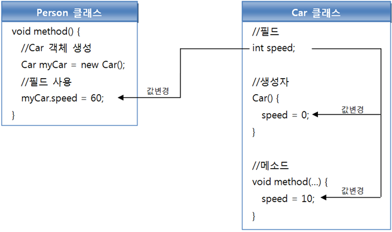


- [Car.java] Car 클래스 필드 선언

  ```java
  public class Car {
      //필드
      String company = "현대자동차";
      String model = "그랜저";
      String color = "검정";
      int maxSpeed = 350;
      int speed;
  }
  ```

- [CarExample.java] 외부 클래스에서 Car 필드값 읽기와 변경

  ```java
  public class CarExample {
      public static void main(String[] args) {
          //객체 생성
          Car myCar = new Car();
  
          //필드값 읽기
          System.out.println("제작 회사: " + myCar.company);
          System.out.println("모델명: " + myCar.model);
          System.out.println("색깔: " + myCar.color);
          System.out.println("최고속도: " + myCar.maxSpeed);
          System.out.println("현재속도: " + myCar.speed);
  
          //필드값 변경
          myCar.speed = 60;
          System.out.println("수정된 속도: " + myCar.speed);
      }
  }
  ```

  

### 6.5.2 생성자

  생성자는 new 연산자로 호출되는 특별한 중괄호 {} 블록이다. 생성자의 역할은 객체 생성 시 초기화를 담당한다.

  필드를 초기화하거나, 메소드를 호출해서 객체를 사용할 준비를 한다. 생성자는 메소드와 비슷하게 생겼지만, 클래스 이름으로 되어 있고 리턴 타입이 없다.

  생성자를 실행시키지 않고는 클래스로부터 객체를 만들 수 없다. new 연산자에 의해 생성자가 성공적으로 실행되면 힙(heap) 영역에 객체가 생성되고 객체의 주소가 리턴된다.

  리턴된 객체의 주소는 클래스 타입 변수에 저장되어 객체에 접근할 때 이용된다. 만약 생성자가 성공적으로 실행되지 않고 예외(에러)가 발생했다면 객체는 생성되지 않는다.


#### 기본 생성자

  모든 클래스는 생성자가 반드시 존재하며, 하나 이상을 가질 수 있다.
<b>우리가 클래스 내부에 생성자 선언을 생략했다면, 컴파일러는 다음과 같이 중괄호 {} 블록 내용이 비어 있는 기본 생성자(Default Constructor)를 바이트 코드에 자동 추가 시킨다.</b>

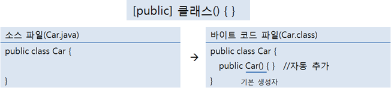

  클래스가 public class로 선언되면 기본 생성자에서도 public이 붙지만, 클래스가 public 없이 class로만 선언되면 기본 생성자에도 public이 붙지 않는다.

  <b>클래스에 명시적으로 선언한 생성자가 한 개라도 있으면, 컴파일러는 기본 생성자를 추가하지 않는다.</b>
명시적으로 생성자를 선언하는 이유는 객체를 다양하게 초기화하기 위해서이다. 그럼 생성자를 명시적으로 선언하는 방법에 대해 알아보자


#### 생성자 선언

  기본 생성자 대신 우리가 생성자를 명시적으로 선언하려면 다음과 같은 형태로 작성하면 된다.


  생성자는 메소드와 비슷한 모양을 가지고 있으나, 리턴 타입이 없고 클래스 이름과 동일하다.

  생성자 블록 내부에는 객체 초기화 코드가 작성되는데, <u>일반적으로 필드에 초기값을 저장하거나 메소드를 호출하여 객체 사용 전에 필요한 준비를 한다.</u>

  매개 변수 선언은 생략할 수도 있고, 여러 개를 선언해도 좋다. 매개 변수는 new 연산자로 생성자를 호출할 때 외부의 값을 생성자 블록 내부로 전달하는 역할을 한다.

  예를 들어 다음과 같이 Car생성자를 호출할 때 세 개의 값을 제공한다고 보자.


  두개의 매개 값은 String 타입이고 마지막 매개값은 int 타입인 것을 볼 수 있다. 세 매개값을 생성자가 받기 위해서는 다음과 같이 생성자를 선언해야 한다.

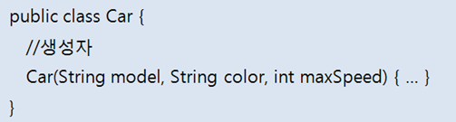


  클래스에 생성자가 명시적으로 선언되어 있을 경우에는 반드시 선언된 생성자를 호출해서 객체를 생성해야만 한다.

  다음 예제를 보면 Car 클래스에 생성자 선언이 있기 때문에 기본 생성자(Car())를 호출해서 객체를 생성할 수 없고 Car(String color, int cc)를 호출해서 객체를 생성해야 한다.

- [Car2.java] 생성자 선언

  ```java
  public class Car2 {
      //생성자
      Car2(String color, int cc) {
      }
  }
  ```

- [CarExample2.java] 생성자를 호출해서 객체 생성

  ```java
  public class CarExample2 {
      public static void main(String[] args) {
          Car2 myCar2 = new Car2("검정", 3000);
          //Car myCar2 = new Car2();  //기본 생성자를 호출할 수 없다.
      }
  }
  ```


#### 필드 초기화

  초기화 없이 선언된 필드는 객체가 생성될 때 기본값으로 자동 설정된다.

- 다른 값으로 필드 초기화하는 방법
  - 필드 선언할 때 초기값 설정
  - 생성자의 매개값으로 초기값 설정
    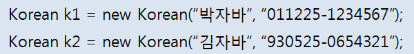

```java
public class Korean {
    //필드
    String nation = "대한민국";
    String name;
    String ssn;
    
    //생성자
    public Korean(String n, String s) {
        name = n;
        ssn = s;
    }
}
```

```java
Korean k1 = new Korean("박자바", "011225-1234567");
Korean k2 = new Korean("김자바", "930525-0654321");
```

  위의 코드에서 "박자바", "김자바"는 매개 변수 n을 통해 전달되고, "011225-1234567", "930525-0654321"은 매개 변수 s를 통해 전달된다. 이 값들은 각각 name 필드와 ssn 필드의 초기값으로 사용된다.

- [Korean.java] 생성자에서 필드 초기화

  ```java
  public class Korean {
      //필드
      String nation = "대한민국";
      String name;
      String ssn;
  
      //생성자
      public Korean(String n, String s) {
          name = n;
          ssn = s;
      }
  }
  ```

- [KoreanExample.java] 객체 생성 후 필드값 출력

  ```java
  public class KoreanExample {
      public static void main(String[] args) {
          Korean k1 = new Korean("박자바", "011225-1234567");
          System.out.println("k1.name : " + k1.name);
          System.out.println("k1.ssn : " + k1.ssn);
  
          Korean k2 = new Korean("김자바", "930525-0654321");
          System.out.println("k2.name : " + k2.name);
          System.out.println("k2.ssn : " + k2.ssn);
      }
  }
  ```

  - 출력결과

    k1.name : 박자바

    k1.ssn : 011225-1234567

    k2.name : 김자바

    k2.ssn : 930525-0654321


  Korean 생성자의 매개 변수 이름은 각각 n과 s를 사용했다.
매개 변수의 이름이 너무 짧으면 코드의 가독성이 좋지 않기 때문에 가능하면 초기화시킬 필드 이름과 비슷하거나 동일한 이름을 사용할 것을 권장한다.

  관례적으로 필드와 동일한 이름을 갖는 매개 변수를 사용한다. 이 경우, 필드와 매개변수 이름이 동일하기 때문에 생성자 내부에서 해당 필드에 접근할 수 없다.

  <u>왜냐하면 동일한 이름의 매개 변수가 사용 우선순위가 높기 때문이다.</u>
해결 방법은 필드 앞에 "this."를 붙이면 된다.

  this는 객체 자신의 참조인데, 우리가 우리 자신을 "나"라고 하듯이 객체가 객체 자신을 this라고 한다.

```java
public Korean(String name, String ssn) {
    this.name = name;
    this.ssn = ssn;
}
```


#### 생성자 오버로딩(Overloading)

  외부에서 제공되는 다양한 데이터들을 이용해서 객체를 초기화하려면 생성자도 다양화될 필요가 있다.

- 생성자 다양화해야 하는 이유
  - 객체 생성할 때 외부 값으로 객체를 초기화할 필요
  - 외부 값이 어떤 타입으로 몇 개가 제공될 지 모르기때문


  자바는 다양한 방법으로 객체를 생성할 수 있도록 생성자 오버로딩을 제공한다. 생성자 오버로딩이란 매개 변수를 달리하는 생성자를 여러 개 선언하는 것을 말한다.

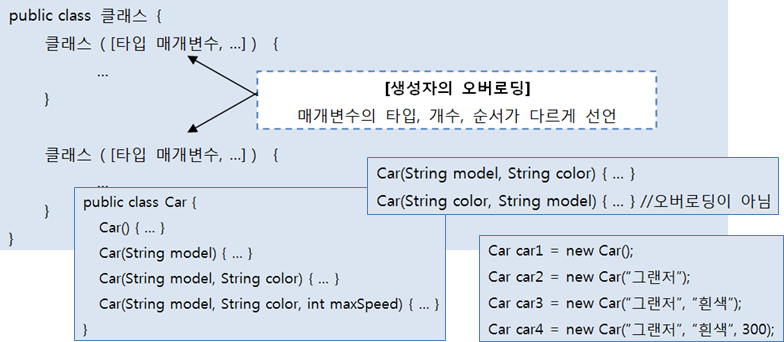


- [Car3.java] 생성자의 오버로딩

  ```java
  public class Car3 {
      //필드
      String company = "현대자동차";
      String model;
      String color;
      int maxSpeed;
  
      //생성자
      Car3() {                                            //생성자1번
      }
  
      Car3(String model) {                                //생성자2번
          this.model = model;
      }
  
  
      Car3(String model, String color) {                  //생성자3번
          this.model = model;
          this.color = color;
      }
  
      Car3(String model, String color, int maxSpeed) {    //생성자4번
          this.model = model;
          this.color = color;
          this.maxSpeed = maxSpeed;
      }
  }
  ```

- [CarExample3.java] 객체 생성 시 생성자 선택

  ```java
  public class CarExample3 {
      public static void main(String[] args) {
          Car3 car1 = new Car3();                   //생성자1번 선택
          System.out.println("Car1.company : " + car1.company);
          System.out.println();
  
          Car3 car2 = new Car3("자가용");            //생성자2번 선택
          System.out.println("Car2.company : " + car2.company);
          System.out.println("Car2.model : " + car2.model);
          System.out.println();
  
          Car3 car3 = new Car3("자가용", "빨강");     //생성자3번 선택
          System.out.println("Car3.company : " + car3.company);
          System.out.println("Car3.model : " + car3.model);
          System.out.println("Car3.color : " + car3.color);
          System.out.println();
  
          Car3 car4 = new Car3("택시", "검정", 200);  //생성자4번 선택
          System.out.println("Car4.company : " + car4.company);
          System.out.println("Car4.model : " + car4.model);
          System.out.println("Car4.color : " + car4.color);
          System.out.println("Car4.maxSpeed : " + car4.maxSpeed);
          System.out.println();
      }
  }
  ```

  - 출력결과

    Car1.company : 현대자동차

    

    Car2.company : 현대자동차

    Car2.model : 자가용

    

    Car3.company : 현대자동차

    Car3.model : 자가용

    Car3.color : 빨강

    

    Car4.company : 현대자동차

    Car4.model : 택시

    Car4.color : 검정

    Car4.maxSpeed : 200
    

#### 다른 생성자 호출(this())

  생성자 오버로딩이 많아질 경우 생성자 간의 중복된 코드가 발생할 수 있다. 매개 변수의 수만 달리하고 필드 초기화 내용이 비슷한 생성자에서 이러한 현상을 많이 볼 수 있다. 

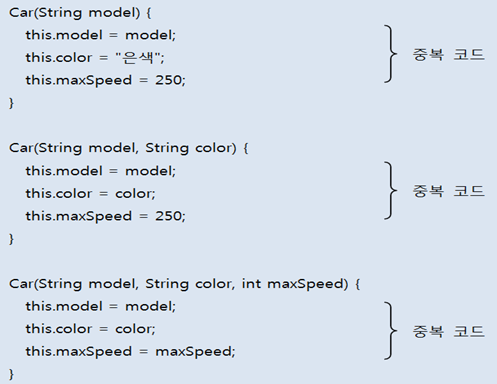

  이 경우에는 필드 초기화 내용은 한 생성자에만 집중적으로 작성하고 나머지 생성자는 초기화 내용을 가지고 있는 생성자를 호출하는 방법으로 개선할 수 있다.

- [Car4.java] 다른 생성자를 호출해서 중복 코드 줄이기

  ```java
  public class Car4 {
      //필드
      String company = "현대자동차";
      String model;
      String color;
      int maxSpeed;
  
      //생성자
      Car4() {                                            //생성자1번
      }
  
      Car4(String model) {                                //생성자2번
          this(model, "은색", 250);//생성자4번을 호출
      }
  
  
      Car4(String model, String color) {                  //생성자3번
          this(model, color, 250);//생성자4번을 호출
      }
  
      Car4(String model, String color, int maxSpeed) {    //생성자4번
          this.model = model;
          this.color = color;
          this.maxSpeed = maxSpeed;
      }
  }
  ```


### 6.5.3 메소드

  메소드는 객체의 동작에 해당하는 중괄호 {} 블록을 말한다. 중괄호 블록은 이름을 가지고 있는데, 이것이 메소드 이름이다.

  메소드를 호출하게 되면 중괄호 블록에 있는 모든 코드들이 일괄적으로 실행된다.
메소드는 필드를 읽고 수정하는 역할도 하지만, 다른 객체를 생성해서 다양한 기능을 수행하기도 한다.

  <b>메소드는 객체 간의 데이터 전달의 수단으로 사용된다. 외부로부터 매개값을 받을 수도 있고, 실행 후 어떤 값을 리턴할 수도 있다.</b>


#### 메소드 선언

  메소드 선언은 선언부(리턴 타입, 메소드 이름, 매개변수 선언)와 실행 블록으로 구성된다. 메소드 선언부를 메소드 시그너처(signature)라고도 한다.

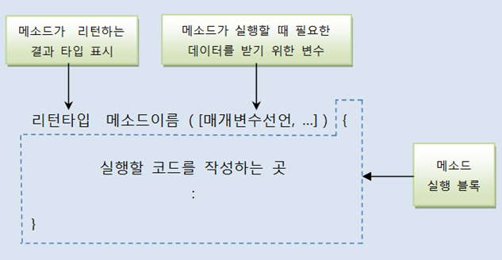


##### 리턴 타입

  리턴 타입은 메소드가 실행 후 리턴하는 값의 타입을 말한다. 메소드는 리턴값이 있을 수도 있고 없을 수도 있다.

  메소드가 실행 후 결과를 호출한 곳에 넘겨줄 경우에는 리턴값이 있어야 한다.

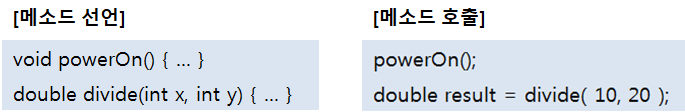

  만약 result 변수를 int 타입으로 선언하게 되면 double 값을 저장할 수 없기 때문에 컴파일 에러가 발생한다.

```java
int result = divide(10, 20);	//컴파일 에러
```

  리턴 타입이 있다고 해서 반드시 리턴값을 변수에 저장할 필요는 없다. 리턴값이 중요하지 않고, 메소드 실행이 중요할 경우에는 다음과 같이 변수 선언 없이 메소드를 호출할 수도 있다.

```java
divide(10, 20);
```


##### 메소드 이름

- 숫자로 시작하면 안되고 $와 _를 제외한 특수 문자를 사용하지 말아야 한다.
- 관례적으로 메소드명은 소문자로 작성한다.
- 서로 다른 단어가 혼합된 이름이라면 뒤이어 오는 단어의 첫머리 글자는 대문자로 작성한다.

  다음은 잘 작성된 메소드 이름을 보여준다.

```java
void run() {...}
void StartEngine() {...}
String getName() {...}
int[] getScores() {...}
```


##### 매개 변수 선언

  매개변수는 메소드를 실행할 때 필요한 데이터를 외부에서 받기 위해 사용한다.
매개 변수도 필요한 경우가 있고 필요 없는 경우가 있다.

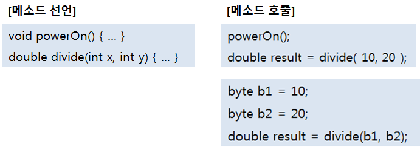

  위의 메소드 호출에서 매개값의  타입(byte)과 매개 변수의 타입(int)이 달라도 byte타입은 int 타입으로 자동 타입 변환되기 때문에 컴파일 오류가 생기지 않는다.


  다음은 Calculator 클래스에서 powerOn(), plus(), divide(), powerOff() 메소드를 선언한 것이다. plus()와 divide() 메소드에서 사용된 return문은 다음 절에서 설명한다.

- [Calculator.java] 메소드 선언

  ```java
  public class Calculator {
      //메소드
      void powerOn() {
          System.out.println("전원을 켭니다.");
      }
  
      int plus(int x, int y) {
          int result = x + y;
          return result;
      }
  
      double divide(int x, int y) {
          double result = (double)x / (double)y;
          return result;
      }
  
      void powerOff() {
          System.out.println("전원을 끕니다.");
      }
  }
  ```

  외부 클래스에서 Calculator 클래스의 메소드를 호출하기 위해서는 다음 예제와 같이 Calculator 객체를 생성하고 참조 변수인 myCal을 이용해야 한다.

- [CalculatorExample.java] 메소드 호출

  ```java
  public class CalculatorExample {
      public static void main(String[] args) {
          Calculator myCal = new Calculator();
          myCal.powerOn();
  
          int result1 = myCal.plus(5, 6);
          System.out.println("result1: " + result1);
  
          byte x = 10;
          byte y = 4;
          double result2 = myCal.divide(x, y);
          System.out.println("result2: " + result2);
  
          myCal.powerOff();
      }
  }
  ```

  - 출력결과

    전원을 켭니다.

    result1: 11

    result2: 2.5

    전원을 끕니다.


##### 매개 변수의 수를 모를 경우

  메소드의 매개 변수는 개수가 이미 정해져 있는 것이 일반적이지만, 경우에 따라서는 메소드를 선언할 때 매개 변수의 개수를 알 수 없는 경우가 있다.

  예를 들어 여러 개의 수를 모두 합산하는 메소드를 선언해야 한다면, 몇 개의 매개 변수가 입력될지 알 수 없기 때문에 매개 변수의 개수를 결정할 수 없을 것이다.

  해결책은 다음과 같이 매개 변수를 배열 타입으로 선언하는 것이다.

```java
int sum1(int[] values) {  }
```

  sum1() 메소드를 호출할 때 배열을 넘겨줌으로써 배열의 항목 값들을 모두 전달할 수 있다.

```java
int[] values = { 1, 2, 3 };
int result1 = sum1(values);
int result2 = sum1(new int[] { 1, 2, 3, 4, 5 });
```

  매개 변수를 배열 타입으로 선언하면, 메소드를 호출하기 전에 배열을 생성해야 하는 불편한 점이 있다. 그래서 배열을 생성하지 않고 값의 리스트만 넘겨주는 방법도 있다.

  다음과 같이 sum2() 메소드의 매개 변수를 "..."을 사용해서 선언하게 되면, 메소드 호출 시 넘겨준 값의 수에 따라 자동으로 배열이 생성되고 매개값으로 사용한다.

```java
int sum2(int ... values) {  }
```

  "..."로 선언된 매개 변수의 값은 다음과 같이 메소드 호출 시 리스트로 나열해주면 된다.

```java
int result1 = sum2(1, 2, 3);
int result2 = sum2(1, 2, 3, 4, 5);
```

  "..."로 선언된 매개 변수는 배열 타입이므로 다음과 같이 배열을 직접 매개값으로 사용해도 좋다.

```java
int[] values = { 1, 2, 3 };
int result = sum2(values);
int result = sum2(new int[] {1, 2, 3, 4, 5, 6} );
```

  다음 예제는 매개 변수를 배열로 선언한 sum1()과 매개 변수를 "..."로 선언한 sum2()의 작성 방법을 보여준다. 둘 다 항목의 값을 모두 더해서 리턴한다.

- [Computer.java] 매개 변수의 수를 모를 경우

  ```java
  public class Computer {
      int sum1(int[] values) {
          int sum = 0;
          for(int i=0; i<values.length; i++) {
              sum += values[i];
          }
          return sum;
      }
  
      int sum2(int ... values) {
          int sum = 0;
          for(int i=0; i<values.length; i++) {
              sum += values[i];
          }
          return sum;
      }
  }
  ```

    sum1()과 sum2() 메소드의 실행문들이 완전 일치하는 것을 볼 수 있다. 
  매개 변수의 선언 방법만 다를 뿐이지 매개 변수의 타입이 배열이므로 처리 내용이 같을 수 밖에 없다.

- [ComputerExample.java] 매개 변수의 수를 모를 경우

  ```java
  public class ComputerExample {
      public static void main(String[] args) {
          Computer myCom = new Computer();
  
          int[] values1 = {1, 2, 3};
          int result1 = myCom.sum1(values1);
          System.out.println("result1: " + result1);
  
          int result2 = myCom.sum1(new int[] {1, 2, 3, 4, 5, 6});
          System.out.println("result2: " + result2);
  
          int result3 = myCom.sum2(1, 2, 3);
          System.out.println("result3: " + result3);
  
          int result4 = myCom.sum2(1, 2, 3, 4, 5);
          System.out.println("result4: " + result4);
      }
  }
  ```

  - 출력결과

    result1: 6

    result2: 21

    result3: 6

    result4: 15
    

#### 리턴(return)문

  리턴문은 메소드 실행을 중지하고 리턴값을 지정하는 역할을 한다.

##### 리턴값이 있는 메소드

  메소드 선언에 리턴 타입이 있는 메소드는 반드시 리턴(return)문을 사용해서 리턴값을 지정해야 한다. 만약 return문이 없다면 컴파일 오류가 발생한다. return문이 실행되면 메소드는 즉시 종료된다.

```java
return 리턴값;
```

  return문의 리턴값은 리턴 타입이거나 리턴 타입으로 변환될 수 있어야 한다. 예를 들어 리턴 타입이 int인 plus() 메소드에서 byte, short, int 타입의 값이 리턴되어도 상관없다.

  byte와 short는 int로 자동 타입 변환되어 리턴되기 때문이다.

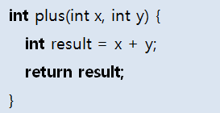

  return문을 사용할 때 주의할 점은 return문 이후에 실행문이 오면 "Unreachable code"라는 컴파일 오류가 발생한다.

  왜냐하면 return문 이후의 실행문은 결코 실행되지 않기 때문이다. 따라서 다음은 잘못된 코딩이다.

```java
int plus(int x, int y) {
    int result = x + y;
    return result;
    System.out.println(result);	//Unreachable code
}
```

  하지만 다음과 같은 경우, 컴파일 에러가 발생하지 않는다.

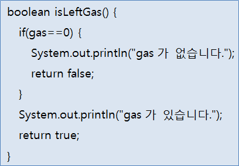


##### 리턴값이 없는 메소드(void)

  void로 선언된 리턴값이 없는 메소드에서도 return문을 사용할 수 있다. 다음과 같이 return문을 사용하면 메소드 실행을 강제 종료시킨다.

```java
return;
```

- [Car.java] return문

  ```java
  public class Car {
      //필드
      int gas;
      
      //메소드
      void setGas(int gas) {
          this.gas = gas;
      }
      
      boolean isLeftGas() {
          if(gas == 0) {
              System.out.println("gas가 없습니다.");
              return false;
          }
          System.out.println("gas가 있습니다.");
          return true;
      }
      
      void run() {
          while(true) {
              if(gas > 0) {
                  System.out.println("달립니다.(gas잔량:" + gas + ")");
                  gas -= 1;
              }
              else {
                  System.out.println("멈춥니다.(gas잔량:" + gas + ")");
                  return;	//메소드 실행 종료
              }
          }
      }
  }
  ```

- [CarExample.java] return문

  ```java
  public class CarExample {
      public static void main(String[] args) {
          Car myCar = new Car();
          
          myCar.setGas(5);	//Car의 setGas() 메소드 호출
          
          boolean gasState = myCar.isLeftGas();	
          					//Car의 isLeftGas() 메소드 호출
          if(gasState) {
              System.out.println("출발합니다.");
              myCar.run();    //Car의 run() 메소드 호출
          }
          
          if(myCar.isLeftGas()) { //Car의 isLeftGas() 메소드 호출
              System.out.println("gas를 주입할 필요가 없습니다.");
          }
          else {
              System.out.println("gas를 주입하세요.");
          }
      }
  }
  ```

  

#### 메소드 호출

  메소드는 클래스 내, 외부의 호출에 의해 실행된다.
클래스 내부의 다른 메소드 에서 호출할 경우에는 단순한 메소드 이름으로 호출하면 되지만, 클래스 외부에서 호출할 경우에는 우선 클래스로부터 객체를 생성한 뒤, 참조 변수를 이용해서 메소드를 호출해야 한다.

  그 이유는 객체가 존재해야 메소드도 존재하기 때문이다.

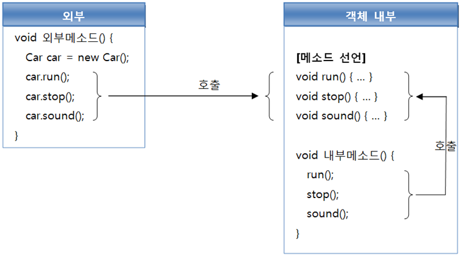


##### 객체 내부에서 호출

  클래스 내부에서 다른 메소드를 호출할 경우

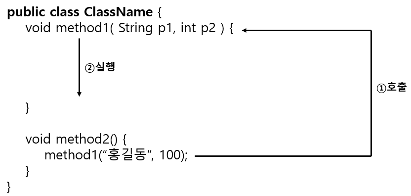

  메소드의 리턴값이 없거나, 있어도 받지 않고 싶을 경우 위와 같이 모두 호출이 가능하다.
리턴값이 있는 메소드를 호출하고 리턴값을 받고 싶다면 다음과 같이 변수를 선언하고 대입하면 된다.

```java
타입 변수 = 메소드(매개값, ...);
// 메소드의 리턴값이 타입 변수에 저장
```


  주의해야 할 점은 변수 타입은 메소드 리턴 타입과 동일하거나, 타입 변환이 될 수 있어야 한다. 예를 들어 int 타입은 double 타입으로 자동 변환되기 때문에 int 리턴값은 double 변수에 대입할 수 있다.

```java
public class ClassName {
    int method1(int x, int y) {
        int result = x + y;
        return result;
    }
    
    void method2() {
        int result1 = method1(10, 20);		//30
        double result2 = method2(10, 20);	//30.0
    }
}
```


- [Calculator2.java] 클래스 내부에서 메소드 호출

  ```java
  public class Calculator2 {
    int plus(int x, int y) {
      int result = x + y;
      return result;
    }
  
    double avg(int x, int y) {
      double sum = plus(x, y);
      double result = sum / 2;
      return result;
    }
  
    void execute() {
      double result = avg(7, 10);
      println("실행경과: " + result);
    }
  
    void println(String message) {
      System.out.println(message);
    }
  }
  ```

- [CalculatorExample2.java] Calculator의 execute() 실행

  ```java
  class CalculatorExample2 {
    public static void main(String[] args) {
      Calculator2 myCalc = new Calculator2();
      myCalc.execute();
    }
  }
  ```

  - 실행결과
    8.5


##### 객체 외부에서 호출

  외부 클래스에서 메소드를 호출하려면 우선 다음과 같이 클래스로부터 객체를 생성해야 한다. 메소드는 객체에 소속된 맴버이므로 객체가 존재하지 않으면 메소드도 존재하지 않기 때문이다.

```java
클래스 참조변수 = new 클래스(매개값, ...);
```


  객체가 생성되었다면 참조 변수와 함께 도트(.) 연산자를 사용해서 메소드를 호출할 수 있다. 도트(.) 연산자는 객체 접근 연산자로 객체가 가지고 있는 필드나, 메소드에 접근할 때 사용된다.

```java
참조변수.메소드(  매개값, ... );				//리턴값이 없거나, 있어도 리턴값을 받지 않을 경우
타입 변수 = 참조변수.메소드(  매개값, ... );    //리턴값이 있고, 리턴값을 받고 싶을 경우
```

   다음은 Car 객체의 keyTurnOn() 메소드와 run() 메소드를 호출하는 코드이다. keyTurnOn()과 run() 메소드는 리턴값이 없기 때문에 단순 호출만 했고, getSpeed() 메소드는 리턴값이 있으므로 리턴값을 받아 변수 speed에 저장했다.

```java
Car myCar = new Car();
myCar.keyTurnOn();
myCar.run();
int speed = myCar.getSpeed();
```


- [Car3.java] 클래스 외부에서 메소드 호출

  ```java
  public class Car3 {
    //필드
    int speed;
  
    //생성자
  
    //메소드
    int getSpeed() {
      return speed;
    }
  
    void keyTurnOn() {
      System.out.println("키를 돌립니다.");
    }
  
    void run() {
      for(int i=10; i<=50; i+=10) {
        speed = i;
        System.out.println("달립니다.(시속:" + speed + "km/h");
      }
    }
  }
  ```

- [CarExample3.java] 클래스 외부에서 메소드 호출

  ```java
  class CarExample3 {
    public static void main(String[] args) {
      Car3 myCar = new Car3();
      myCar.keyTurnOn();
      myCar.run();
      int speed = myCar.getSpeed();
      System.out.println("현재 속도: " + speed + "km/h");
    }
  }
  ```

  

##### 메소드 오버로딩

  클래스 내에 같은 이름의 여러 개 선언하는 것을 메소드 오버로딩(overloading)이라고 한다. 
오버로딩의 사전적 의미는 많이 싣는 것을 뜻한다. <b>하나의 메소드 이름으로 여러 기능을 담는다 하여 붙여진 이름이라 생각할 수 있다. <u>메소드 오버로딩의 조건은 매개 변수의 타입, 개수, 순서 중 하나가 달라야 한다.</u></b>   

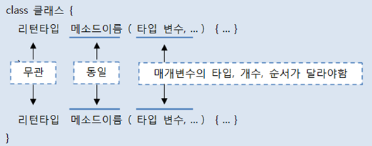

  메소드 오버로딩이 필요한 이유는 매개값을 다양하게 받아 처리할 수 있도록 하기 위해서이다. 예를 들어 다음과 같이 plus() 메소드가 있다고 가정해보자.

```java
int plus(int x, int y) {
    int result = x + y;
    return result;
}
```

  plus() 메소드를 호출하기 위해서는 두 개의 int 매개값이 필요하다. 하지만 int 타입이  아니라 double 타입의 값을 덧셈하기 위해서는 plus() 메소드를 호출할 수 없다.

  해결 방법은 매개 변수가 double 타입으로 선언된 plus() 메소드를 하나 더 선언하는 것이다.

```java
double plus(double x, double y) {
    double result = x + y;
    return result;
}
```

  오버로딩된 메소드를 호출할 경우 JVM은 매개값의 타입을 보고 메소드를 선택한다. 예를 들어 다음과 같이 plus() 메소드를 호출하면 plus(int x, int y)가 실행된다.

```java
plus(10, 20);
```

  그리고 다음과 같이 plus() 메소드를 호출하면 plus(double x, double y)가 실행된다.

```java
plus(10.5, 20.3);
```


```java
int x = 10;
double y = 20.3;
plus(x, y);
```

  위와같이 실행한다면,
plus(double x, double y) 메소드가 실행된다. 자바 가상 기계는 일차적으로 매개 변수 타입을 보지만, 매개 변수의 타입이 일치하지 않을 경우, 자동 타입 변환이 가능한지를 검사한다.

  첫 번째 매개변수인 int타입은 double 타입으로 변환이 가능하므로 최종적으로 plus(double x, double y) 메소드가 선택된다.


  메소드 오버로딩의 가장 대표적인 예는 System.out.println() 메소드이다. println() 메소드는 호출할 때 주어진 매개값의 타입에 따라서 오버로딩된 println() 메소드를 호출한다.

  다음은 오버로딩된 println() 메소드를 보여준다.

```java
void println() { ... };
void println(boolean x) { ... };
void println(char x) { ... };
void println(char[] x) { ... };
void println(double x) { ... };
void println(float x) { ... };
void println(int x) { ... };
void println(long x) { ... };
void println(Object x) { ... };
void println(String x) { ... };
```


- [Calculator3.java] 메소드 오버로딩

  ```java
  public class Calculator3 {
      //정사각형의 넓이
      double areaRectangle(double width) {
          return width * width;
      }
      
      //직사각형의 넓이
      double areaRectangle(double width, double height) {
          return width * height;
      }
  }
  ```

- [CalculatorExample.java] 메소드 오버로딩

  ```java
  public class CalculatorExample3 {
      Calculaotr3 myCalcu = new Calculator3();
      
      //정사각형의 넓이 구하기
      double result1 = myCalcu.arearRectangle(10);
      
      //직사각형의 넓이 구하기
      double result2 = myCalcu.areaRectangle(10, 20);
      
      //결과 출력
      System.out.println("정사각형 넓이=" + result1);
      System.out.println("직사각형 넓이=" + result2);
  }
  ```

  - 출력결과

    정사각형 넓이=100.0

    직사각형 넓이=200.0


### 6.6 인스턴스 맴버와 this

  인스턴스(instance) 맴버란 객체(인스턴스)를 생성한 후 사용할 수 있는 필드와 메소드를 말하는데, 이들을 각각 인스턴스 필드, 인스턴스 메소드라고 부른다.

  우리가 지금까지 작성한 모든 필드와 메소드는 인스턴스 맴버들이었다. 인스턴스 필드와 메소드는 객체에 소속된 맴버이기 때문에, 객체 없이는 사용할 수 없다.

  Car 클래스에 gas 필드와 setSpeed() 메소드가 다음과 같이 선언되어 있다고 가정해보자.

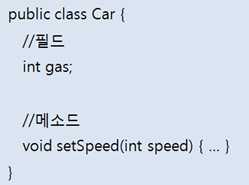

  gas 필드와 setSpeed() 메소드는 인스턴스 맴버이기 때문에 외부 클래스에서 사용하기 위해서는 우선 Car 객체(인스턴스)를 생성하고 참조 변수 myCar 또는 yourCar로 접근해야 한다.

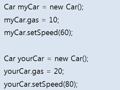

  위 코드가 실행된 후 메모리 상태를 그림으로 표현하면 다음 그림과 같다. 인스턴스 필드 gas는 객체마다 따로 존재하고, 인스턴스 메소드 setSpeed()는 객체마다 존재하지 않고 메소드 영역에 저장되고 공유된다.

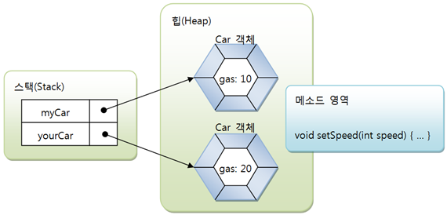


  객체 외부에서 인스턴스 맴버에 접근하기 위해 참조 변수를 사용하는 것과 마찬가지로 객체 내부에서도 인스턴스 맴버에 접근하기 위해 this를 사용할 수 있다.

  우리가 자신을 "나"라고 하듯이, 객체는 자신을 "this"라고 한다. 따라서 this.model은 자신이 가지고 있는 model 필드라는 뜻이다.

  this는 주로 생성자와 메소드의 매개 변수 이름이 필드와 동일한 경우, 인스턴스 맴버인 필드임을 명시하고자 할 때 사용된다. 다음은 매개 변수 model의 값을 필드 model에 저장한다.

```java
Car(String model) {
    this.model = model;
}
void setModel(String model) {
    this.model = model;
}
```


- [Car5.java] 인스턴스 맴버와 this

  ```java
  public class Car5 {
    //필드
    String model;
    int speed;
  
    //생성자
    Car5(String model) {
      this.model = model;
    }
  
    //메소드
    void setSpeed(int speed) {
      this.speed = speed;
    }
  
    void run() {
      for(int i=0; i<=50; i+=10) {
        this.setSpeed(i);
        System.out.println(this.model + "가 달립니다.(시속:" + this.speed + "km/h)");
      } 
    }
  }
  ```

- [CarExample5.java] 인스턴스 맴버와 this

  ```java
  class CarExample5 {
    public static void main(String[] args) {
      Car5 myCar = new Car5("포르쉐");
      Car5 yourCar = new Car5("벤츠");
  
      myCar.run();
      yourCar.run();
    }
  }
  ```

  - 출력결과

    포르쉐가 달립니다.(시속:0km/h)

    포르쉐가 달립니다.(시속:10km/h)

    포르쉐가 달립니다.(시속:20km/h)

    포르쉐가 달립니다.(시속:30km/h)

    포르쉐가 달립니다.(시속:40km/h)

    포르쉐가 달립니다.(시속:50km/h)

    벤츠가 달립니다.(시속:0km/h)

    벤츠가 달립니다.(시속:10km/h)

    벤츠가 달립니다.(시속:20km/h)

    벤츠가 달립니다.(시속:30km/h)

    벤츠가 달립니다.(시속:40km/h)

    벤츠가 달립니다.(시속:50km/h)


### 6.7 정적 맴버와 static

  정적(static)은 '고정된'이란 의미를 가지고 있다. 정적 맴버는 클래스에 고정된 맴버로서 <b>객체를 생성하지 않고 사용할 수 있는 필드와 메소드를 말한다.</b>

  이들을 각각 정적 필드, 정적 메소드라고 부른다.
정적 맴버는 <u>객체에 소속된 맴버가 아니라 클래스에 소속된 맴버</u>이기 때문에 클래스 맴버라고도 한다.


#### 6.7.1 정적 맴버 선언

  정적 필드와 정적 메소드를 선언하는 방법은 필드와 메소드 선언 시 static 키워드를 추가적으로 붙이면 된다.
다음은 정적 필드와 정적 메소드를 선언하는 방법을 보여준다.

```java
public class 클래스 {
    //정적 필드
    static 타입 필드 [= 초기값];
    
    //정적 메소드
    static 리턴타입 메소드( 매개변수선언, ... ) { ... }
}
```


  정적 필드와 정적 메소드는 클래스에 고정된 맴버이므로 클래스 로더가 클래스(바이트 코드)를 로딩해서 메소드 메모리 영역에 적재할 때 클래스별로 관리된다.

  따라서 클래스의 로딩이 끝나면 바로 사용할 수 있다.

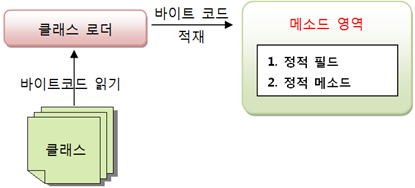


  필드를 선언할 때 인스턴스 필드로 선언할 것인가, 아니면 정적 필드로 선언할 것인가의 판단 기준은 

  <b>객체마다 가지고 있어야 할 데이터라면 인스턴스 필드로 선언하고, 객체마다 가지고 있을 필요성이 없는 공용적인 데이터라면 정적 필드로 선언</b>하는 것이 좋다.

  예를 들어 Calculator 클래스에서 원의 넓이나 둘레를 구할 때 필요한 파이는 Calculator 객체마다가 가지고 있을 필요가 없는 변하지않는 공용적인 데이터이므로 정적 필드로 선언하는 것이 좋다.
  그러나 객체별로 색깔이 다르다면 색깔은 인스턴스 필드로 선언해야 한다.

```java
public class Calculator {
    String color;					//계산기별로 색깔이 다를 수 있다.
    static double pi = 3.141592		//계산기에서 사용하는 파이 값은 동일하다.
}
```


  메소드의 경우, 인스턴스 메소드로 선언할 것인가, 아니면 정적 메소드로 선언할 것인가의 판단 기준은 <b>인스턴스 필드를 이용해서 실행해야 한다면 인스턴스 메소드로 선언</b>하고,

  <b>인스턴스 필드를 이용하지 않는다면 정적 메소드로 선언</b>한다.
예를 들어 Calculator 클래스의 덧셈, 뺄셈 기능은 인스턴스 필드를 이용하기 보다는 외부에서 주어진 매개값들을 가지고 덧셈과 뺄셈을 수행하므로 정적 메소드로 선언하는 것이 좋다.

  그러나 인스턴스 필드인 색깔을 변경하는 메소드는 인스턴스 메소드로 선언해야 한다.

```java
public class Calculator {
    String color;											//인스턴스 필드
    void setColor(String color) { this.color = color; }		//인스턴스 메소드
    static int plus(int x, int y) { return x+y; }			//정적 메소드
    static int minus(int x, int y) {return x-y; }			//정적 메소드
}  
```


#### 6.7.2 정적 맴버 사용

  클래스가 메모리로 로딩되면 정적 맴버를 바로 사용할 수 있는데, 클래스 이름과 함께 도트(.) 연산자로 접근한다.

```java
클래스.필드;
클래스.메소드( 매개값, ... );
```

  예를 들어 Calculator 클래스가 다음과 같이 작성되었다면,

```java
public class Calculator {
    static double pi = 3.141592;
    static int plus(int x, int y) { ... }
    static int minus(int x, int y) { ... } 
}
```

  정적 필드 pi와 정적 메소드 plus(), minus()는 다음과 같이 사용할 수 있다.

```java
double result1 = 10 * 10 * Calculator.pi;
int result2 = Calculator.plus(10, 5);
int result3 = Calculator.minus(10, 5);
```


  정적 필드와 정적 메소드는 원칙적으로는 클래스 이름으로 접근해야 하지만 다음과 같이 객체 참조 변수로도 접근이 가능하다.

```java
Calculator myCalcu = new Calculator();
double result1 = 10 * 10 * myCalcu.pi;
int result2 = myCalcu.plus(10, 5);
int result3 = myCalcu.minus(10, 5);
```

  하지만 정적 요소는 클래스 이름으로 접근하는 것이 좋다. 이클립스에서는 정적 맴버를 클래스 이름으로 접근하지 않고 객체 참조 변수로 접근햇을 경우, 경고 표시가 나타난다.

- [Calculator4.java] 정적맴버 사용

  ```java
  public class Calculator4 {
      static double pi = 3.141592;
  
      static int plus(int x, int y) {
          return x + y;
      }
  
      static int minus(int x, int y) {
          return x - y;
      }
  }
  ```

- [CalculatorExample4.java] 정적 맴버 사용

  ```java
  public class CalculatorExample4 {
      public static void main(String[] args) {
          double result1 = 10 * 10 * Calculator4.pi;
          int result2 = Calculator4.plus(10, 5);
          int result3 = Calculator4.minus(10, 5);
  
          System.out.println("result1 : " + result1);
          System.out.println("result2 : " + result2);
          System.out.println("result3 : " + result3);
      }
  }
  ```

  - 출력결과

    result1 : 314.1592

    result2 : 15

    result3 : 5
    

#### 6.7.3 정적 초기화 블록

  정적 필드는 다음과 같이 필드 선언과 동시에 초기값을 주는 것이 보통이다.

```java
static double pi = 3.14159;
```


  그러나 계산이 필요한 초기화 작업이 있을 수 있다. <u>인스턴스필드는 생성자에서 초기화</u>하지만, <b>정적 필드는 객체 생성 없이도 사용해야 하므로 생성자에서 초기화 작업을 할 수 없다.</b>

  생성자는 객체 생성 시에만 실행되기 때문이다. 그렇다면 정적 필드를 위한 초기화 작업은 어디에서 해야 할까?
자바는 정적 필드의 복잡한 초기화 과정을 위해서 <b>정적블록(static block)</b>을 제공한다. 
  다음은 정적 블록의 형태를 보여준다.

```java
static {
    ...
}
```

  정적 블록은 클래스가 메모리로 로딩될 때 자동적으로 실행된다. 정적 블록은 클래스 내부에 여러개가 선언되어도 상관없다.

  클래스가 메모리로 로딩될 때 선언된 순서대로 실행된다.
다음예제는, Television은 세개의 정적 필드를 가지고 있는데, company와 model은 선언 시 초기값을 주었고 info는 초기화 하지 않았다.

  info 필드는 정적 블록에서 company와 model 필드값을 서로 연결해서 초기값으로 설정한다.

- [Television.java] 정적 초기화 블록

  ```java
  public class Television {
      static String company = "Samsung";
      static String model = "LCD";
      static String info;
  
      static {
          info = company + "-" + model;
      }
  }
  ```

- [TelevisionExample.java] 정적 초기화 블록

  ```java
  public class TelevisionExample {
      public static void main(String[] args) {
          System.out.println(Television.info);
      }
  }
  ```

  - 출력결과

    Samsung-LCD


#### 6.10.4 정적 메소드와 블록 선언 시 주의할 점

  정적 메소드와 정적 블록을 선언할 때 주의할 점은 객체가 없어도 실행된다는 특징 때문에, 이들 내부에 인스턴스 필드나 인스턴스 메소드를 사용할 수 없다. 

  또한 객체 자신의 참조인 this 키워드도 사용이 불가능하다. 그래서 다음 코드는 컴파일 오류가 발생한다.

```java
public class CalssName {
    //인스턴스 필드와 메소드
    int field1;
    void method1() { ... }
    
    //정적 필드와 메소드
    static int field2;
    static void method2() { ... }
    
    //정적 블록
    static {
        field1 = 10;		//컴파일 에러
        method1();			//컴파일 에러
        field2 = 10;
        method2();
    }
    
    //정적 메소드
    static void Method3 {
        this.field1 = 10;	//컴파일 에러
        this.method1();		//컴파일 에러
        field2 = 10;
        method2();
    }
}
```

  정적 메소드와 정적 블록에서 인스턴스 맴버를 사용하고 싶다면 다음과 같이 객체를 먼저 생성하고 참조 변수로 접근해야 한다.

```java
static void Method3() {
    ClassName obj = new ClassName();
    obj.field1 = 10;
    obj.method1();
}
```


  main() 메소드도 동일한 규칙이 적용된다. main() 메소드도 정적(static) 메소드이므로 객체 생성 없이 인스턴스 필드와 인스턴스 메소드를 main() 메소드에서 바로 사용할 수 없다. 따라서 다음은 잘못된 코딩이다.

```java
public class Car {
    int speed;
    
    void run() { ... }
    
    public static void main(String[] args) {
        speed = 60;	//컴파일 에러
        run();		//컴파일 에러
    }
}
```

  main() 메소드를 올바르게 수정하면 다음과 같다.

```java
public static void main(String[] args) {
    Car myCar = new Car();
    myCar.speed = 60;
    myCar.run();
}
```


#### 6.10.5 싱글톤(Singleton)

  가끔 전체 프로그램에서 단 하나의 객체만 만들도록 보장해야 하는 경우가 있다. 단 하나만 생성된다고 해서 이 객체를 싱글톤(Singleton)이라고 한다.

  싱글톤을 만들려면 클래스 외부에서 new 연산자로 생성자를 호출할 수 없도록 막아야 한다. 생성자를 호출한 만큼 객체가 생성되기 때문이다.

  <b>생성자를 외부에서 호출할 수 없도록 하려면 생성자 앞에 private 접근 제한자를 붙여주면 된다.</b> 접근 제한자는 나중에 자세히 설명한다.


  그리고 자신의 타입인 정적 필드를 하나 선언하고 자신의 객체를 생성해 초기화한다.  참고로 클래스 내부에서는 new 연산자로 생성자 호출이 가능하다.

  정적 필드도 private 접근 제한자를 붙여 외부에서 필드값을 변경하지 못하도록 막는다. 대신 외부에서 호출할 수 있는 정적 메소드인 getInstance()를 선언하고 정적 필드에서 참조하고 있는 자신의 객체를 리턴해준다.

```java
public class 클래스 {
    //정적 필드
    private static 클래스 singleton = new 클래스();
    
    //생성자
    private 클래스() {}
    
    //정적 메소드
    static 클래스 getInstance() {
        return singleton;
    }
}
```

  외부에서 객체를 얻는 유일한 방법은 getInstance() 메소드를 호출하는 방법이다.getInstance() 메소드는 단 하나의 객체만 리턴하기 때문에 아래 코드에서 변수1과 변수2는 동일한 객체를 참조한다.

```java
클래스 변수1 = 클래스.getInstance();
클래스 변수2 = 클래스.getInstance();
```

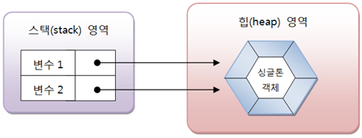

- [Singleton.java] 싱글톤

  ```java
  public class Singleton {
      private static Singleton st = new Singleton();
  
      private Singleton() {}
  
      static Singleton getInstance() {
          return st;
      }
  }
  ```

- [SingletonExample.java] 싱글톤 객체

  ```java
  public class SingletonExample {
      public static void main(String[] args) {
          /*
          Singleton obj1 = new Singleton();   //컴파일 에러
          Singleton obj2 = new Singleton();   //컴파일 에러
           */
  
          Singleton obj1 = Singleton.getInstance();
          Singleton obj2 = Singleton.getInstance();
          
          if(obj1 == obj2) {
              System.out.println("같은 Singleton 객체 입니다.");
          }
          else {
              System.out.println("다른 Singleton 객체 입니다.");
          }
      }
  }
  ```

  - 출력결과

    같은 Singleton 객체 입니다.


### 6.8 final 필드와 상수

#### 6.8.1 final 필드

  final의 의미는 최종적이란 뜻을 가지고 있다. 그렇다면 final 필드는 최종적인 필드란 뜻인데, 무슨 말일까?
final 필드는 초기값이 저장되면 이것이 최종적인 값이 되어서 프로그램 실행 도중에 수정할 수 없다는 것이다.
final 필드는 다음과 같이 선언한다.

```java
final 타입 필드 [= 초기값];
```


  final 필드의 초기값을 줄 수 있는 방법은 딱 두가지 밖에 없다. 첫 번째는 필드 선언 시에 주는 방법이고 두 번째는 생성자에서 주는 방법이다.

  단순 값이라면 필드 선언 시에 주는 것이 제일 간단하다. 하지만 복잡한 초기화 코드가 필요하거나 객체 생성 시에 외부 데이터로 초기화해야 한다면 생성자에서 초기값을 지정해야 한다.

  생성자는 final 필드의 최종 초기화를 마쳐야 하는데, 만약 초기화 되지 않은 final 필드를 그래도 남겨두면 컴파일 에러가 발생한다.


  다음 예제를 보자. 주민등록번호 필드는 한 번 값이 저장되면 변경할 수 없도록 final 필드로 선언했다. 하지만 주민등록번호는 Person 객체가 생성될 때 부여되므로 Person 클래스 설계 시 초기값을 미리 줄 수 없다.
  그래서 생성자 매개값으로 주민등록번호를 받아서 초기값으로 지정해주었다. 반면 nation은 항상 고정된 값을 갖기 때문에 필드 선언 시 초기값으로 "Korea"를 주었다.

- [Person.java] final 필드 선언과 초기화

  ```java
  public class Person {
      final String nation  = "Korea";
      final String ssn;
      String name;
  
      public Person(String ssn, String name) {
          this.ssn = ssn;
          this.name = name;
      }
  }
  ```

- [PersonExample.java] final 필드 테스트

  ```java
  public class PersonExample {
      public static void main(String[] args) {
          Person p1 = new Person("123456-1234567", "계백");
  
          System.out.println(p1.nation);
          System.out.println(p1.ssn);
          System.out.println(p1.name);
  
          //p1.nation = "usa"; //final 필드는 값 수정 불가
          //p1.ssn = "654321-7654321";
          p1.name = "을지문덕";
      }
  }
  ```

  - 출력결과

    Korea

    123456-1234567

    계백
    

#### 6.8.2 상수(static final)

  일반적으로 불변의 값을 상수라고 부른다.
불변의 값은 수학에서 사용되는 원주율 파이나, 지구의 무게 및 둘레 등이 해당된다.

  이런 불변의 값을 저장하는 필드를 자바에서는 상수(constant)라고 한다.

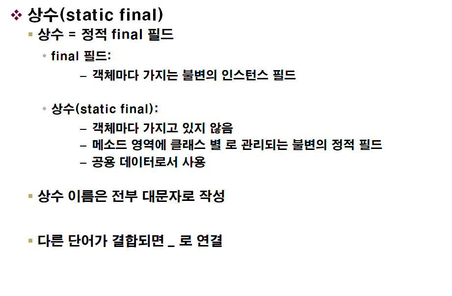
  상수는 static이면서 final이어야 한다. static final 필드는 객체마다 저장되지 않고, 클래스에만 포함된다. 그리고 한 번 초기값이 저장되면 변경할 수 없다.

- [Earth.java] 상수 선언

  ```java
  public class Earth {
      static final double EARTH_RADIUS = 6400;
      static final double EARTH_SURFACE_AREA;
  
      static {
          EARTH_SURFACE_AREA = 4 * Math.PI * EARTH_RADIUS * EARTH_RADIUS;
      }
  }
  ```

- [EarthExample.java] 상수 사용

  ```java
  public class EarthExample {
      public static void main(String[] args) {
          System.out.println("지구의 반지름: " + Earth.EARTH_RADIUS + "km");
          System.out.println("지구의 표면적: " + Earth.EARTH_SURFACE_AREA + "km^2");
      }
  }
  ```

  - 출력결과

    지구의 반지름: 6400.0km

    지구의 표면적: 5.147185403641517E8km^2


### 6.9 패키지

  프로젝트를 개발하다 보면 적게는 수십 개, 많게는 수백 개의 클래스를 작성해야 한다. 클래스를 체계적으로 관리하지 않으면 클래스 간의 관계가 뒤엉켜서 복잡하고 난해한 프로그램이 되어 결국 유지 보수가 어렵게 된다.

  자바에서는 클래스를 체계적으로 관리하기 위해 패키지(package)를 사용한다.

- 패키지란?
  - 클래스를 기능별로 묶어서 그룹 이름을 붙여 놓은 것
    - 파일들을 관리하기 위해 사용하는 폴더(디렉토리)와 비슷한 개념
    - 패키지의 물리적인 형태는 파일 시스템의 폴더
  - 클래스이름의 일부
    - 클래스를 유일하게 만들어주는 식별자
    - 클래명이 같아도 패키지명이 다르면 다른 클래스로 취급
    - 전체 클래스 이름 = 상위패키지.하위패키지.클래스
      

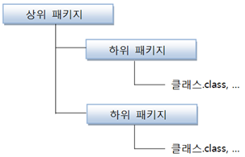

  만약 Car클래스가 com.mycompany 패키지에 속해 있다면 Car 클래스의 전체 이름은 com.mycompany.Car가 되고 실제 파일 시스템에서는 com/mycompany 폴더에 Car.class가 위치한다.

  패키지가 중요한 이유는 클래스만 따로 복사해서 다른 곳으로 이동하면 클래스는 사용할 수 없기 때문이다.

  예를 들어 Car 클래스가 com.mycomany 패키지에 소속되어 있을 경우, 파일 시스템 com/yourcomany 폴더에 Car.class를 저장하면 Car클래스를 사용할 수 없다.
클래스를 이동할 경우에는 패키지 전체를 이동시켜야 한다.

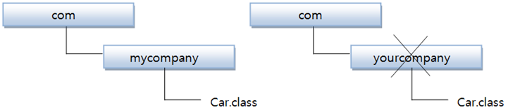


#### 6.9.1 패키지 선언

  패키지는 클래스를 컴파일하는 과정에서 자동적으로 생성되는 폴더이다. 
컴파일러는 클래스에 포함되어 있는 패키지 선언을 보고, 파일 시스템의 폴더로 자동 생성시킨다. 다음은 패키지를 선언하는 방법이다.

```java
package 상위패키지.하위패키지;

public class ClassName { ... }
```

  패키지 이름은 개발자가 임의대로 지어주면 되지만, 여기에도 지켜야 할 몇 가지 규칙이 있다.

- 숫자로 시작해서는 안 되고, _, $를 제외한 특수문자를 사용해서는 안 된다.
- java로 시작하는 패키지는 자바 표준 API에서만 사용되므로 사용해서는 안 된다.
- 모두 소문자로 작성하는 것이 관례이다.


  여러 개발 회사가 함계 참여하는 대규모 프로젝트나, 다른 회사의 패키지를 이용해서 개발할 경우, 패키지 이름이 중복될 가능성이 있다. 그래서 회사들 간에 패키지가 서로 중복되지 않도록 흔히 회사의 도메인 이름으로 패키지를 만든다.

```java
com.samsung.projectname
com.hyndai.projectname    
com.lg.projectname    
com.apache.projectname    
```


#### 6.9.2 패키지 선언이 포함된 클래스 컴파일

  패키지 선언이 포함된 클래스를 명령 프롬프트에서 컴파일할 경우, 단순히 javac ClassName.java로 컴파일해서는 패키지 폴더가 생성되지 않는다. 패키지 폴더가 자동으로 생성되려면 javac 명령어 다음에 -d 옵션을 추가하고 패키지가 생성될 경로를 다음과 같이 지정해야 한다.

```java
javac -d .			 ClassName.java	//현재 폴더 내에 생성
javac -d ..\bin		 ClassName.java	//현재 폴더와 같은 위치의 bin 폴더에 생성	
javac -d C:\Temp\bin ClassName.java //C:\Temp\bin 폴더에 생성
```

  예를 들어 다음 Application.java가 C:\Temp 폴더에서 작성되었다고 가정하자.

```java
package sec12.exam01_package_compile;

public class Application {
    public static void main(String[] args) {
        System.out.println("애플리케이션을 실행합니다.");
    }
}
```

  명령 프롬프트를 열고 C:\Temp로 이동한 후 다음과 같이 컴파일 해보자.

```java
C:\Temp>javac -d . Application.java
```

  컴파일이 성공되면 다음과 같은 패키지 폴더들이 생성되고 마지막에 class파일이 저장된다.


  패키지에 소속된 클래스를 명령 프롬프트에서 실행하려면 바이트 코드 파일(*.class)이 있는 폴더에서 java 명령어를 사용해서는 안 된다.

  패키지는 클래스의 일부분이므로 패키지가 시작하는 폴더에서 java 명령어를 사용해야 한다. Application 클래스의 패키지 sec12는 C:\Temp 폴더에 있기 때문에 C:\Temp 폴더에서 다음과 같이 java 명령어를 실행해야 한다.

```java
C:\Temp>java sec12.exam01_package_compile.Application
```


#### 6.9.3 import문

  같은 패키지에 속하는 클래스들은 아무런 조건 없이 다른 클래스를 사용할 수 있지만, 다른 패키지에 속하는 클래스를 사용하려면 두 가지 방법 중 하나를 선택해야 한다.

  첫 번째 방법은 패키지와 클래스를 모두 기술하는 것이다. 다음은 com.hankook 패키지에 소속된 Tire 클래스를 이용해서 필드를 선언하고 객체를 생성한 것이다.

```java
package com.mycompany;

public class Car {
    com.hankook.Trie tire = new com.hankook.Tire();
}
```

  패키지 이름이 짧을 경우에는 불편함이 없겠지만, 패키지 이름이 길거나 이렇게 사용해야 할 클래스 수가 많다면 패키지 이름을 붙인다는 것은 전체 코드를 난잡해 보이게 할 수 있다.

  그래서 두 번째 방법인 import문을 주로 사용한다. 사용하고자 하는 패키지를 import문으로 선언하고, 클래스를 사용할 때에는 패키지를 생략하는 것이다.

```java
package com.mycompany;

import com.hankook.Tire;
[ 또는 import com.hankkok.*; ]

public class Car {
    Tire tire = new Tire();
}
```

  import문이 작성되는 위치는 패키지 선언과 클래스 선언 사이다. 패키지에 포함된 다수의 클래스를 사용해야 한다면 클래스별로 import문을 작성할 필요 없이 클래스 이름을 생략하고 대신 *를 사용해서 import문을 한 번 작성하면 된다.
(\*은 패키지에 속하는 모든 클래스들을 의미)

  만약 하위 패키지에 있는 클래스들도 사용하고 싶다면 import문을 하나 더 작성해야 한다.
예를 들어 com.mycompany 패키지에 있는 클래스도 사용해야 하고, com.mycompany.project 패키지에 있는 클래스도 사용해야 한다면 다음과 같이 두 개의 import문이 필요하다.

```java
import com.mycompany.*;
import com.mycompany.project.*;
```


  패키지 이름 전체를 기술하는 첫 번째 방법이 꼭 필요한 경우가 있는데, 서로 다른 패키지에 동일한 클래스 이름이 존재하고, 두 패키지가 모두 import되어 있을 경우이다.

  자바 컴파일러는 어떤 패키지에서 클래스를 로딩할지 결정할 수 없기 때문에 컴파일 에러가 발생한다. 이 경우에는 정확하게 패키지 이름 전체를 기술해야 한다.


### 6.10 접근 제한자

  main() 메소드를 가지지 않는 대부분의 클래스는 외부 클래스에서 이용할 목적으로 설계된 라이브러리 클래스이다. 라이브러리 클래스를 설계할 때에는 외부 클래스에서 접근할 수 있는 맴버와 접근할 수 없는 맴버로 구분해서 필드, 생성자, 메소드를 설계하는 것이 바람직하다.

  객체 생성을 막기위해 생성자를 호출하지 못하게 하거나 객체의 특정 데이터를 보호하기 위해 해당 필드에 접근하지 못하도록 막아야 한다. 그리고 특정 메소드를 호출할 수 없도록 제한할 필요가 있다.

  이러한 기능을 구현하기 위해 접근 제한자(Access Modifier)를 제공하고 있다.


  접근제한자는 public, protected, default, private와 같이 네 가지 종류가 있다.
public 제한자는 단어의 뜻 그대로, 공개한다는 의미를 가지고 있다. public 접근 제한자는 외부 클래스가 자유롭게 사용할 수 있는 공개 맴버를 만든다.

  protected 접근 제한자는 같은 패키지 또는 자식 클래스에서 사용할 수 있는 맴버를 만든다.

  private 접근 제한자는 단어의 뜻 그대로 개인적인 것이라 외부에 노출되지 않는 맴버를 만든다.

  위 세가지 접근 제한자가 적용되지 않은 맴버는 default 접근 제한을 가진다. default 접근 제한자는 같은 패키지에 소속된 클래스에서만 사용할 수 있는 맴버를 만든다.

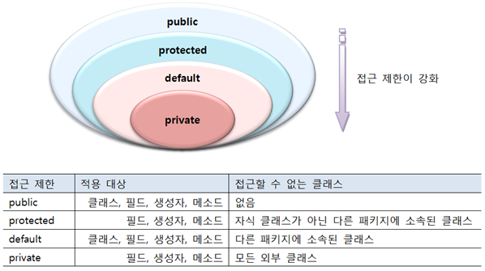


#### 6.10.1 클래스의 접근 제한

클래스에 적용할 수 있는 접근 제한은 public과 default 단 두 가지인데, 다름과 같은 형식으로 작성한다.

```java
//default 접근 제한
class 클래스 { ... }

//public 접근 제한
public class 클래스 { ... }
```

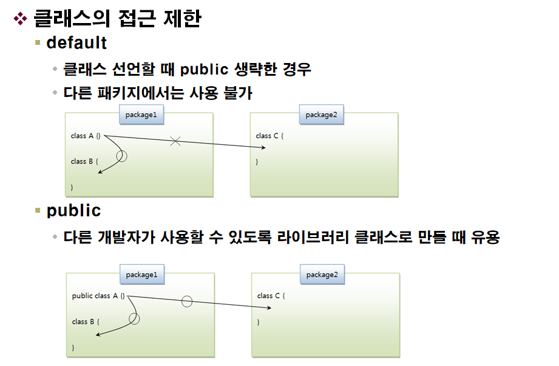

- 예시

  - [A.java] 클래스의 접근 제한

    ```java
    package sec13.exam01.class_access.package1;
    
    class A {}	//default 접근 제한
    ```

  - [B.java] 클래스의 접근 제한

    ```java
    package sec13.exam01_class_access.package1;
    
    public class B {
        A a;	//(o)  <---- A클래스 접근 가능(필드로 선언할 수 있음)
    }
    ```

    B클래스는 A클래스와 같은 패키지 이므로 A클래스에 접근이 가능하다. 그래서 B클래스에서 A클래스를 이용하여 필드 선언 및 생성자/메소드 내부에서 변수 선언이 가능하다.

  - [C.java] 클래스의 접근 제한

    ```java
    package sec13.exam01_class_access.package2;
    
    import sec13.exam01_class_access.package1.*;
    
    public class C {
        A a;	//(x) <---- A클래스 접근 불가(컴파일 에러)
        B b;	//(o)
    }
    ```

    C클래스는 A클래스와 다른 패키지이므로 default로 접근이 제한된 A 클래스에는 접근이 되지 않지만, public으로 공개된 B 클래스는 접근이 가능하다.

    그래서 C클래스에서 B클래스를 이용하여 필드 선언 및 생성자/메소드 내부에서 변수 선언이 가능하다.


#### 6.10.2 생성자의 접근 제한

  객체를 생성하기 위해서는 new 연산자로 생성자를 호출해야 한다. 하지만 생성자를 어디에서나 호출할 수 있는 것은 아니다. 
생성자가 어떤 접근 제한을 갖느냐에 따라 호출 가능 여부가 결정된다.
생성자는 다음과 같이 public, protected, default, private 접근 제한을 가질 수 있다.

```java
public class ClassName {
    //public 접근 제한
    public ClassName(...) { ... }

    //protected 접근 제한
    protected ClassName(...) { ... }
    
    //defalut 접근 제한
    ClassName(...) { ... }
    
    private ClassName(...) { ... }
}
```

  클래스에 생성자를 선언하지 않으면 컴파일러에 의해 자동적으로 기본 생성자가 추가된다.
자동으로 생성되는 기본 생성자의 접근 제한은 클래스의 접근 제한과 동일하다.

  클래스가 default 접근 제한을 가지면 기본 생성자도 default 접근 제한을 가지고, 클래스가 public 접근 제한을 가지면 기본 생성자도 public 접근 제한을 가진다.
| 접근 제한자 | 생성자      | 설명                                                         |
| ----------- | ----------- | ------------------------------------------------------------ |
| public      | 클래스(...) | public 접근 제한은 모든 패키지에서 아무런 제한 없이 생성자를 호출<br />public 접근 제한을 가진다면 클래스도 public 접근 제한을 가지는 것이 정상적이다.<br />클래스가 default 접근제한을 가진다면 클래스 사용이 같은 패키지로 한정되므로, 생성자의 public은 의미가 없음. |
| protected   | 클래스(...) | protected 접근 제한은 default 접근 제한과 마찬가지로 같은 패키지에 속하는 클래스에서 생성자를 호출할 수 있도록 함.<br />차이점은 다른 패키지에 속한 클래스가 해당 클래스의 자식(child)클래스라면 생성자를 호출할 수 있음. |
| default     | 클래스(...) | 생성자를 선언할 때 public 또는 private를 생략했다면 생성자는 default 접근 제한을 가진다.<br />default 접근 제한은 같은 패키지에서는 아무런 제한 없이 생성자를 호출할 수 있으나, 다른 패키지에서는 생성자를 호출할 수 없도록 한다. |
| private     | 클래스(...) | private 접근 제한은 동일 패키지이건 다른 패키지이건 상관없이 생성자를 호출하지 못하도록 제한한다.<br />따라서 클래스 외부에서 new 연산자로 객체를 만들 수 없다. 오로지 클래스 내부에서만 생성자를 호출할 수 있고, 객체를 만들 수 있다. |

- 예제

  - [A.java] 생성자의 접근 제한

    ```java
    package sec13.exam02_constructor_access.package1;
    
    public class A {
        //필드
        A a1 = new A(true);	   //(o)
        A a2 = new A(1);	   //(o)
        A a3 = new A("문자열"); //(o)
        
        //생성자
        public A(boolean b) {}		//public 접근 제한
        A(int b) {}					//default 접근 제한
        private A(Stirng[] s) {}	//private 접근 제한
    }
    ```

  - [B.java] 생성자의 접근 제한

    ```java
    package sec13.exam02_constructor_access.package1;	//동일한 패키지
    
    public class B {
        //필드
        A a1 = new A(true);	   //(o)
        A a2 = new A(1);	   //(o)
        A a3 = new A("문자열"); //(x)	//private 생성자 접근 불가(컴파일 에러)
    }
    ```

  - [C.java] 생성자의 접근 제한

    ```java
    package sec13.exam02_constructor.access.package2;	//다른 패키지
    
    public class C {
        //필드
        A a1 = new A(true);	   //(o)
        A a2 = new A(1);	   //(x)  //default 생성자 접근 불가(컴파일 에러)
        A a3 = new A("문자열"); //(x)	//private 생성자 접근 불가(컴파일 에러)
    }
    ```


#### 6.10.3 필드와 메소드의 접근 제한

 <u><b>필드와 메소드를 선언할 때 고려해야 할 사항</b>은 클래스 내부에서만 사용할 것인지, 패키지 내에서만 사용할 것인지, 아니면 다른 패키지에서도 사용할 수 있도록 할 것인지를 결정해야 한다.</u>

  이것은 필드와 메소드가 어떤 접근 제한을 갖느냐에 따라 결정된다. 필드와 메소드는 다음과 같이 public, protected, default, private 접근 제한을 가질 수 있다.
| 접근 제한자 | 생성자                | 설명                                                         |
| ----------- | --------------------- | ------------------------------------------------------------ |
| public      | 필드<br />메소드(...) | public 접근 제한은 모든 패키지에서 아무런 제한 없이 필드와 메소드를 사용할 수 있도록 해준다.<br />public 접근 제한을 가질 경우 클래스도 public이여야 한다.<br />클래스가 default라면 같은 패키지 안에서만 클래스가 사용되기 때문이다. |
| protected   | 필드<br />메소드(...) | protected 접근 제한은 default 접근 제한과 마찬가지로 같은 패키지에 속하는 클래스에서 필드와 메소드를 사용할 수 있도록 한다.<br />차이점은 다른 패키지에 속한 클래스가 해당 클래스의 자식 클래스라면 필드와 메소드를 사용할 수 있다. |
| default     | 필드<br />메소드(...) | 필드와 메소드를 선언할 때 public 또는 private를 생략했다면 default 접근 제한을 가진다.<br /> default 접근 제한은 같은 패키지에서는 아무런 제한 없이 필드와 메소드를 사용할 수 있으나, 다른 패키지에서는 필드와 메소드를 사용할 수 없도록 한다. |
| private     | 필드<br />메소드(...) | private 접근 제한은 동일 패키지이건 다른 패키지이건 상관없이 필드와 메소드를 사용하지 못하도록 제한한다.<br />오로지 클래스 내부에서만 사용할 수 있다. |

- [A.java] 필드와 메소드의 접근 제한

  ```java
  package sec13.exam03_filed_method_access.package1;
  
  public class A {
      // 필드
      public int filed1;	//public 접근 제한
      int field2;			//default 접근 제한
      private int field3; //private 접근 제한
      
      //생성자
      public A() {
          field1 = 1; //(o)
          field2 = 1; //(o)
          field3 = 1; //(o)
          
          method1();	//(o)
          method2();	//(o)
          method3();	//(o)
      }
      
      //메소드
      public void method1() {}	//public 접근 제한
      void method2() {}			//default 접근 제한
      private void method3() {}	//private 접근 제한
  }
  ```

    A 클래스 내부에서는 접근 제한과는 상관없이 필드와 메소드를 모두 사용할 수 있다.

- [B.java] 필드와 메소드의 접근 제한

  ```java
  package sec13.exam03_filed_method_access.package1;	//패키지가 동일
  
  public class B {
      public B() {
          A a = new A();
          a.field1 = 1; //(o)
          a.field2 = 1; //(o)
          a.field3 = 1; //(x) <--- private 필드 접근 불가(컴파일 에러)
          
          a.method1();  //(o)
          a.method2();  //(o)
          a.method3();  //(x) <--- private 필드 접근 불가(컴파일 에러)
      }
  }
  ```

    패키지가 동일한 B클래스에서는 A클래스의 private 필드와 메소드를 제뢰한 다른 필드와 메소드는 사용할 수 있다. 그러나 다음과 같이 패키지가 다른 C클래스에서는 A클래스의 public 필드와 메소드를 제외한 다른 필드와 메소드를 사용할 수 없다.

- [C.java] 필드와 메소드의 접근 제한

  ```java
  package sec13.exam03_filed_method_access.package2;	//패키지가 다름
  
  import sec13.exam03_filed_method_access.package1.A;
  
  public class C {
      public C() {
          A a = new A();
          a.field1 = 1; //(o)
          a.field2 = 1; //(x) <--- default 필드 접근 불가(컴파일 에러)
          a.field3 = 1; //(x) <--- private 필드 접근 불가(컴파일 에러)
          
          a.method1();  //(o)
          a.method2();  //(x) <--- default 필드 접근 불가(컴파일 에러)
          a.method3();  //(x) <--- private 필드 접근 불가(컴파일 에러)
      }
  }
  ```


### 6.11 Getter와 Setter 메소드

  일반적으로 객체 지향 프로그래밍에서 객체의 데이터는 객체 외부에서 직접적으로 접근하는 것을 막는다.
  그 이유는 객체의 데이터를 외부에서 마음대로 읽고 변경할 경우 객체의 무결성(결점이 없는 성질)이 깨어질 수 있기 때문이다.

  예를 들어 자동차의 속도는 음수가 될 수 없는데, 외부에서 음수로 변경하면 객체의 무결성이 깨진다. 실제로 다음 코드는 Car 객체의 speed 필드값을 -100으로 변경시킨다.

```java
myCar.speed = -100;
```


  이러한 문제점을 해결하기 위해 객체 지향 프로그래밍에서는 메소드를 통해서 데이터를 변경하는 방법을 선호한다.
  데이터는 외부에서 접근할 수 없도록 막고 메소드는 공개해서 외부에서 메소드를 통해 데이터에 접근하도록 유도한다.

  그 이유는 메소드는 매개값을 검증해서 유효한 값만 데이터로 저장할 수 있기 때문이다.
이러한 역할을 하는 메소드가 Setter이다.

```java
void setSpeed(double speed) {
    if(speed < 0) {
        this.speed = 0;
        return;
    }
    else {
        this.speed = speed;
    }
}
```

  외부에서 객체의 데이터를 읽을 때도 메소드를 사용하는 것이 좋다. 객체 외부에서 객체의 필드값을 사용하기에 부적절한 경우도 있다.
  이런 경우에는 메소드로 필드값을 가공한 후 외부로 전달하면 된다.
이런 메소드가 바로 Getter이다. 예를 들어 자동차의 속도를 마일에서 KM 단위로 환산해서 외부로 리턴해주는 getSpeed() 메소드를 다음과 같이 작성할 수 있다.

```java
double getSpeed() {
    double km = speed * 1.6;
    return km;
}
```

  클래스를 선언할 때 가능하다면 필드를 private로 선언해서 외부로부터 보호하고, 필드에 대한 Setter와 Getter 메소드를 작성해서 필드값을 안전하게 변경/사용하는 것이 좋다.

  다음은 Setter와 Getter 메소드를 선언하는 방법을 보여준다. 검증 코드나 변환 코드는 필요에 따라 추가해야 한다.

```java
private 타입 fieldName;		//필드 접근 제한자 : private

//Getter
public 리턴타입 getFieldName() {
    return fieldName;
}

//setter
public void setFieldName(타입 fieldName) {
    this.fieldName = fieldName;
}
```


  필드 타입이 boolean일 경우에는 Getter는 get으로 시작하지 않고 is로 시작하는 것이 관례이다. 예를 들어 stop 필드의 Getter와 Setter는 다음과 같이 작성할 수 있다.

```java
private boolean stop;

//Getter
public boolean isStop() {
    return stop;
}

//Setter
public void setStop(boolean stop) {
    this.stop = stop;
} 
```


### 6.12 어노테이션

  이노테이션(Annotation)은 메타데이터(metadata)라고 볼 수 있다. 메타데이터란 애플리케이션이 처리해야 할 데이터가 아니라, 컴파일 과정과 실행 과정에서 코드를 어떻게 컴파일하고 처리할 것인지를 알려주는 정보이다. 어노테이션은 다음과 같은 형태로 작성된다.

```java
@AnnotationName
```

  어노테이션은 다음 세 가지 용도로 사용된다.

- 컴파일러에게 코드 문법 에러를 체크하도록 정보를 제공
- 소프트웨어 개발 툴이 빌드나 배치 시 코드를 자동으로 생성할 수 있도록 정보를 제공
- 실행 시(런타임 시) 특정 기능을 실행하도록 정보를 제공


  컴파일러에게 코드 문법 에러를 체크하도록 정보를 제공하는 대표적인 예는 @Override 어노테이션이다. @Override는 메소드 선언 시 사용하는데, 메소드가 오버라이드(재정의)된 것임을 컴파일러에게 알려주어 컴파일러가 오버라이드 검사를 하도록 해준다.  

  정확히 오버라이드가 되지 않았다면 컴파일러는 에러를 발생시킨다. 어노테이션은 빌드 시 자동으로 XML 설정 파일을 생성하거나, 배포를 위해 JAR 압축 파일을 생성하는데에도 사용된다. 그리고 실행 시 클래스의 역할을 정의하기도 한다.


#### 6.12.1 어노테이션 타입 정의와 적용

  어노테이션 타입을 정의하는 방법은 인터페이스를 정의하는 것과 유사하다. 다음과 같이 @interface를 사용해서 어노테이션을 정의하며, 그 뒤에 사용할 어노테이션 이름이 온다.

```java
public @interface AnnotationName {
}
```

  이렇게 정의할 어노테이션은 코드에서 다음과 같이 사용한다.

```java
@AnnotationName
```

  어노테이션은 엘리먼트(element)를 맴버로 가질 수 있다. 각 엘리먼트는 타입과 이름으로 구성되며, 디폴트 값을 가질 수 있다.

```java
public @interface AnnotationName {
    타입 elementName() {default 값};
    ...
}
```

  엘리먼트의 타입으로는 int와 double과 같은 기본 데이터 타입이나 String, 열거 타입 Class 타입, 그리고 이들의 배열 타입을 사용할 수 있다. 엘리먼트의 이름 뒤에는 메소드를 작성하느 것처럼 ()를 붙여야 한다.

  예를 들어 String 타입의 엘리먼트와 int 타입의 엘리먼트를 다음과 같이 선언할 수 있다.

```java
public @interface AnnotationName {
    String elementName1();
    int elementName2() default 5;
}
```

  이렇게 정의한 어노테이션을 코드에서 적용할 때에는 다음과 같이 기술한다.

```java
@AnnotationName(elementName1="값", elementName2=3);
또는
@AnnotationName(elementName1="값");
```

  elementName1은 디폴트값이 없기 때문에 반드시 값을 기술해야 하고, elementName2는 디폴트 값이 있기 때문에 생략 가능하다. 어노테이션은 기본 엘리먼트인 <b>value</b>를 가질 수 있다.

```java
public @interface AnnotationName {
    String value();		//기본 엘리먼트 선언
    int elementName() default 5;
}
```

  value 엘리먼트를 가진 어노테이션을 코드에서 적용할 때에는 다음과 같이 값만 기술할 수 있다.
이 값은 기본 엘리먼트인 value 값으로 자동 설정된다.

```java
@AnnotationName("값");
```

  만약 value 엘리먼트와 다른 엘리먼트의 값을 동시에 주고 싶다면 다음과 같이 정상적인 방법으로 지정하면 된다.

```java
@AnnotationName(value="값", elementName=3);
```


#### 6.12.2 어노테이션 적용 대상

  어노테이션을 적용할 수 있는 대상은 java.lang.annotation.ElementType 열거 상수로 다음과 같이 정의되어 있다.

| ElementType 열거 상수 | 적용 대상                     |
| --------------------- | ----------------------------- |
| TYPE                  | 클래스, 인터페이스, 열거 타입 |
| ANNOTATION_TYPE       | 어노테이션                    |
| FIELD                 | 필드                          |
| CONSTRUCTOR           | 생성자                        |
| METHOD                | 메소드                        |
| LOCAL_VARIABLE        | 로컬 변수                     |
| PACKAGE               | 패키지                        |

  어노테이션이 적용될 대상을 지정할 때에는 @Target 어노테이션을 사용한다. @Target의 기본 엘리먼트인 value는 ElementType 배열을 값으로 가진다. 이것은 어노테이션이 적용될 대상을 복수개로 지정하기 위해서이다.
  예를들어 다음과 같이 어노테이션을 정의할 경우,

```java
@Target({ElementType.TYPE, ElementType.FIELD, ElementType.METHOD})
public @interface AnnotationName {
}
```

  다음과 같이 클래스, 필드, 메소드만 어노테이션을 적용할 수 있고 생성자는 적용할 수 없다.

```java
@AnnotationName
public class ClassName {
    @AnnotationName
    private Stirng fieldName;
    
    //@AnnotationName //(x) @Target에 CONSTRUCT가 없어 생성자는 적용 못함
    public ClassName() {}
    
    @AnnotationName
    public void methodName() {}
}
```


#### 6.12.3 어노테이션 유지 정책

  어노테이션 정의 시 한 가지 더 추가해야 할 내용은 사용 용도에 따라 @AnnotationName을 어느 범위까지 유지할 것인지 지정해야 한다. 

  쉽게 설명하면 소스상에만 유지할 것인지, 컴파일된 클래스까지 유지할 건지, 런타임 시에도 유지할 것인지를 지정해야 한다.

  어노테이션 유지 정책은 java.lang.annotation.RetentionPolicy 열거 상수로 다음과 같이 정의되어 있다.
| RetentionPolicy 열거 상수 | 설명                                                         |
| ------------------------- | ------------------------------------------------------------ |
| SOURCE                    | 소스상에서만 어노테이션 정보를 유지한다. 소스 코드를 분석할 때만 의미가 있으며,<br />바이트 코드 파일에는 정보가 남지 않는다. |
| CLASS                     | 바이트 코드 파일까지 어노테이션 정보를 유지한다. 하지만 리플렉션을 이용해서 어노테이션 정보를 얻을 수는 없다. |
| RUNTIME                   | 바이트 코드 파일까지 어노테이션 정보를 유지하면서 리플렉션을 이용해서 런타임 시에 어노테이션 정보를 얻을 수 있다. |


  리플렉션(Reflction)이란 런타임 시에 클래스의 메타 정보를 얻는 기능을 말한다. 예를 들어 클래스가 가지고 있는 필드가 무엇인지, 어떤 생성자를 갖고 있는지, 어떤 메소드를 가지고 있는지, 적용된 어노테이션이 무엇인지 알아내는 것이 리플렉션이다.

  리플렉션을 이용해서 런타임 시에 어노테이션 정보를 얻으려면 어노테이션 유지 정책을 RUNTIME으로 설정해야 한다. 어노테이션 유지 정책을 지정할 때에는 @Retention 어노테이션을 사용한다.

@Retention의 기본 엘리먼트인 value는 RetentionPolicy 타입이므로 위 세가지 상수 중 하나를 지정하면 된다.
코드 자동 생성 툴을 개발하지 않는 이상 우리가 작성하는 어노테이션은 대부분 런타임 시점에 사용하기 위한 용도로 만들어진다.

  다음은 런타임 유지 정책을 적용한 어노테이션이다.

```java
@Target({ElementType.TYPE, ElementType.FIELD, ElementType.METHOD})
@Retention(RetentionPolicy.RUNTIME)
public @interface AnnotationName {
}
```


#### 6.12.4 런타임 시 어노테이션 정보 사용하기

  런타임 시에 어노테이션이 적용되었는지 확인하고 엘리먼트 값을 이용해서 특정 작업을 수행하는 방법에 대해 알아보자.

  어노테이션 자체는 아무런 동작을 가지지 않는 단지 표식일 뿐이지만, 리플렉션을 이용해서 어노테이션의 적용 여부와 엘리먼트 값을 읽고 적절히 처리할 수 있다.

  클래스에 적용된 어노테이션 정보를 얻으려면 java.lang.Class를 이용하면 되지만, 필드, 생성자, 메소드에 적용된 어노테이션 정보를 얻으려면 Class의 다음 메소드를 통해서 java.lang.reflect 패키지의 Field, Constructor, Method 타입의 배열을 얻어야 한다.

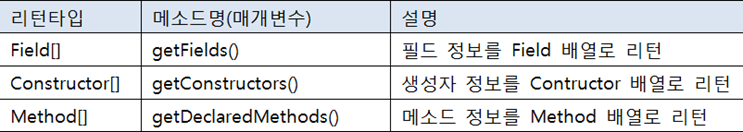


  그런 다음 Class, Field, Constructor, Method가 가지고 있는 다음 메소드를 호출해서 적용된 어노테이션 정보를 얻을 수 있다.

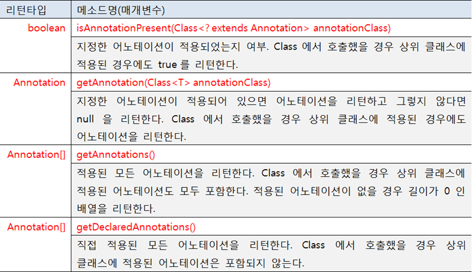


  어노테이션과 리플렉션을 이용해서 간단한 예제를 만들어 보자. 다음은 각 메소드의 실행 내용을 구분선으로 분리해서 콘솔에 출력하도록 하는 PrintAnnotation이다.

- [PrintAnnotation.java] 어노테이션 정의

  ```java
  package junseok.java.seminar;
  
  import java.lang.annotation.ElementType;
  import java.lang.annotation.Retention;
  import java.lang.annotation.RetentionPolicy;
  import java.lang.annotation.Target;
  
  @Target({ElementType.METHOD})
  @Retention(RetentionPolicy.RUNTIME)
  public @interface PrintAnnotation {
      String value() default "-";
      int number() default 15;
  }
  ```

    @Target은 메소드에만 적용하도록 했고, @Retention은 런타임 시까지 어노테이션 정보를 유지하도록 했다. 기본 엘리먼트 value는 구분선에 사용될 문자이고, number는 반복 출력 횟수이다.

    각각 디폴트 값으로 "-"와 15를 주었다. 다음은 PrintAnnotation을 적용한 Service 클래스이다.

- [Service.java] 어노테이션을 적용한 클래스

  ```java
  package junseok.java.seminar;
  
  public class Service {
      @PrintAnnotation
      public void method1() {
          System.out.println("실행 내용1");
      }
  
      @PrintAnnotation("*")
      public void method2() {
          System.out.println("실행 내용2");
      }
  
      @PrintAnnotation(value="#", number=20)
      public void method3() {
          System.out.println("실행 내용3");
      }
  }
  ```

  

  다음 PrintAnnotationExample 클래스는 리플렉션을 이용해서 Service 클래스에 적용된 어노테이션 정보를 읽고 엘리먼트 값에 따라 출력할 문자와 출력 횟수를 콜솔에 출력한 후, 해당 메소드를 호출한다.

  method.invoke(new Service())는 Service 객체를 생성하고 생성된 Service 객체의 메소드를 호출하는 코드이다.

- [PrintAnnotationExample.java]

  ```java
  package junseok.java.seminar;
  
  import java.lang.reflect.Method;
  
  public class PrintAnnotationExample {
      public static void main(String[] args) {
          //Service 클래스로부터 메소드 정보를 얻음
          Method[] declaredMethods = Service.class.getDeclaredMethods();
  
          //Method 객체를 하나씩 처리
          for(Method method : declaredMethods) {
              //PrintAnnotation이 적용되었는지 확인
              if(method.isAnnotationPresent(PrintAnnotation.class)) {
                  //PrintAnnotation 객체 얻기
                  PrintAnnotation printAnnotation = method.getAnnotation(PrintAnnotation.class);
  
                  //메소드 이름 출력
                  System.out.println("[" + method.getName() + "] ");
                  //구분선 출력
                  for(int i=0; i<printAnnotation.number(); i++) {
                      System.out.print(printAnnotation.value());
                  }
                  System.out.println();
  
                  try {
                      //메소드 호출
                      method.invoke(new Service());
                  } catch (Exception e) {}
                  System.out.println();
              }
          }
      }
  }
  ```

  