# 07. 상속

## 7.1 상속 개념

  상속(Inheritance)이란?

- 현실 세계:
  - 부모가 자식에게 물려주는 행위
  - 부모가 자식을 선택해서 물려줌
- 객체 지향 프로그램:
  - 자식(하위, 파생) 클래스가 부모(상위) 클래스의 맴버를 물려받는 것
  - 자식이 부모를 선택해 물려받음
  - 상속 대상: 부모의 필드와 메소드


  상속은 이미 잘 개발된 클래스를 재사용해서 새로운 클래스를 만들기 때문에 코드의 중복을 줄여준다.
field1, field2, method1(), method2()를 가지는 클래스를 작성한다고 생각해보자.

  4개를 모두 처음부터 작성하는 것보다는 field1과 method1()을 가지고 있는 클래스가 있다면 이것을 상속하고, field2와 method2()만 추가 작성하는 것이 보다 효율적이고 개발 시간을 절약해준다.

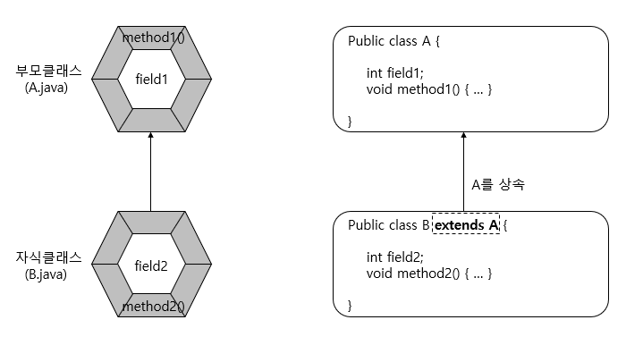
  실제로 클래스 B의 객체를 생성해서 다음과 같이 사용할 때에는 마치 B가 field1과 method1()을 가지고 있는 것처럼 보인다.

```java
B b = new B();
b.field1 = 10;
b.method1();

b.field2 = 20;
b.method2();
```


  상속을 해도 부모 클래스의 모든 필드와 메소드들을 물려받는 것은 아니다. 부모 클래스에서 private 접근 제한을 갖는 필드와 메소드는 상속 대상에서 제외된다.

  그리고 부모 클래스와 자식 클래스가 다른 패키지에 존재한다면 default 접근 제한을 갖는 필드와 메소드도 상속 대상에서 제외된다.
그 이외의 경우는 모두 상속의 대상이 된다.

  상속을 이용하면 클래스의 수정을 최소화시킬 수도 있다. 부모 클래스의 수정으로 모든 자식 클래스들의 수정 효과를 가져오기 때문에 유지 보수 시간을 최소화 시켜준다.


## 7.2 클래스 상속

  현실에서 상속은 부모가 자식을 선택해서 물려주지만, <b>프로그램에서는 자식이 부모를 선택</b>한다.
자식 클래스를 선언할 때 어떤 부모 클래스를 상속받을 것인지를 결정하고 선택된 부모 클래스는 다음과 같이 extends 뒤에 기술한다.

```java
Class 자식클래스 extends 부모클래스 {
    //필드
    //생성자
    //메소드
}
```

  예를 들어 Car 클래스를 상속해서 SportsCar 클래스를 설계하고 싶다면 다음과 같이 작성하면 된다.

```java
Class SportsCar extends Car {    
}
```

  다른 언어와는 달리 자바는 다중 상속을 허용하지 않는다.
즉 여러 개의 부모 클래스를 상속할 수 없다. 그러므로 다음과 같이 extends 뒤에는 단 하나의 부모 클래스만 와야 한다.


  다음 예제는 핸드폰(CellPhone) 클래스를 상속해서 DMB폰(DmbCellPhone) 클래스를 작성한 것이다. 핸드폰이 부모 클래스가 되고, DMB폰이 자식 클래스가 된다.

- [CellPhone.java] 부모 클래스

  ```java
  package wisoft.javaSeminar.ch7;
  
  public class CellPhone {
      //필드
      String model;
      String color;
  
      //생성자
  
      //메소드
      void powerOn() { System.out.println("전원을 켭니다."); }
      void powerOff() { System.out.println("전원을 끕니다."); }
      void bell() { System.out.println("벨이 울립니다."); }
      void sendVoice(String message) { System.out.println("본인:" + message); }
      void receiveVoice(String message) { System.out.println("상대방:" + message); }
      void hangUp() { System.out.println("전화를 끊습니다."); }
  }
  ```

- [DmbCellPhone.java] 자식 클래스

  ```java
  package wisoft.javaSeminar.ch7;
  
  public class DmbCellPhone extends CellPhone{
      //필드
      int channel;
  
      //생성자
      DmbCellPhone(String model, String color, int channel) {
          this.model = model;
          this.color = color;
          this.channel = channel;
      }
  
      //메소드
      void turnOnDmb() {
          System.out.println("채널 " + channel + "번 DMB 방송 수신을 시작합니다.");
      }
      void changeChannelDmb(int channel) {
          this.channel = channel;
          System.out.println("채널 " + channel + "번으로 바꿉니다.");
      }
      void turnOffDmb() {
          System.out.println("DMB 방송 수신을 멈춥니다.");
      }
  }
  ```

- [DmbCellPhoneExample.java] 자식 클래스 사용

  ``` java
  package wisoft.javaSeminar.ch7;
  
  public class DmbCellPhoneExample {
        public static void main(String[] args) {
            //DmbCellPhone 객체 생성
            DmbCellPhone dmbCellPhone = new DmbCellPhone("자바폰", "검정", 10);
            //CellPhone으로부터 상속받은 필드
            System.out.println("모델: " + dmbCellPhone.model);
            System.out.println("색상: " + dmbCellPhone.color);
  
            //DmbCellPhone의 필드
            System.out.println("채널: " + dmbCellPhone.channel);
  
            //CellPhone으로부터 상속받은 메소드 호출
            dmbCellPhone.powerOn();
            dmbCellPhone.bell();
            dmbCellPhone.sendVoice("여보세요");
            dmbCellPhone.receiveVoice("안녕하세요! 저는 홍길동인데요");
            dmbCellPhone.sendVoice("아~ 예 반갑습니다.");
            dmbCellPhone.hangUp();
  
            //DmbCellPhone 메소드 호출
            dmbCellPhone.turnOnDmb();
            dmbCellPhone.changeChannelDmb(12);
            dmbCellPhone.turnOffDmb();
        }
  }
  ```

  - 출력결과

    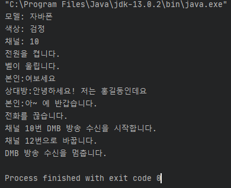


## 7.3 부모 생성자 호출

  현실에서 부모 없는 자식이 있을 수 없듯이 자바에서도 자식 객체를 생성하면, 부모 객체가 먼저 생성되고 자식 객체가 그 다음에 생성된다. 

  아래 코드는 DmbCellPhone 객체만 생성하는 것처럼 보이지만, 사실은 <b>내부적으로 부모인 CellPhone 객체가 먼저 생성되고, DmbCellPhone 객체가 생성된다.</b>

```java
DmbCellPhone dmbCellPhone = new DmbCellPhone();
```

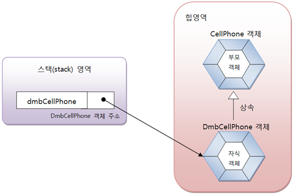

  모든 객체는 클래스의 생성자를 호출해야만 생성된다. 부모 객체도 예외는 아니다. 그렇다면 부모 객체를 생성하기 위해 부모 생성자를 어디서 호출한 것일까?

  이것에 대한 비밀은 자식 생성자에 숨어 있다. 부모 생성자는 자식 생성자의 맨 첫 줄에서 호출된다. 예를 들어 DmbCellPhone의 생성자가 명시적으로 선언되지 않았다면 컴파일러는 다음과 같은 기본 생성자를 생성해 낸다.

```java
public DmbCellPhone() {
    super();
}
```

  첫 줄에 super();가 추가된 것을 볼 수 있다. super()는 부모의 기본 생성자를 호출한다. 즉 CellPhone 클래스의 다음 생성자를 호출한다.

```java
public CellPhone() {
}
```


<b><em>중요</em></b>
  super(매개값, ...)는 매개값의 타입과 일치하는 부모 생성자를 호출한다. 만약 매개값의 타입과 일치하는 부모 생성자가 없을 경우 컴파일 오류가 발생한다.

  super(매개값, ...)가 생략되면 컴파일러에 의해 super()가 자동적으로 추가되기 때문에 부모의 기본 생성자가 존재해야 한다.

  부모 클래스에 기본 생성자가 없고 매개 변수가 있는 생성자만 있다면 자식 생성자에서 반드시 부모 생성자 호출을 위해 super(매개값, ...)를 명시적으로 호출해야 한다.

  super(매개값, ...)는 반드시 자식 생성자 첫 줄에 위치해야 한다. 그렇지 않으면 컴파일 에러가 난다. 


- [People.java] 부모 클래스

  ```java
  public class People {
      public String name;
      public String ssn;
      
      public People(String name, Stirng ssn) {
          this.name = name;
          this.ssn = ssn;
      }
  }
  ```

    People 클래스는 기본 생성자가 없고 name과 ssn을 매개값으로 받아 객체를 생성시키는 생성자만 있다.
  그렇기 때문에 People을 상속하는 Student 클래스는 생성자에서 super(name, ssn)으로 People 클래스의 생성자를 호출해야 한다.

- [Student.java] 자식 클래스

  ```java
  public class student extends People {
      public int studentNo;
      
      public Student(String name, String ssn, int studentNo) {
          super(name, ssn); //부모 생성자 호출
          this.studentNo = studentNo;
      }
  }
  ```

    Student 클래스의 생성자는 name, ssn, studentNo를 매개값으로 받아서 name과 ssn은 다시 부모 생성자를 호출하기 위해 매개값으로 넘겨준다.
  
    <b>super(name, ssn)은 People 생성자인 People(String name, Stirng ssn)을 호출한다.</b>


## 7.4 메소드 재정의

  부모 클래스의 모든 메소드가 자식 클래스에게 맞게 설계되어 있다면 가장 이상적인 상속이지만, 어떤 메소드는 자식 클래스가 사용하기에 적합하지 않을 수도 있다.

  이 경우 상속된 일부 메소드는 자식 클래스에서 다시 수정해서 사용해야 한다.
자바는 이런 경우를 위해 메소드 오버라이딩(Overriding) 기능을 제공한다.


### 7.4.1 메소드 재정의(@Override)

  메소드 오버라이딩은 상속된 메소드의 내용이 자식 클래스에 맞지 않을 경우, 자식 클래스에서 동일한 메소드를 재정의하는 것을 말한다.

  메소드가 오버라이딩되었다면, 부모 객체의 메소드는 숨겨지기 때문에, 자식 객체에서 메소드를 호출하면 오버라이딩된 자식 메소드가 호출된다.
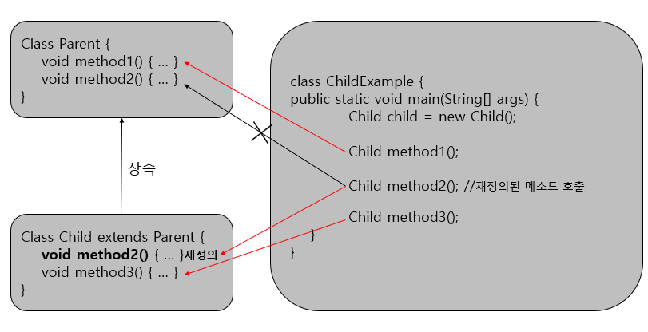

  메소드를 오버라이딩할 때는 다음과 같은 규칙에 주의해서 작성해야 한다.

- 부모의 메소드와 동일한 시그너처(리턴 타입, 메소드 이름, 매개 변수 리스트)를 가져야 한다.
- 접근 제한을 더 강하게 오버라이딩할 수 없다.
- 새로운 예외(Exception)를 thows할 수 없다.(예외는 10장에서 학습)

  접근 제한을 더 강하게 오버라이딩할 수 없다는 것은 부모 메소드가 public 접근 제한을 가지고 있을 경우 오버라이딩하는 자식 메소드는 default나 private 접근 제한으로 수정할 수 없다는 뜻이다.

  반대는 가능하다. 부모 메소드가 default 접근 제한을 가지면 재정의되는 자식 메소드는 default 또는 public 접근 제한을 가질 수 있다.

- [Calculator.java] 부모 클래스

  ```java
  public class Calculator {
      double areaCircle(double r) {
          System.out.println("Calculator 객체의 areaCircle() 실행");
          return 3.141592 * r * r;
      }
  }
  ```

- [Computer.java] 자식 클래스

  ```java
  public class Computer extends Calculator{
      @Override
      double areaCircle(double r) {
          System.out.println("Computer 객체의 areaCircle() 실행");
          return Math.PI * r * r;
      }
  }
  ```

    @Override 어노테이션은 생략해도 좋으나, 이것을 붙여주게 되면 areaCircle() 메소드가 정확히 오버라이딩된것인지 컴파일러가 체크하기 때문에 개발자의 실수를 줄여준다.

    <u>예를 들어 개발자가 areaCircl()처럼 끝에 e를 빼먹게 되면 컴파일에러가 발생</u>한다.

- [ComputerExample.java] 메소드 오버라이딩 테스트

  ```java
  public class CoputerExample {
      public static void main(String[] args) {
          int r = 10;
  
          Calculator calculator = new Calculator();
          System.out.println("원면적 : " + calculator.areaCircle(r));
          System.out.println();
  
          Computer computer  = new Computer();
          System.out.println("원면적 : " + computer.areaCircle(r));
      }
  }
  ```


### 7.4.2 부모 메소드 호출(super)

  자식 클래스에서 부모 클래스의 메소드를 오버라이딩하게 되면, 부모 클래스의 메소드는 숨겨지고 오버라이딩된 자식 메소드만 사용된다.

  그러나 자식 클래스 내부에서 오버라이딩된 부모 클래스의 메소드를 호출해야 하는 상황이 발생한다면 명시적으로 <b>super</b> 키워드를 붙여서 부모 메소드를 호출할 수 있다. super는 부모 객체를 참조하고 있기 때문에 부모 메소드에 직접 접근할 수 있다.

```java
super.부모메소드();
```

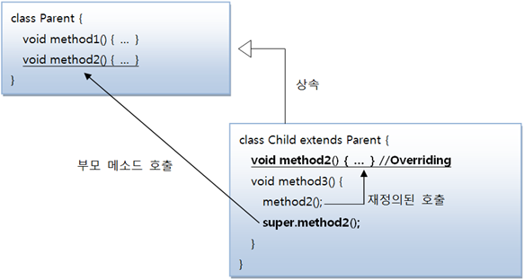

  Airplane 클래스를 상속해서 SupersonicAirplane 클래스를 만들어 보자. Airplane의 fly() 메소드는 일반 비행이지만  SupersonicAirplane의 fly()는 초음속 비행 모드와 일반 비행 모두 두 가지로 동작하도록 설계해보자.

- [Airplane.java] super 변수

  ```java
  puiblic class Airplane {
      public void land() {
          System.out.println("착륙합니다.");
      }
      public void fly() {
          System.out.println("일반비행합니다.");
      }
      public void takeOff() {
          System.out.println("이륙합니다.");
      }
  }
  ```

- [SupersonicAirplane.java] super 변수

  ```java
  public class SupersonicAirplane extends Airplane {
      public static final int NORMAL = 1;
      public static final int SUPERSONIC = 2;
      
      public int flymode = NORMAL;
      
      @Override
      public void fly() {
          if(flyMode == SUPERSONIC) {
              System.out.println("초음속비행입니다.");
          }
          else {
              //Airplane 객체의 fly() 메소드 호출
              super.fly();
          }
      }
  }
  ```

- [SupersonicAirplaneExample.java] super 변수

  ```java
  public class SupersonicAirplaneExample {
      public static voi main(String[] args) {
          SupersonicAirplane sa = new SupersonicAirplane();
          sa.takeOff();
          sa.fly();
          sa.flymode = SupersonicAirplane.SUPERSONIC;
          sa.fly();
          sa.flymode = SupersonicAirplane.NORMAL;
          sa.fly();
          sa.land();
      }
  }
  ```


## 7.5 final 클래스와 final 메소드

  final 키워드는 클래스, 필드, 메소드 선언시에 사용할 수 있다. final 키워드는 해당 선언이 최종 상태이고, 결코 수정될 수 없을을 뜻한다.

  final 키워드가 클래스, 필드, 메소드 선언에 사용될 경우 해석이 조금씩 달라진다.
<u>필드 선언 시에 final이 지정되면 초기값 설정 후, 더 이상 값을 변경할 수 없다.</u> 그렇다면 클래스와 메소드에 final이 지정되면 어떤 효과가 날까?

  클래스와 메소드 선언 시에 final 키워드가 지정되면 상속과 관련이 있다.


### 7.5.1 상속할 수 없는 final 클래스

  클래스를 <b>선언할 때 final 키워드를 class 앞에 붙이게 되면 이 클래스는 최종적인 클래스이므로 <u>상속할 수 없는 클래스</u></b>가 된다.

  즉 final 클래스는 부모 클래스가 될 수 없어 자식 클래스를 만들 수 없다는 것이다.


### 7.5.2 오버라이딩할 수 없는 final 메소드

  메소드를 <b>선언할 때 final 키워드를 붙이게 되면 이 메소드는 최종적인 메소드이므로 <u>오버라이딩할 수 없는 메소드</u></b>가 된다. 

  즉 부모 클래스를 상속해서 자식 클래스를 선언할 때 부모 클래스에 선언된 final 메소드는 자식 클래스에서 재정의할 수 없다는 것이다.


## 7.6 protected 접근 제한자

  접근 제한자는 public, protected, default, private와 같이 네 가지 종류가 있다. 이 중에서 protected가 어떤 역할을 하는지 알아보자.

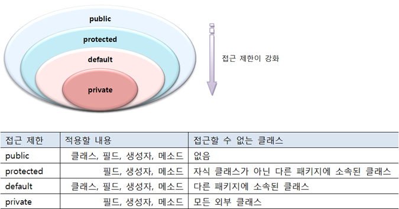


  protected는 public과 default 접근 제한의 종간쯤에 해당한다. 같은 패키지에서는 default와 같이 접근 제한이 없지만 다른 패키지에서는 자식 클래스만 접근을 허용한다.

  protected는 필드와 생성자, 메소드 선언에 사용될 수 있다. 다음 A클래스를 보면 protected로 선언된 필드, 생성자, 메소드가 있다.

- [A.java] protected 접근 제한자

  ```java
  package package1;
  
  public Class A {
      protected String field;
      
      protected A(){
      }
      
      protected void method() {
      }
  }
  ```

  다음 B클래스는 A클래스와 동일한 패키지에 있다. default 접근 제한과 마찬가지로 B클래스의 생성자와 메소드에서는 A클래스의 protected 필드, 생성자, 메소드에 얼마든지 접근이 가능하다.

- [B.java] protected 접근 제한자 테스트

  ```java
  package package1;
  
  public Class B {
      public void method() {
          A a = new A();
          a.field = "value";
          a.method();
      }
  }
  ```

  다음 C클래스는 A클래스와 다른 패키지에 있다. default 접근 제한과 마찬가지로 C클래스의 생성자와 메소드에서는 A클래스의 protected필드, 생성자, 메소드에 접근할 수 없다.

- [C.java] protected 접근 제한자 테스트

  ```java
  package package2;
  
  import package1.A;
  
  public class C {
      public void method() {
          A a = new A();		//(x)
          a.field = "value";	//(x)
          a.method();       	//(x) 
      }
  }
  ```

  다음 D클래스는 A클래스와 다른 패키지에 있다. C클래스와는 달리 D는 A의 자식 클래스이다. 그렇기 때문에 A클래스의 protected 필드, 생성자, 메소드에 접근이 가능하다.

  단 new 연산자를 사용해서 생성자를 직접 호출할 수는 없고, 자식 생성자에서 super()로 A 생성자를 호출할 수 있다.


## 7.7 타입 변환과 다형성

  <b>다형성은 같은 타입이지만 실행 결과가 다양한 객체를 이용할 수 있는 성질</b>을 말한다. 코드 측면에서 보면 다형성은 하나의 타입에 여러 객체를 대입함으로써 다양한 기능을 이용할 수 있도록 해준다.

  다형성을 위해 자바는 부모 클래스로 타입 변환을 허용한다. <b><u>즉 부모 타입에 모든 자식 객체가 대입될 수 있다.</u></b>
이것을 이용하면 객체는 부품화가 가능하다. 

  예를 들어 자동차를 설계할 때 타이어 클래스 타입을 적용했다면 이 클래스를 상속한 실제 타이어들은 어떤 것이든 상관없이 장착(대입)이 가능하다.

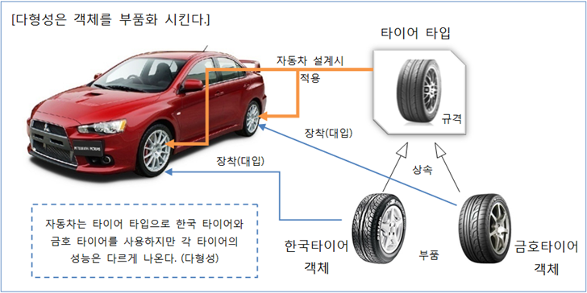


  타입 변환이란 데이터 타입을 다른 데이터 타입으로 변환하는 행위를 말한다. 기본 타입의 변환에 대해서는 이미 2장에서 학습했다.

  클래스 타입도 마찬가지로 타입 변환이 있다. 클래스 타입의 변환은 상속 관계에 있는 클래스 사이에서 발생한다. 자식 타입은 부모 타입으로 자동 타입 변환이 가능하다.
위 그림에서 HankookTire와 KumhoTire는 Tire를 상속했기 때문에 Tire 변수에 대입할 수 있다.


### 7.7.1 자동 타입 변환(promotion)

  자동 타입 변환(Promotion)은 프로그램 실행 도중에 자동적으로 타입 변환이 일어나는 것을 말한다. 자동 타입 변환은 다음과 같은 조건에 일어난다.


  <u>자동 타입 변환의 개념은 자식은 부모의 특징과 기능을 상속받기 때문에 부모와 동일하게 취급될 수 있다는 것이다.</u>

  예를 들어 고양이는 동물의 특징과 기능을 상속 받았다. 그래서 "고양이는 동물이다."가 성립한다. Animal과 Cat클래스가 다음과 같이 상속 관계에 있다고 보자.

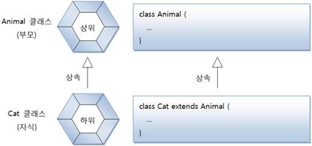


  Cat 클래스로부터 Cat 객체를 생성하고 이것을 Animal 변수에 대입하면 자동 타입 변환이 일어난다.

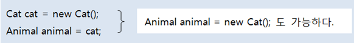

  위 코드로 생성되는 메모리 상태를 그림으로 묘사하면 다음과 같다. cat과 animal 변수는 타입만 다를 뿐, 동일한 Cat 객체를 참조한다.

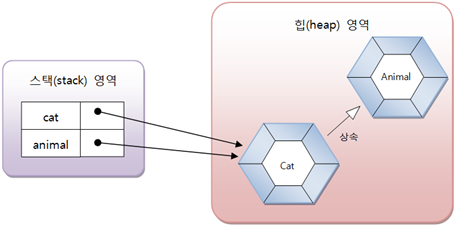

  위 그림에서 animal 변수가 Animal 타입이므로 당연히 부모인 Animal 객체를 참조하는 것이 맞지 않느냐고 생각할 수도 있지만, 사실은 그렇지 않다.

  다음과 같이 cat과 animal 변수를 == 연산해보면 true가 나오는데, 참조 변수의 == 연산은 참조 주소값이 같을 경우 true를 산출하므로 두 변수가 동일한 객체를 참조하고 있다는 뜻이다.

```java
cat == animal //true
```

바로 위의 부모가 아니더라도 상속 계층에서 상위 타입이라면 자동 타입 변환이 일어날 수 있다.

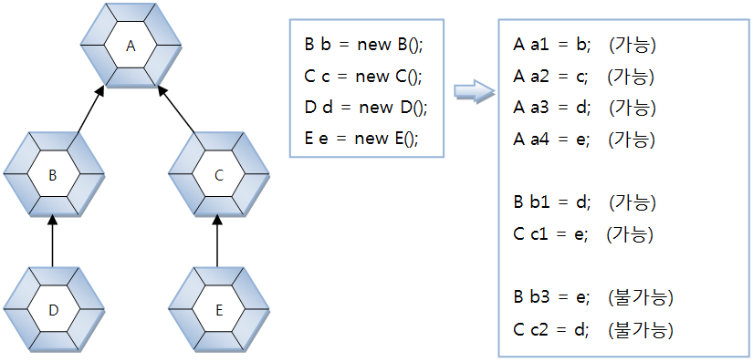

  D객체는 A타입으로 자동 타입 변환이 될 수 있고, E객체는 C와 A타입으로 자동 타입 변환이 될 수 있다. 그러나 D 객체는 C타입으로 변환될 수 없고, 마찬가지로 E객체는 B타입으로 변환될 수 없다. 이유는 상속 관계가 아니기 떄문이다.


- 정리 
    <b>부모 타입으로 자동 타입 변환된 이후에는 부모 클래스에 선언된 필드와 메소드에만 접근이 가능하다.</b>
  <u>비록 변수는 자식 객체를 참조하지만</u> 변수로 접근 가능한 맴버는 부모 클래스 맴버로만 한정된다.

    그러나 예외가 있는데, <u>메소드가 자식 클래스에서 오버라이딩 되었다면</u> <b>자식 클래스의 메소드가 대신 호출된다.</b> 이것은 다형성(<em><b>Polymorphism</b></em>)과 관련이 있기 때문에 매우 중요한 성질이므로 잘 알아두어야 한다.


- [Parent.java] 자동 타입 변환 후의 맴버 접근

  ```java
  public class Parent {
      public void method1() {
          System.out.println("Parent-method1()");
      }
  
      public void method2() {
          System.out.println("Parent-method2()");
      }
  }
  
  ```

- [Child.java] 자동 타입 변환 후의 맴버 접근

  ```java
  public class Child extends Parent{
      @Override
      public void method2() {
          System.out.println("Child-method2()");
      }
      public void method3() {
          System.out.println("Child-method3()");
      }
  }
  ```

- [ChildExample.java] 자동 타입 변환 후의 맴버 접근

  ```java
  public class ChildExample {
      public static void main(String[] args) {
          Child child = new Child();
  
          Parent parent = child;  //자동 타입 변환
          parent.method1();
          parent.method2();       //오버라이딩된 메소드 호출
          //parent.method3();     //호출 불가능
      }
  }
  ```


### 7.7.2 필드의 다형성

  그렇다면 왜 자동 타입 변환이 필요할까? 그냥 자식 타입으로 사용하면  될 것을 부모 타입으로 변환해서 사용하는 이유가 무엇일까?

  그것은 다형성을 구현하는 기술적 방법때문이다.
<b>다형성이란 동일한 타입을 사용하지만 다양한 결과가 나오는 성질을 말한다.</b> 주로 필드의 값을 다양화함으로써 실행 결과가 다르게 나오도록 구현하는데, 필드의 타입은 변함이 없지만, 실행도중에 어떤 객체를 필드로 저장하느냐에 따라 실행 결과가 달라질 수 있다. 이것이 <u>필드의 다형성</u>이다.


  자동차를 구성하는 부품은 언제든지 교체할 수 있다. 부품은 고장 날 수도 있고, 보다 더 성능이 좋은 부품으로 설계되기도 한다.

  객체지향 프로그램에서도 마찬가지이다. <b>프로그램은 수많은 객체들이 서로 연결되고 각자의 역할을 하게 되는데, 이 객체들은 다른 객체로 교체될 수 있어야 한다.</b>

- [Tire.java]

  ```java
  public class Tire {
      //필드
      public int maxRotation; //최대 회전수(타이어 수명)
      public int accumulatedRotation; //누적 회전수
      public String location; //타이어의 위치
  
      //생성자
      public Tire(String location, int maxRotation) {
          this.location = location;
          this.maxRotation = maxRotation;
      }
  
      //메소드
      public boolean roll() {
          ++accumulatedRotation; //누적 회전수 1증가
          if(accumulatedRotation<maxRotation) {
              System.out.println(location + " Tire 수명: " +
                      (maxRotation-accumulatedRotation) + "회");
              return true;    //정상회전일 경우
          }
          else {
              System.out.println("*** " + location + " Tire 펑크 ***");
              return false;   //펑크일 경우
          }
      }
  }
  ```

- [Car.java] Tire를 부품으로 가지는 클래스

  ```java
  public class Car {
      //필드: 자동차는 4개의 타이어를 갖는다.
      Tire frontLeftTire = new Tire("앞왼쪽", 6);
      Tire frontRightTire = new Tire("앞오른쪽", 2);
      Tire backLeftTire = new Tire("뒤왼쪽", 3);
      Tire backRightTire = new Tire("뒤오른쪽", 4);
  
      //생성자
  
      //메소드: 모든 타이어를 1만큼 회전시키다가 펑크가나면 자동차를 멈추고 펑크난 바퀴의 번호를 리턴한다.
      int run() {
          System.out.println("[자동차가 달립니다.]");
          if(frontLeftTire.roll()==false) { stop(); return 1; }
          if(frontRightTire.roll()==false) { stop(); return 2; }
          if(backLeftTire.roll()==false) { stop(); return 3; }
          if(backRightTire.roll()==false) { stop(); return 4; }
          return 0;
      }
  
      void stop() {
          System.out.println("[자동차가 멈춥니다.]"); //펑크났을때 실행
      }
  }
  
  ```

- [HankookTire.java] Tire의 자식 클래스

  ```java
  public class HankookTire extends Tire{
      //필드
  
      //생성자
      public HankookTire(String location, int maxRotation) {
          super(location, maxRotation);
      }
  
      //메소드
      @Override
      public boolean roll() { //출력 내용을 다르게 하기위해 roll() 오버라이딩
          ++accumulatedRotation; //누적 회전수 1증가
          if(accumulatedRotation<maxRotation) {
              System.out.println(location + " HankookTire 수명: " +
                      (maxRotation-accumulatedRotation) + "회");
              return true;    //정상회전일 경우
          }
          else {
              System.out.println("*** " + location + " HankookTire 펑크 ***");
              return false;   //펑크일 경우
          }
      }
  }
  
  ```

- [KumhoTire.java] Tire의 자식 클래스

  ```java
  public class KumhoTire extends Tire{
      //필드
  
      //생성자
      public KumhoTire(String location, int maxRotation) {
          super(location, maxRotation);
      }
  
      //메소드
      @Override
      public boolean roll() { //출력 내용을 다르게 하기위해 roll() 오버라이딩
          ++accumulatedRotation; //누적 회전수 1증가
          if(accumulatedRotation<maxRotation) {
              System.out.println(location + " KumhoTire 수명: " +
                      (maxRotation-accumulatedRotation) + "회");
              return true;    //정상회전일 경우
          }
          else {
              System.out.println("*** " + location + " KumhoTire 펑크 ***");
              return false;   //펑크일 경우
          }
      }
  }
  ```

- [CarExample.java] 실행 클래스

  ```java
  public class CarExample {
      public static void main(String[] args) {
          Car car = new Car();    //Car 객체 생성
  
          for(int i=1; i<=5; i++) {
              int problemlocation = car.run();
  
              switch (problemlocation) {
                  case 1:
                      System.out.println("앞왼쪽 HankookTire로 교체");
                      car.frontLeftTire = new HankookTire("앞왼쪽", 15);
                      break;
                  case 2:
                      System.out.println("앞오른쪽 KumhoTire로 교체");
                      car.frontRightTire = new KumhoTire("앞오른쪽", 13);
                      break;
                  case 3:
                      System.out.println("뒤왼쪽 HankookTire로 교체");
                      car.frontRightTire = new KumhoTire("뒤왼쪽", 14);
                      break;
                  case 4:
                      System.out.println("뒤오른쪽 KumhoTire로 교체");
                      car.frontRightTire = new KumhoTire("뒤오른쪽", 17);
                      break;
              }
              System.out.println("-------------------------------------"); //1회전마다
          }
      }
  }
  ```


### 7.7.3 하나의 배열로 객체 관리

  이전 예제에서 Car 클래스에 4개의 타이어 객체를 4개의 필드로 각각 저장했다. 우리는 동일한 타입의 값들은 배열로 관리하는 것이 유리하다는 것을 알고 있다.

  그렇다면 타이어 객체들도 타이어 배열로 관리하는 것이 코드를 깔끔하게 만들어줄 것이다.

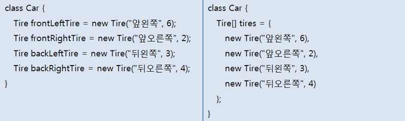

  이처럼 인덱스를 이용하여 객체를 표현할 수 있으므로 대입이나 제어문에서 활용하기 매우 쉽다. 예를 들어 인덱스 1을 이용해서 앞오른쪽 타이어를 KumhoTire로 교체하기 위해 다음과 같이 작성할 수 있다.

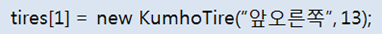

  tires 배열의 각 항목은 Tire 타입이므로 자식 객체인 KumhoTire를 대입하면 자동 타입 변환이 발생하기 때문에 아무런 문제가 없다.

  <b>배열의 타입은 Tire이지만 실제 저장 항목이 Tire의 자식 객체하면 모두 가능하다.</b> 상속 관계에 있는 객체들을 배열로 관리하면 제어문에서 가장 많이 혜택을 본다.
전체 타이어의 roll() 메소드를 호출하는 Car 클래스의 run() 메소드는 다음과 같이 for문으로 작성할 수 있다.

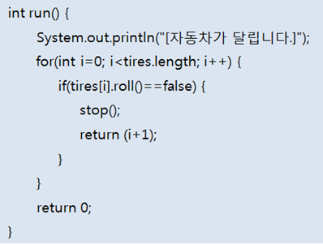


### 7.7.4 매개 변수의 다형성

  자동 타입 변환은 필드의 값을 대입할 때에도 발생하지만, 주로 메소드를 호출할 때 많이 발생한다.
메소드를 호출할 때에는 매개 변수의 타입과 동일한 매개값을 지정하는 것이 정석이지만, 매개값을 다양화하기 위해 매개 변수에 자식 타입 객체를 지정할 수도 있다.

  예를 들어 다음과 같이 Driver라는 클래스가 있다. Driver 클래스에는 drive() 메소드가 정의되어 있는데 Vehicle 타입의 매개 변수가 선언되어 있다.


  drive 메소드를 정상적으로 호출한다면 다음과 같을 것이다.

```java
Driver driver = new Driver();
Vehicle vehicle = new Vihicle();
driver.drive(vehicle);
```

  만약 Vehicle의 자식 클래스인 Bus 객체를 drive() 메소드의 매개값으로 넘겨준다면 어떻게 될까?

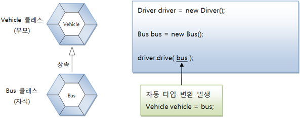

  drive() 메소드는 Vehicle 타입을 매개 변수로 선언했지만, Vehicle을 상속받는 Bus 객체가 매개값으로 사용되면 자동 타입 변환이 발생한다.

```java
Vehicle vehicle = bus;	//자동 타입 변환 
```

  <b>매개 변수의 타입이 클래스일 경우, 해당 클래스의 객체뿐만 아니라 자식 객체까지도 매개값으로 사용할 수 있다.</b>
매개값으로 어떤 자식 객체가 제공되느냐에 따라 메소드의 실행 결과는 다양해질 수 있다.(매개 변수의 다형성)

  자식 객체가 부모의 메소드를 재정의했다면 메소드 내부에서 오버라이딩된 메소드를 호출함으로써 메소드의 실행결과는 다양해진다.

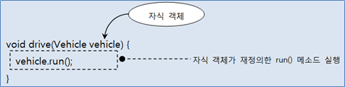


예제를 작성해보면서 지금까지 설명했던 내용을 눈으로 확인해 보자. 우선 Vehicle 클래스가 다음과 같이 작성되었다고 가정해보자.

- [Vehicle.java] 부모 클래스

  ```java
  public class Vehicle {
      public void run() {
          System.out.println("차량이 달립니다.");
      }
  }
  ```

    다음은 Driver 클래스인데, drive() 메소드에서 Vehicle 타입의 매개값을 받아서 run() 메소드를 호출한다.

- [Driver.java] Vehicle을 이용하는 클래스

  ```java
  public class Driver {
      public void drive(Vehicle vehicle) {
          vehicle.run();
      }
  }
  ```

    다음은 Bus 클래스와 Taxi 클래스인데, Vehicle 클래스를 상속받아 run() 메소드를 오버라이딩 하고 있다.

- [Bus.java] 자식 클래스

  ```java
  public class Bus extends Vehicle {
      @Override
      public void run() {
          System.out.println("버스가 달립니다.");
      }
  }
  ```

- [Taxi.java] 자식 클래스

  ```java
  public class Taxi extends Vehicle {
      @Override
      public void run() {
          System.out.println("택시가 달립니다.");
      }
  }
  ```

    이제 Vehicle, Driver, Bus, Taxi 클래스를 이용해서 실행하는 DriverExample 클래스를 보자.

- [DriverExample.java] 실행 클래스

  ```java
  public class DriverExample {
      public static void main(String[] args) {
          Driver driver = new Driver();
          
          Bus bus = new Bus();
          Taxi taxi = new Taxi();
          
          driver.drive(bus);	//자동타입변환 Vehicle vehicle = bus; 
          driver.drive(taxi); //자동타입변환 Vehicle vehicle = taxi;
      }
  }
  ```


### 7.7.5 강제 타입 변환(Casting)

  강제 타입 변환(Casting)은 부모 타입을 자식 타입으로 변환하는 것을 말한다. 그렇다고 해서 모든 부모 타입을 자식 클래스 타입으로 강제 변환할 수 있는 것은 아니다.

  <b>자식 타입이 부모 타입으로 자동 변환한 후, 다시 자식 타입으로 변활할 때 강제 타입 변환을 사용할 수 있다.</b>


  자식 타입이 부모 타입으로 자동 변환하면, 부모 타입에 선언된 필드와 메소드만 사용 가능하다는 제약 사항이 따른다. 

  만약 자식 타입에 선언된 필드와 메소드를 꼭 사용해야 한다면 강제 타입 변환을 해서 다시 자식 타입으로 변환한 다음 자식 타입의 필드와 메소드를 사용하면 된다.

- [Parent.java] 부모 클래스

  ```java
  public class Parent {
      public String field1;
      
      public void method1() {
          System.out.println("Parent-method1()");
      }
      
      public void method2() {
          System.out.println("Parent-method2()");
      }
  }
  ```

- [Child.java] 자식 클래스

  ```java
  public class Child extends Parent {
      public String field2;
      
      public void method3() {
          System.out.println("Child-method3()");
      }
  }
  ```

- [ChildExample.java] 강제 타입 변환(캐스팅)

  ```java
  public class ChildExample {
      public static void main(String[] args) {
          Parent parent = new Child();	//자동 타입 변환
          parent.field1 = "data1";
          parent.method1();
          parent.method2();
          /*
          parent.field2 = "data2";	//불가능
          parent.method3();			//불가능
          */	
          
          Child child = (Child)parent;
          child.field2 = "yyy";		//가능
          child.method3();			//가능
      }
  }
  ```

  

### 7.7.6 객체 타입 확인(instanceof)

  강제 타입 변환은 자식 타입이 부모 타입으로 변환되어 있는 상태에서만 가능하기 때문에 다음과 같이 부모 타입의 변수가 부모 객체를 참조할 경우 자식 타입으로 변환할 수 없다.

```java
Parent parent = new Parent();
Child child = (Child)parent;	//강제 타입 변환을 할 수 없다.
```

  어떤 객체가 어떤 클래스의 인스턴스인지 확인하려면 instanceof 연산자를 사용할 수 있다.
instanceof 연산자의 좌항은 객체가 오고, 우항은 타입이 오는데, 좌항의 객체가 우항의 인스턴스이면 즉 우항의 타입으로 객체가 생성되었다면 true를 산출하고 그렇지 않으면 false를 산출한다.

```java
boolean result = 좌항(객체) instanceof 우항(타입)
```

  instanceof 연산자는 매개값의 타입을 조사할 때 주로 사용한다. 메소드 내에서 강제 타입 변환이 필요할 경우 반드시 매개값이 어떤 객체인지 instanceof 연산자로 확인하고 안전하게 강제 타입 변환을 해야 한다.

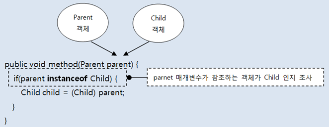

  만약 타입을 확인하지 않고 강제 타입 변환을 시도 한다면 ClassCastException 예외가 발생할 수 있다. 다음 예제를 보자. InstanceofExample 클래스에서 method1()과 method2()는 모두 parent 타입의 매개값을 받도록 선언했다.

- [parent.java] 부모 클래스

  ```java
  public class Parent {
  }
  ```

- [Child.java] 자식 클래스

  ```java
  public class Child extends Parent {
  }
  ```

- [InstanceofExample.java] 객체 타입 확인

  ```java
  public class InstanceofExample {
      public static void method1(Parent parent) {
          if(parent instanceof Child) {
              Child child = (Child) parent;	//Child 타입으로 변환이 가능한지 확인
              System.out.println("method1 - Child로 변환 성공");
          } else {
              System.out.println("method2 - Child로 변환되지 않음");
          }
      }
      
      public static void method2(Parent parent) {
          Child child = (Child) parent;	//ClassCastException이 발생할 가능성있음
          System.out.println("method1 - Child로 변환 성공");
      }
      
      public static void main(String[] args) {
          Parent parentA = new Child();
          method1(parentA); //Child 객체를 매개값으로 전달
          method2(parentA); //Child 객체를 매개값으로 전달
          
          Parent parentB = new Parent();
          method1(parentB); //Parent 객체를 매개값으로 전달
          method2(parentB); //예외발생
      }
  }
  ```


## 7.8 추상 클래스

### 7.8.1 추상 클래스의 개념

  사전적 의미로 추상(abstract)은 실체 간에 공통되는 특성을 추출한 것을 말한다.
예를 들어 새, 곤충, 물고기 등의 실체에서 공통괴는 특성을 추출해보면 동물이라는 공통점이 있다.

  클래스에서도 추상 클래스가 존재한다. 객체를 직접 생성할 수 있는 클래스를 실체 클래스라고 한다면 이 클래스들의 공통적인 특성을 추출해서 선언한 클래스를 추상 클래스라고 한다.

  <b>추상 클래스와 실체 클래스는 상속의 관계를 가지고 있다.</b> 추상 클래스가 부모이고 실체 클래스가 자식으로 구현되어 실체 클래스는 추상 클래스의 모든 특성을 물려받고, 추가적인 특성을 가질 수 있다
여기서 특성이란 필드와 메소드들을 말한다.

  예를 들어 Bird.class, Insect.class, Fish.class 등의 실체 클래스에서 공통되는 필드와 메소드를 따로 선언한 Animal.class를 만들 수 있는데, 이것이 바로 추상 클래스라고 볼 수 있다.

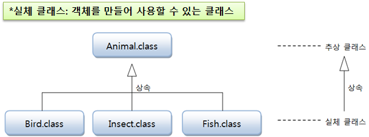

  추상 클래스는 실체 클래스의 공통되는 필드와 메소드를 추출해서 만들었기 때문에 객체를 직접 생성해서 사용할 수 없다. 다시 말해서 <b>추상 클래스는 new 연산자를 사용해서 인스턴스를 생성시키지 못한다.</b>

- 추상클래스의 사용 --> <b>새로운 실체 클래스를 만들기위해 부모 클래스로 사용된다.</b>

- 코드로 설명하면 추상 클래스는 extends 뒤에만 올 수 있는 클래스이다.

  ```java
  class Ant extends Animal { ... } //Animal은 추상클래스
  ```


### 7.8.2 추상 클래스의 용도

  실체 클래스들의 공통적인 특성(필드, 메소드)을 뽑아내어 추상 클래스로 만드는 이유가 무엇일까?
다음 두 가지 이유가 있다.


#### 첫번 째, 실체 클래스들의 공통된 필드와 메소드의 이름을 통일할 목적

  실체 클래스의 설계자가 여러명일 경우에, 똑같은 기능을 하는 메소드나 필드가 제각기 다른 이름을 가질 수 있다.
즉, 동일한 데이터와 기능임에도 불구하고 이름이 다르다 보니, 객체마다 사용방법이 달라진다.

  따라서, 추상 클래스에 필드와 메소드를 선언하고, 각 실체 클래스들은 추상 클래스를 상속함으로써 필드와 메소드 이름을 통일시킬 수 있다.


#### 두 번째, 실체 클래스를 작성할 때 시간을 절약

  공통적인 필드와 메소드는 추상 클래스에 모두 선언해 두고, 실체 클래스마다 다른 점만 실체 클래스에 선언하게 되면 실체 클래스를 작성하는데 시간을 절약할 수 있다.


### 7.8.3 추상 클래스 선언

  추상 클래스르 선언할 때에는 클래스 선언에 <b>abstract</b> 키워드를 붙여야 한다. abstract를 붙이게 되면 new 연산자를 이용해서 객체를 만들지 못하고 상속을 통해 자식 클래스만 만들 수 있다. 

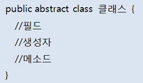

  추상 클래스도 일반 클래스와 마찬가지로 필드, 생성자, 메소드를 선언할 수 있다. new 연산자로 직접 생성자를 호출할 수는 없지만 자식 객체가 생성될 때 <b>super(...)</b>를 호출해서 추상 클래스 객체를 생성하므로 추상 클래스도 생성자가 반드시 있어야 한다.

- [Phone.java] 추상 클래스

  ```java
  public abstract class Phone {
      //필드
      public String owner;
  
      //생성자
      public Phone(String owner) {
          this.owner = owner;
      }
  
      //메소드
      public void turnOn() {
          System.out.println("폰 전원을 켭니다.");
      }
      public void turnOff() {
          System.out.println("폰 전원을 끕니다.");
      }
  }
  ```

    다음은 Phone 추상 클래스를 상속해서 SmartPhone 자식 클래스를 정의한 것이다. SmartPhone 클래스의 생성자를 보면 super(owner); 코드로 Phone의 생성자를 호출하고 있다.

- [SmartPhone.java] 실체 클래스

  ```java
  public class SmartPhone extends Phone {
      //생성자
      public SmartPhone(String owner) {
          super(owner);
      }
      //메소드
      public void internetSearch() {
          System.out.println("인터넷 검색을 합니다.");
      }
  }
  ```

    다음 PhoneExample 클래스는 Phone의 생성자를 호출해서 객체를 생성할 수 없을을 보여준다. 대신 자식 클래스인 SmartPhone으로 객체를 생성해서 Phone의 메소드인 turnOn(), turnOff() 메소드를 사용할 수 있음을 보여준다.

- [PhoneExample.java] 추상 클래스

  ```java
  public class PhoneExample {
      public static void main(String[] args) {
          //Phone phone = new Phone();
  
          SmartPhone smartPhone = new SmartPhone("홍길동");
  
          smartPhone.turnOn();    //Phone의 메소드
          smartPhone.internetSearch();
          smartPhone.turnOff();   //Phone의 메소드
      }
  }
  ```


### 7.8.4 추상 메소드와 오버라이딩

- 추상메소드 : 메소드 이름은 동일하지만, 실행 내용이 실체 클래스마다 다른 메소드

- 추상 메소드는 추상 클래스에서만 선언할 수 있는데, 메소드의 선언부만 있고 메소드 실행 내용인 중괄호 {}가 없는 메소드를 말한다.

  추상 클래스를 설계할 때, 하위 클래스가 반드시 실행 내용을 채우도록 강요하고 싶은 메소드가 있을 경우,
  해당 메소드를 추상 메소드로 선언하면 된다. 자식 클래스는 반드시 추상 메소드를 재정의해서 실행내용을 작성해야 한다.

- 추상 메소드 선언방법

  ```java
  [public | protected] abstract 리턴타입 메소드명(매개변수, ...);
  ```

  일반 메소드 선언과의 차이점은 abstract 키워드가 붙어 있고 메소드 중괄호 {}가 없다. 다음은 Animal 클래스를 추상 클래스로 선언하고 sound() 메소드를 추상 메소드로 선언한 것이다.

```java
public abstract class Animal {
    public abstract void sound();
}
```

  어떤 소리를 내는지는 결정할 수 없지만 동물은 소리를 낸다는 공통적인 특징이 있으므로 sound() 메소드를 추상 메소드로 선언했다. Animal 클래스를 상속하는 하위 클래스는 고유한 소리를 내도록 <b>sound() 메소드를 재정의 해야한다.</b>

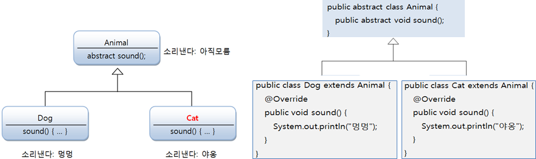


