# 08. 인터페이스

## 8.1 인터페이스의 역할

  자바에서 인터페이스(interface)는 객체의 사용 방법을 정의한 것이다. 인터페이스는 객체의 교환성을 높여주기 때문에 다형성을 구현하는 매우 중요한 역할을 한다.

  인터페이스는 개발 코드와 객체가 서로 통신하는 접점 역할을 한다.
개발 코드가 인터페이스의 메소드를 호출하면 인터페이스는 객체의 메소드를 호출시킨다.
그렇기 때문에 개발 코드는 객체의 내부 구조를 알 필요가 없고 인터페이스의 메소드만 알고 있으면 된다.


- 인터페이스의 역할

  - 개발 코드가 객체에 종속되지 않게 → 객체를 교체할 수 있도록 하는 역할
  - 개발 코드 변경 없이 리턴값 또는 실행 내용이 다양해 질 수 있음(다형성)
    

  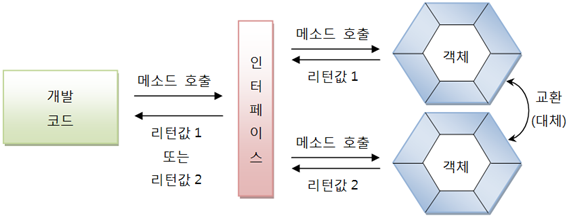


## 8.2 인터페이스 선언

  인터페이스는 "~.java" 형태의 소스 파일로 작성되고 컴파일러(javac.exe)를 통해 "~.class" 형태로 컴파일되기 때문에 물리적 형태는 클래스와 동일하다.
차이점은 소스를 작성할 때 선언하는 방법이 다르다.


### 8.2.1 인터페이스 선언

  인터페이스 선언은 class 키워드 대신에 interface 키워드를 사용한다.

```java
[ public ] Interface 인터페이스명 { ... }
```

- 인터페이스 이름
  - 영어 대소문자 구별
  - 첫 문자를 대문자로 하고 나머지는 소문자로 작성하는 것이 관례
  - public 접근 제한은 다른 패키지에서도 인터페이스를 사용할 수 있도록 해준다

  클래스는 필드, 생성자, 메소드를 구성 맴버로 가지는데 비해, 인터페이스는 상수와 메소드만을 구성 맴버로 가진다. <b>인터페이스는 객체로 생성할 수 없기 때문에 생성자를 가질 수 없다.</b> 
자바 8부터 인터페이스의 메소드는 디폴트 메소드와 정적 메소드도 선언이 가능하다. (이전에는 추상 메소드만)

```java
interface 인터페이스명 {
    //상수
    타입 상수명 = 값;
    //추상 메소드
    타입 메소드명(매개변수, ...);
    //디폴트 메소드
    default 타입 메소드명(매개변수, ...) { ... }
    //정적 메소드
    static 타입 메소드명(매개변수) { ... }
}
```


#### 상수 필드(Constant Field)

  인터페이스는 객체 사용 설명서이므로 런타임 시 데이터를 저장할 수 있는 필드를 선언할 수 없다. 그러나 상수 필드는 선언이 가능하다. 상수는 인터페이스에 고정된 값으로 런타임 시에 데이터를 바꿀 수 없다. 
<b>상수를 선언할 때는 반드시 초기값을 대입해야 한다.</b>


#### 추상 메소드(Abstract Method)

  추상 메소드는 객체가 가지고 있는 메소드를 설명한 것으로 호출할 때 <b>어떤 매개값이 필요하고, 리턴 타입이 무엇인지만 알려준다.</b> 실제 실행부는 객체(구현 객체)가 가지고 있다.


#### 디폴트 메소드(Default Method)

  디폴트 메소드는 인터페이스에 선언되지만 사실은 객체(구현 객체)가 가지고 있는 인스턴스 메소드라고 생각해야 한다.

  <b>자바 8에서 디폴트 메소드를 허용한 이유는 기존 인터페이스를 확장해서 새로운 기능을 추가하기 위해서이다.</b>


#### 정적 메소드(Static Method)

  정적 메소드도 역시 자바 8부터 작성할 수 있는데, 디폴트 메소드와는 달리 객체가 없어도 인터페이스만으로 호출이 가능하다.


### 8.2.2 상수 필드 선언

  인터페이스는 데이터를 저장할 수 없기 때문에 데이터를 저장할 인스턴스 또는 정적 필드를 선언할 수 없다.

  대신 상수 필드만 선언할 수 있다. 상수는 public static final로 선언하는데 클래스에서 이미 학습한 바 있다. 따라서 <b>인터페이스에 선언된 필드는 모두 public static final의 특성을 갖는다.</b>

  public, static, final을 생략하더라도 자동적으로 컴파일 과정에서 붙게 된다.

```java
[ public static final ] 타입 상수명 = 값;
```

  상수명은 대문자로 작성하되, 서로 다른 단어로 구성되어 있을 경우에는 언더바(_)로 연결하는 것이 관례이다.

  인터페이스 상수는 static {} 블록으로 초기화할 수 없기 때문에 반드시 선언과 동시에 초기값을 지정해야 한다.

- [RemoteControl.java] 상수 필드 선언

  ```java
  public interface RemoteControl {
      public int MAX_VOLUME = 10;
      public int MIN_VOLUME = 0;
  }
  ```


### 8.2.3 추상 메소드 선언

  인터페이스를 통해 호출된 메소드는 최종적으로 객체에서 실행된다. 그렇기 때문에 인터페이스의 메소드는 실행 블록이 필요 없는 추상 메소드로 선언한다.

  추상 메소드는 리턴 타입, 메소드명, 매개 변수만 기술되고 중괄호 {}를 붙이지 않는 메소드를 말한다. 인터페이스에 선언된 추상 메소드는 모두 public abstract의 특성을 갖기 때문에 public abstract를 생략하더라도 자동적으로 컴파일 과정에서 붙게 된다.

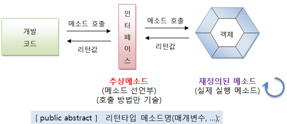


  다음은 RemoteControl 인터페이스에서 turnOn(), turnOff(), setVolume() 추상 메소드를 선언했다. 

  세 메소드는 모두 리턴 타입이 void라는 것과 turnOn(), turnOff() 메소드는 호출 시 매개값이 필요없고, setVolume() 메소드만 int 매개값이 필요함을 알려주고 있다.

- [RemoteControl.java] 메소드 선언

  ```java
  public interface RemoteControl {
      //상수
      public int MAX_VOLUME = 10;
      public int MIN_VOLUME = 0;
      
      //메소드 선언부만 작성 (추상 메소드) 
      public void turnOn();
      public void turnOff();
      public void setVolume(int volume);
  }
  ```

  

### 8.2.4 디폴트 메소드 선언

  디폴트 메소드는 자바 8에서 추가된 인터페이스의 새로운 맴버이다. 형태는 클래스의 인스턴스 메소드와 동일한데, default 키워드가 리턴 타입 앞에 붙는다.

  디폴트 메소드는 public 특성을 갖기 때문에 public을 생략하더라도 자동적으로 컴파일 과정에서 붙게 된다.

```java
[public] default 리턴타입 메소드명(매개변수, ...) { ... }
```

  다음은 RemoteControl 인터페이스에서 무음 처리 기능을 제공하는 setMute() 디폴트 메소드를 선언하였다.

- [RemoteControl.java] 메소드 선언

  ```java
  interface RemoteControl {
      //상수
      public int MAX_VOLUME = 10;
      public int MIN_VOLUME = 0;    
      
      //추상 메소드
    void turnOn();
      void turnOff();
      void setVolume(int volume);
      
      //디폴트 메소드 (실행 내용까지 작성)
      default void setMute(boolean mute) {
          if(mute) {
              System.out.println("무음 처리합니다.");
          }
          else {
              System.out.println("무음 해제합니다.");
          }
      }
  }
  ```
  


### 8.2.5 정적 메소드

  정적 메소드는 디폴트 메소드와 마찬가지로 자바 8에서 추가된 인터페이스의 새로운 맴버이다. 형태는 클래스의 정적 메소드와 완전 동일하다. 

  정적 메소드는 public 특성을 갖기 때문에 public을 생략하더라도 자동적으로 컴파일 과정에서 붙게 된다.

```java
[public] static 리턴타입 메소드명(매개변수, ...) { ... }
```

  다음은 RemoteControl 인터페이스에서 밧데리를 교환하는 기능을 가진 changeBattery() 정적 메소드를 선언하였다.

- [RemoteControl.java] 메소드 선언

  ```java
  public interface RemoteControl {
      //상수
      public int MAX_VOLUME = 10;
      public int MIN_VOLUME = 0;  
      
      //추상 메소드
      void turnOn();
      void turnOff();
      void setVolume(int volume)();
      
      //디폴트 메소드
      default void setMute(boolean mute) {
          if(mute) {
              System.out.println("무음 처리합니다.");
          }
          else {
              System.out.println("무음 해제합니다.");
          }
      }
      
      //정적 메소드
      static void changeBattery() {
          System.out.println("건전지를 교환합니다.");
      }
  }
  ```


## 8.3 인터페이스 구현

  개발 코드가 인터페이스 메소드를 호출하면 인터페이스는 객체의 메소드를 호출한다. <b>객체는 인터페이스에서 정의된 추상 메소드와 동일한 메소드 이름, 매개 타입, 리턴 타입을 가진 실제 메소드를 가지고 있어야 한다.</b>

  이러한 객체를 인터페이스의 구현(implement) 객체라고 하고, 구현 객체를 생성하는 클래스를 구현 클래스라고 한다.

 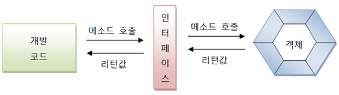


### 8.3.1 구현 클래스

  구현 클래스는 보통의 클래스와 동일한데, 인터페이스 타입으로 사용할 수 있음을 알려주기 위해 클래스 선언부에 implements 키워드를 추가하고 인터페이스명을 명시해야 한다.

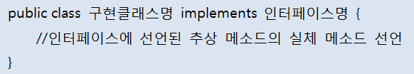

  그리고 인터페이스에 선언된 추상 메소드의 실체 메소드를 선언해야 한다. 다음은 Television과 Audio라는 이름을 가지고 있는 RemoteControl 구현 클래스를 작성하는 방법을 보여준다.

  클래스 선언부 끝에 implements RemoteControl이 붙어 있기 때문에 이 두 클래스는 RemoteControl 인터페이스로 사용이 가능하다. 
<b>RemoteControl에는 3개의 추상 메소드가 있기 때문에 Television과 Audio는 이 추상 메소드들에 대한 실체 메소드를 가지고 있어야 한다.</b>

- [Television.java] 구현 클래스

  ```java
  public class Television implements RemoteControl {
      //필드
      private int volume;
  
      //turnOn() 추상 메소드의 실체 메소드
      @Override
      public void turnOn() {
          System.out.println("TV를 켭니다.");
      }
      //turnOff() 추상 메소드의 실체 메소드
      @Override
      public void turnOff() {
          System.out.println("TV를 끕니다.");
      }
  
      @Override
      public void setVolume(int volume) {
          if(volume > RemoteControl.MAX_VOLUME) {
              this.volume = RemoteControl.MAX_VOLUME;
          }
          else if(volume < RemoteControl.MIN_VOLUME) {
              this.volume = RemoteControl.MIN_VOLUME;
          }
          else {
              this.volume = volume;
          }
          System.out.println("현재 TV 볼륨: " + this.volume);
      }
  }
  ```

- [Audio.java] 구현 클래스

  ```java
  public class Audio implements RemoteControl {
      //필드
      private int volume;
  
      @Override
      public void turnOn() {
          System.out.println("Audio를 켭니다.");
      }
  
      @Override
      public void turnOff() {
          System.out.println("Audio를 끕니다.");
      }
  
      @Override
      public void setVolume(int volume) {
          if(volume > RemoteControl.MAX_VOLUME) {
              this.volume = RemoteControl.MAX_VOLUME;
          }
          else if(volume < RemoteControl.MIN_VOLUME) {
              this.volume = RemoteControl.MIN_VOLUME;
          }
          else {
              this.volume = volume;
          }
          System.out.println("현재 Audio 볼륨: " + this.volume);
      }
  }
  ```


  구현 클래스에서 인터페이스의 추상 메소들에 대한 실체 메소드를 작성할 때 주의할 점은 인터페이스의 모든 메소드는 기본적으로 public 접근 제한을 갖기 때문에 public보다 더 낮은 접근 제한으로 작성할 수 없다.

  public을 생략하면 "Cannot reduce the visibility of the inherited method"라는 컴파일 에러를 만나게 된다.
<b>만약 인터페이스에 선언된 추상 메소드에 대응하는 실체 메소드를 구현 클래스가 작성하지 않으면 구현 클래스는 자동적으로 추상 클래스가 된다.</b>

- 예시

  ```java
  public abstract class Audio implements RemoteControl {
      //필드
      private int volume;
  
      @Override
      public void turnOn() {
          System.out.println("Audio를 켭니다.");
      }
  
      @Override
      public void turnOff() {
          System.out.println("Audio를 끕니다.");
      }
  
  //    @Override
  //    public void setVolume(int volume) {
  //        if(volume > RemoteControl.MAX_VOLUME) {
  //            this.volume = RemoteControl.MAX_VOLUME;
  //        }
  //        else if(volume < RemoteControl.MIN_VOLUME) {
  //            this.volume = RemoteControl.MIN_VOLUME;
  //        }
  //        else {
  //            this.volume = volume;
  //        }
  //        System.out.println("현재 Audio 볼륨: " + this.volume);
  //    }
  }
  ```


  <b>인터페이스로 구현 객체를 사용하려면</b> 다음과 같은 인터페이스 변수를 선언하고 구현 객체를 대입해야 한다.

  인터페이스 변수는 참조 타입이기 때문에 구현 객체가 대입될 경우 구현 객체의 번지를 저장한다.
RemoteControl 인터체이스로 구현 객체인 Television과 Audio를 사용하려면 다음과 같이 RemoteControl 타입 변수 rc를 선언하고 구현 객체를 대입해야 한다.

- [RemoteControlExample.java] 인터페이스 변수에 구현 객체 대입

  ```java
  public class RemoteControlExample {
      public static void main(String[] args) {
          RemoteControl rc = new Television();
          rc = new Television();
          rc = new Audio();
      }
  }
  ```

  > 인터페이스 사용 방법은 다음 절에서 자세히 살펴보기로 하고 여기서는 구현 객체를 인터페이스 변수에 대입에서 사용한다는 것만 알아두자


### 8.3.2 익명 구현 객체

  구현 클래스를 만들어 사용하는 것이 일반적이고, 클래스를 재사용할 수 있기 때문에 편리하지만, 일회성의 구현 객체를 만들기 위해 소스 파일을 만들고 클래스를 선언하는 것은 비효율적이다.

  자바는 소스 파일을 만들지 않고도 구현 객체를 만들 수 있는 방법을 제공하는데, 그것이 익명 구현 객체이다.
자바는 UI 프로그래밍에서 이벤트를 처리하기 위해, 그리고 임시 작업 스레드를 만들기 위해 익명 구현 객체를 많이 활용한다.

  <u>자바 8에서 지원하는 람다식은 인터페이스의 익명 구현 객체를 만들기 때문에 익명 구현 객체의 코드 패턴을 잘 익혀야 한다.</u>

- 명시적인 구현 클래스 작성을 생략하고 바로 구현 객체를 얻는 방법

  - 이름 없는 구현 클래스를 선언과 동시에 객체 생성

    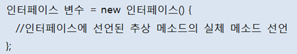

  - 하나의 실행문이므로 끝에는 세미콜론(;)을 반드시 붙여야 함
  - 인터페이스() {}는 인터페이스를 구현해서 중괄호 {}와 같이 클래스를 선언하라는 뜻
  - new 연산자는 이렇게 선언된 클래스를 객체로 생성함
  - 중괄호 {}에는 인터페이스에 선언된 모든 추상 메소드들의 실체 메소드를 작성해야함
  - 추가적으로 필드와 메소드를 선언할 수 있으나, <b>인터페이스 변수로 접근 할 수 없음</b>

- [RemoteControlExample.java]

  ```java
  public class RemoteControlExample {
      public static void main(String[] args) {
          RemoteControl rc = new RemoteControl() {
              @Override
              public void turnOn() {}
  
              @Override
              public void turnOff() {}
  
              @Override
              public void setVolume(int volume) {}
  
              public void method1() {}
          };
  
          //rc.method1 --> 컴파일 에러
          rc.turnOn();
      }
  }
  
  ```


  모든 객체는 클래스로부터 생성되는데, 익명 구현 객체도 예외는 아니다. 
RemoteControlExample.java를 컴파일하면 자바 컴파일러에 의해 자동으로 다음과 같은 클래스파일이 만들어진다.

```java
RemoteControlExample$1.class
```

  RemoteControlExample 이름 뒤에 $가 붙고 생성 번호가 붙는데 생성 번호는 1번부터 시작한다. 만약 두 번째 익명 구현 객체를 만들었다면 클래스 파일명은 RemoteControlExample$2.class가 된다.


### 8.3.3 다중 인터페이스 구현 클래스

  객체는 다음 그림과 같이 다수의 인터페이스 타입으로 사용할 수 있다.

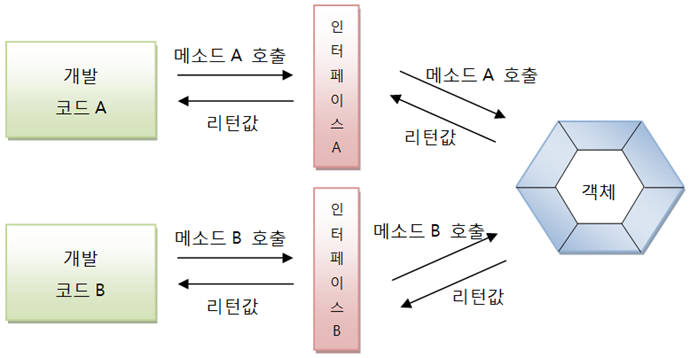

  인터페이스 A와 인터페이스 B가 객체의 메소드를 호출할 수 있으려면 객체는 이 두 인터페이스를 모두 구현해야 한다. 따라서 구현 클래스는 다음과 같이 작성되어야 한다.

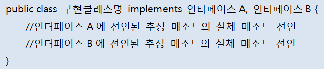

​    다중 인터페이스를 구현할 경우, 구현 클래스는 모든 인터페이스의 추상 메소드에 대해 실체 메소드를 작성해야 한다.

  만약 하나라도 없으면 추상 클래스로 선언해야 한다.

- [Searchable.java] 인터페이스

  ```java
  public interface Searchable {
      public abstract void search(String url);
  }
  ```

  먄약 SmartTelevision 인터넷 검색 기능도 제공한다면 RemoteControl과 Searchable을 모두 구현한 SmartTelevision 클래스를 다음과 같이 작성할 수 있다.

- [SmartTelevision.java] 다중 인터페이스 구현 클래스

  ```java
  public class SmartTelevision implements RemoteControl, Searchable{
      private int volume;
  
      @Override
      public void turnOn() {
          System.out.println("TV를 켭니다.");
      }
  
      @Override
      public void turnOff() {
          System.out.println("TV를 끕니다.");
      }
  
      @Override
      public void setVolume(int volume) {
          if(volume > RemoteControl.MAX_VOLUME) {
              this.volume = RemoteControl.MAX_VOLUME;
          }
          else if(volume < RemoteControl.MIN_VOLUME) {
              this.volume = RemoteControl.MIN_VOLUME;
          }
          else {
              this.volume = volume;
          }
          System.out.println("현재 TV 볼륨: " + this.volume);
      }
  
      @Override
      public void search(String url) {
          System.out.println(url + "을 검색합니다.");
      }
  }
  ```


## 8.4 인터페이스 사용

  인터페이스로 구현 객체를 사용하려면 다음과 같이 인터페이스 변수를 선언하고 구현 객체를 대입해야 한다.

  인터페이스 변수는 참조 타입이기 때문에 구현 객체가 대입될 경우 구현 객체의 번지를 저장한다.
예를 들어 RemoteControl 인터페이스로 구현 객체인 Television과 Audio를 사용하려면 다음과 같이 RemoteControl 타입 변수 rc를 선언하고 구현 객체를 대입해야 한다.

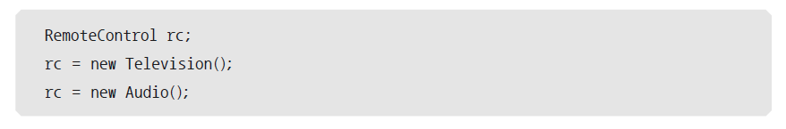

개발 코드에서 인터페이스는 <u>클래스의 필드, 생성자 또는 메소드의 매개변수, 생성자 또는 메소드의 로컬 변수로 선언될 수 있다.</u>

```java
public class MyClass {
    //필드
    RemoteControl rc = new Television();
    
    //생성자
    MyClass(RemoteControl rc) { //생성자의 매개변수
        this.rc = rc;
    }
    
    //메소드
    void methodA() {
        //로컬변수
        RemoteControl rc = new Audio();
    }
    
    void methodB(RemoteControl rc) { ... } //메소드의 매개변수
}
```


### 8.4.1 추상 메소드 사용

  구현 객체가 인터페이스 타입에 대입되면 인터페이스에 선언된 추상 메소드를 개발 코드에서 호출할 수 있게 된다.

  개발 코드에서 RemoteControl의 변수 rc로 turnOn() 또는 turnOff() 메소드를 호출하면 구현 객체의 turnOn()과 turnOff() 메소드가 자동 실행된다.

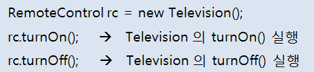

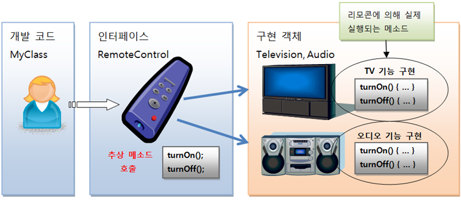

- [RemoteControlExample.java] 인터페이스 사용

  ```java
  public class RemoteControlExample {
      public static void main(String[] args) {
          RemoteControl rc = null; //인터페이스 변수 선언
          
          rc = new Television(); //Television 객체를 인터페이스 타입에 대입
          rc.turnOn(); //인터페이스의 추상 메소드 호출
          rc.turnOff(); //인터페이스의 추상 메소드 호출
  
      	rc = new Audio(); //Audio 객체를 인터페이스 타입에 대입
          rc.turnOn(); //인터페이스의 추상 메소드 호출
          rc.turnOff(); //인터페이스의 추상 메소드 호출
      }
  }
  ```

  

### 8.4.2 디폴트 메소드 사용

  디폴트 메소드는 인터페이스에 선언되지만, 인터페이스에서 바로 사용할 수 없다. 디폴트 메소드는 추상 메소드가 아닌 인스턴스 메소드이므로 구현 객체가 있어야 사용할 수 있다.

  예를 들어 RemoteControl 인터페이스는 setMute()라는 디폴트 메소드를 가지고 있지만, 이 메소드를 다음과 같이 호출할 수는 없다.

```java
RemoteControl.setMute(true);
```


  setMute() 메소드를 호출하려면 RemoteControl의 구현 객체가 필요한데, 다음과 같이 Television 객체를 인터페이스 변수에 대입하고 나서 setMute()를 호출할 수 있다.

```java
RemoteControl rc = new Television();
rc.setMute(true);
```

  비록 setMute()가 Television에 선언되지는 않았지만 Television 객체가 없다면 setMute()도 호출할 수 없다.


  <b>디폴트 메소드는 인터페이스의 모든 구현 객체가 가지고 있는 기본 메소드라고 생각하면 된다.</b> <u>그러나 어떠한 구현 객체는 디폴트 메소드의 내용이 맞지않아 수정이 필요할 수도 있다.</u>

  그럴때는 구현클래스를 작성할 때 디폴트 메소드를 <b>오버라이딩</b>해서 자신에게 맞게 수정하면 디폴트 메소드가 호출될 때 자신을 재정의한 메소드가 호출된다.


  다음 예제를 보면 Audio는 디폴트 메소드를 재정의 했다. Television과 Audio 중 어떤 객체가 인터페이스에 대입되느냐에 따라서 setMute() 디폴트 메소드의 실행 결과는 달라진다.

- [Audio.java] 구현 클래스

  ```java
  public class Audio implements RemoteControl {
      //필드
      private int volume;
      private boolean mute;
  
      @Override
      public void turnOn() {
          System.out.println("Audio를 켭니다.");
      }
  
      @Override
      public void turnOff() {
          System.out.println("Audio를 끕니다.");
      }
  
      @Override
      public void setVolume(int volume) {
          if(volume > RemoteControl.MAX_VOLUME) {
              this.volume = RemoteControl.MAX_VOLUME;
          }
          else if(volume < RemoteControl.MIN_VOLUME) {
              this.volume = RemoteControl.MIN_VOLUME;
          }
          else {
              this.volume = volume;
          }
          System.out.println("현재 Audio 볼륨: " + this.volume);
      }
  
      @Override //디폴트 메소드 재정의
      public void setMute(boolean mute) {
          this.mute = mute;
          if(mute) {
              System.out.println("Audio 무음 처리합니다.");
          }
          else {
              System.out.println("Audio 무음 해제합니다.");
          }
      }
  }
  ```

- [ RemoteControlExample.java] 디폴트 메소드 사용

  ```java
  public class RemoteControlExample {
      public static void main(String[] args) {
          RemoteControl rc = null;
  
          rc = new Television();
          rc.turnOn();
          rc.setMute(true);
  
          rc = new Audio();
          rc.turnOn();
          rc.setMute(true);
      }
  }
  ```

  - 실행 결과
    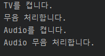


### 8.4.3 정적 메소드 사용

  인터페이스의 정적 메소드는 인터페이스로 바로 호출이 가능하다. 다음 예제는 RemoteControl의 changeBattery() 정적 메소드를 호출한다.

- [RemoteControlExample.java] 정적 메소드 사용

  ```java
  public class RemoteControlExample {
      public static void main(String[] args) {
          RemoteControl.changeBattery();
      }
  }
  ```


## 8.5 타입 변환과 다형성

  우리는 상속에서 타입 변환과 다형성에 대해 살펴보았다. 인터페이스도 다형성을 구성하는 기술이 사용된다.

  오히려 요즘은 상속보다는 인터페이스를 통해서 다형성을 구현하는 경우가 더 많다. <b>다형성은 하나의 타입에 대입되는 객체에 따라서 실행결과가 다양한 형태로 나오는 성질을 말한다.</b>


  부모 타입에 어떤 자식 객체를 대입하느냐에 따라 실행결과가 달라지듯이,
인터페이스 타입에 어떤 구현 객체를 대입하느냐에 따라 실행결과가 달라진다.

  상속은 같은 종류의 하위 클래스를 만드는 기술이고, 인터페이스는 사용 방법이 동일한 클래스를 만드는 기술이라는 개념의 차이점은 있지만 둘 다 다형성을 구현하는 기술임에는 틀림 없다.


  <b>인터페이스는 메소드의 매개 변수로 많이 등장한다.</b> 인터페이스 타입으로 매개 변수를 선언하면 메소드 호출 시 <u>매개값으로 여러 가지 종류의 구현 객체를 줄 수 있기 때문에 메소드 실행 결과가 다양하게 나온다.</u>

  이것이 인터페이스 매개 변수의 다형성 이다.


### 8.5.1 자동 타입 변환(Promotion)

  구현 객체가 인터페이스 타입으로 변환되는 것은 자동 타입 변환(Promotion)에 해당 한다. 자동 타입 변환은 프로그램 실행 도중에 자동적으로 타입 변환이 일어나는 것을 말한다. 


  인터페이스 구현 클래스를 상속해서 자식 클래스를 만들었다면 자식 객체 역시 인터페이스 타입으로 자동 타입 변환시킬 수 있다.

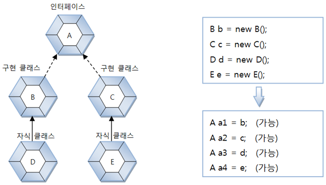

  자동 타입 변환을 이용하면 필드의 다형성과 매개 변수의 다형성을 구현할 수 있다.
필드와 매개 변수의 타입을 인터페이스로 선언하면 다양한 구현 객체를 대입해서 실행 결과를 다양하게 만들 수 있다.


### 8.5.2 필드의 다형성

  자동차를 설계할 때 다음과 같이 필드 타입으로 타이어 인터페이스를 선언하게 되면 필드값으로 한국 타이어 또는 금호 타이어 객체를 대입할 수 있다.

  자동 타입 변환이 일어나기 때문에 아무런 문제가 없다.

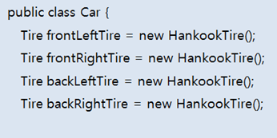

Car 객체를 생성한 후, 초기값으로 대입한 구현 객체 대신 다른 구현 객체를 대입할 수도 있다. 이것이 타이어 교체에 해당한다.

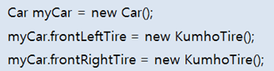

  다음은 Car 객체의 run() 메소드에서 타이어 인터페이스에 선언된 roll() 메소드를 호출한다.

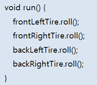

  frontLeftTire와 frontRightTire를 교체하기 전에는 HankookTire 객체의 roll() 메소드가 호출되지만, KumhoTire로 교체된 후에는 KumhoTire 객체의 roll() 메소드가 호출된다.

  Car의 run() 메소드 수정 없이도 다양한 roll() 메소드의 실행 결과를 얻을 수 있는 것이다.
이것이 바로 필드의 다형성이다.

- [Tire.java] 인터페이스

  ```java
  public interface Tire {
      public abstract void roll();
  }
  ```

- [HankookTire.java] 구현 클래스

  ```java
  public class HankookTire implements Tire{
      @Override
      public void roll() {
          System.out.println("한국 타이어가 굴러갑니다."); //Tire 인터페이스 구현
      }
  }
  ```

- [KumhoTire.java] 구현 클래스

  ```java
  public class KumhoTire implements Tire{
      @Override
      public void roll() {
          System.out.println("금호 타이어가 굴러갑니다."); //Tire 인터페이스 구현
      }
  }
  ```

- [Car.java] 필드 다형성

  ```java
  public class Car {
      Tire frontLeftTire = new HankookTire();
      Tire frontRightTire = new HankookTire();
      Tire backLeftTire = new HankookTire();
      Tire backRightTire = new HankookTire();
  
      void run() {
          frontLeftTire.roll();
          frontRightTire.roll();
          backLeftTire.roll();
          backRightTire.roll();
      }
  }
  ```

- [CarExample.java] 필드 다형성 테스트

  ```java
  public class CarExample {
      public static void main(String[] args) {
          Car myCar = new Car();
  
          myCar.run();
  
          myCar.frontLeftTire = new KumhoTire();
          myCar.frontRightTire = new KumhoTire();
  
          myCar.run();
      }
  }
  ```

  - 실행 결과
    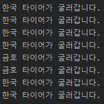


### 8.5.3 인터페이스 배열로 구현 객체 관리

  이전 예제에서는 Car 클래스에서 4개의 타이어 필드를 인터페이스로 각각 선언했지만 다음과 같이 인터페이스 배열로 관리할 수도 있다.

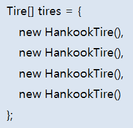

  다음은 이전 예제에서 작성한 Car 클래스의 타이어 필드를 배열로 수정한 예제이다.

- [Car.java] 필드 다형성

  ```java
  public class Car {
      Tire[] tires = {
              new HankookTire(),
              new HankookTire(),
              new HankookTire(),
              new HankookTire()
      };
      
      void run() {
          for(Tire tire : tires) {
              tire.roll();
          }
      }
  }
  ```

  Car 클래스가 수정되었으니, CarExample 클래스도 다음과 같이 수정해야 한다.

- [CarExample.java] 필드 다형성 테스트

  ```java
  public class CarExample {
      public static void main(String[] args) {
          Car myCar = new Car();
  
          myCar.run();
  
          myCar.tires[0] = new KumhoTire();
          myCar.tires[1] = new KumhoTire();
  
          myCar.run();
      }
  }
  ```


### 8.5.4 매개 변수의 다형성

  자동 타입 변환은 필드의 값을 대입할 때에도 발생하지만, 주로 메소드를 호출할 때 많이 발생한다. 매개값을 다양화 하기 위해서 상속에서는 매개변수를 부모 타입으로 선언하고 호출할 대에는 자식 객체를 대입했었다.

  이번에는 매개 변수를 인터페이스 타입으로 선언하고 호출할 때에는 구현 객체를 대입한다. 

- [Driver.java] 매개 변수의 인터페이스화

  ```java
  public class Driver {
      public void drive(Vehicle vehicle) {
          vehicle.run();
      }
  }
  ```

- [Vehicle.java] 인터페이스

  ```java
  public interface Vehicle {
      public abstract void run();
  }
  ```

- [Bus.java] 구현 클래스

  ```java
  public class Bus implements Vehicle{
      @Override
      public void run() {
          System.out.println("버스가 달립니다.");
      }
  }
  ```

- [Taxi.java] 구현 클래스

  ```java
  public class Taxi implements Vehicle{
      @Override
      public void run() {
          System.out.println("택시가 달립니다.");
      }
  }
  ```

- [DriverExample.java] 매개 변수의 다형성 테스트

  ```java
  public class DriverExample {
      public static void main(String[] args) {
          Driver driver = new Driver();
  
          Bus bus = new Bus();
          Taxi taxi = new Taxi();
  
          driver.drive(bus);  //자동 타입 변환
          driver.drive(taxi); //자동 타입 변환
      }
  }
  ```


### 8.5.5 강제 타입 변환(Casting)

  구현 객체가 인터페이스 타입으로 자동 변환하면, 인터페이스에 선언된 메소드만 사용 가능하다는 제약 사항이 따른다. 

  예를 들어, 인터페이스에는 세 개의 메소드가 선언되어 있고, 클래스에는 다섯개의 메소드가 선언되어 있다면, 인터페이스로 호출 가능한 메소드는 세 개뿐이다.


  하지만 경우에 따라서는 구현 클래스에 선언된 필드와 메소드를 사용해야 할 경우도 발생한다. 이때 <b>강제 타입 변환을 해서 <u>다시 구현 클래스 타입으로 변환</u></b>한 다음, 구현 클래스의 필드와 메소드를 사용할 수 있다.

- [Vehicle.java] 인터페이스

  ```java
  public interface Vehicle {
      public abstract void run();
  }
  ```

- [Bus.java] 구현 클래스

  ```java
  public class Bus implements Vehicle{
      @Override
      public void run() {
          System.out.println("버스가 달립니다.");
      }
  
      public void checkFare() {
          System.out.println("승차요금을 체크합니다.");
      }
  }
  ```

- [VehicleExample.java] 강제 타입 변환

  ```java
  public class VehicleExample {
      public static void main(String[] args) {
          Vehicle vehicle = new Bus();
  
          vehicle.run();
          //vehicle.checkFare(); --> Vehicle 인터페이스에는 없는 메소드
  
          Bus bus = (Bus)vehicle;
  
          bus.run();
          bus.checkFare(); //Bus 클래스에는 있는 메소드
      }
  }
  ```

  - 출력 결과
    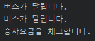


### 8.5.6 객체 타입 확인(instanceof)

  강제 타입 변환은 구현 객체가 인터페이스 타입으로 변환되어 있는 상태에서 가능하다. 그러나 어떤 구현 객체가 변환되어 있는지 알 수 없는 상태에서 무작정 변환을 할 경우 ClassCastException이 발생할 수 있다.

  예를 들어 다음과 같이 Taxi 객체가 인터페이스로 변환되어 있을 경우, Bus 타입으로 강제 타입 변환하면 구현 클래스 타입이 다르므로 예외가 발생한다.

```java
Vehicle vehicle = new Taxi();
Bus bus = (Bus) vehicle;
```


  그렇다면 어떤 구현 객체가 인터페이스 타입으로 변환되었는지 확인하는 방법은 없을까? 우리는 상속에서 객체 타입을 확인하기 위해 instanceof 연산자를 사용했었다.

  instanceof 연산자는 인터페이스 타입에서도 사용할 수 있다. 예를 들어 vehicle 인터페이스 타입으로 변환된 객체가 Bus인지 확인하려면 다음과 같이 작성하면 된다.

```java
if(vehicle instanceof Bus) {
    Bus bus = (Bus) vehicle;
}
```


  다음과 같이 drive() 메소드에서 매개값이 Bus 객체인 경우, Bus의 checkFare() 메소드를 호출 해야 한다면,
Bus 타입으로 강제 타입 변환을 해야 한다. Vehicle 인터페이스에는 checkFare() 메소드가 없기 때문이다. 매개값으로 어떤 구현 객체가 대입될지 모르기 때문에 instanceof 연산자로 Bus 타입인지 꼭 확인해야 한다.

- [Driver.java] 객체 타입 확인

  ```java
  public class Driver {
      public void drive(Vehicle vehicle) {
          if(vehicle instanceof Bus) {
              Bus bus = (Bus) vehicle;
              bus.checkFare();
          }
          vehicle.run();
      }
  }
  ```


## 8.6 인터페이스 상속

  인터페이스도 다른 인터페이스를 상속할 수 있다. 인터페이스는 클래스와는 달리 다중 상속을 허용한다. 다음과 같이 extends 키워드 뒤에 상속할 인터페이스들을 나열할 수 있다.

```java
public interface 하위인터페이스 extends 상위인터페이스1, 상위인터페이스2 { ... }
```

  하위 인터페이스를 구현하는 클래스는 하위 인터페이스의 메소드 뿐만 아니라 상위 인터페이스의 모든 추상 메소드에 대한 실체 메소드를 가지고 있어야 한다.

  그렇기 때문에 구현 클래스로부터 객체를 생성하고 나서 다음과 같이 하위 및 상위 인터페이스 타입으로 변환이 가능하다.

```java
하위인터페이스 변수 = new 구현클래스(...);
상위인터페이스1 변수 = new 구현클래스(...);
상위인터페이스2 변수 = new 구현클래스(...);
```


  <u>하위 인터페이스 타입 변환이 되면 상 · 하위 인터페이스에 선언된 모든 메소드를 사용할 수 있으나</u>, <b>상위 인터페이스로 타입 변환되면 상위 인터페이스에 선언된 메소드만 사용 가능</b>하고 하위 인터페이스에 선언된  메소드는 사용할 수 없다.

- [InterfaceA.java] 부모 인터페이스

  ```java
  public interface InterfaceA {
      public abstract void methodA();
  }
  ```

- [InterfaceB.java] 부모 인터페이스

  ```java
  public interface InterfaceB {
      public abstract void methodB();
  }
  ```

- [InterfaceC.java] 하위 인터페이스

  ```java
  public interface InterfaceC extends InterfaceA, InterfaceB{
      public abstract void methodC();
  }
  ```

- [ImplementationC.java] 하위 인터페이스 구현

  ```java
  public class ImplementationC implements InterfaceC{
      @Override //InterfaceA의 실체 메소드도 있어야 함
      public void methodA() {
          System.out.println("ImplementationC-methodA() 실행");
      }
  
      @Override //InterfaceB의 실체 메소드도 있어야 함
      public void methodB() {
          System.out.println("ImplementationC-methodB() 실행");
      }
  
      @Override
      public void methodC() {
          System.out.println("ImplementationC-methodC() 실행");
      }
  }
  ```

- [Example.java] 호출 가능 메소드

  ```java
  public class Example {
      public static void main(String[] args) {
          ImplementationC impl = new ImplementationC();
  
          InterfaceA ia = impl;
          ia.methodA();   //InterfaceA의 변수는 methodA()만 호출가능
          System.out.println();
  
          InterfaceB ib = impl;
          ib.methodB();   //InterfaceB의 변수는 methodB()만 호출가능
          System.out.println();
  
          InterfaceC ic = impl;
          ic.methodA();
          ic.methodB();
          ic.methodC();
          //모두 호출 가능
      }
  }
  ```


## 8.7 디폴트 메소드와 인터페이스 확장

  디폴트 메소드는 인터페이스에 선언된 인스턴스 메소드이기 때문에 구현 객체가 있어야 사용할 수 있다. <u>선언은 인터페이스에서 하고, 사용은 구현 객체를 통해 한다는 것이 어색해 보인다.</u>

  디폴트 메소드는 모든 구현 객체에서 공유하는 기본 메소드처럼 보이지만, <u>사실은 인터페이스에서 디폴트 메소드를 허용한 다른 이유가 있다.</u>


### 8.7.1 디폴트 메소드의 필요성

  인터페이스에서 디폴트 메소드를 허용한 이유는 기존 인터페이스를 확장해서 새로운 기능을 추가하기 위해서이다.

  기존 인터페이스의 이름과 추상 메소드의 변경 없이 디폴트 메소드만 추가할 수 있기 때문에 이전에 개발한 구현 클래스를 그대로 사용할 수 있으면서 새롭게 개발하는 클래스는 디폴트 메소드를 활용할 수 있다.


- 예시

  - 기존에 MyInterface라는 인터페이스와 이를 구현한 MyClassA 라는 클래스가 있었다고 가정하자.

  - 시간이 흘러 MyInterface에 기능을 추가해야할 필요성이 생겨서, MyInterface에 추상 메소드를 추가했다.

  - 그런데 MyClassA에서 문제가 발생했다. 왜냐하면 추가된 추상 메소드에 대한 실체 메소드가 MyClassA에는 없기 때문이다.

  - 만약, MyClassA를 수정할 여건이 안된다면, MyInterface에 추상 메소드를 추가할 수 없을 것이다.

  - 그래서 MyInterface에 디폴트 메소드를 선언한다. 디폴트 메소드는 추상 메소드가 아니기 때문에 구현 클래스에서 실체 메소드를 작성할 필요가 없다.

    따라서 MyClassA는 아무런 문제없이 계속 사용이 가능하다.

  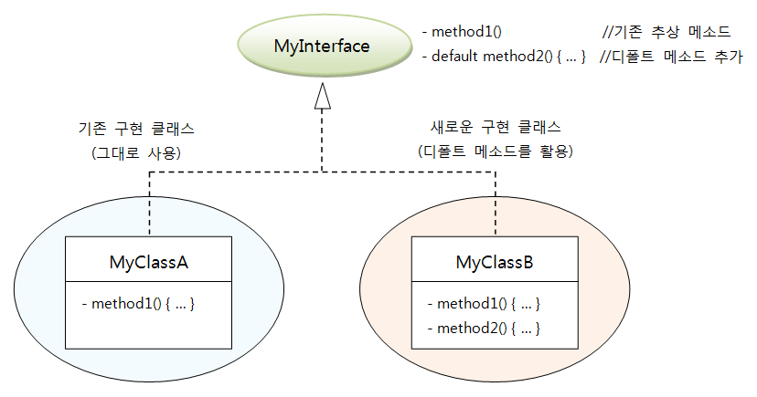

  ​    수정된 MyInterface를 구현한 새로운 클래스인 MyClassB는 method1()의 내용은 반드시 채워야 하지만, 디폴트 메소드인 method2()는 MyInterface에 정의된 것을 사용해도 되고, 필요에 따라 재정의해서 사용할 수도 있다.


### 8.7.2 디폴트 메소드가 있는 인터페이스 상속

  인터페이스 간에도 상속이 있다는 것을 이미 학습했었다. 부모 인터페이스에 디폴트 메소드가 정의되어 있을 경우, 자식 인터페이스에서 디폴트 메소드를 활용하는 방법은 다음 세 가지가 있다.

- 디폴트 메소드를 단순히 상속만 받는다.
- 디폴트 메소드를 재정의(Override)해서 실행 내용을 변경한다.
- 디폴트 메소드를 추상 메소드로 재선언한다.


  다음과 같이 추상 메소드와 디폴트 메소드가 선언된 ParantInterface가 있다고 가정해보자.

- [ParentInterface.java] 부모 인터페이스

  ```java
  public interface ParentInterface {
      public abstract void method1();
      public default void method2() { /*실행문*/ }
  }
  ```

  다음 ChildInterface1은 ParentInterface를 상속하고 자신의 추상 메소드인 method3()을 선언한다.

- [ChildInterface1.java] 자식 인터페이스

  ```java
  public interface ChildInterface1 extends ParentInterface{
      public abstract void method3();    
  }
  ```

  이 경우 ChildInterface1 인터페이스를 구현하는 클래스는 method1()과 method3()의 실체 메소드를 가지고 있어야 하며 ParentInterface의 method2()를 호출할 수 있다.

```java
ChilcInterface1 ci1 = new ChilcInterface1() {
    @Override
    public void method1() { /*실행문*/ }
    public void method3() { /*실행문*/ }
};

ci1.method1();
ci1.method2();  //ParentInterface의 method2() 호출
ci1.method3();
```


  다음 ChildInterface2는 ParentInterface를 상속하고 ParentInterface의 디폴트 메소드인 method2()를 재정의한다. 그리고 자신의 추상 메소드인 method3()을 선언한다.

- [ChildInterface2.java] 자식 인터페이스

  ```java
  public interface ChildInterface2 extends ParentInterface{
      @Override
      public default void method2() { /*재정의*/ }
  
      public void method3();
  }
  ```

  이 경우도 ChildInterface2 인터페이스를 구현하는 클래스는 method1()과 method3()의 실체 메소드를 가지고 있어야 하며, ChildInterface2에서 재정의한 method2()를 호출할 수 있다.

```java
ChildInterface2 ci2 = new ChildInterface2() {
    @Override
    public void method1() { /*실행문*/ }
    @Override
    public void method3() { /*실행문*/ }
};

ci2.method1();
ci2.method2();  //ChildInterface2의 method2() 호출
ci2.method3();
```


  다음 ChildInterface3은 ParentInterface를 상속하고 ParentInterface의 디폴트 메소드인 method2()를 추상 메소드로 재선언한다. 그리고 자신의 추상 메소드인 method3()을 선언한다.

- [ChildInterface3.java] 자식 인터페이스

  ```java
  public interface ChildInterface3 extends ParentInterface {
      @Override
      public void method2();	//추상 메소드로 재선언
      public void method3();
  }
  ```

  이 경우 ChildInterface3 인터페이스를 구현하는 클래스는 method1()과 method2(), method3()의 실체 메소드를 모두 가지고 있어야 한다.

```java
ChildInterface3 ci3 = new ChildInterface3() {
    @Override
    public void method1() { /*실행문*/ }
    @Override
    public void method2() { /*실행문*/ }
    @Override
    public void method3() { /*실행문*/ }
}

ci2.method1();
ci2.method2();  //ChildInterface3 구현 객체의 method2() 호출
ci2.method3();
```


