# 09. 중첩클래스와 중첩인터페이스

## 9.1 중첩 클래스와 중첩 인터페이스란?

  객체 지향 프로그램에서 클래스들은 서로 긴밀한 관계를 맺고 상호작용 한다. 어떤 클래스는 여러 클래스와 관계를 맺기만 어떤 클래스는 특정 클래스와 관계를 맺는다.

  <b>클래스가 여러 클래스와 관계를 맺는 경우</b>에는 <u>독립적으로 선언</u>하는 것이 좋으나, <b>특정 클래스와 관계를 맺을 경우</b>에는 관계 클래스를 <u>클래스 내부</u>에 선언하는 것이 좋다.

  중첩 클래스(Nested Class)란 클래스 내부에 선언한 클래스를 말하는데, 중첩 클래스를 사용하면 두 클래스의 맴버들을 서로 쉽게 접근할 수 있다는 장점과 외부에는 불필요한 관계 클래스를 감춤으로써 코드의 복잡성을 줄일 수 있다.


  인터페이스도 클래스 내부에 선언할 수 있다. 이런 인터페이스를 중첩 인터페이스라고 한다. 인터페이스를 클래스 내부에 선언하는 이유는 <b>해당 클래스와 긴밀한 관계를 맺는 구현 클래스를 만들기 위해서이다.</b>

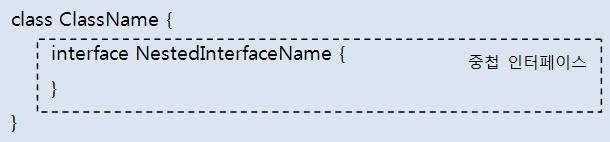

  중첩 인터페이스는 주로 UI 프로그래밍에서 이벤트를 처리할 목적으로 많이 활용된다. 예를 들어 안드로이드에서는 다음과 같이 View 클래스의 클릭 이벤트를 처리하는 구현 클래스를 만들 수 있도록  View 클래스 내부에 OnClickListener라는 중첩 인터페이스를 가지고 있다.

```java
public class View {
    public interface onClickListener {
        public void onClick(View v);
    }
}
```


## 9.2 중첩 클래스

  중첩 클래스는 내부에 선언되는 위치에 따라서 두 가지로 분류된다.
<b>클래스의 맴버</b>로서 선언되는 중첩 클래스를 <u>맴버 클래스</u>라고 하고, <b>메소드 내부</b>에서 선언되는 중첩 클래스를 <u>로컬 클래스</u>라고 한다.

  맴버 클래스는 클래스나 객체가 사용 중이라면 언제든지 재사용이 가능하지만, 로컬 클래스는 메소드 실행 시에만 사용되고, 메소드가 실행 종료되면 없어진다.

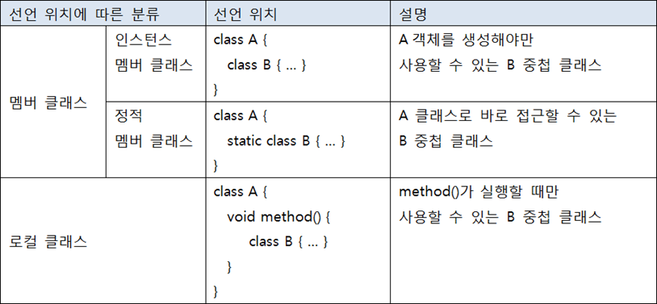

  맴버 클래스도 하나의 클래스이기 때문에 컴파일하면 바이트 코드 파일(.class)이 별도로 생성된다. 바이트 코드 파일의 이름은 다음과 같이 결정된다.

```java
A(바깥 클래스) $ B(맴버 클래스) .class
```

  로컬 클래스일 경우에는 다음과 같이 $1이 포함된 바이트 코드 파일이 생성된다.

```java
A(바깥 클래스) $1 B(로컬 클래스) .class
```


### 9.2.1 인스턴스 맴버 클래스

  인스턴스 맴버 클래스는 <u>static 키워드 없이 선언된 클래스</u>를 말한다. 인스턴스 맴버 클래스는 인스턴스 필드와 메소드만 선언이 가능하고 정적 필드와 메소드는 선언할 수 없다.

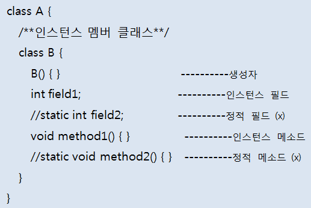

  A 클래스 외부에서 인스턴스 맴버 클래스 B의 객체를 생성하려면 먼저 A 객체를 생성하고 B 객체를 생성해야 한다.

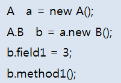


### 9.2.2 정적 맴버 클래스

  정적 맴버 클래스는 static 키워드로 선언된 클래스를 말한다. 정적 맴버 클래스는 <u>모든 종류의 필드와 메소드를 선언할 수 있다.</u>

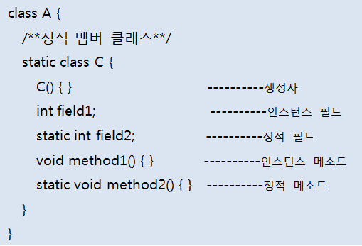

  A 클래스 외부에서 정적 맴버 클래스 C의 객체를 생성하기 위해서는 A 객체를 생성할 필요가 없고, 다음과 같이 C 객체를 생성하면 된다.

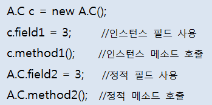


### 9.2.3 로컬 클래스

  중첩 클래스는 메소드 내에서도 선언할 수 있다. 이것을 로컬(local) 클래스라고 한다. 로컬 클래스는 접근 제한자(public, private) 및 static을 붙일 수 없다.
  로컬 클래스는 메소드 내부에서만 사용되므로 접근을 제한할 필요가 없기 때문이다. 로컬 클래스 내부에는 인스턴스 필드와 메소드만 선언이 가능하고 정적 필드와 메소드는 선언할 수 없다.

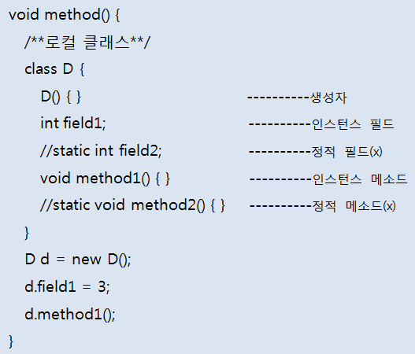

  로컬 클래스는 메소드가 실행될 때 메소드 내에서 객체를 생성하고 사용해야 한다. 주로 다음과 같이 비동기 처리를 위해 스레드 객체를 만들 때 사용하는데, 스레드는 나중에 학습하게 된다.

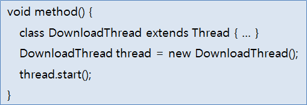


## 9.3 중첩 클래스의 접근 제한

### 9.3.1 바깥 필드와 메소드에서 사용 제한

  맴버 클래스가 인스턴스 또는 정적으로 선언됨에 따라 바깥 클래스의 필드와 메소드에 사용 제한이 생긴다.

  인스턴스 맴버 클래스(B)는 바깥 클래스의 인스턴스 필드(field1)의 초기값이나 인스턴스 메소드(method1())에서 객체를 생성할 수 있으나, 정적 필드(filed3)의 초기값이나 정적 메소드(method2())에서는 객체를 생성할 수 없다.반면 정적 맴버 클래스(C)는 모든 필드의 초기값이나 모든 메소드에서 객체를 생성할 수 있다.

- [A.java] 바깥 필드와 메소드에서 사용 제한

  ```java
  public class A {
      //인스턴스 필드
      B field1 = new B();
      C field2 = new C();
  
      //인스턴스 메소드
      void method1() {
          B var1 = new B();
          C var2 = new C();
      }
  
      //정적 필드 초기화
      //static B field3 = new B();
      static C filed4 = new C();
  
      //정적 메소드
      static void method2() {
          //B var1 = new B();
          C var2 = new C();
      }
  
      //인스턴스 맴버 클래스
      class B {}
  
      //정적 맴버 클래스
      static class C {}
  }
  ```


### 9.3.2 맴버 클래스에서 사용 제한

  맴버 클래스가 인스턴스 또는 정적으로 선언됨에 따라 맴버 클래스 내부에서 바깥 클래스의 필드와 메소드를 접근할 때에도 제한이 따른다.

  인스턴스 맴버 클래스(B) 안에서는 바깥 클래스의 모든 필드와 모든 메소드에 접근할 수 있지만, 정적 맴버 클래스(C) 안에서는 바깥 클래스의 정적 필드(field2)와 메소드(method2())에만 접근할 수 있고 인스턴스 필드(field1)와 메소드(method1())는 접근할 수 없다.

- [A.java] 맴버 클래스에서 사용 제한

  ```java
  public class A {
      int field1;
      void method1() {}
  
      static int field2;
      static void method2() {}
  
      class B {
          void method() { //모든 필드와 메소드에 접근가능
              field1 = 10;
              method1();
  
              field2 = 10;
              method2();
          }
      }
  
      static class C {
          void method() { //인스턴스 필드와 메소드는 접근할 수 없다.
              //field1 = 10;
              //method1();
  
              field2 = 10;
              method2();
          }
      }
  }
  ```


### 9.3.3 로컬 클래스에서 사용 제한

  로컬 클래스 내부에서는 바깥 클래스의 필드나 메소드를 제한 없이 사용할 수 있다. 문제는 메소드의 매개변수나 로컬변수를  로컬 클래스에서 사용할 때이다.

  <b>로컬 클래스의 객체는 메소드 실행이 끝나도 힙 메모리에 존재</b>해서 계속 사용할 수 있다. <b>매개 변수나 로컬 변수는 메소드 실행이 끝나면  스택 메모리에서 사라지기 때문에 로컬 객체에서 사용할 경우 문제가 발생</b>한다.

  <u>자바는 이 문제를 해결하기 위해 컴파일 시 로컬 클래스에서 사용하는 매개 변수나 로컬 변수의 값을 로컬 클래스 내부에 복사해 두고 사용한다.</u>

  그리고 매개 변수나 로컬 변수가 수정되어 값이 변경되면 로컬 클래스에 복사해 둔 값과 달라지는 문제를 해결하기 위해 <b>매개 변수나 로컬 변수를 final로 선언해서 수정을 막는다.</b>


  결론적으로, <b>로컬 클래스에서 사용가능한 것은 final로 선언된 매개 변수와 로컬 변수뿐</b>이라는 것이다.
자바 7이전까지는 final 키워드없이 선언된 매개 변수나 로컬 변수를 로컬 클래스에서 사용하면 컴파일 에러가 발생했다.
하지만 자바 8부터는 final 키워드 없이 선언된 매개 변수와 로컬 변수를 사용해도 컴파일 에러가 나지 않는다.
(final 선언을 하지 않아도 여전히 값을 수정할 수 없는 final의 특성을 갖는다)

  final 키워드 존재 여부의 차이점은 로컬 클래스의 복사 위치이다. <b>final 키워드가 있다면 로컬 클래스의 메소드 내부에 지역 변수로 복사</b>되지만, <b>final 키워드가 없다면 로컬 클래스의 필드로 복사</b>된다.

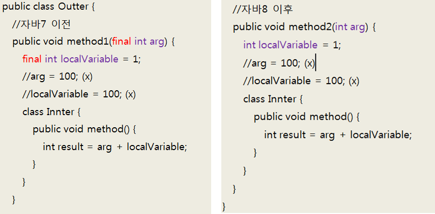


  우리는 로컬 클래스의 내부 복사 위치에 신경 쓸 필요 없이 로컬 클래스에서 사용된 매개 변수와 로컬 변수는 모두 final 특성을 갖는다는 것만 알면 된다.


### 9.3.4 중첩 클래스에서 바깥 클래스 참조 얻기

  클래스 내부에서 this는 객체 자신의 참조이다. 중첩 클래스에서 this 키워드를 사용하면 바깥 클래스의 객체 참조가 아니라, 중첩 클래스의 객체 참조가 된다.

  중첩 클래스 내부에서 바깥 클래스의 객체 참조를 얻으려면 바깥 클래스의 이름을 this 앞에 붙여주면 된다. 다음은 바깥 클래스의 필드와 메소드에 접근하기 위해 바깥클래스.this를 사용한 예이다.

```java
바깥클래스.this.필드;
바깥클래스.this.메소드();
```

- [Outter.java] 중첩 클래스에서 바깥 클래스 참조 얻기

  ```java
  public class Outter {
      String field = "Outter-field";
  
      void method() {
          System.out.println("Outter-method");
      }
  
      class Nested {
          String field = "Nested-field";
          void method() {
              System.out.println("Nested-method");
          }
          void print() {
              //중첩 객체 참조
              System.out.println(this.field);
              this.method();
  
              //바깥 객체 참조
              System.out.println(Outter.this.field);
              Outter.this.method();
          }
      }
  }
  ```

- [OutterExample.java] 실행 클래스

  ```java
  public class OutterExample {
      public static void main(String[] args) {
          Outter outter = new Outter();
          Outter.Nested nested = outter.new Nested();
          nested.print();
      }
  }
  ```

  - 실행결과

    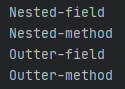

    


## 9.4 중첩 인터페이스

  중첩 인터페이스는 클래스의 맴버로 선언된 인터페이스를 말한다. 인터페이스를 클래스 내부에 선언하는 이유는 해당 클래스와 긴밀한 관계를 맺는 구현 클래스를 만들기 위해서이다.

  특히 UI 프로그래밍에서 이벤트를 처리할 목적으로 많이 활용된다.
예를 들어 Button을 클릭했을 때 이벤트를 처리하는 객체를 받고 싶다고 가정해보자. 그렇다고 아무 객체나 받으면 안 되고, Button 내부에 선언된 중첩 인터페이스를 구현한 객체만 받아야 한다면 다음과 같이 Button클래스를 선언하면 된다.

- [Button.java] 중첩 인터페이스

  ```java
  public class Button {
      OnClickListener listener;
  
      void setOnClickListener(OnClickListener listener) {
          this.listener = listener;
      }
  
      void touch() {
          listener.onClick();
      }
  
      interface OnClickListener {
          void onClick();
      }
  }
  ```

  Button 클래스 내용을 보면 중첩 인터페이스(OnClickListener) 타입으로 필드(listener)를 선언하고 Setter 메소드(setOnClickListener())로 구현 객체를 받아 필드에 대입한다.

  버튼 이벤트가 발생했을 때(touch() 메소드가 실행되었을 때) 인터페이스를 통해 구현 객체의 메소드를 호출(listener.conClick())한다.

  다음은 Button의 중첩 인터페이스인 OnClickListener를 구현한 두 개의 클래스를 보여준다.

- [CallListener.java] 구현 클래스

  ```java
  public class CallListener implements Button.OnClickListener {
      @Override
      public void onClick() {
          System.out.println("전화를 겁니다.");
      }
  }
  ```

- [MessageListener.java] 구현 클래스

  ```java
  public class MessageListener implements Button.OnClickListener {
      @Override
      public void onClick() {
          System.out.println("메시지를 보냅니다.");
      }
  }
  ```

  다음은 버튼을 클릭했을 때 두 가지 방법으로 이벤트를 처리하는 방법을 보여준다. 어떤 구현 객체를 생성해서 Button 객체의 setOnClickListener() 메소드로 세팅하느냐에 따라서 Button의 touch() 메소드의 실행 결과가 달라진다.

- [ButtonExample.java] 버튼 이벤트 처리

  ```java
  public class ButtonExample {
      public static void main(String[] args) {
          Button btn = new Button();
  
          btn.setOnClickListener(new CallListener());
          btn.touch();
  
          btn.setOnClickListener(new MessageListener());
          btn.touch();
      }
  }
  ```

  - 실행결과

    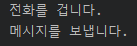


## 9.5 익명 객체

  익명(annonymous) 객체는 이름이 없는 객체를 말한다. 익명 객체는 단독으로 생성할 수 없고 클래스를 상속하거나 인터페이스를 구현해야만 생성할 수 있다.

  익명 객체는 필드의 초기값이나 로컬 변수의 초기값, 매개 변수의 매개값으로 주로 대입된다. UI 이벤트 처리 객체나 스레드 객체를 간편하게 생성할 목적으로 익명 객체가 많이 활용된다.


### 9.5.1 익명 자식 객체 생성

  부모 타입으로 필드나 변수를 선언하고, 자식 객체를 초기값으로 대입할 경우를 생각해보자. 우선 부모 클래스를 상속해서 자식 클래스를 선언하고, new 연산자를 이용해서 자식 객체를 생성한 후, 필드나 로컬 변수에 대입하는 것이 기본이다.

```java
class Child extends Parent {  } //자식 클래스 선언

class A {
    Parent filed = new Child(); //필드에 자식 객체를 대입
    void method() {
        Parent localVar = new Child(); //로컬 변수에 자식 객체를 대입
    }
}
```

  그러나 자식 클래스가 재사용되지 않고, 오로지 해당 필드와 변수의 초기값으로만 사용할 경우라면 익명 자식 객체를 생성해서 초기값으로 대입하는 것이 좋은 방법이다.

  익명 자식 객체를 생성하는 방법은 다음과 같다. 주의할 점은 하나의 실행문이므로 끝에는 세미콜론(;)을 반드시 붙여야 한다.

```java
부모클래스 [필드|변수] = new 부모클래스(매개값, ...) {
    //필드
    //메소드
};
```

  <b>부모 클래스(매개값, ...) {}</b>은 <u>부모 클래스를 상속해서 중괄호 {}와 같이 자식 클래스를 선언하라는 뜻</u>이고, <u>new 연산자는 이렇게 선언된 자식 클래스를 객체로 생성</u>한다.

  부모 클래스(매개값, ...)은 부모 생성자를 호출하는 코드로, 매개값은 부모 생성자의 매개 변수에 맞게 입력하면 된다.

  중괄호 {} 내부에는 필드나 메소드를 선언하거나 부모 클래스의 메소드를 재정의하는 내용이 온다.
<b>일반 클래스와의 차이점은 생성자를 선언할 수 없다는 것이다.</b> 다음 코드는 필드를 선언할 때 초기값으로 익명 자식 객체를 생성해서 대입한다.

```java
class A {
    //A클래스의 필드 선언
    Parent field = new Parent() {
      int childField;
      void ChildMethod() {}
      @Override
      void parentMethod() {} //Parent의 메소드를 오버라이딩
    };
}
```

  다음 코드는 메소드 내에서 로컬 변수를 선언할 때 초기값으로 익명 자식 객체를 생성해서 대입한다.

```java
class A {
    void method() {
        Parent localVar = new Parent() { //로컬 변수 선언
          int childField;
          void ChildMethod() {}
          @Override
          void parentMethod() {} //Parent의 메소드를 오버라이딩
        }
    }
}
```

  메소드의 매개 변수가 부모 타입일 경우 메소드 호출 코드에서 익명 자식 객체를 생성해서 매개값으로 대입할 수도 있다.

```java
class A {
    void method1(Parent parent) {}
    
    void method2() { //method1() 메소드 호출
        method1(new parent() { //method1()의 매개값으로 익명자식객체 대입
            int childField;
            void childMethod() {}
            @Override
            void parentMethod() {}
        }); 
    }
}
```

  익명 자식 객체에 새롭게 정의된 필드와 메소드는 익명 자식 객체 내부에서만 사용되고, 외부에서는 필드와 메소드에 접근할 수 없다.

  왜냐하면 익명 자식 객체는 부모 타입 변수에 대입되므로 부모 타입에 선언된 것만 사용할 수 있기 때문이다.

  예를 들어 다음 코드에서 필드 childField와 메소드 childMethod()는 parentMethod() 메소드 내에서 사용이 가능하나, A 클래스의 필드인 field로는 접근할 수 없다.(<u>부모 클래스에 선언되어 있지 않기 때문</u>)

```java
class A {
    Parent field = new Parent() {
        int childField;
        void childMethod() {}
        @Override
        void parentMethod() {
            childField = 3;
            childMethod();
        }
    }
    
    void method() {
        //field.childField = 3; (x)
        //field.childMethod();  (x)
        field.parentMethod(); (o)
    }
}
```

- [Person.java] 부모 클래스

  ```java
  public class Person {
      void wake() {
          System.out.println("7시에 일어납니다.");
      }
  }
  ```

- [Anonymous.java] 익명 자식 객체 생성

  ```java
  public class Anonymous {
      //필드 초기값으로 대입
      Person field = new Person() {
          void work() {
              System.out.println("출급합니다.");
          }
          @Override
          void wake() {
              System.out.println("6시에 일어납니다.");
              work();
          }
      };
  
      void method1() {
          //로컬 변수값으로 대입
          Person localVar = new Person() {
              void work() {
                  System.out.println("산책합니다.");
              }
              @Override
              void wake() {
                  System.out.println("7시에 일어납니다.");
                  work();
              }
          };
          //로컬 변수 사용
          localVar.wake();
      }
  
      void method2(Person person) {
          person.wake();
      }
  }
  ```

- [AnonymousExample.java] 익명 자식 객체 생성

  ```java
  public class AnonymousExample {
      public static void main(String[] args) {
          Anonymous anony = new Anonymous();
          //익명 객체 필드 사용
          anony.field.wake();
  
          //익명 객체 로컬 변수 사용
          anony.method1();
  
          //익명 객체 매개값 사용
          anony.method2(new Person() {
              void study() {
                  System.out.println("공부합니다.");
              }
              @Override
              void wake() {
                  System.out.println("8시에 일어납니다.");
                  study();
              }
          });
      }
  }
  ```

  - 실행결과

    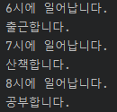


### 9.5.2 익명 구현 객체 생성

  이번에는 인터페이스 타입으로 필드나 변수를 선언하고, 구현 객체를 초기값으로 대입하는 경우를 생각해보자.

  우선 구현 클래스를 선언하고, new 연산자를 이용해서 구현 객체를 생성한 후, 필드나 로컬 변수에 대입하는 것이 기본이다.

```java
class TV implements RemoteControl {  }

class A {
    RemoteControl field = new TV(); //필드에 구현 객체를 대입
    void method() {
        RemoteControl localVar = new TV(); //로컬 변수에 구현 객체를 대입
    }
}
```

  그러나 구현 객체가 재사용되지 않고, 오로지 해당 필드와 변수의 초기값으로만 사용하는 경우라면 익명 구현 객체를 초기값으로 대입하는 것이 좋다.

  익명 구현 객체를 생성하는 방법은 인터페이스에서 살펴보았지만 다시 한 번 살펴보자.

```java
인터페이스 [필드|변수] = new 인터페이스() {
    //인터페이스에 선언된 추상 메소드의 실체 메소드 선언
    //필드
    //메소드
};
```

  <b>인터페이스 () {}</b>는 <u>인터페이스를 구현해서 중괄호 {}와 같이 클래스를 선언</u>하라는 뜻이고, <u>new 연산자는 이렇게 선언된 클래스를 객체로 생성</u>한다.

  중괄호 {}에는 인터페이스에 선언된 모든 추상 메소드들의 실체 메소드를 작성해야 한다. 그렇지 않으면 컴파일 에러가 발생한다.

  추가적으로 필드와 메소드를 선언할 수 있지만, 실체 메소드에서만 사용이 가능하고 외부에서는 사용하지 못한다. 다음은 필드를 선언할 때 초기값으로 익명 구현 객체를 생성해서 대입하는 예이다.

```java
class A {
    RemoteControl field = new RemoteControl() { //클래스 A의 필드 선언
        @Override
        void turnOn() {} 
        //RemoteControl 인터페이스의 추상 메소드에 대한 실체 메소드
    };
}
```

  다음은 메소드 내에서 로컬 변수를 선언할 때 초기값으로 익명 구현 객체를 생성해서 대입하는 예이다.

```java
void method() {
    RemoteControl localVar = new RemoteControl() { //로컬 변수 선언
        @Override
        void trunOn() {}
    };
}
```

  메소드의 매개 변수가 인터페이스 타입일 경우, 메소드 호출 코드에서 익명 구현 객체를 생성해서 매개값으로 대입할 수도 있다.

```java
class A {
    void method1(RemoteControl rc) {}
    
    void method2() {
        method1(new RemoteControl() {
            @Override
            void turnOn() {}
        });
    }
}
```

- [RemoteControl.java] 인터페이스

  ```java
  public interface RemoteControl {
      public void turnOn();
      public void turnOff();
  }
  ```

- [Anonymous.java] 익명 구현 클래스와 객체 생성

  ```java
  public class Anonymous {
      //필드 초기값으로 대입
      RemoteControl field = new RemoteControl() {
          @Override
          public void turnOn() {
              System.out.println("TV를 켭니다.");
          }
  
          @Override
          public void turnOff() {
              System.out.println("TV를 끕니다.");
          }
      };
  
      void method1() {
          //로컬 변수값으로 대입
          RemoteControl localVar = new RemoteControl() {
              @Override
              public void turnOn() {
                  System.out.println("Audio를 켭니다.");
              }
  
              @Override
              public void turnOff() {
                  System.out.println("Audio를 끕니다.");
              }
          };
          //로컬 변수 사용
          localVar.turnOn();
      }
  
      void method2(RemoteControl rc) {
          rc.turnOn();
      }
  }
  ```

- [AnonymousExample.java] 익명 구현 클래스와 객체 생성

  ```java
  public class AnonymousExample {
      public static void main(String[] args) {
          Anonymous anony = new Anonymous();
          //익명 객체 필드 사용
          anony.field.turnOn();
  
          //익명 객체 로컬 변수 사용
          anony.method1();
  
          //익명 객체 매개값 사용
          anony.method2(new RemoteControl() {
              @Override
              public void turnOn() {
                  System.out.println("SmartTV를 켭니다.");
              }
  
              @Override
              public void turnOff() {
                  System.out.println("SmartTV를 끕니다.");
              }
          });
      }
  }
  ```


  다음은 UI 프로그램에서 흔히 사용되는 버튼의 클릭 이벤트 처리를 익명 구현 객체를 이용해서 처리하는 방법을 보여준다.

- [Button.java] UI 클래스

  ```java
  public class Button {
      OnClickListener listener;
  
      void setOnClickListener(OnClickListener listener) {
          this.listener = listener;
      }
  
      void touch() {
          listener.onClick();
      }
  
      interface OnClickListener {
          void onClick();
      }
  }
  ```

    Button 클래스의 내용을 보면 중첩 인터페이스(OnClickListener) 타입으로 필드(listener)를 선언하고 <u>Setter 메소드(setOnClickListener())로</u> <b>외부에서 구현 객체를 받아 필드에 대입한다.</b>

    버튼 이벤트가 발생했을 때(touch() 메소드가 실행되었을 때) 인터페이스를 통해 구현 객체의 메소드를 호출(listener.onClick())한다.

  

  다음 Window 클래스는 두 개의 Button 객체를 가지고 있는 윈도우 창을 만드는 클래스라고 가정하자.

  <b>첫 번째 button1의 클릭 이벤트 처리</b>는 <u>필드로 선언한 익명 구현 객체가 담당</u>하고, <b>두 번째 button2의 클릭 이벤트 처리</b>는 setOnClickListener()를 호출할 때 <u>매개값으로 준 익명 구현 객체가 담당</u>하도록 했다.

- [Window.java] UI 클래스

  ```java
  public class Window {
      Button button1 = new Button();
      Button button2 = new Button();
      
      //필드 초기값으로 대입
      Button.OnClickListener listener = new Button.OnClickListener() {
          @Override
          public void onClick() {
              System.out.println("전화를 겁니다.");
          }
      };
  
      Window() {
         button1.setOnClickListener(listener);//매개값으로 필드 대입
          
         //매개값으로 익명 구현 객체 대입 
         button2.setOnClickListener(new Button.OnClickListener() {
             @Override
             public void onClick() {
                 System.out.println("메시지를 보냅니다.");
             }
         });
      }
  }
  ```

- [Main.java] 실행 클래스

  ```java
  public class Main {
      public static void main(String[] args) {
          Window w = new Window();
          w.button1.touch();
          w.button2.touch();
      }
  }
  ```

  - 실행결과

    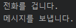


### 9.5.3 익명 객체의 로컬 변수 사용

  익명 객체 내부에서는 바깥 클래스의 필드나 메소드는 제한 없이 사용할 수 있다.
문제는 메소드의 매개 변수나 로컬 변수를 익명 객체에서 사용할 때이다. <u>메소드 내에서 생성된 익명 객체</u>는 <b>메소드 실행이 끝나도 힙 메모리에 존재</b>해서 계속 사용할 수 있다.

  매개 변수나 로컬 변수는 메소드 실행이 끝나면 스택 메모리에서 사라지기 때문에 익명 객체에서 사용할 수 없게 되므로 문제가 발생한다.

>   이 문제에 대한 해결 방법은 9.3.3 로컬 클래스, 사용 제한에서 설명한 바 있다.
> 로컬 클래스와 익명 클래스의 차이점은 클래스 이름의 존재 여부만 다를 뿐 동작 방식은 동일하다.

  익명 객체 내부에서 메소드의 매개 변수나 로컬 변수를 사용할 경우, 이 변수들은 final 특성을 가져야 한다.
자바 7 이전까지는 반드시 final 키워드로 이 변수들을 선언해야 했지만, 자바 8 이후부터는 final 키워드 없이 선언해도 좋다.

  final 선언을 하지 않아도 여전히 값을 수정할 수 없는 final 특성을 갖기 때문이다. 컴파일 시 <b>final 키워드가 있다면 메소드 내부에 지역 변수로 복사</b>되지만, <b>final 키워드가 없다면 익명 클래스의 필드로 복사</b>된다.