# 10. 예외처리

## 10.1 예외와 예외 클래스

  컴퓨터 하드웨어의 오동작 또는 고장으로 인해 응용프로그램 실행 오류가 발생하는 것을 자바에서는 에러(error)라고 한다.

- 에러가 발생되면 프로그램 종료
- 정상 실행 상태로 돌아갈 수 없음

  예외란 사용자의 잘못된 조작 또는 개발자의 잘못된 코딩으로 인해 발생하는 프로그램 오류를 말한다.

- 예외가 발생되면 프로그램 종료
- 예외 처리를 추가하면 정상 실행 상태로 돌아갈 수 있음

  예외는 두 가지 종류가 있다.

- 일반 예외(Exception)
  - 자바 소스를 컴파일하는 과정에서 예외 처리 코드가 필요한지 검사
  - 예외 처리 코드가 없으면 컴파일 오류 발생
- 실행 예외(RuntimeException)
  - 컴파일하는 과정에서 예외 처리 코드를 검사하지 않는 예외
  - 경험에 따라 예외 처리 코드 작성 필요


  자바에서는 <u>예외를 클래스로 관리</u>한다. <b>JVM은 프로그램을 실행하는 도중에 예외가 발생하면 해당 예외 클래스로 객체를 생성</b>한다.

  그리고 나서 예외 처리 코드에서 예외 객체를 이용할 수 있도록 해준다. <b>모든 예외 클래스들은 다음과 같이 java.lang.Exception 클래스를 상속받는다.</b>

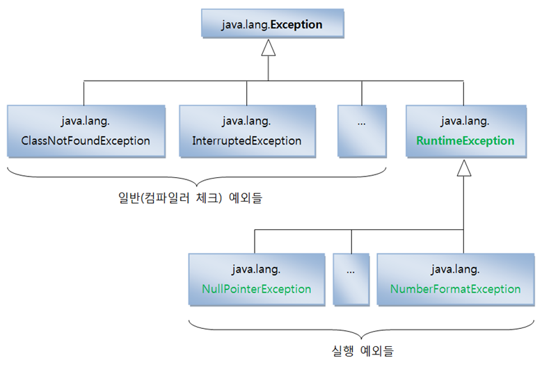

  <u>일반 예외와 실행 예외 클래스를 구별하는 방법</u>은 <b>일반 예외는 Exception을 상속받지만 RuntimeException을 상속받지 않는 클래스</b>들이고, <b>실행 예외는 위와 같이 RuntimeException을 상속받은 클래스들이다.</b>


## 10.2 실행 예외

  실행 예외는 자바 컴파일러가 체크를 하지 않기 때문에 오로지 개발자의 경험에 의해서 예외 처리 코드를 삽입해야 한다. 

  만약 개발자가 실행 예외에 대해 예외 처리 코드를 넣지 않았을 경우, 해당 예외가 발생하면 프로그램은 곧바로 종료된다.


### 10.2.1 NullPointerException

  자바 프로그램에서 가장 빈번하게 발생하는 실행 예외는 java.lang.NullPointerException일 것이다. <b>이것은 객체 참조가 없는 상태</b>, 즉 <u>null값을 갖는 참조 변수로 객체 접근 연산자인 도트(.)를 사용했을 때 발생</u>한다.

  객체가 없는 상태에서 객체를 사용하려 했으니 예외가 발생하는 것이다.

- [NullPointerExceptionExample.java] NullPointerException이 발생하는 경우

  ```java
  public class NullPointerExceptionExample {
      public static void main(String[] args) {
          String data = null;
          System.out.println(data.toString());
      }
  }
  ```

  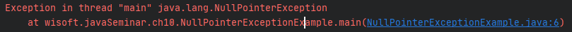


### 10.2.2 ArrayIndexOutOfBoundsException

  배열에서 인덱스 범위를 초과하여 사용할 경우 실행 예외인 java.lang.ArrayIndexOutOfBoundsException이 발생한다. 

- [ArrayIndexOutOfBoundsExceptionExample.java] ArrayIndexOutOfBoundsException

  ```java
  public class ArrayIndexOutOfBoundsExceptionExample {
      public static void main(String[] args) {
          String data1 = args[0];
          String data2 = args[1];
  
          System.out.println("args[0] : " + data1);
          System.out.println("args[1] : " + data2);
      }
  }
  ```

  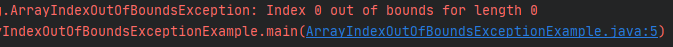

  위 예제를 실행하게 되면 두 개의 실행 매개값을 주지 않았기 때문에 ArrayIndexOutOfBoundsException 예외가 발생한다.

  예제를 다음과 같이 수정하면 ArrayIndexOutOfBoundsException이 발생하지 않는 좋은 프로그램이 된다. 
  배열값을 읽기 전에 배열의 길이를 먼저 조사하는 것이다. 실행 매개값이 없거나 부족할 경우 조건문을 이용해서 사용자에게 실행 방법을 알려준다.

- [ArrayIndexOutOfBoundsExceptionExample.java] ArrayIndexOutOfBoundsException

  ```java
  public class ArrayIndexOutOfBoundsExceptionExample {
      public static void main(String[] args) {
          if(args.length == 2) {
              String data1 = args[0];
              String data2 = args[1];
              System.out.println("args[0] : " + data1);
              System.out.println("args[1] : " + data2);
          } else {
              System.out.println("[실행 방법]");
              System.out.print("java  ArrayIndexOutOfBoundsExceptionExample  ");
              System.out.print("값1  값2");
          }
      }
  }
  ```


### 10.2.3 NumberFormatException

  프로그램을 개발하다 보면 문자열로 되어 있는 데이터를 숫자로 변경하는 경우가 자주 발생한다. 문자열을 숫자로 변환하는 방법은 여러 가지가 있지만 가장 많이 사용되는 코드는 다음과 같다.
| 제목   | 메소드명(매개 변수)          | 설명                                 |
| ------ | ---------------------------- | ------------------------------------ |
| int    | Integer.parseInt(String s)   | 주어진 문자열을 정수로 변환해서 리턴 |
| double | Double.parseDouble(String s) | 주어진 문자열을 실수로 변환해서 리턴 |

  Integer와 Double은 포장(Wrapper) 클래스라고 하는데, 11장에서 자세히 설명한다. 이 클래스의 정적 메소드는 parse<b>XXX</b>() 메소드를 이용하면 문자열을 숫자로 변환할 수 있다.

  이 메소드들은 매개값인 문자열이 숫자로 변환될 수 있다면 숫자를 리턴하지만, 숫자로 변환될 수 없는 문자가 포함되어 있다면 java.lang.NumberFormatException을 발생시킨다.

- [NumberFormatExceptionExample.java] NumberFormatException이 발생하는 경우

  ```java
  public class NumberFormatExceptionExample {
      public static void main(String[] args) {
          String data1 = "100";
          String data2 = "a100";
  
          int value1 = Integer.parseInt(data1);
          int value2 = Integer.parseInt(data2); //예외 발생
  
          int result = value1 + value2;
          System.out.println(data1 + "+" + data2 + "=" + result);
      }
  }
  ```

  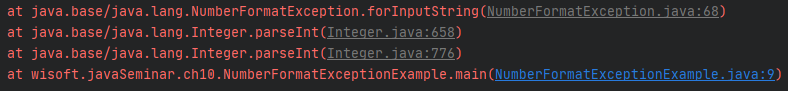

  data1 변수의 "100"문자열은 숫자로 변환이 가능하기 때문에 정상적으로 실행이 되지만, data2 변수의 "a100" 문자열은 숫자로 변환할 수 없기 때문에 예외가 발생한다.


### 10.2.4 ClassCastException

  타입 변환(Casting)은 상위 클래스와 하위 클래스 간에 발생하고 구현 클래스와 인터페이스 간에도 발생한다.

  <b>이러한 관계가 아니라면 클래스는 다른 클래스로 타입 변환할 수 없다.</b> 억지로 타입 변환을 시도할 경우 ClassCastException이 발생한다. 예를 들어 다음과 같이 상속관계와 구현관계가 있다고 가정해보자.

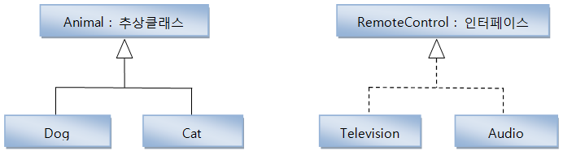

  다음은 올바른 타입 변환을 보여준다. Animal 타입 변수에 대입된 객체가 Dog이므로 다시 Dog 타입으로 변환하는 것은 아무런 문제가 없다.

  마찬가지로 RemoteControl 타입 변수에 대입된 객체가 Telvision이므로 다시 Television 타입으로 변환하는 것은 아무런 문제가 없다.


  그러나 다음과 같이 타입 변환을 하면 ClassCastException이 발생한다. 대입된 객체가 아닌 다른 클래스 타입으로 타입 변환했기 때문이다.

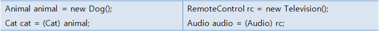

- [ClassCastExceptionExample.java] ClassCastException

  ```java
  public class ClassCastExceptionExample {
      public static void main(String[] args) {
          Dog dog = new Dog();
          changeDog(dog);
  
          Cat cat = new Cat();
          changeDog(cat);
      }
  
      private static void changeDog(Animal animal) {
          //if(animal instanceof Dog) {
              Dog dog = (Dog) animal; //ClassCastException 발생가능
          //}
      }
  }
  
  class Animal {}
  class Dog extends Animal {}
  class Cat extends Animal {}
  ```

  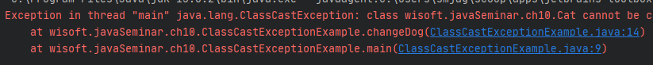


## 10.3 예외 처리 코드

  예외 발생시 프로그램 종료를 막고, 정상 실행을 유지할 수 있도록 처리하는 코드를 예외 처리 코드라고 한다.

- 일반 예외 : 반드시 작성해야 컴파일 가능
- 실행 예외 : 컴파일러가 체크해주지 않으며 개발자의 경험에 의해 작성

  예외 처리 코드는 try-catch-finally 블록을 이용한다.
<b>try-catch-finally 블록은 생성자 내부와 메소드 내부에서 작성</b>되어 <u>일반 예외와 실행 예외가 발생할 경우 예외 처리를 할 수 있도록 해준다.</u>


- try 블록에는 예외 발생 가능 코드가 위치
- 예외 발생 없이 실행되면 catch 블록의 코드는 실행 되지 않음
  - 예외 발생시 try 블록 실행을 즉시 멈추고 catch 블록으로 이동하여 예외 처리 코드를 실행
- finally 블록은 항상 실행 (옵션으로 생략 가능)
  - try, catch 블록에서 return문을 사용하더라도 실행


  Class.forName() 메소드는 매개값으로 주어진 클래스가 존재하면 C lass 객체를 리턴하지만, 존재하지 않으면 ClassNotFoundException 예외를 발생시킨다.

  ClassNotFoundException 예외는 일반 예외이므로 컴파일러는 개발자로 하여금 예외 처리 코드를 다음과 같이 작성하도록 요구 한다.

- [TryCatchFinallyExample.java] 일반 예외 처리

  ```java 
  public class TryCatchFinallyExample {
      public static void main(String[] args) {
          try {
              Class clazz = Class.forName("java.lang.String2");
          } catch (ClassNotFoundException e) {
              System.out.println("클래스가 존재하지 않습니다.");
          }
      }
  }
  ```

  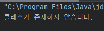

  위 예제를 실행시키면 <b>Class clazz = Class.forName("java.lang.String2");</b>에서 ClassNotFoundException이 발생하는데, 이것은 java.lang.String2 클래스가 존재하지 않기 때문이다.

  예외가 발생하면 catch 부분이 실행되서 예외 처리를 하게 된다. 
ArrayIndexOutOfBoundsException이나 NumberFormatException과 같은 실행 예외는 컴파일러가 예외 처리 코드를 체크하지 않기 때문에 빨간 밑줄이 생기지 않는다.

  오로지 개발자의 경험에 의해 예외 처리를 다음과 같이 작성해 주어야 한다.

- [TryCatchFinallyRuntimeExceptionExample.java] 실행 예외 처리

  ```java
  public class TryCatchFinallyRuntimeExceptionExample {
      public static void main(String[] args) {
          String data1 = null;
          String data2 = null;
          try {
              data1 = args[0];
              data2 = args[1];
          } catch (ArrayIndexOutOfBoundsException e) {
              System.out.println("실행 매개값의 수가 부족합니다.");
              return;
          }
  
          try {
              int value1 = Integer.parseInt(data1);
              int value2 = Integer.parseInt(data2);
              int result = value1 + value2;
              System.out.println(data1 + "+" + data2 + "=" + result);
          } catch (NumberFormatException e) {
              System.out.println("숫자로 변환할 수 없습니다.");
          } finally {
              System.out.println("다시 실행하세요.");
          }
      }
  }
  ```

  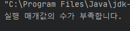

- Program arguments : a 3

  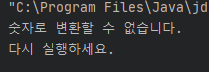


## 10.4 예외 종류에 따른 처리 코드

### 10.4.1 다중 catch

  try 블록 내부는 다양한 종류의 예외가 발생할 수 있다. 이 경우, 발생되는 예외별로 예외 처리 코드를 다르게 하려면 다중 catch 블록을 작성하면 된다.

  catch 블록의 예외 클래스 타입은 try 블록에서 발생된 예외의 종류를 말하는데, try 블록에서 해당 타입의 예외가 발생하면 catch 블록을 실행하도록 되어 있다.

- 예외 별로 예외 처리 코드 다르게 구현

  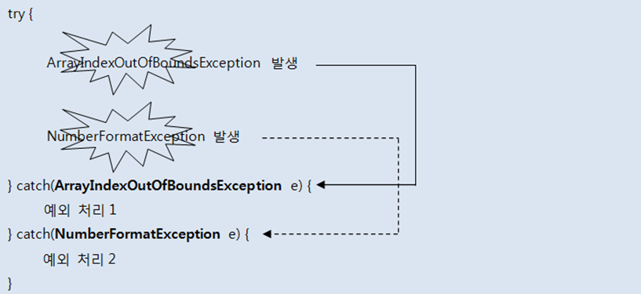

<b>catch 블록이 여러 개라 할지라도 단 하나의 catch 블록만 실행된다.</b> 그 이유는 try 블록에서 동시 다발적으로 예외가 발생하지 않고, 하나의 예외가 발생하면 즉시 실행을 멈추고 해당 catch 블록으로 이동하기 때문이다.

- [CatchByExceptionKindExample.java] 다중 catch

  ```java
  public class CatchByExceptionKindExample {
      public static void main(String[] args) {
          try {
              String data1 = args[0];
              String data2 = args[1];
              int value1 = Integer.parseInt(data1);
              int value2 = Integer.parseInt(data2);
              int result = value1 + value2;
              System.out.println(data1 + "+" + data2 + "=" + result);
          } catch (ArrayIndexOutOfBoundsException e) {
              System.out.println("실행 매개값의 수가 부족합니다.");
          } catch (NumberFormatException e) {
              System.out.println("숫자로 변환할 수 없습니다.");
          } finally {
              System.out.println("다시 실행하세요.");
          }
      }
  }
  ```

  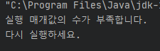


### 10.4.2 catch 순서

  <b>다중 catch 블록을 작성할 때 주의할 점은 상위 예외 클래스가 하위 예외 클래스보다 아래쪽에 위치해야 한다.</b>

  만약 상위 예외 클래스의 catch 블록이 위에 있다면, 하위 예외 클래스의 catch 블록은 실행되지 않는다. 왜냐하면 하위 예외는 상위 예외를 상속했기 때문에 상위 예외 타입도 되기 때문이다.
  따라서 다음은 잘못 코딩한 것이다.

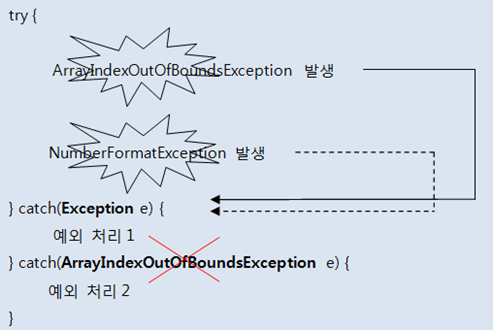

  ArrayIndexOutOfBoundsException과 NumberFormatException은 모두 Exception을 상속받기 때문에 첫 번째 catch 블록만 실행된다. 

  위 코드는 다음과 같이 수정해야 한다.

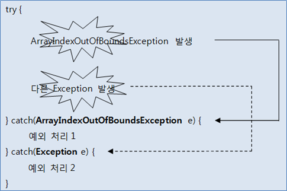

  try 블록에서 ArrayIndexOutOfBoundsException이 발생하면 첫 번째 catch 블록을 실행하고, 그 밖의 다른 예외가 발생하면 두 번째 catch 블록을 실행한다.


### 10.4.3 멀티 catch

  자바 7부터 하나의 catch 블록에서 여러 개의 예외를 처리할 수 있도록 멀티(multi) catch 기능을 추가했다. 

  다음은 멀티 catch 블록을 작성하는 방법을 보여준다. catch 괄호() 안에 동일하게 처리하고 싶은 예외를 |로 연결하면 된다.

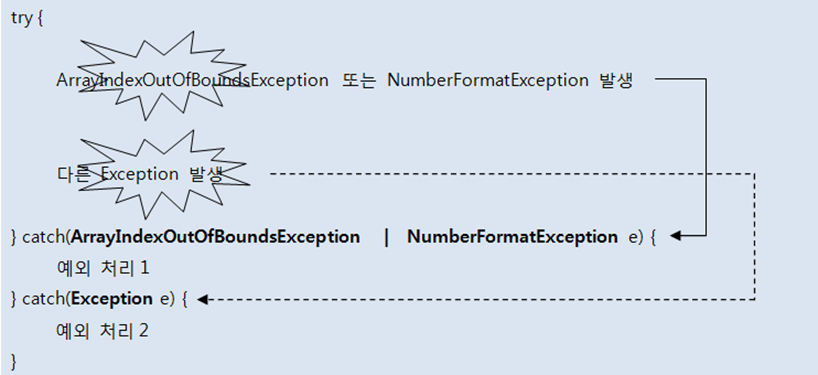


## 10.5 자동 리소스 닫기

  자바 7에서 새로 추가된 try-with-resource를 사용하면 예외 발생 여부와 상관없이 사용했던 리소스 객체(각종 입출력 스트림, 서버 소켓, 소켓, 각종 채널)의 close() 메소드를 호출해서 안전하게 리소스를 닫아준다.

(<u>리소스란 여기서는 데이터를 읽고 쓰는 객체라고 생각</u>)
  예를 들어 파일의 데이터를 읽는 FileInputStream 객체와 파일에 쓰는 FileOutputStream은 리로스 객체라고 보면 된다.

다음은 리소스 객체를 안전하게 닫기 위해 자바 6 이전까지 사용해 왔던 코드이다.

```java
FileInputStream fis = null;
try {
    fis = new FileInputStream("file.txt");
    ...
} catch(IOException e) {
    ...
} finally {
    if(fis != null) {
        try {
            fis.close()
        } catch (IOException e) { } 
    }
}
```

  finally 블록에서 다시 try-catch를 사용해서 close() 메소드를 예외 처리해야 하므로 다소 복잡하게 보인다.
자바 7에서 추가된 try-with-resources를 사용하면 다음과 같이 간단해진다.  어디를 봐도 close()를 명시적으로 호출한 곳이 없다.

```java
try(FileInputStream fis = new FileInputStream("file.txt")) {
    ...
} catch(IOExeption e) {
    ...
}
```

  try 블록이 정상적으로 실행을 완료했거나 도중에 예외가 발생하게 되면 자동으로 FileInputStream의 close() 메소드가 호출된다. try {}에서 예외가 발생하면 우선 close()로 리소스를 닫고 catch 블록을 실행한다.

  만약 복수 개의 리소스를 사용해야 한다면 다음과 같이 작성할 수 있다.

```java
try {
    FileInputStream fis = new FileInputStream("file.txt");
    FileOutputStream fos = new FileOutputStream("file2.txt");
} {
    ...
} catch(IOException e) {
    ...
}
```

  try-with-resources를 사용하기 위해서는 조건이 있는데, 리소스 객체는 java.lang.AutoCloseable 인터페이스를 구현하고 있어야 한다. AutoCloseable에는 close() 메소드가 정의되어 있는데 try-with-resources는 바로 이 close() 메소드를 자동 호출한다.

  API 도큐먼트에서 AutoCloseable 인터페이스를 찾아 "All known Implementing Classes:"를 보면 try-with-resources와 함께 사용할 수 있는 리소스가 어떤 것이 있는지 알 수 있다.

  다음 예제는 직접 AutoCloseable을 구현해서 FileInputStream 클래스를 작성했다. TryWithResourceExample 클래스의 main() 메소드에서 try-with-resources를 사용하면 예외가 발생하는 즉시 자동으로 FileInputStream의 close()가 호출되는 것을 볼 수 있다.

- [FileInputStream.java] AutoCloseable 구현 클래스

  ```java
  public class FileInputStream implements AutoCloseable {
      private String file;
  
      public FileInputStream(String file) {
          this.file = file;
      }
  
      public void read() {
          System.out.println(file + "을 읽습니다.");
      }
  
      @Override
      public void close() throws Exception {
          System.out.println(file + "을 닫습니다.");
      }
  }
  ```

- [TryWithResourceExample.java] AutoCloseable 구현 클래스

  ```java
  public class TryWithResourceExample {
      public static void main(String[] args) {
          try(FileInputStream fis = new FileInputStream("file.txt")) {
              fis.read();
              throw new Exception(); //강제적으로 예외 발생시킴
          } catch (Exception e) {
              System.out.println("예외 처리 코드가 실행되었습니다.");
          }
      }
  }
  ```

  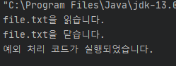


## 10.6 예외 떠넘기기

  메소드 내부에서 예외가 발생할 수 있는 코드를 작성할 때 try-catch 블록으로 예외를 처리하는 것이 기본이지만, 경우에 따라서는 메소드를 호출한 곳으로 예외를 떠넘길 수도 있다.

  이때 사용하는 키워드가 throws이다. throws 키워드는 메소드 선언부 끝에 작성되어 메소드에서 처리하지 않은 예외를 호출한 곳으로 떠넘기는 역할을 한다.

  throws 키워드는 메소드 선언부 끝에 작성되어 메소드에서 처리하지 않은 예외를 호출한 곳으로 떠넘기는 역할을 한다.

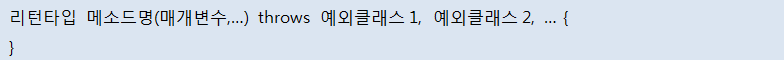

  발생할 수 있는 예외의 종류별로 throws 뒤에 나열하는 것이 일반적이지만, 다음과 같이 throws Exception만으로 모든 예외를 간단히 떠넘길 수도 있다.

```java
리턴타입 메소드명(매개변수, ...) throws Exception {    
}
```

  <b>throws 키워드가 붙어있는 메소드는 반드시 try 블록 내에서 호출되어야 한다.</b> 
그리고 catch 블록에서 떠넘겨 받은 예외를 처리해야 한다. 
  다음 코드는 throws 키워드가 있는 method2()를 method1()에서 호출하는 방법을 보여준다.

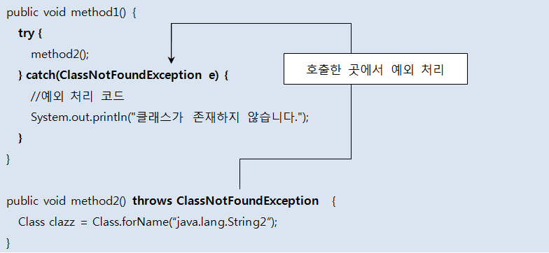

  method1()에서도 try-catch 블록으로 예외를 처리하지 않고 throws 키워드로 다시 예외를 떠넘길 수 있다. 그러면 method1()을 호출하는 곳에서 결국 try-catch 블록을 사용해서 예외를 처리해야 한다.

```java
public void method1() throws classNotFoundException {
    method2();
}
```

  자바 API 도큐먼트를 보면 클래스 생성자와 메소드 선언부에 throws 키워드가 붙어있는 것을 흔히 볼 수 있다.

  이러한 생성자와 메소드를 사용하고 싶다면, 반드시 try-catch 블록으로 예외 처리를 해야 한다. 아니면 throws를 다시 사용해서 예외를 호출한 곳으로 떠넘겨야 한다.
  그렇지 않으면 컴파일 오류가 발생한다. 

예를 들어 Class의 forName() 메소드를 자바 API 도큐먼트에서 보면 다음과 같다.

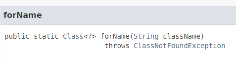

- [ThrowsExample.java] 예외 처리 떠넘기기

  ```java
  public class ThrowsExample {
      public static void main(String[] args) {
          try {
              findClass();
          } catch (ClassNotFoundException e) {
              System.out.println("클래스가 존재하지 않습니다.");
          }
      }
  
      public static void findClass() throws ClassNotFoundException {
          Class clazz = Class.forName("java.lang.String2");
      }
  }
  ```


  <u>main() 메소드에서도 throws 키워드를 사용해서 예외를 떠넘길 수 있는데,</u> <b>결국 JVM이 최종적으로 예외 처리를 하게 된다.</b> JVM은 예외의 내용을 콘솔(Console)에 출력하는 것으로 예외 처리를 한다.

```java
public static void main(String[] args) throws ClassNotFoundException {
    findClass();
}
```

  main() 메소드에서 throws Exception을 붙이는 것은 좋지 못한 예외 처리 방법이다. 
프로그램 사용자는 프로그램이 알 수 없는 예외 내용을 출력하고 종료되는 것을 좋아하지 않는다. 
  그렇기 때문에 main()에서 try-catch 블록으로 예외를 최종 처리하는 것이 바람직하다.


## 10.7 사용자 정의 예외와 예외 발생

  프로그램을 개발하다보면 자바 표준 API에서 제공하는 예외 클래스만으로는 다양한 종류의 예외를 표현할 수가 없다.

  *자바 표준 API에는 존재하지 않는 예외*

- *잔고 부족 예외, 계좌 이체 실패 예외, 회원 가입 실패 예외, ...*
- *애플리케이션 서비스와 관련된 예외를 애플리케이션 예외라고 한다.*

- *개발자가 직접 정의해서 만들어야 하므로 사용자 정의 예외라고도 한다.*


### 10.7.1 사용자 정의 예외 클래스 선언

  사용자 정의 예외 클래스는 컴파일러가 체크하는 일반 예외로 선언할 수도 있고, 컴파일러가 체크하지 않는 실행 예외로 선언할 수도 있다.

  <b>일반 예외로 선언할 경우 Exception을 상속하면 되고, 실행 예외로 선언할 경우에는 RuntimeException을 상속하면 된다.</b>

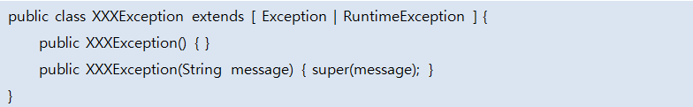

  <u>사용자 정의 예외 클래스 이름은 Exception으로 끝나는 것이 좋다.</u> 사용자 정의 예외 클래스도 필드, 생성자, 메소드 선언들을 포함할 수 있지만 <b>대부분 생성자 선언만을 포함한다.</b>

  생<u>성자는 두 개를 선언하는 것이 일반적</u>인데, 하나는 <b>매개 변수가 없는 기본 생성자</b>이고, 다른 하나는 <b>예외 발생 원인(예외 메시지)을 전달하기 위해 String 타입의 매개 변수를 갖는 생성자</b>이다.

  <u>String 타입의 매개 변수를 갖는 생성자</u>는 <b>상위 클래스의 생성자를 호출하여 예외 메시지를 넘겨준다.</b> 예외 메시지의 용도는 catch {} 블록의 예외 처리 코드에서 이용하기 위해서 이다.
  다음은 잔고 부족 예외를 사용자 정의 예외 클래스로 선언한 것이다.

- [BalanceInsufficientException.java] 사용자 정의 예외 클래스

  ```java
  public class BalanceInsufficientException extends Exception{
      public BalanceInsufficientException() {}
      public BalanceInsufficientException(String message) {
          super(message);
      }
  }
  ```

    BalanceInsufficientException은 Exception을 상속하기 때문에 컴파일러에 의해 체크되는 예외가 된다. 그래서 소스 작성 시 try-catch 블록으로 예외처리가 필요하다. 


### 10.7.2 예외 발생시키기

  사용자 정의 예외 또는 자바 표준 예외를 코드에서 발생시키는 방법을 알아보자. 코드에서 예외를 발생시키는 방법은 다음과 같다.

```java
throw new XXXException();
throw new XXXException("메시지");
```

  예외 객체를 생성할 때는 기본 생성자 또는 예외 메시지를 갖는 생성자 중 어떤 것을 사용해도 된다.
만약 catch 블록에서 예외 메시지가 필요하다면 예외 메시지를 갖는 생성자를 이용해야 한다. 

  예외 발생 코드를 가지고 있는 메소드는 내부에서 try-catch 블록으로 예외를 처리할 수 있지만, 대부분은 자신을 호출한 곳에서 예외를 처리하도록 throws 키워드로 예외를 떠넘긴다.

- [Account.java] 사용자 정의 예외 발생시키기

  ```java
  public class Account {
      private long balance;
  
      public Account() {}
  
      public long getBalance() {
          return balance;
      }
      public void deposit(int money) {
          balance += money;
      }
      public void withdraw(int money) throws BalanceInsufficientException {
          if(balance < money) {
              throw new BalanceInsufficientException("잔고부족:"+(money-balance)+" 모자람");
          }
          balance -= money;
      }
  }
  ```


## 10.8 예외 정보 얻기

  try 블록에서 예외가 발생되면 예외 객체는 catch 블록의 매개 변수에서 참조하게 되므로 매개 변수를 이용하면 예외 객체의 정보를 알 수 있다. 

  <b>모든 예외 객체는 Exception 클래스를 상속</b>하기 때문에 <u>Exception이 가지고 있는 메소드들은 모든 예외 객체에서 호출할 수 있다.</u> 그중에서도 가장 많이 사용되는 메소드는 getMessage()와 printStackTrace()이다. 

  예외를 발생시킬 때 다음과 같이 String 타입의 메시지를 갖는 생성자를 이용하였다면, 메시지는 자동적으로 예외 객체 내부에 저장된다.

```java
throw new XXXException("예외 메시지");
```

  <u>예외 메시지의 내용에는 왜 예외가 발생했는지에 대한 간단한 설명이 포함</u>된다. 좀 더 상세한 원인을 세분화하기 위해 예외 코드를 포함하기도 하는데, 예를 들어 <u>데이터베이스에서 발생한 오류들은 예외 코드가 예외 메시지로 전달</u>된다.

  이와 같은 예외 메시지는 다음과 같이 catch 블록에서 getMessage() 메소드의 리턴값으로 얻을 수 있다.

```java 
} catch(Exception e) {
    String message = e.getMessage();
}
```

  printStackTrace()는 예외 발생 코드를 추적해서 모두 콜솔에 출력한다. 어떤 예외가 어디에서 발생했는지 상세하게 출력해주기 때문에 프로그램을 테스트하면서 오류를 찾을 때 활용된다.

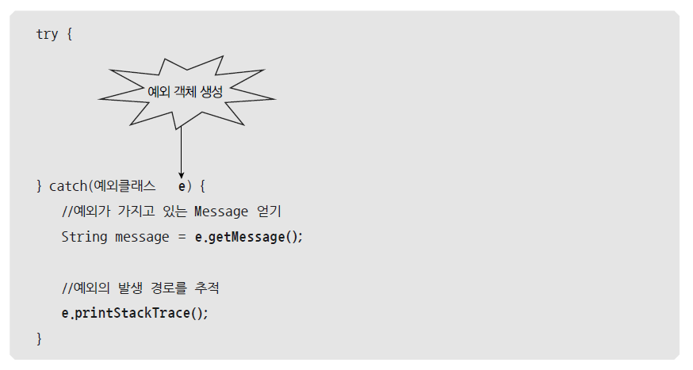

  다음 AccountExample 클래스는 Account 클래스를 이용해서 예금과 출금을 한다. 출금할 때 <b>withdraw() 메소드를 사용하므로 예외 처리가 꼭 필요하다.</b>

  예외 처리 코드에서 BalanceInsufficientException 객체의 getMessage() 메소드와 printStackTrace() 메소드로 예외에 대한 정보를 얻어내고 있다. 

- [AccountExample.java] 사용자 정의 예외 발생시키기

  ```java
  public class AccountExample {
      public static void main(String[] args) {
          Account account = new Account();
          //예금하기
          account.deposit(10000);
          System.out.println("예금액: " + account.getBalance());
          //출금하기
          try {
              account.withdraw(30000);
          } catch (BalanceInsufficientException e) {
              String message = e.getMessage();
              System.out.println(message);
              System.out.println();
              e.printStackTrace();
          }
      }
  }
  ```


  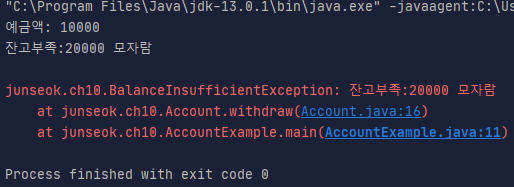

 